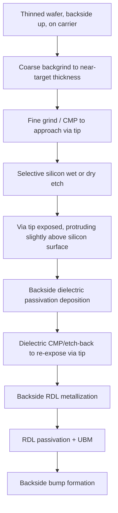

## TSV Reveal and Backside Redistribution Processing

### Overview

TSV reveal is the process sequence that exposes the buried end of a Through-Silicon Via from the wafer backside after thinning, converting a via that was previously embedded entirely within silicon into an externally accessible electrical contact. Backside redistribution layer (RDL) processing then builds the fan-out/fan-in wiring and bump interconnects on that revealed backside surface, enabling the TSV to connect to the next level of packaging (another die, an interposer, or a substrate). This sequence is the final stage that converts a "buried" TSV structure into a functional 3D interconnect terminal.

### TSV Reveal: Process Objective

Before reveal, the TSV's copper (or polysilicon, for via-first) fill is fully embedded in silicon, with its far end terminating just above the target backside surface, separated by a thin layer of remaining silicon and typically the SiO2 liner. The reveal process must remove this remaining silicon selectively, exposing the via tip while:

- Leaving the SiO2 liner around the via largely intact (to maintain electrical isolation from the surrounding silicon)
- Avoiding excessive over-etch that would recess or damage the copper via tip
- Achieving controlled, uniform silicon removal across the entire wafer despite total thickness variation (TTV) from the preceding grinding step

### Reveal Process Sequence

#### Step 1: Grinding to Near-Target Thickness

Mechanical backgrinding removes the bulk of the silicon, stopping short of the via tip by a controlled margin, since grinding alone lacks the selectivity to stop precisely at the via/silicon interface without risking copper smearing across the wafer (a serious contamination concern, since exposed copper during mechanical grinding can smear across the grinding surface and cause cross-contamination between vias or into the silicon).

#### Step 2: Selective Silicon Removal (Wet or Dry Etch)

A silicon-selective etch removes the final remaining silicon layer between the ground surface and the via tip, using chemistry that etches silicon much faster than it etches the SiO2 liner or the copper fill:

- **Dry etch (plasma-based)**: Commonly $SF_6$-based isotropic plasma etch, offering good silicon-to-oxide selectivity and process control compatible with the same class of equipment used for TSV formation
- **Wet etch**: Alkaline solutions (e.g., TMAH or KOH-based chemistries) can also achieve silicon-selective removal, though with different selectivity and uniformity trade-offs relative to dry plasma approaches
- **[Inference]** Dry plasma reveal etches are generally favored in production for better across-wafer uniformity control at the fine final-removal stage, though the specific choice between wet and dry reveal chemistry depends on integration scheme, cost, and existing fab equipment availability.

#### Step 3: Via Protrusion ("Cu Pillar Reveal")

After silicon etch-back, the SiO2-lined copper via typically **protrudes slightly** above the surrounding silicon surface, since the etch chemistry removes silicon much faster than it removes the oxide liner or copper. This slight protrusion (commonly on the order of hundreds of nanometers to a few microns) becomes the physical contact feature for subsequent backside metallization.

#### Step 4: Backside Passivation

A dielectric layer (commonly SiO2, SiN, or a polymer such as polyimide/PBO) is deposited across the revealed backside surface to:

- Provide electrical isolation between the silicon substrate and the subsequent RDL metal
- Planarize and mechanically protect the revealed via structures
- Serve as the base layer onto which RDL wiring is patterned

This passivation is then selectively opened (via etch-back, CMP, or lithographic patterning) to re-expose the via tips for electrical contact to the RDL.

### Backside Redistribution Layer (RDL) Processing

Once TSVs are revealed and passivated, backside RDL processing builds the wiring layer(s) that route TSV connections to their final bump or pad locations, since TSV positions (dictated by front-side circuit design and TSV placement rules) rarely align directly with the desired backside bump pattern.

#### RDL Metallization Sequence

1. **Seed layer deposition**: Sputtered Ti/Cu or similar barrier/seed stack across the passivated backside surface
2. **Photolithography**: Patterning the RDL trace layout using a photoresist mask
3. **Electroplating**: Copper (sometimes with an additional barrier/cap metal) plated into the patterned openings to form RDL traces
4. **Resist strip and seed etch**: Removing the plating mask and etching away the unwanted seed layer between traces
5. **RDL passivation**: A second dielectric layer deposited over the RDL traces, patterned to open only at final bump/pad locations

#### Multi-Layer RDL

Complex fan-out or high-density interposer applications may require **multiple RDL layers** stacked with intervening dielectric, connected by micro-vias, to achieve sufficient routing density between the TSV pitch and the final bump pitch — analogous in concept to a miniaturized multi-layer PCB built directly on the wafer backside.

- **[Inference]** RDL layer count is generally driven by the ratio between TSV area array density and the coarser bump pitch required for the next packaging level (e.g., C4 bump pitch for flip-chip attach), with routing congestion increasing the need for additional layers; exact layer counts are design- and application-specific.

#### Under-Bump Metallization (UBM) and Bump Formation

The final backside metallization step establishes the actual solder or copper-pillar bump interconnect:

- **UBM deposition**: A metal stack (commonly Ti/Cu, Ti/Ni/Cu, or similar) providing adhesion, diffusion barrier, and solder-wettable surface properties at each bump site
- **Bump formation**: Solder ball placement/reflow, copper-pillar plating, or micro-bump plating, depending on the target application (fine-pitch die stacking vs. coarser substrate/interposer attach)

### Key Process Challenges

| Challenge | Description |
| --- | --- |
| Via protrusion uniformity | Non-uniform silicon etch-back causes inconsistent via protrusion height across the wafer, affecting subsequent RDL contact reliability |
| Copper smearing during grinding | Premature copper exposure during mechanical thinning can smear conductive debris across the wafer, risking shorts |
| Passivation step coverage | Dielectric deposition must conformally cover protruding via tips without leaving voids or thin spots at the via sidewall-to-passivation interface |
| RDL-to-TSV contact resistance | Interfacial contamination or incomplete seed layer contact at the via tip can elevate contact resistance |
| Thermo-mechanical stress in thin wafer stack | Backside RDL and bump processing on an already-thinned wafer (bonded to carrier) must manage additional thermal steps without inducing warpage or cracking |
| Alignment to buried structures | Backside lithography must align to front-side or buried reference features, typically via infrared alignment or pre-established fiducial marks, since the wafer has been flipped and thinned |

### Backside Reveal and RDL Cross-Section (svg_diagram)

<svg xmlns="http://www.w3.org/2000/svg" viewBox="0 0 700 400">
<text x="350" y="30" text-anchor="middle" font-size="15" font-weight="bold" fill="#1a1a1a">TSV Reveal and Backside RDL Stack (svg_diagram)</text>

<rect x="150" y="80" width="400" height="120" fill="#e8e8e8" stroke="#666" />
<text x="350" y="70" text-anchor="middle" font-size="11" fill="#666">Thinned Silicon</text>

<rect x="270" y="80" width="40" height="120" fill="#ffffff" stroke="#333" />
<rect x="275" y="80" width="30" height="120" fill="#e69138" />
<text x="290" y="75" text-anchor="middle" font-size="8" fill="#333" />
<rect x="420" y="80" width="40" height="120" fill="#ffffff" stroke="#333" />
<rect x="425" y="80" width="30" height="120" fill="#e69138" />

<rect x="275" y="65" width="30" height="15" fill="#e69138" stroke="#333" />
<rect x="425" y="65" width="30" height="15" fill="#e69138" stroke="#333" />
<text x="350" y="60" text-anchor="middle" font-size="9" fill="#c00">Via protrusion after silicon etch-back</text>

<rect x="150" y="200" width="400" height="15" fill="#c9daf8" stroke="#0b5394" />
<text x="350" y="230" text-anchor="middle" font-size="10">Backside passivation dielectric</text>

<rect x="275" y="200" width="30" height="15" fill="#ffffff" />
<rect x="425" y="200" width="30" height="15" fill="#ffffff" />

<rect x="150" y="245" width="400" height="12" fill="#f9cb9c" stroke="#b45f06" />
<path d="M 290 245 L 290 235 L 440 235 L 440 245" fill="none" stroke="#b45f06" stroke-width="2" />
<text x="350" y="275" text-anchor="middle" font-size="10">RDL metal trace (fan-out routing)</text>

<rect x="150" y="285" width="400" height="12" fill="#d9ead3" stroke="#38761d" />
<rect x="335" y="285" width="30" height="12" fill="#ffffff" />
<text x="350" y="315" text-anchor="middle" font-size="10">RDL passivation (bump opening)</text>

<ellipse cx="350" cy="340" rx="20" ry="15" fill="#999" stroke="#333" />
<text x="350" y="370" text-anchor="middle" font-size="10">Solder/Cu bump</text>
</svg>

**Related Topics**

- Wafer thinning, temporary bonding, and de-bonding sequencing
- Via-last backside TSV formation approach
- Under-bump metallization (UBM) and solder bump reliability
- Multi-layer fan-out RDL design and micro-via routing
- Backside alignment techniques for buried-structure lithography
- Copper smearing contamination control during backgrinding
- TSV-to-RDL contact resistance characterization
- 2.5D interposer integration using backside RDL routing