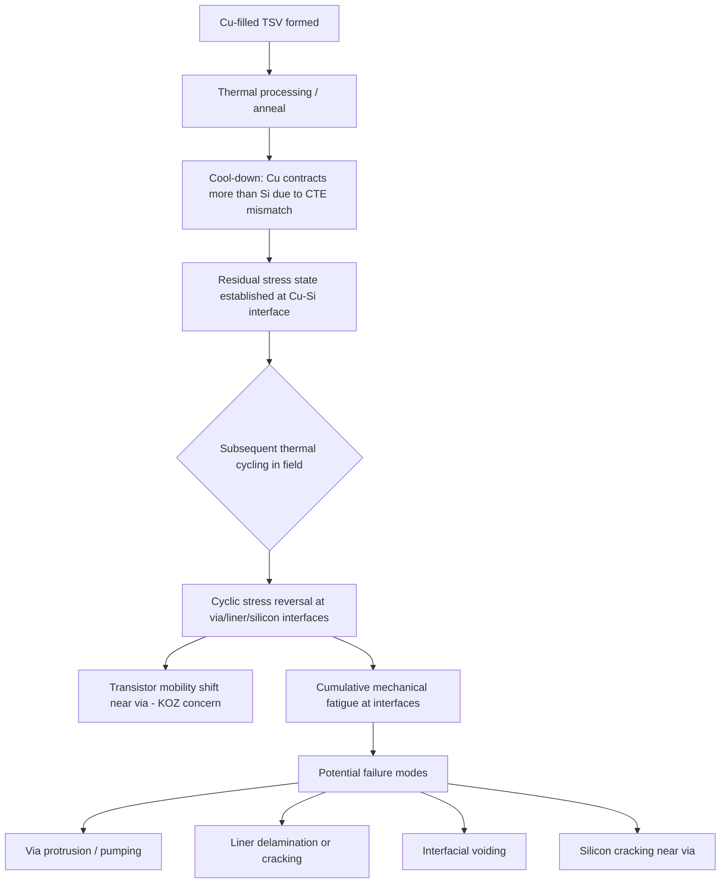

## TSV-Induced Stress and Mechanical Reliability

### Overview

TSV-induced stress and mechanical reliability address the thermo-mechanical consequences of embedding a copper-filled (or polysilicon-filled) via within a silicon substrate, and how that stress field affects both transistor performance and long-term structural integrity of the 3D-IC stack. Because copper's coefficient of thermal expansion (CTE) differs substantially from silicon's, every thermal excursion the device experiences — from process anneals through end-use thermal cycling — generates mechanical stress at and around the via, with consequences ranging from localized transistor mobility shift (addressed in keep-out zone design) to macroscopic failure modes such as via protrusion, liner delamination, and cracking.

### Origin of TSV-Induced Stress

#### CTE Mismatch

Copper's CTE (~17 ppm/°C) is roughly 6–7x larger than silicon's CTE (~2.6-3 ppm/°C). This mismatch means that for any given temperature change, copper attempts to expand or contract by a substantially larger fraction of its dimension than the surrounding silicon does.

- **During cooling from processing temperatures** (e.g., after copper fill anneal or after high-temperature backside RDL processing), the copper via contracts more than the surrounding silicon, placing the copper in a state of residual tensile stress and inducing compressive stress in the immediately surrounding silicon
- **During field thermal cycling** (device power-on/power-off, ambient temperature swings), this stress state cyclically reverses and intensifies, since the via and substrate repeatedly expand and contract at different rates

#### Stress Field Distribution

The resulting mechanical stress is not uniform — it is highest immediately adjacent to the via sidewall and decays radially with distance, following patterns well-characterized by finite element modeling (FEM) and confirmed experimentally via techniques such as micro-Raman spectroscopy and wafer curvature measurement.

- **[Inference]** Because the stress field decays gradually with radial distance rather than dropping to zero at a sharp boundary, keep-out zone (KOZ) design rules are generally a practical simplification of an underlying continuous stress gradient, applied as a hard cutoff for design rule simplicity even though the physical stress effect does not have a discrete boundary; some advanced design flows instead model this gradient directly for stress-aware timing closure.

### Key Mechanical Failure Modes

#### Via Protrusion ("Cu Pumping")

Repeated thermal cycling can cause the copper via to gradually extrude or "pump" outward relative to the surrounding silicon surface, particularly at an exposed or thinned wafer surface (such as after backside reveal):

- Each thermal cycle's copper expansion is not perfectly reversed on cooling due to plastic deformation of the copper and/or gradual creep behavior
- Accumulated protrusion over many thermal cycles can interfere with subsequent processing (e.g., backside RDL contact formation) or with mechanical/electrical contact reliability at the via tip
- **[Inference]** Via protrusion is a well-documented TSV reliability concern in industry literature and is generally addressed through anneal process optimization (to stabilize the copper grain structure before further processing) and copper fill microstructure control, though the specific magnitude of protrusion is process- and thermal-history-dependent.

#### Liner Delamination and Cracking

The SiO2 liner sits at the interface experiencing the steepest stress gradient (between the highly stressed copper core and the silicon substrate):

- Repeated stress cycling can cause interfacial delamination between the liner and either the copper fill or the surrounding silicon, particularly if adhesion at either interface is marginal
- Delamination compromises the liner's electrical isolation function, potentially leading to leakage current between the TSV and substrate
- Liner cracking, if severe, can propagate stress into the adjacent silicon, increasing local defect density risk

#### Silicon Cracking

In severe cases, or in the presence of pre-existing defects (such as DRIE-induced sidewall damage, mask-edge stress concentrators, or thinning-induced subsurface damage), the stress field around a TSV can initiate or propagate cracks in the silicon itself:

- Crack initiation risk is elevated at geometric stress concentrators: via corners (for non-circular via layouts), scalloped sidewall features from Bosch-process etching, and interfaces between adjacent TSVs in dense arrays
- **[Inference]** This is a primary reason wafer thinning process control (grinding damage removal, stress-relief etching) is treated as reliability-critical rather than purely a dimensional/thickness concern, since residual grinding damage combines additively with TSV-induced stress to elevate overall crack risk.

#### Interfacial Voiding

Thermal cycling stress can also drive void formation or void migration at metal-dielectric interfaces over extended cycling, distinct from the plating-induced voids addressed during initial copper fill — this is a **field-reliability** voiding mechanism rather than a manufacturing-defect mechanism, though pre-existing manufacturing voids can serve as nucleation sites that accelerate this process.

### Reliability Test and Qualification Methods

Because TSV mechanical reliability concerns manifest over extended thermal cycling rather than at time-zero test, qualification relies on accelerated stress testing methodologies standard to semiconductor reliability engineering, adapted for 3D-IC/TSV-specific failure modes:

| Test Method | Purpose |
| --- | --- |
| Temperature cycling (TC) | Accelerates CTE-mismatch-driven fatigue over repeated thermal excursions |
| High-temperature storage (HTS) | Evaluates stress relaxation and diffusion-driven degradation at elevated steady-state temperature |
| Thermal shock | More aggressive/rapid temperature transitions than standard TC, stressing interfacial adhesion |
| Cross-sectional SEM/TEM (post-stress) | Directly images delamination, cracking, or void formation after stress testing |
| Micro-Raman spectroscopy | Non-destructive stress-state characterization near TSV structures |
| Electrical parametric monitoring | Tracks via resistance drift or leakage current increase as an indirect stress/degradation indicator over cycling |

- **[Inference]** Because TSV mechanical failure modes often develop gradually over many thermal cycles rather than causing abrupt failure, reliability qualification typically requires monitoring parametric drift (resistance, leakage) across extended cycle counts rather than relying solely on pass/fail endpoint criteria; specific test conditions and acceptance criteria are defined by industry standards bodies (e.g., JEDEC) and individual qualification programs.

### Mitigation Strategies

- **Anneal optimization**: Controlled thermal treatment of the copper fill (often before subsequent high-temperature steps) to stabilize copper grain structure and reduce subsequent protrusion/creep behavior
- **Liner and barrier engineering**: Optimizing liner thickness and barrier adhesion to improve interfacial fracture toughness and delamination resistance
- **KOZ and stress-aware design**: As covered in TSV electrical modeling, restricting or characterizing transistor placement near the stress field reduces performance-impact risk (though this addresses electrical/timing impact rather than the mechanical failure modes themselves)
- **Via geometry optimization**: Via diameter, depth, and array pitch all influence peak stress magnitude and spatial extent; **[Inference]** larger-diameter vias generally induce a larger absolute stress field even though relative (per-unit-area) stress behavior can differ, making via sizing an active trade-off parameter between electrical performance (lower resistance favors larger diameter) and mechanical risk (larger diameter increases stress field extent).
- **Process-induced damage minimization**: Controlling DRIE sidewall scalloping severity and wafer thinning subsurface damage, since both act as crack initiation sites that compound with TSV-induced stress

### Stress Field Distribution Diagram (svg_diagram)

<svg xmlns="http://www.w3.org/2000/svg" viewBox="0 0 700 400">
<text x="350" y="30" text-anchor="middle" font-size="15" font-weight="bold" fill="#1a1a1a">Radial Stress Field Around a TSV (svg_diagram)</text>

<circle cx="350" cy="220" r="160" fill="#fff2cc" stroke="none" />
<circle cx="350" cy="220" r="130" fill="#fce5cd" stroke="none" />
<circle cx="350" cy="220" r="100" fill="#f9cb9c" stroke="none" />
<circle cx="350" cy="220" r="70" fill="#f4cccc" stroke="none" />
<circle cx="350" cy="220" r="40" fill="#ea9999" stroke="none" />
<circle cx="350" cy="220" r="22" fill="#e69138" stroke="#333" stroke-width="1" />
<text x="350" y="225" text-anchor="middle" font-size="8" fill="#fff">Cu via</text>

<line x1="350" y1="220" x2="510" y2="220" stroke="#333" stroke-width="1" stroke-dasharray="3,2" />
<text x="530" y="150" font-size="10" fill="#333">High stress</text>
<text x="530" y="170" font-size="10" fill="#333">(near via wall)</text>
<text x="530" y="290" font-size="10" fill="#333">Low stress</text>
<text x="530" y="310" font-size="10" fill="#333">(far field)</text>

<text x="350" y="390" text-anchor="middle" font-size="10" fill="#666">Stress magnitude decays radially outward from via sidewall</text>

</svg>

**Related Topics**

- TSV electrical modeling and keep-out zone design
- Wafer thinning subsurface damage and stress relief techniques
- DRIE/Bosch process scalloping as a crack-initiation risk factor
- Copper fill anneal optimization and grain structure control
- JEDEC reliability qualification standards for 3D-IC packaging
- Liner/barrier adhesion engineering for interfacial fracture resistance
- Finite element modeling (FEM) methodologies for TSV stress simulation
- Micro-Raman spectroscopy for non-destructive stress characterization