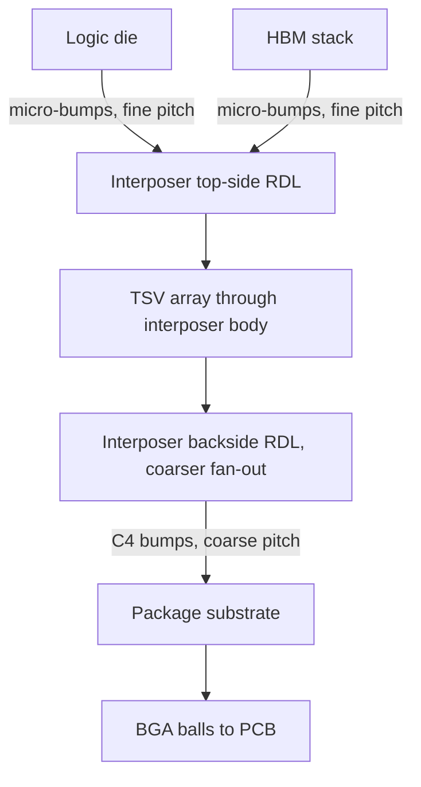

## Silicon Interposer Design and Fabrication

### Overview

A silicon interposer is a passive (or lightly active) silicon substrate that sits between one or more dies and the package substrate, providing high-density, fine-pitch routing and TSV-based vertical interconnect that neither the dies' own metal stacks nor a conventional organic package substrate can achieve at the same density. Silicon interposers are the foundational enabling technology of 2.5D integration, most prominently used to connect high-bandwidth memory (HBM) stacks to logic dies (GPUs, AI accelerators) at the interconnect densities modern high-performance computing workloads require.

### Why Silicon Interposers Exist: The Density Gap

Organic package substrates (build-up substrates using laminate/epoxy dielectrics) are limited in achievable line width/spacing, typically to the range of several microns to tens of microns at best, due to fundamental limitations in organic dielectric lithography and via formation processes. Modern multi-die systems, particularly those pairing logic dies with HBM stacks, require interconnect pitches at the single-digit-micron to sub-10-micron scale to route the thousands of parallel signal and power connections HBM's wide I/O interface demands.

Silicon, as a substrate material, permits interconnect fabrication using the same lithography and thin-film deposition techniques used in front-end semiconductor manufacturing — enabling routing densities on the interposer that are orders of magnitude finer than organic substrates can achieve, closing this density gap.

### Silicon Interposer Structural Components

A silicon interposer integrates several distinct structural elements:

- **Through-Silicon Vias (TSVs)**: Provide vertical electrical connection from the interposer's top surface (where dies are mounted) to its bottom surface (where the package substrate connects), using the same via-middle or via-last formation approaches used in TSV technology generally
- **Front-side Redistribution Layer (RDL)**: Fine-pitch metal wiring on the interposer's top surface providing die-to-die and die-to-TSV routing, fabricated using damascene-style processes similar to BEOL interconnect
- **Backside Redistribution Layer (RDL)**: Coarser-pitch wiring on the interposer's bottom surface, fanning TSV connections out to the bump pitch required for package substrate attach
- **Micro-bumps**: Fine-pitch (commonly tens of microns) solder or copper-pillar bumps connecting dies to the interposer's top-side RDL
- **C4 bumps**: Coarser-pitch bumps connecting the interposer's backside RDL to the package substrate

### Fabrication Process Flow

Silicon interposer fabrication combines front-end-like lithography/deposition steps with TSV and backside processing techniques covered elsewhere in this chapter:

1. **Starting wafer**: A bare or lightly processed silicon wafer, since most interposers are **passive** (no active transistors) — though **active interposers** incorporating transistor circuitry are an emerging variant discussed below
2. **TSV formation**: Via-middle approach is most common for interposers, since it enables copper fill (lower resistance than via-first polysilicon) while remaining compatible with a foundry-integrated process flow
3. **Front-side RDL build-up**: Multiple fine-pitch metal layers (often 2–4 or more layers) fabricated using damascene copper processes, providing die-to-die and die-to-TSV routing at pitches far finer than the TSV pitch itself
4. **Wafer thinning and TSV reveal**: The interposer wafer is temporarily bonded to a carrier, thinned via backgrinding, and TSVs are revealed from the backside — following the same thinning/bonding/reveal sequence used generally in TSV processing
5. **Backside RDL and bump formation**: Coarser backside wiring fans TSV connections to the final C4 bump pattern matching the package substrate's ball pitch
6. **Dicing and die attach preparation**: The interposer wafer is diced into individual interposer die (or panels, in panel-based approaches), ready for die-to-interposer bonding

### Passive vs. Active Interposers

#### Passive Interposers

- No active transistor circuitry — function purely as a high-density routing and power-delivery layer
- Simpler, lower-cost, lower-risk fabrication since no FEOL transistor process is required
- Dominant approach in current production HBM-based 2.5D packages (e.g., GPU/AI accelerator + HBM stacks)

#### Active Interposers

- Incorporate transistor circuitry directly into the interposer, enabling functions such as power management, signal buffering/repeaters, built-in test structures, or even limited logic integrated at the interposer level
- **[Inference]** Active interposers require full FEOL transistor processing integrated with the TSV and RDL flow, substantially increasing fabrication complexity and cost relative to passive interposers, which is why passive interposers remain the dominant commercial approach for most current 2.5D products; active interposer adoption is generally associated with applications where the added interposer-level functionality justifies the additional process complexity, though the specific commercial tradeoff varies by product roadmap.

### Design Considerations

#### Routing Density Allocation

Interposer design must partition routing across layers and layer types based on signal requirements:

- High-speed, tightly-coupled signals (e.g., HBM data/command/address buses) typically route on the finest-pitch front-side RDL layers to minimize length and maintain signal integrity
- Power and ground distribution often uses wider traces and dedicated planes within the RDL stack to manage IR drop and power delivery network (PDN) impedance across the interposer
- TSV placement must balance electrical routing needs against keep-out zone constraints if any active circuitry exists on the interposer (relevant for active interposers) or against mechanical/thermal stress distribution considerations generally

#### TSV Array Planning

Because interposer TSVs primarily serve power delivery and lower-speed signal routing (high-speed signals often stay on-interposer via front-side RDL rather than traversing through the interposer body), TSV placement is planned around:

- Power/ground TSV density needed to meet PDN impedance targets for the dies mounted above
- Signal TSV placement for I/O that must reach the package substrate
- Mechanical/thermal considerations, since dense TSV arrays contribute to overall interposer stiffness and thermal conduction path characteristics

#### Warpage and Thermal Management

Silicon interposers, being thin (post-thinning) and bonded to dies above and substrate below, are subject to warpage risk from the CTE mismatches across the full stack (silicon interposer, organic package substrate, die materials):

- **[Inference]** Interposer thickness, die placement symmetry, and underfill material properties are typically co-optimized to manage warpage within package assembly process tolerances, since excessive warpage can cause micro-bump or C4 bump interconnect opens during reflow or thermal cycling; specific warpage mitigation strategies are package-design and assembly-process specific.
- Silicon's relatively high thermal conductivity compared to organic substrate materials also gives interposers a secondary benefit as a heat-spreading layer between mounted dies, though this is generally a secondary design consideration relative to the primary routing-density motivation.

### Silicon Interposer Cross-Section (svg_diagram)

<svg xmlns="http://www.w3.org/2000/svg" viewBox="0 0 800 420">
<text x="400" y="30" text-anchor="middle" font-size="16" font-weight="bold" fill="#1a1a1a">Silicon Interposer Structure (svg_diagram)</text>

<rect x="150" y="60" width="150" height="40" fill="#c9daf8" stroke="#0b5394" />
<text x="225" y="84" text-anchor="middle" font-size="11">Logic Die</text>
<rect x="330" y="60" width="100" height="40" fill="#d9d2e9" stroke="#674ea7" />
<text x="380" y="84" text-anchor="middle" font-size="10">HBM Stack</text>
<rect x="450" y="60" width="100" height="40" fill="#d9d2e9" stroke="#674ea7" />
<text x="500" y="84" text-anchor="middle" font-size="10">HBM Stack</text>

<g fill="#999">
<circle cx="170" cy="105" r="3" /><circle cx="190" cy="105" r="3" /><circle cx="210" cy="105" r="3" />
<circle cx="230" cy="105" r="3" /><circle cx="250" cy="105" r="3" /><circle cx="270" cy="105" r="3" />
<circle cx="345" cy="105" r="3" /><circle cx="365" cy="105" r="3" /><circle cx="385" cy="105" r="3" /><circle cx="405" cy="105" r="3" />
<circle cx="465" cy="105" r="3" /><circle cx="485" cy="105" r="3" /><circle cx="505" cy="105" r="3" /><circle cx="525" cy="105" r="3" />
</g>
<text x="650" y="108" font-size="9" fill="#666">Micro-bumps (fine pitch)</text>

<rect x="100" y="115" width="550" height="15" fill="#f9cb9c" stroke="#b45f06" />
<text x="750" y="125" font-size="9" fill="#666">Front-side RDL</text>

<rect x="100" y="130" width="550" height="100" fill="#e8e8e8" stroke="#666" />
<text x="375" y="185" text-anchor="middle" font-size="11" fill="#666">Silicon Interposer Body</text>
<g fill="#e69138" stroke="#333">
<rect x="180" y="130" width="12" height="100" />
<rect x="230" y="130" width="12" height="100" />
<rect x="360" y="130" width="12" height="100" />
<rect x="480" y="130" width="12" height="100" />
<rect x="530" y="130" width="12" height="100" />
</g>
<text x="650" y="180" font-size="9" fill="#666">TSV array</text>

<rect x="100" y="230" width="550" height="15" fill="#d9ead3" stroke="#38761d" />
<text x="750" y="240" font-size="9" fill="#666">Backside RDL</text>

<g fill="#999">
<circle cx="150" cy="260" r="6" /><circle cx="230" cy="260" r="6" /><circle cx="310" cy="260" r="6" />
<circle cx="390" cy="260" r="6" /><circle cx="470" cy="260" r="6" /><circle cx="550" cy="260" r="6" />
</g>
<text x="700" y="264" font-size="9" fill="#666">C4 bumps (coarse pitch)</text>

<rect x="80" y="280" width="590" height="50" fill="#fff2cc" stroke="#bf9000" />
<text x="375" y="310" text-anchor="middle" font-size="11">Organic Package Substrate</text>
</svg>

**Related Topics**

- TSV formation approaches applied to interposer fabrication (via-middle emphasis)
- Front-side and backside RDL processing and fan-out routing
- HBM (High Bandwidth Memory) interface and channel architecture
- Micro-bump and C4 bump reliability under thermal cycling
- Power delivery network (PDN) design across multi-die 2.5D systems
- Warpage control and underfill material selection in 2.5D assembly
- Active interposer integration and embedded transistor circuitry
- Panel-level and glass interposer alternatives to silicon