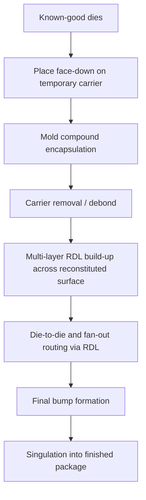

## Organic and RDL-Based Interposer Alternatives

### Overview

Organic and RDL-based interposer alternatives replace the silicon interposer's routing function with lower-cost, higher-throughput fabrication approaches — either organic (laminate/build-up) substrates with enhanced routing density, or fully redistribution-layer-based fan-out structures built without any silicon carrier at all. These approaches trade some of silicon interposer's ultra-fine routing density and TSV-based vertical integration for substantially lower cost, better scalability to large package sizes, and avoidance of TSV-specific yield and reliability risks, making them attractive for cost-sensitive or panel-scalable 2.5D-class integration.

### Motivation: Why Alternatives to Silicon Interposers

Silicon interposers, while offering the finest achievable routing density, carry several cost and manufacturing drawbacks:

- **Cost**: Silicon interposer fabrication uses front-end-like lithography and TSV processing, which is substantially more expensive per unit area than organic substrate fabrication
- **Panel/wafer size limits**: Silicon interposers are constrained to standard wafer sizes (300 mm), limiting the maximum interposer (and therefore package) size achievable per unit, whereas organic and panel-based fan-out approaches can scale to larger rectangular panel formats
- **TSV yield and reliability risk**: TSV formation, fill, and reveal (as covered throughout this chapter) introduce yield loss and reliability risk mechanisms (voiding, stress-induced cracking, KOZ constraints) that organic/RDL-only approaches avoid by using no TSVs, or substantially fewer
- **[Inference]** These cost and scalability pressures are widely cited industry motivations for pursuing organic and RDL-based alternatives, particularly as package sizes for AI/HPC accelerators grow toward or beyond the reticle-limited maximum die size achievable on a single silicon interposer, though the specific cost delta and adoption pace vary across the industry and by product segment.

### Organic Interposer (High-Density Build-Up Substrate)

An organic interposer is fundamentally an advanced laminate substrate engineered with finer line width/spacing than conventional package substrates, positioned as a direct cost-reduced alternative to silicon.

#### Key Characteristics

- **Substrate base**: Organic build-up materials (resin/epoxy-based dielectrics, similar in family to conventional BT or ABF-based substrates but processed with tighter design rules)
- **Routing density**: Finer than conventional package substrates but generally coarser than silicon interposer RDL, since organic dielectric lithography and via formation (typically laser-drilled microvias) have inherent resolution limits well above semiconductor-grade lithography
- **No TSVs required in the base case**: Vertical interconnection uses conventional laser-drilled microvias through the organic dielectric layers rather than silicon TSVs, eliminating TSV-specific process steps and their associated yield/reliability risks
- **[Inference]** Because organic interposers avoid TSV formation, fill, and reveal entirely, they generally carry lower absolute yield risk from those specific mechanisms, though achievable routing density is correspondingly reduced relative to silicon interposer RDL, making organic interposers most suitable for designs where signal count and pitch requirements fit within organic routing capability.

#### Trade-offs vs. Silicon Interposer

- Lower cost per unit area and better scalability to large panel sizes
- Coarser achievable pitch limits applicability for the most I/O-dense die-to-die connections (e.g., may be less suitable for the finest-pitch HBM interfaces without additional density-enhancing structures)
- Lower thermal conductivity than silicon, reducing any secondary heat-spreading benefit

### RDL-Based Fan-Out Interposers (Silicon-Free Approaches)

A distinct category eliminates the interposer substrate entirely, instead building multi-layer RDL wiring directly across reconstituted dies embedded in a mold compound — extending fan-out wafer-level packaging (FOWLP) concepts to 2.5D-class multi-die integration.

#### Core Concept

Rather than mounting dies onto a separate interposer, dies are:

1. Placed face-down (or face-up, depending on the specific process variant) onto a temporary carrier
2. Encapsulated in mold compound to form a reconstituted panel or wafer
3. The carrier is removed, and multi-layer RDL is built directly across the reconstituted surface, connecting dies to each other and fanning out to the final bump pattern — the RDL itself performs the routing function a silicon interposer's front-side RDL would otherwise provide

#### Named Industry Implementations

Several fan-out-based 2.5D approaches have been developed by OSATs and foundries as direct alternatives to silicon interposer-based integration, generally built around the RDL-as-interposer concept described above, using multi-layer high-density RDL to replace both the silicon interposer body and its front-side routing function. **[Unverified]** Specific named commercial process brands and their exact layer counts, minimum line/space capabilities, and qualification status change over time and are best confirmed against current vendor documentation rather than treated as fixed figures, since fan-out packaging technology continues to evolve rapidly across OSAT providers.

#### Trade-offs vs. Silicon Interposer

- **Cost and panel scalability**: Panel-based fan-out processing can use larger rectangular panel formats than 300 mm wafer-based silicon interposer fabrication, potentially improving area utilization and throughput
- **No TSVs**: Vertical interconnect needs are addressed through RDL layer stacking and via connections within the RDL build-up itself rather than through-silicon vias, avoiding TSV-specific process and reliability risk
- **Achievable RDL density**: Modern fan-out RDL processes can achieve quite fine line/space geometries, though **[Inference]** the finest achievable RDL pitch in fan-out approaches is generally influenced by the planarity and thermal stability of the mold compound and reconstituted panel, which behaves differently under lithography and thermal processing than a rigid silicon wafer; this is a widely discussed process integration challenge though specific achievable pitches are vendor- and process-generation-specific.
- **Warpage management**: Reconstituted panels (die + mold compound) generally exhibit different, and often more challenging, warpage behavior than a rigid silicon interposer, due to the CTE and modulus differences between mold compound and die silicon; this is a widely recognized fan-out process integration challenge addressed through mold compound formulation and panel-level warpage control techniques

### Comparative Summary

| Attribute | Silicon Interposer | Organic Interposer | RDL-Based Fan-Out |
| --- | --- | --- | --- |
| Base material | Silicon | Organic laminate | Mold compound + RDL |
| Vertical interconnect | TSV | Laser-drilled microvia | RDL via / no separate substrate |
| Routing density | Finest | Moderate | Fine (process-dependent) |
| Relative cost | Highest | Lower | Lower to moderate |
| Panel/wafer size scalability | Limited to wafer size | Panel-scalable | Panel-scalable |
| TSV-related yield/reliability risk | Present | Absent | Absent |
| Thermal conductivity (secondary benefit) | High (silicon) | Lower | Lower |
| Typical target application | Finest-pitch HBM/logic integration | Cost-sensitive moderate-density 2.5D | Cost-sensitive, large-area, panel-scalable multi-die integration |

### Selection Considerations

- **Choose silicon interposer** when interconnect density requirements exceed what organic or RDL-based routing can achieve, and where TSV-related cost/yield trade-offs are acceptable given the density benefit — the historically dominant choice for the finest-pitch HBM-to-logic connections
- **Choose organic interposer** when routing density requirements are more moderate and cost/panel-scalability benefits outweigh the density reduction relative to silicon
- **Choose RDL-based fan-out** when large package area, panel-level cost/throughput advantages, and TSV avoidance are priorities, and where the specific RDL process generation's achievable density meets the design's routing requirements

**Related Topics**

- Silicon interposer design and fabrication (TSV-based comparison baseline)
- Fan-out wafer-level packaging (FOWLP) fundamentals
- Panel-level packaging process scaling and equipment considerations
- Mold compound material properties and warpage control
- Multi-layer RDL fabrication and achievable line/space geometries
- HBM interface routing density requirements
- Package substrate laser-drilled microvia formation
- Die placement accuracy and known-good-die (KGD) testing for fan-out integration