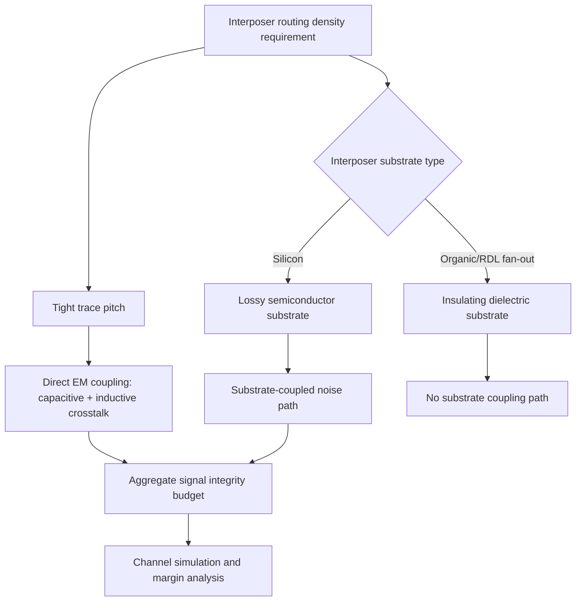

## Interposer Routing and Signal Integrity Considerations

### Overview

Interposer routing and signal integrity considerations address how signals are physically routed across an interposer (silicon, organic, or RDL-based) and what electrical phenomena must be managed to preserve signal quality across these short but electrically significant interconnects. Because interposers sit at the intersection of die-level and package-level electrical domains, they inherit signal integrity challenges from both worlds — fine-pitch, high-density routing reminiscent of on-die interconnect, combined with substrate-coupling and impedance-discontinuity effects more typical of package-level interconnect.

### Routing Layer Allocation

Interposer routing is typically partitioned across multiple metal layers, each optimized for a different electrical function:

- **Signal layers**: Carry high-speed data, command, and address signals between dies (e.g., logic-to-HBM channels), typically on the finest-pitch layers to maximize routing density and minimize trace length
- **Power/ground planes or grids**: Dedicated layers (or substantial plane regions within signal layers) providing low-impedance power delivery and a continuous reference plane for signal return current
- **Shielding/isolation structures**: Ground traces or plane fill between sensitive signal groups to reduce crosstalk, particularly relevant given the tight pitch and geometry of interposer routing

Routing layer count and allocation depend on the total signal count that must cross the interposer and the achievable pitch of the fabrication process (finer pitch on silicon interposer RDL vs. coarser pitch on organic/laminate approaches, as covered in the interposer alternatives topic).

### Transmission Line Behavior at Interposer Scale

Even though interposer traces are physically short compared to PCB-level interconnect, they must be treated as transmission lines rather than lumped-element wires once signal rise/fall times become comparable to or shorter than the trace's electrical length — a condition commonly met at the multi-Gbps signaling rates used in HBM and die-to-die interfaces.

#### Characteristic Impedance

Interposer trace impedance is governed by standard transmission line geometry relationships (microstrip or stripline configurations, depending on layer stack-up), following the same underlying physics as PCB trace impedance but at much finer geometric scale:

$$Z_0 \approx \frac{\eta}{2\pi\sqrt{\varepsilon_r}}\ln\left(\frac{8h}{w} + \frac{w}{4h}\right)$$

(a standard microstrip approximation, where $h$ is dielectric height, $w$ is trace width, and $\varepsilon_r$ is the relative dielectric permittivity) — provided here to illustrate the general geometric dependence; actual interposer trace impedance calculation typically requires full-wave or field-solver simulation given the multi-layer, multi-dielectric stack-ups and non-ideal geometries (rounded corners, via transitions) present in real interposer designs.

- **[Inference]** Impedance-controlled routing is generally treated as a design requirement for high-speed signal layers on interposers to minimize reflections at any impedance discontinuities, though achieving tightly controlled impedance is more challenging at interposer-scale geometries than at PCB scale due to tighter tolerances relative to feature size; specific target impedances and tolerance windows are interface-specification-dependent (e.g., defined by the relevant HBM or die-to-die interface standard).

#### Impedance Discontinuities

Signal integrity degradation at interposer scale commonly originates at geometric transitions rather than along uniform trace runs:

- Micro-bump and TSV transitions (a signal passing from die, through a micro-bump, onto interposer RDL, potentially through a TSV, and onto backside RDL) each represent a local impedance discontinuity
- Via stubs (unused portions of a via barrel beyond the signal transition point) can introduce resonance effects at high frequencies
- **[Inference]** Because interposer signal paths often traverse multiple such transitions in a single channel (bump → RDL → TSV → RDL → bump), aggregate discontinuity effects across a full channel are generally more significant to overall signal integrity budget than any single transition in isolation, making full-channel simulation (rather than single-transition analysis) the standard practice for interface qualification.

### Crosstalk Mechanisms

Interposer routing density — often the primary reason for using an interposer in the first place — directly creates crosstalk risk, arising through multiple coupling mechanisms:

#### Direct Electromagnetic Coupling

Adjacent traces at tight pitch couple capacitively and inductively, following standard coupled-transmission-line behavior; tighter trace pitch (a direct consequence of the density interposers are meant to provide) increases near-end and far-end crosstalk magnitude for a given trace length and edge rate.

#### Substrate-Coupled Noise (Silicon Interposers Specifically)

As covered in TSV electrical modeling, silicon is a lossy semiconductor rather than an ideal insulator. On a silicon interposer, this means:

- TSVs and, to a lesser extent, RDL traces running close to the silicon surface can couple noise into the substrate
- This substrate-coupled noise can propagate and re-couple onto other nearby TSVs or sensitive circuit nodes, an effect that does not exist in organic or RDL-based (silicon-free) interposer alternatives, since those substrates are effectively insulating dielectrics rather than lossy semiconductors
- **[Inference]** This substrate-coupling mechanism is a specific signal integrity consideration unique to silicon interposers relative to organic or fan-out alternatives, and is generally addressed through substrate resistivity selection, TSV placement/shielding strategy, and dedicated ground/guard structures, though exact mitigation approaches are design- and foundry-specific.

### Power Delivery Network (PDN) Considerations

Signal integrity on an interposer cannot be fully separated from power delivery network design, since power supply noise directly modulates signal timing margins (through supply-induced jitter) on the dies the interposer connects:

- **PDN impedance**: Interposer power/ground routing, TSV power delivery paths, and decoupling strategy together determine PDN impedance across the frequency range relevant to the connected dies' switching activity
- **Simultaneous switching noise (SSN)**: Dense parallel signal switching (characteristic of wide-interface HBM channels) draws transient current that, combined with non-zero PDN impedance, induces voltage droop/bounce that can degrade signal timing margins on adjacent signal paths
- **[Inference]** Because interposer PDN impedance is influenced by TSV inductance, RDL trace resistance, and available decoupling capacitance placement (which is itself constrained by interposer routing area competition with signal routing), PDN and signal routing are generally co-optimized rather than designed independently, though the specific co-optimization methodology is design-flow and tool-dependent.

### Channel Simulation and Design Verification Practice

Given the combination of transmission line effects, multiple discontinuity types, and (for silicon interposers) substrate coupling, interposer signal integrity verification typically relies on:

- **Extraction**: Parasitic RLC(G) extraction of the full interposer routing structure, including TSVs, RDL traces, and bump/via transitions, from physical layout
- **Full-channel simulation**: Time-domain (transient) or frequency-domain (S-parameter based) simulation of the complete signal path from die transmitter through the interposer to die receiver, incorporating extracted parasitics
- **Eye diagram / margin analysis**: Evaluating simulated channel response against the target interface's signaling specification (e.g., HBM's defined timing and voltage margins) to confirm adequate design margin under worst-case process, voltage, and temperature (PVT) conditions
- **[Inference]** Given the growing signaling rates of successive HBM generations and other die-to-die interface standards, channel simulation rigor and required margin analysis complexity have generally increased over time, though specific verification methodologies and margin requirements are defined by each interface standard's specification and each design team's qualification practice.

### Interposer Signal Path Cross-Section (svg_diagram)

<svg xmlns="http://www.w3.org/2000/svg" viewBox="0 0 800 350">
<text x="400" y="30" text-anchor="middle" font-size="15" font-weight="bold" fill="#1a1a1a">Signal Path Discontinuities Across Interposer (svg_diagram)</text>

<rect x="80" y="60" width="120" height="30" fill="#c9daf8" stroke="#0b5394" />
<text x="140" y="80" text-anchor="middle" font-size="10">Die A (Tx)</text>

<circle cx="140" cy="100" r="5" fill="#999" />
<text x="140" y="118" text-anchor="middle" font-size="8" fill="#c00">Discontinuity 1</text>

<line x1="140" y1="105" x2="400" y2="105" stroke="#f9cb9c" stroke-width="4" />
<text x="270" y="98" text-anchor="middle" font-size="9">Front-side RDL trace</text>

<rect x="395" y="105" width="10" height="80" fill="#e69138" stroke="#333" />
<text x="400" y="200" text-anchor="middle" font-size="8" fill="#c00">Discontinuity 2 (TSV)</text>

<line x1="405" y1="185" x2="600" y2="185" stroke="#d9ead3" stroke-width="4" />
<text x="500" y="178" text-anchor="middle" font-size="9">Backside RDL trace</text>

<circle cx="600" cy="185" r="5" fill="#999" />
<text x="600" y="203" text-anchor="middle" font-size="8" fill="#c00">Discontinuity 3</text>

<rect x="540" y="215" width="120" height="30" fill="#d9d2e9" stroke="#674ea7" />
<text x="600" y="235" text-anchor="middle" font-size="10">Die B (Rx)</text>

<text x="400" y="290" text-anchor="middle" font-size="10" fill="#666">Full channel = bump + RDL + TSV + RDL + bump, each a potential Z-discontinuity</text>

</svg>

**Related Topics**

- TSV electrical modeling and substrate coupling mechanisms
- Silicon interposer design and fabrication
- Organic and RDL-based interposer alternatives
- HBM interface signaling and channel timing specifications
- Power delivery network (PDN) impedance design for multi-die packages
- S-parameter extraction and full-channel signal integrity simulation
- Simultaneous switching noise (SSN) and decoupling capacitor placement
- Crosstalk mitigation via guard traces and shielding structures