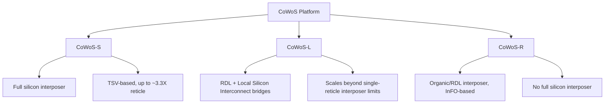

## TSMC CoWoS Family: CoWoS-S, CoWoS-L, and CoWoS-R

### Overview

CoWoS (Chip-on-Wafer-on-Substrate) is TSMC's 2.5D packaging platform for integrating logic dies, chiplets, and HBM stacks into a single package via an interposer-based flow. CoWoS is TSMC's productized implementation of the general silicon-interposer and interposer-alternative concepts covered elsewhere in this chapter: CoWoS-S accommodates an interposer up to approximately 3.3X-reticle size (~2700 mm²), while CoWoS-L or CoWoS-R are recommended for interposer sizes larger than that. The three variants differ primarily in interposer material, construction method, and target application, representing three distinct points along the density-cost-scalability trade-off space discussed generally in the silicon interposer and organic/RDL interposer alternatives topics. [Substack](https://globalsemiresearch.substack.com/p/tsmcs-cowos-capacity-scaling-up-outsourcing)[TSMC](https://3dfabric.tsmc.com/english/dedicatedFoundry/technology/cowos.htm)

### CoWoS-S: Full Silicon Interposer

#### Structure

CoWoS-S is the original and most established CoWoS variant, using a **full silicon interposer** with TSVs — the direct commercial implementation of the silicon interposer architecture (front-side/backside RDL, TSV array, micro-bumps, C4 bumps) described in the silicon interposer topic.

- CoWoS-S uses a silicon interposer with Through-Silicon Vias, supports HBM integration, and has been used in flagship AI accelerator products. [Aminext](https://www.aminext.blog/en/post/tsmc-cowos-s-r-l-differences)
- CoWoS-S is currently the market mainstream variant, used in AI servers and high-performance computing products, though its production cost is relatively high compared to the alternatives. [7evenguy](https://en.7evenguy.com/what-are-cowos-s-cowos-r-and-cowos-l/)
- CoWoS-S can accommodate an interposer up to approximately 3.3X-reticle size, roughly 2700 mm². This reticle-size ceiling exists because a full silicon interposer, like any silicon die, cannot exceed the maximum field size a lithography scanner can expose in a single pass without stitching. [TSMC](https://3dfabric.tsmc.com/english/dedicatedFoundry/technology/cowos.htm)

#### Trade-offs

- Finest achievable interconnect density among the three variants, since it inherits the full front-end-lithography-based routing precision of a true silicon interposer
- Higher relative cost and reticle-size ceiling relative to CoWoS-L and CoWoS-R
- **[Inference]** Because it is the most mature and highest-density variant, CoWoS-S is generally positioned for products where interconnect density and signal integrity requirements are paramount and package size fits within the reticle-based size ceiling, though specific product allocation decisions depend on customer design requirements and available capacity.

### CoWoS-L: Local Silicon Interconnect (LSI) Bridges

#### Structure

CoWoS-L replaces the single monolithic silicon interposer with a **redistribution-layer-based carrier embedding smaller silicon bridge chiplets** (Local Silicon Interconnect, or LSI chips) only at the specific die-to-die or die-to-HBM junctions that require the finest routing density, while the rest of the package uses RDL fan-out routing.

- LSI chips provide high routing density die-to-die interconnect through multiple layers of sub-micron copper lines, and can feature connection architectures such as SoC-to-SoC, SoC-to-chiplet, or SoC-to-HBM, with metal types, layer counts, and pitches aligned with the CoWoS-S offering. [TSMC](https://3dfabric.tsmc.com/english/dedicatedFoundry/technology/cowos.htm)
- TSMC's first CoWoS-L at 3.5X-reticle size entered volume production in 2024, and CoWoS-L continues scaling interposer size to integrate more silicon and memory. [TSMC](https://3dfabric.tsmc.com/english/dedicatedFoundry/technology/cowos.htm)
- CoWoS-L enables extra-large interposer areas exceeding 3000 mm² by stitching multiple interposer segments using LSI technology, allowing more chiplets and HBM stacks in a single package for AI training systems requiring very high bandwidth. [Aminext](https://www.aminext.blog/en/post/tsmc-cowos-s-r-l-differences)
- CoWoS-L offers cost savings via RDL plus silicon bridges compared to the full silicon interposer used in CoWoS-S, though it carries higher complexity and roughly 3–4x higher value per unit. [Substack](https://globalsemiresearch.substack.com/p/tsmcs-cowos-capacity-scaling-up-outsourcing)

#### Why LSI Bridges Enable Larger Packages

Because only small silicon bridge chiplets — not an entire monolithic interposer — need to be manufactured with fine-pitch lithography, LSI-based construction sidesteps the single-reticle size ceiling that constrains CoWoS-S. Multiple LSI bridges can be embedded into a single large RDL-based carrier, each serving a specific high-density interconnect junction, while the surrounding RDL handles lower-density fan-out routing — directly analogous to the RDL-based fan-out interposer concept covered in the organic/RDL interposer alternatives topic, but combined with embedded silicon bridge segments for the highest-density junctions.

#### Trade-offs

- Larger interposer size introduces thermal, mechanical, and yield challenges, which have limited CoWoS-L adoption primarily to flagship products. [Aminext](https://www.aminext.blog/en/post/tsmc-cowos-s-r-l-differences)
- CoWoS-L is being used at significant volume for next-generation flagship AI accelerator products, reflecting its role as the scaling path beyond CoWoS-S's reticle-size limit. [Substack](https://globalsemiresearch.substack.com/p/tsmcs-cowos-capacity-scaling-up-outsourcing)

### CoWoS-R: Organic/RDL Interposer

#### Structure

CoWoS-R replaces the silicon interposer entirely with an **organic RDL-based interposer built using InFO (Integrated Fan-Out) technology** — the direct commercial implementation of the RDL-based fan-out interposer concept covered in the organic/RDL interposer alternatives topic.

- CoWoS-R uses InFO technology and organic interposers to replace the silicon interposers used in CoWoS-S, integrating various SoCs and HBMs heterogeneously, which reduces overall packaging cost and makes it suitable for networking products. [7evenguy](https://en.7evenguy.com/what-are-cowos-s-cowos-r-and-cowos-l/)
- CoWoS-R utilizes InFO technology with an RDL interposer for chip-to-chip interconnection, particularly for HBM and SoC heterogeneous integration. [7evenguy](https://en.7evenguy.com/what-are-cowos-s-cowos-r-and-cowos-l/)
- The main difference between CoWoS-S and CoWoS-R lies in the material and structure used for the interposer, with CoWoS-S using a silicon interposer and CoWoS-R using the organic/RDL-based approach instead. [SemiWiki](https://semiwiki.com/semiconductor-manufacturers/tsmc/371759-the-difference-between-cowos-s-and-cowos-r/)

#### Trade-offs

- Lower cost than CoWoS-S due to elimination of TSV formation, fill, and reveal, and use of organic/RDL fabrication rather than front-end-lithography-based silicon interposer processing
- Coarser achievable routing density than CoWoS-S, positioning it for applications with lower interconnect density requirements than the most demanding HBM-heavy AI training accelerators
- Positioned as suitable for networking products rather than the highest-bandwidth AI training use cases that favor CoWoS-S or CoWoS-L [7evenguy](https://en.7evenguy.com/what-are-cowos-s-cowos-r-and-cowos-l/)

### Comparative Summary

| Attribute | CoWoS-S | CoWoS-L | CoWoS-R |
| --- | --- | --- | --- |
| Interposer base | Full silicon | RDL carrier + embedded LSI silicon bridges | Organic/RDL (InFO-based) |
| TSVs | Yes, full interposer array | Present within LSI bridge segments | Generally avoided/minimal |
| Max size class | Up to ~3.3X reticle (~2700 mm²) | Beyond single-reticle, 3.5X+ demonstrated, exceeding 3000 mm² | Organic-substrate scalable |
| Relative cost | Relatively high | Higher complexity, ~3–4x value vs. CoWoS-S per unit | Reduced cost relative to CoWoS-S |
| Routing density | Finest | Fine at LSI bridge junctions, coarser elsewhere | Coarser than CoWoS-S |
| Representative use case | High-end AI accelerators (e.g., NVIDIA H100-class) | Flagship next-gen AI accelerators (e.g., MI400/MI450-class products), also used by Broadcom | Networking products, cost-sensitive heterogeneous integration |

### Capacity and Industry Context

**[Unverified]** Capacity figures, customer allocation percentages, and specific product-to-variant mappings change frequently and are best confirmed against current TSMC disclosures or recent market analysis rather than treated as fixed, since this is an actively evolving, capacity-constrained market segment. As illustrative context: total CoWoS demand has roughly tripled in two years, from an estimated ~370,000 wafers in 2024 to approaching ~1.0 million wafers in 2026, with TSMC ramping monthly capacity from about 75–80k toward a 120–130k wafers-per-month target by the end of 2026. Analyst estimates regarding customer allocation percentages (such as NVIDIA's share of CoWoS demand) are industry and sell-side estimates rather than TSMC disclosures, and should be treated as analysis rather than confirmed figures. [Silicon Analysts](https://siliconanalysts.com/analysis/foundry-allocation-status-q1-2026)[Inside Deep Tech](https://www.insidedeeptech.com/tsmc-cowos-packaging-full-guide/)

### Relationship to General Interposer Concepts

Mapping CoWoS variants back to the general concepts covered earlier in this chapter:

- **CoWoS-S** = commercial silicon interposer (full TSV-based interposer, as in "Silicon interposer design and fabrication")
- **CoWoS-R** = commercial RDL-based fan-out interposer (as in "Organic and RDL-based interposer alternatives")
- **CoWoS-L** = a hybrid approach not fully covered by either prior topic in isolation: RDL-based carrier construction (like CoWoS-R/organic alternatives) combined with embedded silicon bridge chiplets at high-density junctions (preserving CoWoS-S-like density exactly where needed) — enabling package sizes beyond the single-reticle ceiling that constrains a monolithic silicon interposer

**Related Topics**

- Silicon interposer design and fabrication (CoWoS-S architectural basis)
- Organic and RDL-based interposer alternatives (CoWoS-R architectural basis)
- TSMC SoIC and 3D hybrid bonding as a complementary/feeder technology to CoWoS
- Reticle-limited die and interposer size constraints in lithography
- InFO (Integrated Fan-Out) wafer-level packaging fundamentals
- HBM stack integration density requirements across CoWoS variants
- Package-level thermal and mechanical challenges at multi-reticle interposer sizes
- Known-good-die (KGD) testing and yield economics in multi-die CoWoS assembly