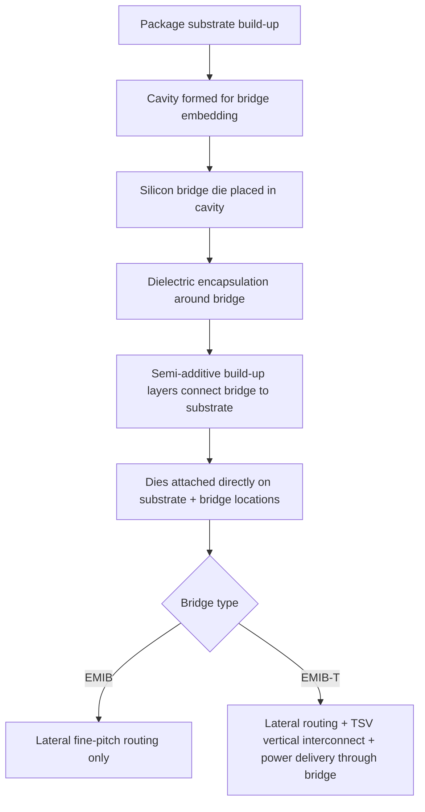

## Intel EMIB and EMIB-T Embedded Bridge Architecture

### Overview

Embedded Multi-die Interconnect Bridge (EMIB) is Intel's 2.5D packaging architecture that embeds small silicon bridge dies directly into an organic package substrate, providing high-density die-to-die interconnect only at the specific locations where it is needed, rather than covering the entire package footprint with a full silicon interposer. EMIB-T extends this architecture by integrating through-silicon vias into the bridge, enabling vertical interconnect and power delivery through the bridge itself in addition to the lateral routing the original EMIB architecture provides. Both represent Intel's answer to the same 2.5D integration problem CoWoS addresses, using a localized-bridge philosophy that is architecturally closest to TSMC's CoWoS-L. [TrendForce](https://www.trendforce.com/news/2026/05/04/news-intels-emib-reportedly-gains-traction-at-google-meta-yields-said-to-reach-90-milestone/)

### EMIB: Core Architecture

#### Structural Concept

Rather than placing all dies atop a single large interposer, EMIB uses local silicon bridges to host ultrafine line/space structures for die-to-die interconnect communications, embedding a silicon bridge die into an organic substrate, encapsulating it with dielectric materials, and connecting it to external layers of the package substrate through semi-additive substrate build-up processes at the panel level. [IEEE Xplore](https://ieeexplore.ieee.org/document/9501629/)

- In EMIB's architecture, the bridges are embedded directly into the package substrate itself, with chiplets sitting atop the substrate rather than on top of an additional carrier layer, which reduces assembly complexity relative to interposer-based approaches, since it removes a separate die-to-interposer bonding step and an added material layer that would otherwise contribute cost and thermal resistance. [Tech Times](https://www.techtimes.com/articles/322276/20260730/tsmc-copies-intels-packaging-approach-new-emib-like-program-kinsus-shakes-ai-race.htm)
- An EMIB bridge is a piece of silicon containing multiple layers of fine-pitch copper routing, fabricated on silicon wafers using processes similar to back-end-of-line wafer processing: dielectric deposition, copper damascene routing, and via formation. [Semiconductorx](https://semiconductorx.com/packaging-emib.html)
- Many bridge dice can be embedded as part of a single package, with each bridge serving one specific high-density interconnect junction (e.g., logic-to-HBM, or die-to-die), while the surrounding substrate uses conventional (coarser) build-up routing for the rest of the package. [IEEE Xplore](https://ieeexplore.ieee.org/document/9501629/)

#### Manufacturing Flow and Ownership Division

Intel manufactures the bridge, substrate suppliers embed it into the package substrate, and Intel then performs final assembly by attaching the die. This flow creates a key manufacturing trade-off: EMIB avoids a large interposer and wafer-level assembly steps associated with full interposer solutions, but it raises the bar for embedded substrate manufacturing — bridge placement, substrate cavity formation, build-up layer registration, and die attach alignment become critical. [X](https://x.com/TheValueist/article/2064314206875226268)[X](https://x.com/TheValueist/article/2064314206875226268)

#### Production History and Deployment

EMIB has been in high-volume production since 2017 for server, network, and HPC products. Notable deployments include: [Technetbook](https://www.technetbooks.com/2026/01/intel-emib-technology-explained-guide.html)

- Stratix 10 FPGAs, which introduced EMIB commercially to connect the FPGA fabric to high-speed transceiver dies and HBM memory, with Agilex FPGAs continuing the pattern with more aggressive multi-die integration [Semiconductorx](https://semiconductorx.com/packaging-emib.html)
- Sapphire Rapids Xeon server CPUs with HBM, which use EMIB to bridge between compute tiles and HBM stacks on the same substrate [Semiconductorx](https://semiconductorx.com/packaging-emib.html)
- Ponte Vecchio, which combines EMIB with Foveros to integrate 40+ chiplets, where EMIB bridges handle lateral connections between compute columns while Foveros handles vertical stacking within each column [Semiconductorx](https://semiconductorx.com/packaging-emib.html)

### EMIB vs. Full Silicon Interposer: Trade-off Rationale

Full silicon interposers deliver higher total die-to-die bandwidth because routing runs continuously across the full module area rather than only at bridge zones. For AI accelerators with very wide memory bandwidth requirements — a logic die connected to eight or more HBM stacks with thousands of signals to each — the full interposer remains the preferred architecture. For products with more localized high-bandwidth requirements — a compute die connected to one or two HBM stacks on one side, transceivers on another, other compute on a third — EMIB's bridge-per-interface approach delivers the required bandwidth at much lower cost and with greater topology flexibility. [Semiconductorx](https://semiconductorx.com/packaging-emib.html)[Semiconductorx](https://semiconductorx.com/packaging-emib.html)

- **[Inference]** This trade-off directly parallels the general silicon-interposer-vs-RDL/bridge-based trade-off covered in the interposer alternatives topic: EMIB pays only for high-density silicon wherever a bridge is placed, rather than for an entire interposer's worth of TSV and fine-pitch RDL area, which is the same underlying cost-density logic that motivates CoWoS-L's LSI bridge approach.

### EMIB-T: Adding Through-Silicon Vias to the Bridge

#### Core Extension

Silicon bridges embedded in the substrate allow chiplets to be joined edge-to-edge with very high interconnect density, without needing a silicon interposer to cover the entire package. With the addition of TSV in EMIB-T, these bridges gain capacity and versatility for large packages that integrate dozens of different components. [PcHardwarePro](https://www.pchardwarepro.com/en/What-is-Intel-EMIB-and-why-is-it-key-to-AI-and-advanced-packaging/)

Intel Foundry's Embedded Multi-die Interconnect Bridge with Through-Silicon Via (EMIB-T) technology offers a scalable heterogeneous integration solution for chiplets, developed to meet the stringent bandwidth and power delivery requirements of cutting-edge HBM4E interfaces. The EMIB-T architecture incorporates a large number of metal layers, advanced routing capabilities, and integrated power delivery features. [Wccftech](https://wccftech.com/intel-emib-t-breaks-past-existing-ai-hpc-scaling-limits-enabling-ultra-large-die-complexes/)[Wccftech](https://wccftech.com/intel-emib-t-breaks-past-existing-ai-hpc-scaling-limits-enabling-ultra-large-die-complexes/)

#### Why TSVs Matter for a Bridge Architecture

Where the original EMIB bridge provides only **lateral** (in-plane) fine-pitch routing between dies sitting side-by-side on the substrate, adding TSVs through the bridge itself enables **vertical** current and signal paths through the bridge — most significantly for power delivery, since high-bandwidth memory integration is one of the areas where the value of EMIB-T is best understood, as HBM has become as important as, or even more important than, the computing logic itself in modern accelerators, and HBM's power and signal demands benefit from a lower-impedance vertical path than lateral-only routing can provide. [PcHardwarePro](https://www.pchardwarepro.com/en/What-is-Intel-EMIB-and-why-is-it-key-to-AI-and-advanced-packaging/)

- **[Inference]** This closely parallels why silicon interposers use TSVs for backside power/signal delivery rather than routing everything through front-side RDL alone (as covered in the TSV electrical modeling topic): a purely lateral bridge, like a purely front-side RDL layer, eventually hits routing and power-delivery-network impedance limits that a vertical via path through the structure relieves.

#### Scaling Targets

Intel's March 2026 Foundry blog states that EMIB-T uses small bridges fabricated at high density with approximately 90% wafer utilization, then embedded into large-format organic panels, with Intel targeting complexes above 8x reticle size, roughly 6800 mm², in 2026, and above 12x reticle size, roughly 10000 mm², with at least 16 HBM4/HBM5 stacks and 30 or more bridges by 2028. [X](https://x.com/TheValueist/article/2064314206875226268)

- EMIB-T is positioned to break past existing AI and HPC scaling limits, enabling ultra-large die complexes with over 10x reticle dies and 12+ Gb/s HBM4e DRAM support. [Wccftech](https://wccftech.com/intel-emib-t-breaks-past-existing-ai-hpc-scaling-limits-enabling-ultra-large-die-complexes/)

#### EMIB 3.5D: Combining Lateral and Vertical Integration

EMIB 3.5D is Intel's current terminology for combining EMIB lateral bridge connectivity with Foveros vertical die stacking within a single package — extending the Ponte Vecchio-era EMIB+Foveros combination concept into a more formalized platform naming, layering true 3D die stacking (Foveros) on top of 2.5D lateral bridge interconnect (EMIB) in the same package. [X](https://x.com/TheValueist/article/2064314206875226268)

### Yield and Adoption Status

According to reporting, Intel's EMIB has reached approximately 90% yield levels, with Google and Meta Platforms emerging as potential adopters for future designs; Google's TPU v8e, scheduled for the second half of 2027, and Meta's in-house CPU planned for the second half of 2028, are both reportedly expected to leverage Intel's EMIB technology. Separately, Google has placed an order for Intel to package more than three million of its custom Tensor Processing Units in 2028, and Amazon's AWS Trainium 3 accelerator is reportedly also targeting Intel's EMIB-T platform. [[News] Intel’s EMIB Reportedly Gains Traction at Google, Meta; Yields Said to Reach ~90% Milestone +2](https://www.trendforce.com/news/2026/05/04/news-intels-emib-reportedly-gains-traction-at-google-meta-yields-said-to-reach-90-milestone/)

**[Unverified]** Customer engagement reports, order volumes, and adoption timelines for EMIB-T are drawn from industry reporting and analyst commentary rather than confirmed company disclosures in all cases, and should be treated as developing industry context rather than settled fact, since Intel states EMIB has been in mass production since 2017 with Intel and external silicon, but reviewed official materials do not name a high-volume external AI accelerator shipping in production on EMIB as of the underlying report, and reported hyperscaler engagements should be treated as important but unverified unless confirmed by the customer, Intel, filings, revenue disclosure, or teardown. [X](https://x.com/TheValueist/article/2064314206875226268)

### Comparison to CoWoS-L

The closest structural peer to EMIB is TSMC CoWoS-L, which uses the same bridge concept within the CoWoS architecture family. Where CoWoS-L is a relatively recent addition to TSMC's advanced packaging portfolio, EMIB has been Intel's volume 2.5D architecture for longer and has seen broader product deployment. Notably, the urgency behind TSMC's newer EMIB-like bridge program with substrate partner Kinsus is directly traceable to Intel's success in converting customer interest into signed orders for EMIB-based packaging, indicating cross-industry convergence toward the localized-bridge philosophy both companies now pursue in parallel with their respective full-interposer offerings (CoWoS-S / silicon interposer). [Semiconductorx](https://semiconductorx.com/packaging-emib.html)[Tech Times](https://www.techtimes.com/articles/322276/20260730/tsmc-copies-intels-packaging-approach-new-emib-like-program-kinsus-shakes-ai-race.htm)

### Future Direction

Future EMIB-T versions are expected to include higher-density on-bridge MIM capacitors, larger high-aspect-ratio bridge dies, sub-25 µm bump pitch, active bridges, and embedded voltage regulators inside EMIB dies. More broadly, as package sizes outgrow the practical limits of circular silicon interposers, additional vendors are proposing interposer-less integration schemes beyond Intel's EMIB-T, including panel-scale organic and glass-core interposer approaches, reflecting an industry-wide shift toward bridge-based and RDL-based architectures for the largest AI/HPC packages, consistent with the reticle-scaling motivations discussed in the CoWoS family topic. [Semianalysis](https://newsletter.semianalysis.com/p/ectc2026)[Semianalysis](https://newsletter.semianalysis.com/p/ectc2026)

### EMIB-T Package Cross-Section (svg_diagram)

<svg xmlns="http://www.w3.org/2000/svg" viewBox="0 0 800 380">
<text x="400" y="30" text-anchor="middle" font-size="15" font-weight="bold" fill="#1a1a1a">EMIB-T Embedded Bridge Package (svg_diagram)</text>

<rect x="140" y="60" width="140" height="35" fill="#c9daf8" stroke="#0b5394" />
<text x="210" y="82" text-anchor="middle" font-size="10">Logic Die</text>
<rect x="320" y="60" width="100" height="35" fill="#d9d2e9" stroke="#674ea7" />
<text x="370" y="82" text-anchor="middle" font-size="9">HBM Stack</text>
<rect x="460" y="60" width="100" height="35" fill="#d9d2e9" stroke="#674ea7" />
<text x="510" y="82" text-anchor="middle" font-size="9">HBM Stack</text>

<rect x="80" y="95" width="600" height="140" fill="#fff2cc" stroke="#bf9000" />
<text x="700" y="165" font-size="9" fill="#666">Organic build-up substrate</text>

<rect x="270" y="105" width="60" height="40" fill="#e69138" stroke="#333" />
<text x="300" y="128" text-anchor="middle" font-size="8" fill="#fff">Bridge+TSV</text>

<rect x="280" y="145" width="6" height="15" fill="#333" />
<rect x="310" y="145" width="6" height="15" fill="#333" />

<rect x="410" y="105" width="60" height="40" fill="#e69138" stroke="#333" />
<text x="440" y="128" text-anchor="middle" font-size="8" fill="#fff">Bridge+TSV</text>
<rect x="420" y="145" width="6" height="15" fill="#333" />
<rect x="450" y="145" width="6" height="15" fill="#333" />

<rect x="80" y="160" width="600" height="75" fill="#fce5cd" stroke="#b45f06" stroke-dasharray="3,2" />
<text x="700" y="200" font-size="9" fill="#666">Semi-additive build-up (power/signal fan-out)</text>

<g fill="#999">
<circle cx="150" cy="245" r="5" /><circle cx="220" cy="245" r="5" /><circle cx="290" cy="245" r="5" />
<circle cx="360" cy="245" r="5" /><circle cx="430" cy="245" r="5" /><circle cx="500" cy="245" r="5" /><circle cx="570" cy="245" r="5" />
</g>

<rect x="80" y="260" width="600" height="20" fill="#d9d9d9" stroke="#666" />
<text x="700" y="273" font-size="9" fill="#666">to board/PCB</text>

<text x="400" y="320" text-anchor="middle" font-size="10" fill="#666">Bridges embedded only at high-density junctions; rest of package uses substrate build-up routing</text>

</svg>

**Related Topics**

- TSMC CoWoS-L (structural peer bridge-based architecture within the CoWoS family)
- Silicon interposer design and fabrication (full-interposer alternative to bridge-based approaches)
- TSV formation and electrical modeling as applied to bridge structures
- Intel Foveros 3D die-stacking and its combination with EMIB (EMIB 3.5D)
- HBM4/HBM4E/HBM5 interface bandwidth and power delivery requirements
- Panel-scale organic and glass-core substrate integration
- Package substrate cavity formation and embedded-die alignment tolerances
- Fan-out embedded bridge (FO-EB) and competing interposer-less integration schemes