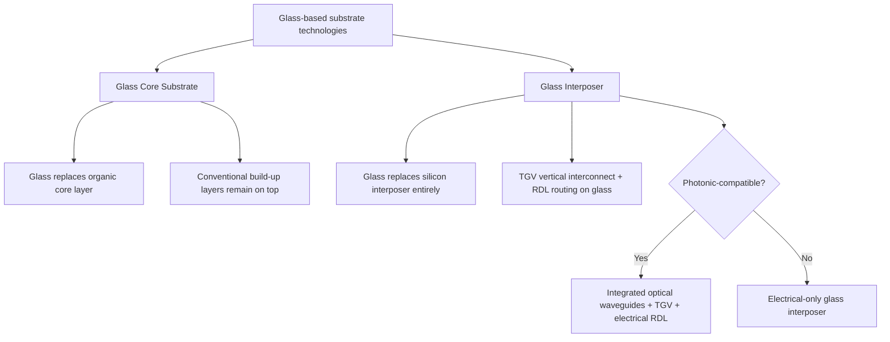

## Glass Interposers and Photonic-Compatible Substrates

### Overview

Glass interposers and glass core substrates are an emerging alternative interposer/substrate material class being pursued across the industry to address limitations that both silicon interposers and organic build-up substrates face at the largest AI/HPC package sizes: silicon's reticle-size ceiling and cost, and organic substrate's warpage and dielectric loss at scale. Glass additionally offers a distinctive capability neither silicon nor conventional organic substrates provide well — native optical transparency — positioning it as the leading candidate material for substrates that must simultaneously carry electrical interconnect and integrated optical waveguides for photonic and co-packaged optics (CPO) applications.

### Two Categories of Glass-Based Substrates

Glass-based solutions fall into two categories: one replaces the core layer of a conventional build-up substrate with glass, known as a **glass core substrate**; the other replaces the silicon interposer with glass entirely, known as a **glass interposer**.

### Why Glass: Material Property Motivation

Glass offers several properties that make it attractive relative to both silicon and organic substrates for advanced packaging:

- **Flatness and dimensional stability**: Glass panels can be manufactured with high flatness and low warpage tendency, addressing a persistent challenge in large organic substrates and reconstituted fan-out panels, where CTE and modulus mismatches between mold compound and embedded dies drive warpage
- **Low dielectric loss**: Glass exhibits favorable high-frequency electrical loss characteristics compared to organic dielectrics, relevant to the signal integrity concerns covered in the interposer routing topic, particularly as signaling rates continue to increase
- **Panel-scale processing potential**: Unlike silicon (limited to 300 mm wafer format), glass can be processed at large panel scale (500 mm-class panels have been demonstrated), directly addressing the reticle-size and wafer-size ceiling that constrains silicon interposers, similar in motivation to the panel-scale RDL fan-out approaches covered in the organic/RDL interposer alternatives topic
- **Native optical transparency**: Unlike silicon or organic materials, glass is optically transparent at wavelengths relevant to photonic interconnect, enabling integrated waveguides to be formed directly within or on the substrate

### Through-Glass Via (TGV): The Glass Equivalent of TSV

Glass interposers require a vertical interconnect technology analogous to the TSV formation approaches covered earlier in this chapter, adapted to glass's different material properties:

#### TGV Formation Methods

- **Laser-Induced Deep Etching (LIDE)**: A laser modifies the glass material along the via path, followed by a wet chemical etch that selectively removes the laser-modified material to form the via
- **Direct laser ablation**: Direct laser drilling of via holes through the glass, without a separate chemical etch step
- **Photosensitive glass methods**: Using glass formulations that respond directly to targeted exposure and development processes analogous to photoresist patterning, allowing via definition through an exposure-and-develop sequence rather than laser drilling alone

Benchmark figures cited for commercial readiness include via diameters around 6 µm with aspect ratios up to approximately 15:1, though **[Unverified]** exact achievable geometries vary by vendor, TGV method, and glass formulation, and should be confirmed against current supplier specifications given the pace of development in this area.

#### TGV vs. TSV Comparison

| Aspect | TSV (Silicon) | TGV (Glass) |
| --- | --- | --- |
| Formation method | DRIE (Bosch process) | Laser-based (LIDE, direct ablation) or photosensitive glass patterning |
| Substrate conductivity | Semiconductor (requires liner for isolation, causes MIS capacitance) | Insulator (no liner-induced depletion capacitance concern) |
| Substrate coupling/crosstalk | Present (lossy silicon substrate coupling, as in TSV electrical modeling) | Substantially reduced, since glass is a true insulator rather than a lossy semiconductor |
| Typical fill material | Copper (via-middle/via-last) or polysilicon (via-first) | Copper, via electroplating |
| CTE | ~2.6-3 ppm/°C (close match to die silicon) | Tunable via glass formulation; low-CTE borosilicate compositions are used to approach silicon-like CTE matching |

- **[Inference]** Because glass is a true electrical insulator rather than a lossy semiconductor, glass interposers are generally expected to avoid the substrate-coupled noise mechanism that is a specific signal integrity concern for silicon interposers (as covered in the interposer routing topic), though TGV electrical modeling still requires accounting for standard transmission-line and via-transition discontinuity effects common to any vertical interconnect structure.

### Fabrication and Process Flow

The general glass interposer fabrication sequence parallels the silicon interposer flow, substituting glass-specific process modules:

1. Glass panel/wafer preparation (low-CTE borosilicate formulations are commonly supplied for early evaluations)
2. TGV formation (LIDE, laser ablation, or photosensitive glass patterning)
3. TGV metallization (copper fill, typically via electroplating, analogous to TSV copper fill)
4. RDL build-up on front and back surfaces (fine-pitch routing layers), with commercial targets in the sub-2 µm RDL geometry range for the most advanced offerings
5. For photonic-compatible variants: integration of optical waveguides (planar waveguides formed on or within the glass) and optical fiber interface structures, in addition to the electrical RDL and TGV structures
6. Panel-level or die-level singulation and assembly integration

- **[Inference]** Panel-level processing (PLP) is a recurring emphasis across glass substrate development because it directly addresses the same throughput/area-cost motivation that drives panel-scale RDL fan-out approaches, though achieving process uniformity (metallization, planarization, RDL lithography) across large glass panels at production yield remains an active engineering challenge rather than a settled capability.

### Photonic-Compatible Substrate Integration

Glass's transparency enables a distinct application: substrates that host both electrical interconnect and integrated optical interconnect on the same platform, directly relevant to co-packaged optics (CPO) architectures increasingly discussed for the highest-bandwidth data center switch and AI interconnect applications.

#### Structural Elements of a Photonic Glass Substrate

- **Integrated planar waveguides**: Optical signal paths formed within or on the glass substrate surface, guiding light between optical fiber interfaces and photonic integrated circuits (PICs) mounted on the substrate
- **Through-glass vias**: Provide electrical vertical interconnect alongside the optical routing, connecting electrical circuits (driver/receiver ICs) to the rest of the package
- **Optical fiber interfaces**: Structures enabling coupling between external optical fibers and the substrate's integrated waveguides
- **Flip-chip bonded photonic and electronic ICs**: Both electrical ICs and photonic ICs are typically flip-chip bonded to the glass substrate surface, with electrical and optical interconnects both terminating at the substrate

A circuit-on-glass approach combining optical fiber interfaces, integrated planar waveguides, and through-glass vias has been demonstrated specifically for co-packaged optics applications, hosting and interconnecting electrical and photonic integrated circuits via flip-chip bonding. Component placement on such substrates typically relies on vision alignment using precise fiducials, or passive alignment using mechanical features on the glass substrate surface, to achieve the tight positional tolerances optical coupling requires alongside electrical interconnect.

#### CPO Application Context

Cited application targets for glass-enabled co-packaged optics include very high aggregate data rates for data center switch applications, leveraging glass's transparency for integrated optical waveguides in place of discrete pluggable optical modules — a broader industry direction where reducing electrical trace length between switch silicon and optical transceiver circuitry lowers power consumption and improves signal integrity, similar in underlying motivation to why 2.5D packaging shortens electrical interconnect between logic and HBM.

### Industry Adoption Status

**[Unverified]** As of this writing, no company has publicly committed to a firm production launch date for glass interposers or glass core substrates at volume manufacturing scale; the technology is broadly described as being pursued intensively but still facing decisive hurdles including yield, TGV reliability, and panel-level-processing cost at production scale, and reported timelines should be checked against current vendor announcements given how quickly this space is moving. Representative activity reported across the industry includes:

- Intel has been an active mover in glass substrate technology, having committed to glass substrates in its advanced packaging roadmap, and demonstrated a sample combining EMIB packaging with a glass core substrate achieving no observed micro-cracking under test — though this work is generally framed as foundational research for later in the decade rather than imminent high-volume manufacturing
- Samsung and Rapidus are reported to be expected to roll out glass interposer solutions, with Samsung Electronics reportedly testing glass substrate application in next-generation HBM4 memory packaging, aiming to optimize heat dissipation through the glass interposer, alongside a joint venture established with Sumitomo Chemical specifically to produce core glass materials
- SK Absolics (an affiliate of SKC) is targeting mass production of glass substrates, and has secured preliminary support to establish a glass-substrate manufacturing facility
- Additional OSAT and substrate suppliers across the industry have reported glass-related technology development, including through-glass-via packaging capability and panel-level glass interposer work, with some reporting multi-year mass-production ramp targets

### Remaining Technical Hurdles

- **TGV reliability**: Long-term mechanical and electrical reliability of copper-filled through-glass vias under thermal cycling remains an area of active characterization, analogous to but not identical to the TSV mechanical reliability concerns covered earlier in this chapter, since glass's mechanical failure modes (brittle fracture behavior) differ from silicon's
- **Panel-level processing yield and cost**: Achieving production-grade yield and cost parity with established silicon and organic approaches at large panel scale remains an open question
- **Edge and warpage management**: Even with glass's inherent flatness advantage, large glass-core packages have been reported to fail reliability testing without additional edge coating, with such coating shown to meaningfully reduce warpage; this indicates that glass substrate integration still requires dedicated mechanical reliability engineering rather than being a drop-in replacement free of new failure modes
- **[Inference]** Because glass is a brittle material with different fracture mechanics than silicon or organic substrates, edge chipping and crack propagation risk during handling, dicing, and assembly are generally treated as glass-specific reliability concerns requiring dedicated process controls (such as edge coating), distinct from the failure modes emphasized in silicon TSV or organic substrate reliability discussions.

### Glass Interposer with Photonic Integration Cross-Section (svg_diagram)

<svg xmlns="http://www.w3.org/2000/svg" viewBox="0 0 800 380">
<text x="400" y="30" text-anchor="middle" font-size="15" font-weight="bold" fill="#1a1a1a">Photonic-Compatible Glass Interposer (svg_diagram)</text>

<rect x="150" y="60" width="120" height="35" fill="#c9daf8" stroke="#0b5394" />
<text x="210" y="82" text-anchor="middle" font-size="10">Electronic IC</text>
<rect x="320" y="60" width="120" height="35" fill="#d9ead3" stroke="#38761d" />
<text x="380" y="82" text-anchor="middle" font-size="9">Photonic IC (PIC)</text>

<rect x="100" y="100" width="500" height="120" fill="#eaf1fb" stroke="#6fa8dc" opacity="0.6" />
<text x="650" y="160" font-size="9" fill="#666">Glass substrate (transparent)</text>

<rect x="180" y="100" width="10" height="90" fill="#e69138" stroke="#333" />
<rect x="360" y="100" width="10" height="90" fill="#e69138" stroke="#333" />

<path d="M 385 130 Q 450 130 500 190" fill="none" stroke="#38761d" stroke-width="3" stroke-dasharray="1,0" />
<text x="500" y="180" font-size="8" fill="#38761d">Integrated optical waveguide</text>

<circle cx="560" cy="195" r="8" fill="#fff" stroke="#38761d" stroke-width="2" />
<line x1="568" y1="195" x2="650" y2="195" stroke="#38761d" stroke-width="4" />
<text x="650" y="210" font-size="8" fill="#38761d">Fiber I/O</text>

<line x1="150" y1="220" x2="600" y2="220" stroke="#f9cb9c" stroke-width="4" />
<text x="350" y="238" text-anchor="middle" font-size="9">Electrical RDL</text>

<rect x="100" y="250" width="500" height="30" fill="#fff2cc" stroke="#bf9000" />
<text x="350" y="270" text-anchor="middle" font-size="9">Package substrate / board</text>
</svg>

**Related Topics**

- Silicon interposer design and fabrication (baseline comparison for glass interposer trade-offs)
- Organic and RDL-based interposer alternatives (panel-scale processing parallel)
- TSV electrical modeling and substrate coupling (TGV comparison baseline)
- Co-packaged optics (CPO) architecture for data center interconnect
- Through-glass via (TGV) reliability and TGV-specific failure mechanisms
- Panel-level processing (PLP) equipment and yield scaling
- Intel EMIB glass-core substrate integration
- HBM4/HBM5 thermal and power delivery integration on glass substrates