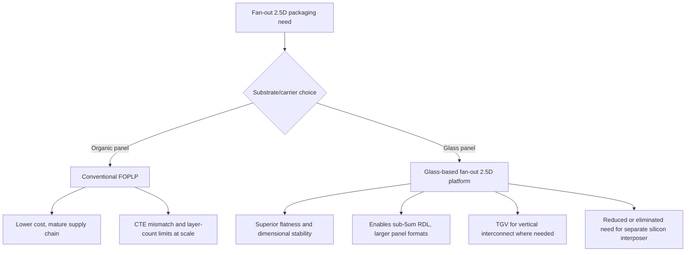

## Alternative Glass-Based Fan-Out 2.5D Platforms

### Overview

Alternative glass-based fan-out 2.5D platforms combine two ideas covered separately elsewhere in this chapter — panel-level, RDL-based fan-out integration (as in the organic/RDL interposer alternatives topic) and glass as a substrate material (as in the glass interposer and photonic-substrate topic) — into named commercial or near-commercial platforms that use glass panels as the base for fan-out-style 2.5D packaging, rather than either a full silicon interposer or a conventional organic fan-out panel. These platforms are positioned to extend fan-out packaging's cost and scalability advantages while gaining glass's superior flatness, dimensional stability, and low dielectric loss at the largest AI/HPC package sizes.

### Motivation: Combining Fan-Out Economics with Glass Material Properties

Conventional organic fan-out panel-level packaging (FOPLP) offers cost-effective routing and panel-scale throughput advantages over silicon interposer-based approaches, but organic substrate materials face physical limits on layer count and CTE mismatch that become more pronounced as package sizes and layer counts increase. Glass, in contrast, offers substantially better dimensional stability — Samsung's glass roadmap targets dimensional drift roughly one-tenth that of organic materials, a property directly enabling sub-5 µm line-width redistribution layers that would be difficult to achieve reliably on a warping organic panel.

- **[Inference]** This dimensional stability advantage is the core reason glass-based fan-out platforms are being pursued specifically for the largest, highest-layer-count AI and networking packages, since RDL lithography alignment tolerances become progressively harder to hold as panel size and layer count grow on a dimensionally unstable organic core, a challenge glass's low CTE and high stiffness directly addresses.

### Architectural Approaches

Glass-based fan-out platforms generally follow one of two structural philosophies, both extending concepts already introduced in this chapter:

#### Glass Core with Fan-Out Build-Up

A glass core layer replaces the organic core of a conventional substrate, with standard semi-additive build-up (RDL) layers constructed on top, following the same general glass core substrate concept introduced in the glass interposer topic, but explicitly combined with panel-level fan-out die embedding rather than only serving as a passive substrate core. This approach reduces or eliminates the need for a separate silicon interposer in some 2.5D assemblies by shifting more routing into the glass core itself.

#### Glass Panel as Fan-Out Reconstitution Carrier

Rather than embedding a discrete glass core within a build-up stack, dies are reconstituted directly onto or within a large glass panel (analogous to the mold-compound reconstitution step in conventional RDL-based fan-out described in the organic/RDL interposer alternatives topic), with multi-layer RDL built across the glass-based reconstituted surface. This approach directly leverages glass's flatness advantage during the RDL lithography steps that are most sensitive to substrate warpage.

### Named Industry Platforms and Initiatives

**[Unverified]** Named commercial platform brands, their specific panel formats, and production timelines are evolving rapidly and should be verified against current vendor disclosures, since this is an actively developing segment of the industry with frequent roadmap updates. Representative platform-level activity reported across the industry as of this writing includes:

- TSMC introduced its Chip-on-Panel-on-Substrate (CoPoS) platform based on 310×310 mm square panels, distinct from its wafer-based CoWoS technology in using square panel format rather than round wafer format, and CoPoS is being developed to incorporate glass-core substrates. TSMC plans to establish a pilot line at subsidiary VisEra Technologies, begin trial production in 2027, and target mass production in the second half of 2028.
- Intel added glass substrates to its advanced packaging roadmap in 2023, and has demonstrated a sample combining its EMIB 2.5D bridge technology with a glass-core substrate, indicating a path toward combining the bridge-based approach covered in the EMIB topic with a glass-core carrier rather than a purely organic one.
- Samsung's glass roadmap (referred to in some market coverage as an "H-glass" initiative) targets a volume ramp with dimensional drift figures substantially better than organic materials, aimed at enabling the fine RDL geometries described above.
- ASE has developed Fan-Out Chip-on-Substrate (FoCoS), a fan-out packaging approach that does not require a separate interposer, including an HBM-capable variant; **[Unverified]** whether and how ASE's FoCoS platform specifically incorporates glass panels (versus remaining organic-panel-based) should be confirmed against current ASE technical disclosures, since available reporting describes FoCoS primarily in an organic fan-out context.
- A distinct and more disruptive concept referenced in industry roadmap discussions is Chip-on-Wafer-on-Platform-PCB (CoWoP), described as the most disruptive of several next-generation advanced packaging options under discussion, reportedly aiming to combine chip-on-wafer assembly more directly with a platform-level PCB rather than an intermediate interposer or panel substrate; **[Unverified]** specifics of CoWoP's relationship to glass-based approaches specifically require confirmation against primary sourcing, as available reporting treats it as one of several next-generation options rather than a settled glass-based platform.

### Technical and Manufacturing Considerations

#### Panel Size and Warpage Control

Panel size for glass-based fan-out platforms generally exceeds standard 300 mm wafer format, which changes the dominant reliability concern: thermal warpage control becomes the key challenge at panel scale, since larger-format processing amplifies the consequences of any residual CTE mismatch or process-induced stress across a proportionally larger area — this is the same warpage concern raised generally for organic fan-out panels, but glass's stiffness and low CTE are specifically intended to mitigate it relative to organic panels of comparable size.

#### TGV Integration Where Vertical Interconnect Is Needed

Where glass-based fan-out platforms require vertical interconnect through the glass itself (rather than routing exclusively through build-up RDL layers), they draw on the same through-glass via (TGV) formation techniques — laser-induced deep etching, direct laser ablation, or photosensitive glass patterning — introduced in the glass interposer topic.

#### Reduced Interposer Dependency

A recurring theme across these platforms is combining panel-level fan-out on top of a glass core to build very large AI or networking packages without pushing a silicon-interposer-based approach (such as CoWoS-S) beyond its comfortable reticle-size range, effectively using glass-based fan-out as a scaling path for package sizes where a monolithic silicon interposer becomes impractical — conceptually parallel to how CoWoS-L's LSI bridges and EMIB-T's scaled bridge targets address the same reticle-size ceiling from a different architectural direction.

#### Adoption Pattern Expectations

Glass is generally not expected to be a wholesale, immediate replacement for existing organic-core fan-out lines: existing organic-core lines are well-amortized and remain attractive for many products given their mature, lower-cost supply chains. The expected adoption pattern is that glass-based fan-out platforms will likely appear first in the highest-end, most bandwidth-hungry systems, then gradually diffuse into broader markets as production volumes grow and costs decline — an adoption curve pattern common to most emerging advanced-packaging material transitions.

### Comparative Positioning

| Attribute | Conventional Organic FOPLP | Glass-Based Fan-Out Platform | Silicon Interposer (CoWoS-S) |
| --- | --- | --- | --- |
| Base material | Organic laminate / mold compound | Glass panel/core | Silicon |
| Panel/wafer format | Panel-scalable | Panel-scalable, often larger/square formats | Limited to 300 mm wafer |
| Dimensional stability | Moderate; CTE mismatch limits scale | High; low CTE, low dimensional drift | High (native silicon CTE match to die) |
| Achievable RDL pitch | Moderate | Fine, approaching sub-5 µm in roadmap targets | Finest (front-end lithography-based) |
| Relative maturity (as of this writing) | Established, high-volume | Emerging; pilot lines and trial production stages reported | Established, high-volume |
| Vertical interconnect | RDL vias / no TSV | TGV where needed | TSV |

### Remaining Development Hurdles

- **[Inference]** Because these platforms combine two still-maturing elements — panel-level fan-out process control and glass-specific handling/TGV reliability — they generally face a compounded set of engineering hurdles relative to either technology in isolation: glass demands different die-placement and reconstitution handling than organic mold compound, new inspection strategies suited to glass's optical and mechanical properties, and reinforcement approaches to manage glass's brittleness during panel handling, none of which are fully solved simply by importing organic FOPLP process know-how directly onto a glass carrier.
- Achieving production yield and cost parity with mature organic FOPLP and established silicon interposer supply chains remains the central open question determining how quickly reported pilot-line and trial-production timelines translate into actual volume adoption.

**Related Topics**

- Organic and RDL-based interposer alternatives (baseline fan-out architecture)
- Glass interposers and photonic-compatible substrates (glass material and TGV baseline)
- TSMC CoWoS family (CoWoS-S reticle-size ceiling this class of platform addresses)
- Intel EMIB and EMIB-T (bridge-based scaling parallel using glass-core substrates)
- Panel-level processing (PLP) equipment and warpage control techniques
- Through-glass via (TGV) formation and reliability
- HBM integration on fan-out and glass-based 2.5D platforms
- Co-packaged optics (CPO) as an additional glass-enabled application vector