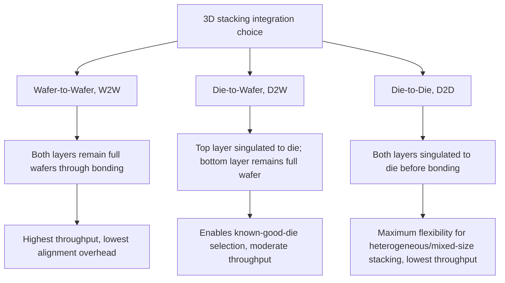

## Wafer-to-Wafer, Die-to-Wafer, and Die-to-Die Bonding Flows

### Overview

Wafer-to-wafer (W2W), die-to-wafer (D2W), and die-to-die (D2D) bonding flows are the three fundamental integration schemes for joining separately fabricated silicon layers into a stacked 3D-IC assembly, each defined by which of the two mating surfaces (top and bottom) remains in full-wafer form versus singulated die form at the moment of bonding. This distinction drives fundamental trade-offs in throughput, yield economics, alignment precision requirements, and applicability to heterogeneous (mixed-die-size or mixed-process-node) stacking — making the choice among these three flows one of the most consequential architectural decisions in any 3D-IC integration scheme.

### The Three Bonding Flows

### Wafer-to-Wafer (W2W) Bonding

#### Process Concept

Two fully processed wafers are aligned and bonded together **while both remain in full wafer form**, with all die sites on both wafers bonded simultaneously in a single bonding operation. After bonding, the stacked wafer pair is typically thinned (backgrinding one side) and then diced into individual stacked die.

#### Key Characteristics

- **Highest throughput**: A single bond operation joins every die site on the wafer at once, rather than requiring individual die placement and bonding steps — this is the primary throughput advantage of W2W relative to the other two flows
- **Tightest alignment tolerance achievable**: Because both wafers are rigid, flat, and can be aligned using whole-wafer fiducial marks and precision wafer-bonding equipment, W2W bonding generally achieves the finest achievable bond pitch and alignment accuracy among the three flows, making it the preferred approach for the highest-density hybrid bonding applications (e.g., stacked image sensors, memory-on-logic at very fine pitch)
- **Requires matched die size and matched wafer diameter**: Because every die site on wafer A bonds to the corresponding die site on wafer B, W2W fundamentally requires that both wafers have the same die size/layout grid and the same wafer diameter, since there is no mechanism to selectively skip or reposition individual die sites during a whole-wafer bond

#### Yield Limitation: The Known-Good-Die Problem

The central drawback of W2W bonding is a **yield multiplication problem**: since every die site on both wafers bonds unconditionally, a good die on wafer A will be bonded to whatever die occupies the corresponding site on wafer B — including a defective one. If wafer A has yield $Y_A$ and wafer B has yield $Y_B$ (assuming independent, randomly distributed defects), the yield of resulting good stacked die approximates:

$$Y_{stack} \approx Y_A \times Y_B$$

This multiplicative yield loss becomes increasingly costly as the number of stacked layers grows, or as either layer's individual die yield is lower (e.g., a large, complex logic die with inherently lower per-die yield than a smaller, more mature memory die).

- **[Inference]** This yield multiplication effect is the primary reason W2W bonding is generally best suited to stacks where both layers have comparably high individual yield and closely matched die size, and is less favored for stacking a low-yielding large logic die with a separately-optimized memory die, where the yield mismatch would otherwise waste many good memory die sites bonded to defective logic die sites.

### Die-to-Wafer (D2W) Bonding

#### Process Concept

One layer (typically the smaller or higher-value die, such as a compute logic die) is singulated into individual die and tested prior to bonding, while the other layer remains in full wafer form. Individual known-good die are then placed and bonded one at a time (or in small groups, depending on equipment) onto the corresponding sites on the target wafer.

#### Key Characteristics

- **Known-Good-Die (KGD) selection**: Because the top layer is singulated and can be individually tested before bonding, only known-good die are selected for bonding onto the wafer, directly avoiding the W2W yield multiplication problem — a defective die from the singulated layer is simply discarded rather than bonded to a good die on the wafer side
- **Supports mismatched die size**: Since individual die are placed rather than an entire wafer bonded at once, D2W allows the singulated die to differ in size and even process node from the wafer-side die, enabling more flexible heterogeneous stacking scenarios than W2W permits
- **Moderate throughput**: Individual die placement and bonding is inherently slower per unit than a single whole-wafer bond operation, though modern die-to-wafer bonding equipment achieves meaningful throughput through parallelized or high-speed sequential placement
- **Alignment considerations**: Individual die placement accuracy depends on pick-and-place/bonder equipment precision rather than whole-wafer fiducial alignment, which historically implied somewhat looser achievable alignment tolerance than W2W, though **[Inference]** advances in D2W bonder placement accuracy have narrowed this gap considerably for many production applications, with the specific achievable tolerance depending on the bonding equipment generation and process used.

#### Common Application

D2W is widely used where a known-good, individually tested die (such as a logic die) is bonded onto memory or interposer wafers, since it allows pre-bond testing to filter out defective logic die before they are committed to an expensive bonded stack — this is a central reason D2W is prevalent in HBM-adjacent and logic-on-memory 3D-IC integration schemes.

### Die-to-Die (D2D) Bonding

#### Process Concept

Both layers are fully singulated into individual die before bonding, with each die-to-die bond performed as an individual placement and bonding operation.

#### Key Characteristics

- **Maximum flexibility**: Both die can differ arbitrarily in size, process node, and even come from entirely different foundries or wafer lots, since neither side constrains the other to a shared wafer-level grid
- **Full known-good-die selection on both sides**: Both die can be individually tested and selected as known-good before bonding, avoiding yield multiplication entirely (assuming accurate pre-bond test coverage)
- **Lowest throughput**: Every individual bond is a discrete pick-and-place-and-bond operation, making D2D the slowest of the three flows on a per-die basis
- **Most common in complex heterogeneous multi-die stacks**: Because D2D imposes no constraint on matching die size or wafer origin between the two layers, it is the natural choice for stacking dissimilar die (e.g., dies from different process nodes, different foundries, or highly irregular die sizes) where W2W or D2W's shared-wafer-grid constraints would not apply

### Comparative Summary

| Attribute | W2W | D2W | D2D |
| --- | --- | --- | --- |
| Top layer form at bonding | Full wafer | Singulated die | Singulated die |
| Bottom layer form at bonding | Full wafer | Full wafer | Singulated die |
| Throughput | Highest | Moderate | Lowest |
| Achievable alignment/bond pitch | Finest | Fine, equipment-dependent | Coarser, though equipment-dependent |
| Known-good-die selection | Not possible (whole-wafer bond) | Possible for singulated layer | Possible for both layers |
| Yield behavior | Multiplicative ($Y_A \times Y_B$) | Improved via KGD selection on one side | Best, KGD selection on both sides |
| Die size/node matching requirement | Required (matched grid) | Only the wafer-side layer constrained | None (fully flexible) |
| Typical application | High-volume, high-yield, matched-size stacks (e.g., stacked image sensors) | Logic-on-memory, HBM-adjacent integration | Complex heterogeneous multi-die 3D stacks |

### Selection Criteria in Practice

- **Choose W2W** when both layers have comparably high yield, matched die size, and the application demands the finest achievable bond pitch and highest throughput — image sensor stacking (pixel array wafer bonded to logic wafer) is a widely cited example where W2W hybrid bonding is well established
- **Choose D2W** when one layer (often a complex, lower-yielding logic die) benefits significantly from pre-bond known-good-die testing, while the other layer remains economically bonded at wafer scale — common in logic-plus-memory 3D-IC schemes
- **Choose D2D** when the stack involves dissimilar die sizes, mixed process nodes, or die sourced from different origins, where the shared-wafer-grid constraint of W2W or D2W would not be workable, accepting the throughput cost for maximum integration flexibility

### Bonding Flow Diagram (svg_diagram)

<svg xmlns="http://www.w3.org/2000/svg" viewBox="0 0 800 400">
<text x="400" y="30" text-anchor="middle" font-size="15" font-weight="bold" fill="#1a1a1a">W2W vs D2W vs D2D Bonding Flows (svg_diagram)</text>

<text x="130" y="65" text-anchor="middle" font-size="12" font-weight="bold">W2W</text>

<circle cx="130" cy="110" r="40" fill="`#c9daf8`" stroke="`#0b5394`" />

<circle cx="130" cy="170" r="40" fill="`#d9d2e9`" stroke="`#674ea7`" />

<text x="130" y="215" text-anchor="middle" font-size="9">Both full wafers</text>

<line x1="130" y1="150" x2="130" y2="130" stroke="#333" stroke-width="2" />

<text x="400" y="65" text-anchor="middle" font-size="12" font-weight="bold">D2W</text>

<g>

<rect x="360" y="90" width="18" height="18" fill="`#c9daf8`" stroke="`#0b5394`" />

<rect x="390" y="90" width="18" height="18" fill="`#c9daf8`" stroke="`#0b5394`" />

<rect x="420" y="90" width="18" height="18" fill="`#f4cccc`" stroke="#c00" />

<text x="440" y="102" font-size="8" fill="#c00">defective, discarded</text>

</g>

<circle cx="400" cy="170" r="40" fill="`#d9d2e9`" stroke="`#674ea7`" />

<text x="400" y="215" text-anchor="middle" font-size="9">Full wafer + KGD singulated die</text>

<line x1="369" y1="108" x2="390" y2="150" stroke="#333" stroke-width="1.5" />

<line x1="399" y1="108" x2="400" y2="150" stroke="#333" stroke-width="1.5" />

<text x="660" y="65" text-anchor="middle" font-size="12" font-weight="bold">D2D</text>

<g>

<rect x="620" y="90" width="18" height="18" fill="`#c9daf8`" stroke="`#0b5394`" />

<rect x="650" y="90" width="18" height="18" fill="`#c9daf8`" stroke="`#0b5394`" />

<rect x="680" y="90" width="24" height="24" fill="`#c9daf8`" stroke="`#0b5394`" />

</g>

<g>

<rect x="620" y="160" width="18" height="18" fill="`#d9d2e9`" stroke="`#674ea7`" />

<rect x="650" y="160" width="18" height="18" fill="`#d9d2e9`" stroke="`#674ea7`" />

<rect x="680" y="155" width="24" height="24" fill="`#d9d2e9`" stroke="`#674ea7`" />

</g>

<text x="660" y="215" text-anchor="middle" font-size="9">Both singulated, individually matched</text>

<text x="400" y="260" text-anchor="middle" font-size="10" fill="#666">Blue = layer A, purple = layer B, red = defective die filtered before bonding</text>

</svg>

**Related Topics**

- Hybrid bonding (Cu-Cu direct bonding) mechanisms and process requirements
- Known-good-die (KGD) testing and pre-bond die screening methodologies
- 3D-IC yield modeling and known-good-die economics
- Stacked CMOS image sensor W2W integration as a production example
- HBM-style D2W integration for logic-on-memory stacking
- Bonding equipment alignment accuracy and throughput trade-offs
- TSV integration within stacked die for inter-tier electrical connection
- Heterogeneous chiplet integration using D2D bonding flows