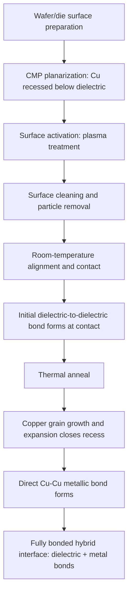

## Copper-to-Copper Hybrid Bonding Mechanics and Dielectric Bonding

### Overview

Copper-to-copper (Cu-Cu) hybrid bonding is the direct-bonding technique that simultaneously joins copper interconnect pads and the surrounding dielectric surface between two die or wafer surfaces, without any intervening solder, adhesive, or bump material. Unlike micro-bump-based interconnection, which relies on a distinct solder or metallic bump reflowed between two surfaces, hybrid bonding achieves direct atomic-level metal-to-metal and dielectric-to-dielectric bonding at room temperature followed by thermal annealing, enabling dramatically finer interconnect pitch than bump-based approaches can achieve and forming the foundational bonding mechanism underlying the wafer-to-wafer, die-to-wafer, and die-to-die flows covered elsewhere in this chapter.

### Why "Hybrid" Bonding: Two Simultaneous Bond Types

The term "hybrid" refers to the fact that a single bonding operation must simultaneously form two chemically and mechanically distinct types of bonds across the same bonded interface:

1. **Dielectric-to-dielectric bond**: The oxide (typically SiO2, sometimes SiCN or other low-k dielectric) surrounding each copper pad bonds directly to the corresponding oxide surface on the mating die/wafer
2. **Metal-to-metal (Cu-Cu) bond**: The copper pads themselves, recessed slightly below the surrounding dielectric surface prior to bonding, come into direct contact and bond as the structure is annealed and the copper expands to close the recess

### Surface Preparation Requirements

Achieving a successful hybrid bond depends critically on surface preparation quality, since both bond types require near-atomic-level surface conditions to succeed:

#### Chemical Mechanical Polishing (CMP)

Both the dielectric and copper surfaces must be planarized to extremely tight flatness and roughness specifications via CMP. A key design feature is that the copper pads are deliberately polished to sit slightly **recessed** below the surrounding dielectric surface (a controlled dishing profile, typically on the order of a few nanometers), rather than flush or protruding.

- **[Inference]** This deliberate recess is generally necessary because copper's thermal expansion during the subsequent anneal step causes it to expand and rise to meet the mating copper pad; if the copper were not recessed, its as-deposited surface topology could interfere with achieving intimate dielectric-to-dielectric contact across the full bonding area at room temperature, before the anneal-driven copper expansion occurs.
- Achieving the necessary flatness and controlled recess uniformity across an entire wafer is one of the most demanding CMP requirements in semiconductor manufacturing, since even small deviations can cause localized bonding voids.

#### Surface Activation

Immediately before bonding, the dielectric surface is typically treated with a plasma activation step, which modifies the surface chemistry (commonly increasing surface hydroxyl group density) to promote strong covalent bond formation at the dielectric-dielectric interface during subsequent room-temperature contact and low-temperature annealing.

#### Particle and Contamination Control

Because the bonding process brings two surfaces into direct atomic-scale contact across the entire wafer or die area, even nanometer-scale particles or contamination at the interface can prevent local bonding, creating a void. This makes cleanroom particle control and surface cleaning immediately before bonding a critical, yield-determining process step — arguably more stringent than in most other semiconductor process steps, since a single trapped particle can propagate a bonding void across a surrounding area far larger than the particle itself.

### Bonding Sequence: Room-Temperature Contact and Thermal Anneal

#### Initial Room-Temperature Bonding

The two prepared surfaces are aligned and brought into contact at or near room temperature. At this stage, the dielectric surfaces form an initial bond (driven by the surface activation chemistry), while the recessed copper pads are not yet in direct contact.

#### Thermal Annealing

The bonded pair is then subjected to a thermal anneal, typically in the range of a few hundred degrees Celsius (specific temperatures depend on the process and dielectric chemistry involved):

- The anneal strengthens the dielectric-dielectric bond by promoting further chemical bond formation at the interface
- The anneal also causes the copper pads to expand (thermally and through grain growth/recrystallization), closing the initial recess gap until the two copper surfaces make direct contact and interdiffuse, forming a continuous metallic Cu-Cu bond
- **[Inference]** Anneal temperature and duration are generally tuned to balance sufficient copper grain growth and interdiffusion (needed for low-resistance electrical continuity across the bond) against the thermal budget constraints of whatever devices and prior processing already exist on both bonded wafers/die, since excessive thermal exposure could affect other structures (e.g., prior TSV fill material behavior, or transistor characteristics if the anneal budget approaches FEOL-relevant temperatures).

### Achievable Interconnect Pitch

Hybrid bonding's central technical advantage over micro-bump interconnection is achievable pitch: because there is no discrete bump/solder volume that must physically fit within a given pitch (a constraint that limits micro-bump pitch to a practical minimum), hybrid bonding can achieve substantially finer interconnect pitch, into the single-digit-micron range and below, since the "interconnect" is simply a lithographically defined copper pad rather than a three-dimensional bump structure with its own minimum achievable size and reflow-related spacing requirements.

- **[Inference]** This pitch advantage is the primary reason hybrid bonding has become the preferred approach for the highest-density 3D stacking applications (such as SRAM-on-logic stacking and stacked image sensors), where the interconnect density achievable through hybrid bonding directly enables finer-grained partitioning of a design across multiple stacked tiers than micro-bump-based stacking would allow at comparable interconnect density.

### Electrical Characteristics of Hybrid-Bonded Interconnect

Because the bonded structure is a direct, continuous copper-to-copper metallic path rather than a bump/solder joint, hybrid bond interconnect generally exhibits:

- **Low resistance**: A continuous copper path without an intervening lower-conductivity solder alloy generally offers lower per-connection resistance than a comparable bump-based joint
- **Low parasitic capacitance and inductance relative to bump interconnect at equivalent pitch**: Since the bond connection itself is essentially planar copper-to-copper contact rather than a taller three-dimensional bump structure, the parasitic profile differs from bump-based interconnect, generally favoring hybrid bonding for the shortest, lowest-parasitic vertical interconnect achievable in current 3D-IC technology
- **[Inference]** Exact electrical performance depends heavily on bond pad geometry, pitch, and the specific process node's hybrid bonding implementation, so specific resistance/capacitance/inductance figures require reference to the particular process being used rather than treatment as universal constants.

### Key Defect Mechanisms

| Defect | Cause |
| --- | --- |
| Bonding void (dielectric interface) | Particle contamination, surface roughness exceeding specification, incomplete surface activation |
| Cu-Cu bond incompletion | Insufficient copper recess control, inadequate anneal temperature/time, copper surface oxidation prior to bonding |
| Misalignment | Bonder equipment placement/alignment accuracy limits, especially relevant at the finest achievable pitches |
| Delamination | Weak dielectric-dielectric bond strength from inadequate surface activation or contamination |
| Electrical opens/high resistance | Incomplete Cu-Cu metallic bond formation, insufficient copper expansion/interdiffusion during anneal |

### Comparison to Micro-Bump Interconnection

| Attribute | Micro-Bump | Cu-Cu Hybrid Bonding |
| --- | --- | --- |
| Interconnect medium | Discrete solder or Cu-pillar bump | Direct planar Cu-Cu contact |
| Achievable pitch | Tens of microns (fine-pitch) down to low tens | Single-digit microns and below |
| Bonding temperature profile | Reflow (solder melting) or thermocompression | Room-temperature contact + moderate-temperature anneal |
| Underfill requirement | Typically required (mechanical/environmental protection) | Not required in the same sense; dielectric bond itself provides mechanical continuity |
| Surface prep stringency | Moderate (bump/pad cleanliness) | Extremely high (CMP flatness, particle-free, plasma-activated surfaces) |
| Parasitic profile | Higher (larger physical bump structure) | Lower (planar, minimal-height interconnect) |
| Typical application | General die-to-die/die-to-substrate/die-to-interposer attach | Highest-density 3D stacking (image sensors, SRAM-on-logic, fine-pitch memory-on-logic) |

### Hybrid Bond Interface Cross-Section (svg_diagram)

<svg xmlns="http://www.w3.org/2000/svg" viewBox="0 0 700 380">
<text x="350" y="30" text-anchor="middle" font-size="15" font-weight="bold" fill="#1a1a1a">Hybrid Bond: Before and After Anneal (svg_diagram)</text>

<text x="175" y="65" text-anchor="middle" font-size="12" font-weight="bold">Before Anneal (room temp contact)</text>

<rect x="80" y="80" width="190" height="40" fill="`#e8e8e8`" stroke="#666" />

<text x="175" y="104" text-anchor="middle" font-size="8">Die A dielectric</text>

<rect x="130" y="105" width="30" height="20" fill="`#e69138`" stroke="#333" />

<rect x="200" y="105" width="30" height="20" fill="`#e69138`" stroke="#333" />

<line x1="80" y1="125" x2="270" y2="125" stroke="#c00" stroke-width="1" stroke-dasharray="2,2" />
<text x="175" y="140" text-anchor="middle" font-size="7" fill="#c00">initial dielectric contact only</text>
<rect x="80" y="145" width="190" height="40" fill="#e8e8e8" stroke="#666" />
<text x="175" y="169" text-anchor="middle" font-size="8">Die B dielectric</text>
<rect x="130" y="125" width="30" height="20" fill="#e69138" stroke="#333" opacity="0.7" />
<rect x="200" y="125" width="30" height="20" fill="#e69138" stroke="#333" opacity="0.7" />
<text x="175" y="200" text-anchor="middle" font-size="7" fill="#666">Cu pads recessed, gap remains</text>

<text x="525" y="65" text-anchor="middle" font-size="12" font-weight="bold">After Anneal</text>

<rect x="430" y="80" width="190" height="40" fill="`#e8e8e8`" stroke="#666" />

<rect x="480" y="100" width="30" height="45" fill="`#e69138`" stroke="#333" />

<rect x="550" y="100" width="30" height="45" fill="`#e69138`" stroke="#333" />

<rect x="430" y="145" width="190" height="40" fill="`#e8e8e8`" stroke="#666" />

<line x1="430" y1="122" x2="620" y2="122" stroke="#38761d" stroke-width="2" />
<text x="525" y="205" text-anchor="middle" font-size="7" fill="#38761d">continuous dielectric + Cu-Cu metallic bond</text>

<text x="350" y="260" text-anchor="middle" font-size="9" fill="#666">Orange = copper pads, gray = dielectric</text>

</svg>

**Related Topics**

- Wafer-to-wafer, die-to-wafer, and die-to-die bonding flows
- CMP process control for hybrid bonding surface preparation
- Stacked CMOS image sensor hybrid bonding integration
- SRAM-on-logic 3D stacking using hybrid bonding
- Bonding void inspection and metrology techniques
- TSV-to-hybrid-bond-pad electrical integration in multi-tier stacks
- Thermal budget management across stacked die anneal sequences
- Alignment accuracy requirements for fine-pitch hybrid bonding equipment