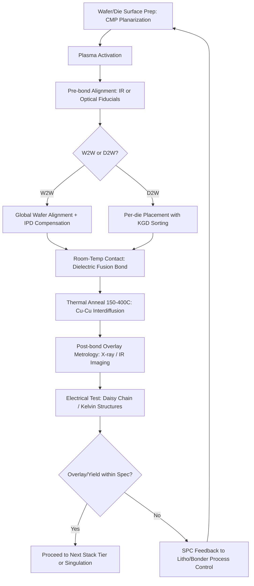

## Hybrid Bond Pitch Scaling Roadmap and Overlay and Alignment Control

### Overview

Hybrid bonding fuses dielectric-to-dielectric (typically SiO₂-SiO₂) and metal-to-metal (Cu-Cu) interfaces simultaneously in a single bonding step, without solder or bumps. Pitch scaling in hybrid bonding refers to the progressive reduction of the center-to-center spacing between adjacent Cu pads/vias at the bonding interface, which directly determines interconnect density, vertical parasitic (R, C, L), and achievable bandwidth per $mm^2$. Overlay and alignment control is the lithography and bonding-equipment discipline that keeps two independently processed wafers or dies registered to each other within a fraction of the pad pitch, since bond yield and electrical continuity collapse once misregistration approaches pad radius.

These two subjects are treated together because pitch scaling is fundamentally gated by alignment capability: a roadmap node's pad pitch is only manufacturable if the combined overlay budget (wafer-to-wafer or die-to-wafer) is a small, controlled fraction of that pitch.

---

### Hybrid Bonding Fundamentals Recap

**Key Points**

- Two bonding architectures: Wafer-to-Wafer (W2W) and Die-to-Wafer (D2W, sometimes called Chip-to-Wafer/C2W); Die-to-Die (D2D) exists but is less common in volume production.
- Bond formation occurs in two stages: (1) room-temperature dielectric fusion via plasma activation and van der Waals/covalent bonding, followed by (2) thermal annealing (typically 150–400 °C) that drives Cu grain growth and expansion across the pad interface to complete metallic continuity.
- Surface preparation requires chemical mechanical polishing (CMP) to achieve sub-nanometer dielectric surface roughness (typically < 0.5 nm RMS) and a slight Cu dishing (recessed a few nanometers below the dielectric) to allow controlled Cu expansion during anneal without voiding.
- Unlike microbump/C4 interconnects, there is no solder reflow self-alignment mechanism — hybrid bonding is a direct, non-collapsing bond, so as-placed alignment accuracy directly becomes final bond alignment accuracy.

---

### Pitch Scaling Roadmap

#### Historical and Current Pitch Nodes

| Generation | Typical Bond Pitch | Bonding Type | Representative Use Case |
| --- | --- | --- | --- |
| First-gen production | 9–10 µm | W2W | CMOS image sensors (backside illumination stacking) |
| Logic-on-logic early | 6–9 µm | W2W | Early 3D SoC prototypes |
| Current high-volume | 4–6 µm | W2W | HBM-class and logic stacking |
| Advanced D2W | 3–6 µm | D2W | Chiplet stacking, foundry 3DIC offerings |
| Leading edge (disclosed) | 1–2 µm | W2W | Advanced logic-on-logic stacking (foundry roadmaps) |
| Research/roadmap target | < 1 µm, approaching 400–500 nm | W2W | Future monolithic-like 3D integration |

[Inference] Exact pitch values vary by foundry/OSAT disclosure and change year to year; the table reflects publicly disclosed roadmap ranges rather than a single vendor's exact specification.

#### Scaling Drivers

**Key Points**

- **Interconnect density**: pitch $P$ scales inversely with achievable I/O density; density $\propto 1/P^2$ for a given area, so halving pitch roughly quadruples achievable via density.
- **Parasitic reduction**: smaller pad diameter (typically 30–50% of pitch) reduces bond capacitance, improving signal integrity for high-speed interfaces.
- **Z-height reduction**: hybrid bonding eliminates bump standoff height entirely (compared to 20–40 µm for microbumps), and pitch scaling further compresses redistribution layer (RDL) routing congestion.
- **Bandwidth-per-mm²**: tighter pitch is the primary lever for scaling memory bandwidth in stacked DRAM (e.g., HBM-successor architectures) and cache-on-logic designs.

#### Fundamental Scaling Limits

As pitch shrinks, several physical constraints tighten simultaneously:

1. **Cu pad diameter shrinkage** — smaller pads have proportionally larger relative dishing/erosion sensitivity from CMP, since the same absolute topography variation (nm-scale) consumes a larger fraction of a smaller pad's tolerance budget.
2. **Overlay budget compression** — as a design rule of thumb, total overlay error must remain below roughly 10–20% of bond pitch to maintain acceptable electrical yield; at 1 µm pitch this implies sub-100–200 nm total misalignment budget across all error sources.
3. **CMP dishing/erosion control** — pattern-density-dependent dishing must be held to sub-nanometer levels across the full wafer for pads that may only be hundreds of nanometers in diameter at future nodes.
4. **Cu grain growth kinetics** — at very fine pitch, the volume of Cu available for grain boundary migration during anneal shrinks, constraining the thermal budget and time window needed for full metallic continuity.
5. **Dielectric gap-fill and keep-out zones** — minimum spacing between adjacent pads to avoid electrical/mechanical interaction becomes a larger fraction of pitch.

[Inference] The specific numeric overlay-to-pitch ratio threshold (10–20%) is a commonly cited engineering heuristic rather than a universal physical law; actual yield-limiting ratios are process- and design-dependent and are typically determined empirically per integration scheme.

---

### Overlay and Alignment Control

#### Sources of Misalignment

**Key Points**

- **Wafer-level distortion**: prior processing (CMP, thermal cycling, film stress) induces in-plane distortion (IPD) — non-linear, non-uniform stretching/shrinking of the wafer pattern relative to an ideal grid.
- **Bonder placement accuracy**: the physical tool's ability to position and hold wafer-to-wafer or die-to-wafer registration during the bonding sequence.
- **Thermal expansion mismatch**: differential CTE (coefficient of thermal expansion) between the two substrates causes drift during anneal if not compensated.
- **Die-level rotational and translational error** (D2W specific): each die placed individually accumulates pick-and-place tool error, distinct from W2W's single global alignment event.
- **Bow and warpage**: wafer non-flatness alters the effective local alignment even when global alignment metrology reports correct registration.

#### Overlay Budget Allocation

Total overlay error $\sigma_{total}$ is typically modeled as a root-sum-square (RSS) combination of independent error sources:

$$\sigma_{total} = \sqrt{\sigma_{align}^2 + \sigma_{IPD}^2 + \sigma_{bond}^2 + \sigma_{anneal}^2 + \sigma_{metrology}^2}$$

Where:

- $\sigma_{align}$ = pre-bond alignment system accuracy
- $\sigma_{IPD}$ = residual in-plane distortion after correction
- $\sigma_{bond}$ = mechanical shift during the bonding (contact/pressing) event
- $\sigma_{anneal}$ = thermally induced drift during anneal
- $\sigma_{metrology}$ = alignment mark measurement uncertainty

[Inference] The RSS model assumes statistically independent, roughly Gaussian error sources; in practice some sources (e.g., IPD and thermal drift) can be correlated, which is why fabs increasingly rely on empirical overlay characterization (via post-bond metrology on test structures) rather than purely analytical budgeting.

#### Alignment Techniques by Bonding Architecture

**W2W Alignment**

- Uses infrared (IR) transmission alignment (since bonded wafer stacks are often opaque at visible wavelengths) or specialized optical alignment marks visible through the substrate.
- Global wafer-to-wafer alignment performed once per wafer pair; IPD correction is applied via lithography-side compensation (adjusting exposure grid on one or both wafers during prior patterning) to pre-compensate for known distortion signatures.
- Typical production overlay targets: sub-200 nm (3σ) at current high-volume nodes, with leading-edge roadmap targets pushing toward tens of nanometers.

**D2W Alignment**

- Each die aligned individually to the target wafer site using die-level fiducials.
- Benefits from "known-good-die" (KGD) sorting (only pre-tested good die are placed), improving yield economics despite slower throughput than W2W.
- Alignment accuracy is generally looser than W2W per-event but must account for die-to-die placement variation across the full population being stacked; tool throughput and alignment precision are in direct tension (higher precision generally requires longer per-die placement time).
- [Unverified] Exact throughput-vs-accuracy tradeoff curves are highly tool- and vendor-specific and are not standardized across the industry.

#### Metrology and Feedback Control

**Key Points**

- **Pre-bond metrology**: overlay marks (box-in-box, AIM-type, or diffraction-based marks) measured optically before bonding to characterize expected registration.
- **Post-bond metrology**: X-ray or IR-based imaging measures actual achieved overlay after bonding, used both for process qualification and as feedback to adjust subsequent lots (run-to-run control, akin to Advanced Process Control/APC used in front-end lithography).
- **In-line electrical test structures**: daisy-chain and Kelvin structures at the bond interface provide indirect overlay/yield correlation by detecting opens/shorts attributable to misalignment.
- Statistical Process Control (SPC) on overlay distributions (mean + 3σ) is used to gate lot disposition, analogous to lithography overlay control in front-end fabs.

---

### Process Flow Diagram

---

### Overlay Error Budget Illustration

<svg xmlns="http://www.w3.org/2000/svg" viewBox="0 0 700 420">
<text x="350" y="30" text-anchor="middle" font-size="18" font-weight="bold" fill="#1a1a1a">Overlay Error Sources vs. Bond Pitch (svg_diagram)</text>

<line x1="80" y1="360" x2="650" y2="360" stroke="#333" stroke-width="2" />
<line x1="80" y1="360" x2="80" y2="60" stroke="#333" stroke-width="2" />
<text x="365" y="400" text-anchor="middle" font-size="14" fill="#333">Bond Pitch (µm)</text>
<text x="30" y="210" text-anchor="middle" font-size="14" fill="#333" transform="rotate(-90 30 210)">Overlay Budget (nm)</text>

<text x="600" y="378" font-size="12" fill="#333">1</text>

<text x="470" y="378" font-size="12" fill="#333">3</text>

<text x="340" y="378" font-size="12" fill="#333">5</text>

<text x="210" y="378" font-size="12" fill="#333">7</text>

<text x="90" y="378" font-size="12" fill="#333">9</text>

<text x="70" y="365" text-anchor="end" font-size="12" fill="#333">0</text>

<text x="70" y="290" text-anchor="end" font-size="12" fill="#333">500</text>

<text x="70" y="215" text-anchor="end" font-size="12" fill="#333">1000</text>

<text x="70" y="140" text-anchor="end" font-size="12" fill="#333">1500</text>

<text x="70" y="70" text-anchor="end" font-size="12" fill="#333">2000</text>

<rect x="95" y="75" width="60" height="285" fill="#4a90d9" opacity="0.8" />
<rect x="225" y="140" width="60" height="220" fill="#4a90d9" opacity="0.8" />
<rect x="355" y="215" width="60" height="145" fill="#4a90d9" opacity="0.8" />
<rect x="485" y="280" width="60" height="80" fill="#4a90d9" opacity="0.8" />
<rect x="585" y="330" width="40" height="30" fill="#d94a4a" opacity="0.9" />

<text x="125" y="365" text-anchor="middle" font-size="11" fill="#111">9µm</text>

<text x="255" y="365" text-anchor="middle" font-size="11" fill="#111">7µm</text>

<text x="385" y="365" text-anchor="middle" font-size="11" fill="#111">5µm</text>

<text x="515" y="365" text-anchor="middle" font-size="11" fill="#111">3µm</text>

<text x="605" y="365" text-anchor="middle" font-size="11" fill="#111">1µm</text>

<text x="605" y="325" text-anchor="middle" font-size="10" fill="`#d94a4a`" font-weight="bold">Critical</text>

<text x="605" y="337" text-anchor="middle" font-size="10" fill="`#d94a4a`" font-weight="bold">zone</text>

<rect x="450" y="65" width="14" height="14" fill="#4a90d9" opacity="0.8" />
<text x="470" y="76" font-size="12" fill="#333">Approx. allowable overlay budget (illustrative)</text>
</svg>

[Inference] The chart above is a conceptual, illustrative representation of the inverse relationship between pitch and allowable overlay budget, not a plot of specific vendor-measured data.

---

### Practical Example: Overlay Budget Calculation

**Example**

For a hybrid bond pad pitch of $P = 4\ \mu m$ with a pad diameter of $d = 1.6\ \mu m$ (40% of pitch), assume a design rule requiring total overlay error to stay within 15% of pitch:

$$\sigma_{total,max} = 0.15 \times 4\ \mu m = 600\ nm$$

If the bonder's intrinsic alignment contributes $\sigma_{align} = 150\ nm$, residual IPD after litho compensation contributes $\sigma_{IPD} = 100\ nm$, and metrology uncertainty contributes $\sigma_{metrology} = 50\ nm$, the remaining budget for bond-event and anneal-induced drift is:

$$\sigma_{remaining} = \sqrt{600^2 - 150^2 - 100^2 - 50^2} \approx \sqrt{360000 - 22500 - 10000 - 2500} \approx 565\ nm$$

This remaining budget must be allocated between $\sigma_{bond}$ and $\sigma_{anneal}$, which are typically the hardest to control since they occur during the physical bonding and thermal process rather than being correctable via metrology-driven compensation beforehand.

---

### Design and Process Interactions

**Key Points**

- **Litho-side pre-compensation**: because IPD is a repeatable, wafer-signature-dependent distortion, many fabs apply "overlay-aware" exposure grid corrections during the RDL/pad patterning step on one or both wafers to pre-cancel expected distortion prior to bonding.
- **Keep-out zone (KOZ) design rules**: chip designers must allocate sufficient pad-to-pad spacing margin to tolerate the process node's qualified overlay 3σ, directly trading off achievable interconnect density against yield.
- **Redundancy strategies**: some designs employ redundant bond pads or dummy fill patterns to maintain local pattern density uniformity (which affects CMP dishing) even in sparse signal-routing regions.
- **Co-design with TSVs**: in multi-tier stacks, through-silicon via (TSV) landing pad alignment to the hybrid bond interface adds a second, compounding alignment budget that must be managed jointly.

---

### Comparison: Hybrid Bond Pitch vs. Microbump Pitch

| Parameter | Microbump (C4/µbump) | Hybrid Bonding |
| --- | --- | --- |
| Typical minimum pitch | 20–40 µm | 1–10 µm (roadmap: sub-1 µm) |
| Self-alignment (reflow) | Yes | No |
| Z-height per interconnect | 10–40 µm | Near-zero (planar) |
| Alignment tolerance mechanism | Solder wetting/surface tension | Direct mechanical placement precision |
| Primary yield risk | Bridging, voiding | Misalignment-induced open/short, dielectric non-bond |

---

### Industry Roadmap Context

[Inference] Publicly available foundry and OSAT roadmaps (e.g., from major logic foundries, memory manufacturers, and equipment suppliers such as bonder OEMs) generally indicate a multi-year trajectory from single-digit-micron pitches toward sub-micron pitches, driven primarily by high-bandwidth memory stacking and logic-on-logic chiplet integration demands. Because this is a fast-moving and competitively sensitive area, specific pitch/date commitments should be verified against current supplier and foundry technology disclosures rather than treated as fixed.

---

### Common Failure Modes Related to Overlay Error

**Key Points**

- **Partial pad overlap**: reduces effective contact area, increasing contact resistance and current density (risk of electromigration at the reduced contact).
- **Open circuits**: overlay error exceeding pad radius results in complete loss of metallic contact despite successful dielectric bonding.
- **Dielectric-only bonding without metal contact**: mechanically bonded but electrically open — often the hardest failure mode to detect without post-bond electrical test.
- **Cu protrusion/voiding asymmetry**: even with correct alignment, asymmetric overlay can bias Cu expansion during anneal, creating localized stress concentration.

---

### Next Steps

**Related Topics**

- Wafer-to-wafer (W2W) vs. die-to-wafer (D2W) bonding architecture tradeoffs
- Chemical mechanical polishing (CMP) for hybrid bond surface preparation
- Plasma activation surface chemistry for dielectric fusion bonding
- Cu-Cu interdiffusion kinetics and thermal budget optimization
- Through-silicon via (TSV) integration with hybrid bonded interfaces
- Known-good-die (KGD) testing and sorting strategies for D2W flows
- Post-bond X-ray and infrared overlay metrology techniques
- In-plane distortion (IPD) modeling and lithography compensation
- Electromigration reliability at fine-pitch hybrid bond interfaces
- Multi-tier 3D stacking and cumulative alignment budget management