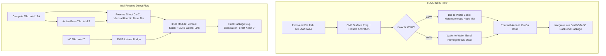

## TSMC SoIC and Intel Foveros and Foveros Direct Platforms

### Overview

TSMC SoIC (System on Integrated Chips) and Intel Foveros/Foveros Direct are the two leading commercially deployed 3D die-stacking platforms that use hybrid bonding to achieve bumpless, high-density vertical chip integration. Both platforms compete on similar technical axes — bond pitch, interconnect density, thermal management, and heterogeneous node mixing — but differ in bonding chemistry generations, base-die architecture philosophy, and ecosystem positioning (TSMC as a merchant foundry service vs. Intel as an integrated device manufacturer offering both internal and foundry packaging).

---

### TSMC SoIC Platform

#### Architecture and Positioning

**Key Points**

- SoIC is TSMC's **front-end** 3D stacking technology, meaning die stacking occurs at the wafer-fab level before conventional back-end packaging steps, distinguishing it from TSMC's other advanced packaging platforms (CoWoS for 2.5D interposer integration, InFO for fan-out wafer-level packaging).
- SoIC is positioned as an industry-first 3D logic-on-logic and memory-on-logic chiplet stacking technology platform that enables heterogeneous integration of known-good-dies (KGDs) with different chip sizes, functionalities, and wafer node technologies, integrated into a single compact system chip. [TSMC](https://research.tsmc.com/schinese/research/interconnect/publish-time-2.html)
- Because SoIC is fabricated using a front-end process, it can be holistically integrated into various back-end advanced packaging platforms such as flip chip, InFO, and 2.5D with silicon interposer (CoWoS), enabling a miniaturized, highly integrated heterogeneous-integration system-in-package. [TSMC](https://research.tsmc.com/schinese/research/interconnect/publish-time-2.html)
- SoIC supports both **Chip-on-Wafer (CoW)** (die-to-wafer) and **Wafer-on-Wafer (WoW)** bonding schemes, with CoW favored for heterogeneous-node stacking (mixing mature and leading-edge nodes) and WoW favored for homogeneous, highest-density stacking.

#### Bond Pitch Roadmap

**Key Points**

- TSMC-SoIC technology enables bond pitch scalability for chip I/O to realize high-density die-to-die interconnects, with bond pitch starting from the sub-10 µm design rule. [TSMC](https://3dfabric.tsmc.com/english/dedicatedFoundry/technology/SoIC.htm)
- SoIC's 3nm chip stacking technology entered volume production in 2025. [TSMC](https://3dfabric.tsmc.com/english/dedicatedFoundry/technology/SoIC.htm)
- TSMC commenced mass production of SoIC at a 6 µm bond pitch in 2025, with plans to scale to a 4.5 µm pitch by 2029. [Trendforce](https://insights.trendforce.com/p/advanced-packaging-hybrid-bonding)
- TSMC has scaled its SoIC bond pitch from an earlier 9 µm generation down to 6 µm currently in high-volume manufacturing. [Tom's Hardware](https://www.tomshardware.com/tech-industry/semiconductors/hybrid-bonding-roadmap-examined)
- TSMC's node-stacking roadmap runs in parallel with its pitch roadmap, progressing from N3P-on-N4 stacking currently toward N2P-on-N2P by 2028 and A14-on-A14 in 2029 — the latter reportedly delivering 1.8× the die-to-die I/O density of N2-on-N2 SoIC. [Ninescrolls](https://ninescrolls.com/news/hybrid-bonding-in-2026-tsmc-ships-6-m-while-its-newest-disclosed-customer/)

#### Interconnect Density and Performance Claims

**Key Points**

- TSMC has presented figures putting face-to-face hybrid bonding at roughly 14,000 signals per square millimeter, compared to approximately 1,500 signals/mm² for face-to-back stacking, where signals must route through through-silicon vias (TSVs) in the lower die. [Ninescrolls](https://ninescrolls.com/news/hybrid-bonding-in-2026-tsmc-ships-6-m-while-its-newest-disclosed-customer/)
- TSMC's 6 µm bond pitch is described as achieving roughly a 100x increase in interconnect density compared to the 30–40 µm pitches used in traditional micro-bump technologies. [FinancialContent](https://markets.financialcontent.com/stocks/article/tokenring-2026-1-30-beyond-the-shrink-how-6-micrometer-hybrid-bonding-is-resurrecting-moores-law-for-the-ai-era)
- [Inference] Specific "56x density / 5x power efficiency vs. CoWoS" figures reported in some coverage should be treated as TSMC marketing benchmarks tied to particular product comparisons rather than universal ratios applicable to all SoIC configurations.

#### Manufacturing and Capacity

**Key Points**

- TSMC is building out its Chiayi AP7 site as its largest advanced-packaging campus, with output targeted for 2026; TrendForce has estimated SoIC capacity roughly doubling year-on-year from a few thousand wafers per month in 2024. [Tom's Hardware](https://www.tomshardware.com/tech-industry/semiconductors/hybrid-bonding-roadmap-examined)
- Customers reported to be using SoIC in volume include AMD, whose 3D V-Cache and MI300-class accelerators were among the first volume SoIC products, and the Broadcom-built Fujitsu Monaka CPU. [Tom's Hardware](https://www.tomshardware.com/tech-industry/semiconductors/hybrid-bonding-roadmap-examined)
- Surface quality requirements are stringent: the polished dielectric surface can vary by no more than approximately 0.2 nanometers, copper pads must sit a few nanometers below the dielectric surface so they expand into contact during a 200–300°C anneal, and a single particle smaller than a micron can hold surfaces apart across many pads, making CMP cleanliness and flatness critical to yield. [Tom's Hardware](https://www.tomshardware.com/tech-industry/semiconductors/hybrid-bonding-roadmap-examined)

---

### Intel Foveros and Foveros Direct

#### Foveros (Original, Microbump-Based) vs. Foveros Direct (Hybrid Bonding)

**Key Points**

- Original **Foveros** (first deployed commercially in Lakefield, later Meteor Lake) uses conventional microbump-based 3D stacking with solder interconnects, typically at tens-of-micron pitch.
- **Foveros Direct** is Intel's hybrid-bonding successor — a solder-free, direct Cu-Cu bonding process analogous in principle to SoIC, eliminating microbumps in favor of bumpless copper-to-copper bonded interfaces.
- Foveros Direct is Intel's solder-free successor to microbump Foveros, with first-generation copper bonding at 9 µm and a second generation targeting 3 µm per Intel Foundry's data-center technology disclosures. [Inside Deep Tech](https://www.insidedeeptech.com/hybrid-bonding-soic-foveros-direct-full-guide/)

#### Bond Pitch Roadmap

**Key Points**

- Foveros Direct reached volume production in the first half of 2026 with the Clearwater Forest Xeon 6+ at a 9 µm bond pitch, with a second generation targeting 3 µm on the roadmap. [Trendforce](https://insights.trendforce.com/p/advanced-packaging-hybrid-bonding)
- Intel shipped Foveros Direct in volume in the Clearwater Forest Xeon 6+ during the first half of 2026 at 9 µm, with a 3 µm second generation on its roadmap. [Ninescrolls](https://ninescrolls.com/news/hybrid-bonding-in-2026-tsmc-ships-6-m-while-its-newest-disclosed-customer/)
- [Inference] The jump from 9 µm directly toward a 3 µm target (rather than incremental intermediate pitches) suggests Intel's public roadmap disclosures compress multiple internal process refinements into headline milestone numbers; actual intermediate process qualifications are likely to occur but may not be individually publicized.

#### Flagship Product: Clearwater Forest (Xeon 6+)

**Key Points**

- Clearwater Forest (Xeon 6+) combines 12 compute chiplets manufactured on the Intel 18A node with three active base tiles on Intel 3 and two I/O tiles on Intel 7. [trendforce](https://www.trendforce.com/news/?p=53823)
- Clearwater Forest is Intel's first high-volume CPU to adopt Foveros Direct 3D, an advanced packaging technology that links compute and I/O tiles through the active base tiles, featuring a 9 µm bump pitch with copper-to-copper bonding, effectively functioning as an active silicon interposer with high density and low resistance. [trendforce](https://www.trendforce.com/news/?p=53823)
- Each compute tile houses six clusters of four "Darkmont" efficiency cores, delivering 24 E-cores per tile and up to 288 cores per socket. [trendforce](https://www.trendforce.com/news/?p=53823)
- The design links core clusters via a high-bandwidth on-chip mesh fabric and combines Foveros Direct 3D stacking (vertical) with EMIB (lateral, 2.5D bridge die) interconnects — a hybrid 3D+2.5D packaging architecture sometimes termed "3.5D." [tweaktown](https://www.tweaktown.com/news/107327/intel-next-gen-clearwater-forest-xeon-cpu-unveiled-288-cores-made-in-the-usa-on-18a-node/images/applenews.png)
- The platform is built on Intel's 18A process node featuring RibbonFET (gate-all-around transistors) and backside power delivery, targeting roughly 3.5x performance-per-watt improvement over previous Xeon generations. [hwbusters](https://hwbusters.com/?p=81470)
- Intel positions Clearwater Forest as the successor to Sierra Forest for hyperscale, core-dense data center workloads. [hwbusters](https://hwbusters.com/?p=81470)

#### 3.5D Integration Strategy

**Key Points**

- Intel's Foveros Direct path pairs hybrid bonding with EMIB into what the industry has termed 3.5D modules — combining vertical Cu-Cu stacking (Foveros Direct) with lateral silicon-bridge die-to-die interconnects (EMIB) within the same package. [Inside Deep Tech](https://www.insidedeeptech.com/hybrid-bonding-soic-foveros-direct-full-guide/)
- This architecture allows Intel to vertically stack compute tiles on active base tiles (via Foveros Direct) while laterally connecting separate tile groups or I/O tiles (via EMIB), optimizing each interconnect type for its respective bandwidth/distance tradeoff.

---

### Comparative Analysis

| Attribute | TSMC SoIC | Intel Foveros Direct |
| --- | --- | --- |
| Current HVM bond pitch | 6 µm (scaled down from 9 µm) | 9 µm (Clearwater Forest, 1H26) |
| Next roadmap target | 4.5 µm by 2029 | 3 µm (2nd generation) |
| Flagship product | AMD 3D V-Cache/MI300, Fujitsu Monaka (Broadcom-built) | Xeon 6+ "Clearwater Forest" |
| Combined interconnect strategy | Paired with CoWoS (2.5D interposer) and InFO | Paired with EMIB into 3.5D modules |
| Process node context | N3P-on-N4 today; N2P-on-N2P by 2028; A14-on-A14 by 2029 | 18A compute tiles over Intel 3 base tiles, Intel 7 I/O tiles |
| Manufacturing footprint | Chiayi AP7 advanced packaging campus, Taiwan | US-based (Clearwater Forest fully designed/built in USA per Intel disclosures) |

[Inference] Direct pitch-for-pitch comparison between SoIC and Foveros Direct should be treated cautiously, since the two platforms are frequently applied to different die-stacking use cases (SoIC often used for cache-on-logic and accelerator stacking with AMD/Broadcom customers; Foveros Direct currently deployed for Intel's own base-tile/compute-tile server architecture) — the pitch numbers are not necessarily measuring identical structures or design rules.

---

### Market and Supply Context

**Key Points**

- In terms of hybrid bonding leadership, TSMC's SoIC platform currently leads in production volume. [Tom's Hardware](https://www.tomshardware.com/tech-industry/semiconductors/hybrid-bonding-roadmap-examined)
- A January 2026 JEDEC decision raising the HBM package height ceiling from 720 µm to 775 µm allowed 16-high HBM4 to be assembled with conventional microbumps after all, deferring hybrid bonding's debut in memory stacking to HBM4E and HBM5 — indicating that logic-on-logic stacking (SoIC, Foveros Direct) is currently ahead of memory-stack adoption for hybrid bonding. [Ninescrolls](https://ninescrolls.com/news/hybrid-bonding-in-2026-tsmc-ships-6-m-while-its-newest-disclosed-customer/)
- Because achieving fine-pitch hybrid bonding at scale currently requires very high process precision, industry commentary has raised concerns about supply chain concentration, since only a small number of foundries possess this capability at volume. [Speculation] The degree to which this represents an actual bottleneck comparable to GPU shortages is a debated industry framing rather than an established fact. [FinancialContent](https://markets.financialcontent.com/wral/article/tokenring-2026-1-16-the-3d-revolution-how-tsmcs-soic-and-the-ucie-20-standard-are-redefining-the-limits-of-ai-silicon)

---

### Process Flow Comparison Diagram

---

### Architectural Diagram: 3.5D Integration (Foveros Direct + EMIB)

<svg xmlns="http://www.w3.org/2000/svg" viewBox="0 0 700 380">
<text x="350" y="28" text-anchor="middle" font-size="17" font-weight="bold" fill="#1a1a1a">Foveros Direct + EMIB 3.5D Package Concept (svg_diagram)</text>

<rect x="60" y="300" width="580" height="30" fill="#c9c9c9" stroke="#333" stroke-width="1.5" />
<text x="350" y="320" text-anchor="middle" font-size="11" fill="#333">Package Substrate</text>

<rect x="80" y="240" width="100" height="55" fill="#e8b04a" stroke="#333" stroke-width="1.5" />
<text x="130" y="270" text-anchor="middle" font-size="11" fill="#111">I/O Tile</text>
<text x="130" y="283" text-anchor="middle" font-size="9" fill="#333">(Intel 7)</text>

<rect x="180" y="285" width="40" height="12" fill="#7a5ea8" stroke="#333" stroke-width="1" />
<text x="200" y="330" text-anchor="middle" font-size="9" fill="#7a5ea8">EMIB Bridge</text>

<rect x="220" y="240" width="260" height="55" fill="#4a90d9" stroke="#333" stroke-width="1.5" />
<text x="350" y="270" text-anchor="middle" font-size="11" fill="#fff">Active Base Tiles (Intel 3)</text>

<rect x="480" y="285" width="40" height="12" fill="#7a5ea8" stroke="#333" stroke-width="1" />

<rect x="520" y="240" width="100" height="55" fill="#e8b04a" stroke="#333" stroke-width="1.5" />
<text x="570" y="270" text-anchor="middle" font-size="11" fill="#111">I/O Tile</text>
<text x="570" y="283" text-anchor="middle" font-size="9" fill="#333">(Intel 7)</text>

<rect x="230" y="160" width="70" height="75" fill="#4ac97a" stroke="#333" stroke-width="1.5" />
<text x="265" y="200" text-anchor="middle" font-size="10" fill="#111">Compute</text>
<text x="265" y="213" text-anchor="middle" font-size="9" fill="#333">(18A)</text>
<rect x="315" y="160" width="70" height="75" fill="#4ac97a" stroke="#333" stroke-width="1.5" />
<text x="350" y="200" text-anchor="middle" font-size="10" fill="#111">Compute</text>
<text x="350" y="213" text-anchor="middle" font-size="9" fill="#333">(18A)</text>
<rect x="400" y="160" width="70" height="75" fill="#4ac97a" stroke="#333" stroke-width="1.5" />
<text x="435" y="200" text-anchor="middle" font-size="10" fill="#111">Compute</text>
<text x="435" y="213" text-anchor="middle" font-size="9" fill="#333">(18A)</text>

<line x1="265" y1="235" x2="265" y2="240" stroke="#d94a4a" stroke-width="3" />
<line x1="350" y1="235" x2="350" y2="240" stroke="#d94a4a" stroke-width="3" />
<line x1="435" y1="235" x2="435" y2="240" stroke="#d94a4a" stroke-width="3" />

<text x="500" y="150" font-size="10" fill="`#d94a4a`" font-weight="bold">Foveros Direct</text>

<text x="500" y="163" font-size="10" fill="`#d94a4a`" font-weight="bold">(Cu-Cu, 9µm)</text>

<rect x="80" y="345" width="12" height="12" fill="#4ac97a" />
<text x="98" y="355" font-size="10" fill="#333">Compute Tile</text>
<rect x="200" y="345" width="12" height="12" fill="#4a90d9" />
<text x="218" y="355" font-size="10" fill="#333">Active Base Tile</text>
<rect x="340" y="345" width="12" height="12" fill="#e8b04a" />
<text x="358" y="355" font-size="10" fill="#333">I/O Tile</text>
<rect x="440" y="345" width="12" height="12" fill="#7a5ea8" />
<text x="458" y="355" font-size="10" fill="#333">EMIB Bridge</text>
</svg>

[Inference] This diagram is a simplified conceptual illustration of the disclosed Clearwater Forest architecture (compute tiles over active base tiles via Foveros Direct, I/O tiles connected via EMIB) and is not an exact reproduction of Intel's proprietary floorplan.

---

### Design and Ecosystem Considerations

**Key Points**

- **Node mixing flexibility**: both platforms enable mixing mature and leading-edge process nodes within one package (e.g., SoIC's N3P-on-N4, Foveros Direct's 18A-on-Intel-3), allowing designers to place cost-sensitive or power-delivery/cache functions on mature nodes while reserving leading-edge nodes for compute-critical logic.
- **Ecosystem access**: TSMC SoIC is offered as a merchant foundry service accessible to any TSMC customer (AMD, Broadcom-affiliated designs, and others), while Foveros Direct has so far been primarily deployed in Intel's own products, though Intel Foundry Services aims to offer similar packaging to external customers. [Unverified] The extent and terms of external customer access to Foveros Direct as a standalone foundry offering were not confirmed in available sources at time of writing.
- **Thermal management**: stacking active compute tiles directly on active base tiles (both platforms) concentrates heat flux, requiring co-design of thermal solutions (e.g., backside power delivery in Intel 18A reduces front-side routing congestion and can aid thermal/power co-optimization).

---

### Next Steps

**Related Topics**

- Hybrid bond pitch scaling roadmap and overlay/alignment control (foundational process detail underlying both platforms)
- EMIB (Embedded Multi-die Interconnect Bridge) architecture and lateral die-to-die signaling
- CoWoS (Chip-on-Wafer-on-Substrate) 2.5D interposer integration alongside SoIC
- Backside power delivery network (BSPDN) co-design with 3D stacking
- Known-good-die (KGD) testing strategies for chiplet-based 3D stacks
- Thermal management and hotspot mitigation in vertically stacked active dies
- UCIe (Universal Chiplet Interconnect Express) standard as it relates to die-to-die signaling in 3D/2.5D packages
- HBM (High Bandwidth Memory) stacking roadmap and hybrid bonding adoption timeline
- Foundry advanced packaging capacity planning (TSMC Chiayi AP7, Intel packaging facilities)