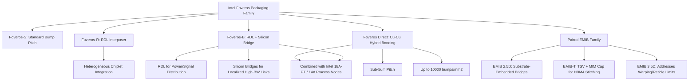

## Foveros-R and Foveros-B Variant Architectures

### Overview

Foveros-R and Foveros-B are two additions Intel Foundry announced to its Foveros packaging family, positioned alongside Foveros Direct (hybrid bonding) and Foveros Omni/Foveros-S variants to give customers a broader set of options across bump pitch, redistribution layer (RDL) strategy, and substrate architecture. Rather than being alternative names for the same technology, these variants represent distinct interconnect and integration strategies within the same overall Foveros packaging umbrella, allowing designers to trade off cost, density, and integration complexity depending on system requirements.

**Key Points**

- Intel Foundry's Foveros portfolio spans a spectrum: Foveros-S (bump pitches, standard offering), Foveros-R (RDL-interposer based), Foveros-B (RDL + silicon bridge hybrid), and Foveros Direct (hybrid bonding, sub-10 µm and trending toward sub-5 µm).
- Foveros-R, Foveros-S, and Foveros-B deliver different options for bump pitches, redistribution layers, and substrate choices, providing integration flexibility for compute, analog, or I/O in systems where cost, density, or form factor vary by market.
- Both Foveros-R and Foveros-B were announced as due out in 2027, positioning them as near-term additions to the packaging roadmap rather than immediately available options at time of announcement.

---

### Foveros-R Architecture

#### Core Technical Definition

**Key Points**

- Foveros-R features a redistribution layer (RDL) interposer, which in turn creates heterogeneous integration between chiplets.
- The "R" designation reflects its core architectural distinction: rather than relying on a silicon interposer or direct hybrid-bonded stacking, Foveros-R uses an RDL-based interposer structure as the integration medium connecting multiple chiplets.
- [Inference] An RDL interposer is generally a lower-cost alternative to a full silicon interposer (as used in 2.5D silicon-interposer packaging) because it avoids the need for a monolithic silicon substrate with through-silicon vias across the entire interposer area, instead using thin-film redistribution layers (similar in concept to fan-out wafer-level packaging RDL structures) to route signal and power between chiplets.
- Foveros-R is expected to be ready by 2027.

#### Positioning and Use Case

**Key Points**

- Foveros-R is positioned as a heterogeneous integration solution, meaning it is designed to connect chiplets built on different process nodes or with different functions (e.g., compute, analog, I/O) within a shared package.
- [Inference] Given the RDL-interposer approach (rather than fine-pitch hybrid bonding), Foveros-R is likely targeted at applications where bump pitch requirements are less extreme than Foveros Direct's sub-5 µm hybrid bonding, trading some interconnect density for lower cost and higher manufacturing flexibility — consistent with its framing as part of a spectrum of "different options for bump pitches" alongside Foveros-S and Foveros-B.

---

### Foveros-B Architecture

#### Core Technical Definition

**Key Points**

- Foveros-B combines RDLs for power and signal with silicon bridges to provide advanced packaging solutions for complex designs.
- The "B" designation reflects the incorporation of embedded silicon bridge elements (conceptually related to EMIB-style local silicon bridges) alongside RDL-based power/signal distribution, creating a hybrid RDL + bridge architecture.
- Foveros-B is due out in 2027, the same target year as Foveros-R.

#### Positioning and Use Case

**Key Points**

- Foveros-B is explicitly positioned for "complex designs," implying it addresses packaging scenarios that require more localized high-bandwidth die-to-die connectivity (via silicon bridges) than a pure RDL interposer alone can provide, while still leveraging RDL layers for broader power and signal distribution across the package.
- [Inference] This architecture appears to sit conceptually between a pure RDL-interposer approach (Foveros-R) and full silicon-interposer or hybrid-bonding approaches, using localized silicon bridges only where high-density die-to-die links are needed (similar in philosophy to how EMIB avoids a full interposer by embedding small bridge die only at chiplet-to-chiplet boundaries) while using lower-cost RDL for the remainder of the package's routing.

---

### Relationship to the Broader Foveros and EMIB Portfolio

#### Full Portfolio Context

**Key Points**

- Intel's advanced packaging roadmap disclosed alongside Foveros-R and Foveros-B also included **EMIB-T**, a new EMIB variant that integrates through-silicon vias (TSVs) and MIM (metal-insulator-metal) capacitors, enabling stitched die-to-HBM4 connections and vertical power delivery — positioned to enable future high-bandwidth-memory needs.
- **Foveros Direct** remains Intel's true 3D hybrid-bonding platform, using Cu-Cu bonding with pitches of 5 microns or less and bump densities of up to 10,000 per mm², enabling dense memory-on-logic stacking for inference or edge compute workloads.
- Intel 18A-PT (a variant building on Intel 18A-P) is specifically designed to connect to a top die using Foveros Direct 3D with hybrid bonding interconnect pitch less than 5 micrometers, illustrating how process node variants and Foveros packaging variants are co-developed as paired offerings.
- Intel Foundry offers system-level integration using Intel 14A on Intel 18A-PT, connected via Foveros Direct (3D stacking) and embedded multi-die interconnect bridging (2.5D bridging) — demonstrating the combinatorial design space these variants are meant to serve.

#### Strategic Rationale

**Key Points**

- The stated strategic differentiator across the full Foveros family (S, R, B, Direct) is flexibility: Foveros supports both incremental scaling and ambitious system integration without forcing customers into a single interconnect model.
- Logic and memory can be co-located, analog or I/O components can be stacked below compute, and system form factors can be redefined depending on which Foveros variant and which EMIB variant are paired together.
- Used alongside EMIB, the Foveros family enables hybrid 2.5D/3D systems that balance cost, yield, and thermal design, with different dies stacked or bridged depending on function and system-level needs.
- [Inference] The introduction of multiple named variants (R, B, S, Direct) rather than a single unified Foveros process suggests Intel Foundry is explicitly targeting a broader external foundry customer base with varying cost/performance/density requirements, rather than only optimizing for Intel's own highest-end products (which more directly leverage Foveros Direct).

---

### Comparative Positioning Table

| Variant | Integration Medium | Primary Differentiator | Target Availability |
| --- | --- | --- | --- |
| Foveros-S | Standard bump-pitch stacking | Baseline/mainstream option | Existing/near-term |
| Foveros-R | RDL interposer | Heterogeneous chiplet integration via RDL | 2027 |
| Foveros-B | RDL + silicon bridges | Power/signal RDL combined with localized bridge die for complex designs | 2027 |
| Foveros Direct | Cu-Cu hybrid bonding | True 3D stacking, sub-5 µm pitch, up to 10,000 bumps/mm² | Volume production (Clearwater Forest, 1H26) |

[Unverified] Precise bump pitch figures for Foveros-R and Foveros-S specifically were not disclosed in the sources reviewed; only Foveros Direct's sub-5 µm pitch and bump density figures were explicitly quantified in available material.

---

### Architectural Positioning Diagram

---

### System Integration Illustration

<svg xmlns="http://www.w3.org/2000/svg" viewBox="0 0 700 400">
<text x="350" y="28" text-anchor="middle" font-size="17" font-weight="bold" fill="#1a1a1a">Foveros-R vs Foveros-B Structural Concept (svg_diagram)</text>

<text x="175" y="60" text-anchor="middle" font-size="14" font-weight="bold" fill="#333">Foveros-R</text>

<rect x="60" y="280" width="230" height="25" fill="`#c9c9c9`" stroke="#333" stroke-width="1.5" />

<text x="175" y="297" text-anchor="middle" font-size="10" fill="#333">Package Substrate</text>

<rect x="60" y="240" width="230" height="35" fill="#e8b04a" stroke="#333" stroke-width="1.5" />
<text x="175" y="262" text-anchor="middle" font-size="11" fill="#111">RDL Interposer Layer</text>
<rect x="75" y="170" width="70" height="65" fill="#4ac97a" stroke="#333" stroke-width="1.5" />
<text x="110" y="205" text-anchor="middle" font-size="10" fill="#111">Chiplet A</text>
<rect x="155" y="170" width="70" height="65" fill="#4a90d9" stroke="#333" stroke-width="1.5" />
<text x="190" y="205" text-anchor="middle" font-size="10" fill="#fff">Chiplet B</text>
<rect x="235" y="170" width="45" height="65" fill="#d97a4a" stroke="#333" stroke-width="1.5" />
<text x="257" y="200" text-anchor="middle" font-size="9" fill="#fff">I/O</text>
<line x1="110" y1="235" x2="110" y2="240" stroke="#333" stroke-width="2" />
<line x1="190" y1="235" x2="190" y2="240" stroke="#333" stroke-width="2" />
<line x1="257" y1="235" x2="257" y2="240" stroke="#333" stroke-width="2" />

<text x="525" y="60" text-anchor="middle" font-size="14" font-weight="bold" fill="#333">Foveros-B</text>

<rect x="410" y="280" width="230" height="25" fill="`#c9c9c9`" stroke="#333" stroke-width="1.5" />

<text x="525" y="297" text-anchor="middle" font-size="10" fill="#333">Package Substrate</text>

<rect x="410" y="240" width="230" height="35" fill="#e8b04a" stroke="#333" stroke-width="1.5" />
<text x="525" y="262" text-anchor="middle" font-size="11" fill="#111">RDL Power/Signal Layer</text>
<rect x="425" y="170" width="70" height="65" fill="#4ac97a" stroke="#333" stroke-width="1.5" />
<text x="460" y="205" text-anchor="middle" font-size="10" fill="#111">Chiplet A</text>
<rect x="505" y="170" width="70" height="65" fill="#4a90d9" stroke="#333" stroke-width="1.5" />
<text x="540" y="205" text-anchor="middle" font-size="10" fill="#fff">Chiplet B</text>
<rect x="585" y="170" width="45" height="65" fill="#d97a4a" stroke="#333" stroke-width="1.5" />
<text x="607" y="200" text-anchor="middle" font-size="9" fill="#fff">I/O</text>

<rect x="490" y="225" width="30" height="15" fill="#7a5ea8" stroke="#333" stroke-width="1.5" />
<text x="505" y="255" text-anchor="middle" font-size="8" fill="#7a5ea8">Si Bridge</text>
<line x1="460" y1="235" x2="460" y2="240" stroke="#333" stroke-width="2" />
<line x1="540" y1="235" x2="540" y2="240" stroke="#333" stroke-width="2" />
<line x1="607" y1="235" x2="607" y2="240" stroke="#333" stroke-width="2" />

<rect x="60" y="340" width="12" height="12" fill="#e8b04a" />
<text x="78" y="350" font-size="10" fill="#333">RDL Layer</text>
<rect x="180" y="340" width="12" height="12" fill="#7a5ea8" />
<text x="198" y="350" font-size="10" fill="#333">Embedded Silicon Bridge (Foveros-B only)</text>
</svg>

[Inference] This diagram represents a simplified conceptual rendering based on the described characteristics (RDL interposer for Foveros-R; RDL plus embedded silicon bridge for Foveros-B). Intel has not published detailed cross-sectional diagrams of these variants in the sources reviewed, so exact layer stack-up, bridge placement, and dimensional proportions are illustrative rather than literal.

---

### Distinguishing Foveros-R/B from Foveros Direct

**Key Points**

- Foveros Direct represents Intel's true 3D platform using hybrid bonding (direct Cu-Cu bonding, no bumps), while Foveros-R and Foveros-B both appear to retain some form of bump-based or RDL-mediated interconnect rather than the bumpless hybrid-bonded interface — placing them architecturally closer to traditional Foveros/2.5D-style integration than to Foveros Direct's fully bumpless stacking.
- [Inference] This distinction matters for pitch scaling: Foveros Direct's hybrid bonding path targets sub-5 µm and eventually sub-3 µm pitches, whereas Foveros-R and Foveros-B, as RDL/bridge-based architectures, are likely to operate at coarser interconnect pitches more typical of RDL fan-out and bridge-based packaging (tens of microns), trading maximum density for cost efficiency, larger interposer-equivalent area coverage, and simpler process integration.
- All variants remain part of Intel Foundry's broader packaging strategy of offering system-level integration options that combine 3D stacking (Foveros family) with 2.5D bridging (EMIB family) in the same package when required.

---

### Next Steps

**Related Topics**

- Foveros Direct hybrid bonding pitch scaling and Cu-Cu bonding process
- EMIB and EMIB-T architecture for 2.5D bridging and HBM4 stitching
- RDL (redistribution layer) fan-out wafer-level packaging fundamentals
- Intel 18A-PT and 14A process node co-integration with Foveros packaging
- UCIe (Universal Chiplet Interconnect Express) compatibility across Foveros and EMIB portfolios
- Silicon bridge die design and embedding techniques (comparison to TSMC LSI/InFO_L)
- Foveros Omni and prior-generation Foveros (Lakefield, Meteor Lake) microbump architecture
- Intel Foundry external customer access model for advanced packaging services
- 3.5D packaging integration combining vertical (Foveros) and lateral (EMIB) interconnects