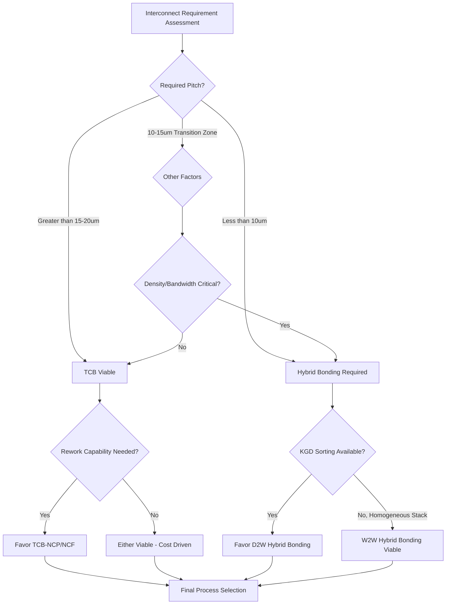

## Thermocompression versus Hybrid Bonding Trade-offs

### Overview

Thermocompression bonding (TCB) and hybrid bonding represent two distinct approaches to die-to-die and die-to-wafer interconnection in advanced 3D packaging. TCB uses heat and mechanical pressure to form metallurgical (typically Cu-Cu or Cu-Sn-Cu) joints between discrete microbumps, while hybrid bonding forms a bumpless, simultaneous dielectric-fusion and Cu-Cu metallic bond across a planarized interface. Understanding their trade-offs is essential because they are not strictly successive technologies — both remain in active production use, often for different tiers within the same overall packaging roadmap, with selection driven by pitch requirements, throughput needs, cost sensitivity, and known-good-die (KGD) economics.

---

### Process Fundamentals

#### Thermocompression Bonding (TCB)

**Key Points**

- TCB joins discrete raised metal bumps (typically Cu pillars capped with Sn-Ag or Cu-Sn intermetallic solder, or increasingly Cu-Cu bumps) between two substrates using a combination of applied force and elevated temperature, causing localized plastic deformation and/or intermetallic compound (IMC) formation at the bump interface.
- The process is typically performed die-by-die or in small batches using a bond head that applies controlled pressure and thermal profile (often with sequential ramp, hold, and cooldown phases) to each bump array.
- TCB-NCP (Non-Conductive Paste) and TCB-NCF (Non-Conductive Film) variants incorporate a polymer underfill material dispensed or laminated prior to bonding, which simultaneously provides mechanical support, moisture barrier, and stress buffering around the bump joints as it cures during the thermal cycle.
- Bump pitches for production TCB are typically in the 20–55 µm range historically, with advanced TCB implementations pushing toward finer pitches (sub-20 µm) as an evolutionary step, though this remains coarser than hybrid bonding's sub-10 µm capability.

#### Hybrid Bonding

**Key Points**

- Hybrid bonding forms a bumpless, planar bonded interface combining simultaneous dielectric-to-dielectric (SiO₂-SiO₂) fusion bonding and Cu-to-Cu metallic bonding, without discrete bump structures.
- Bonding occurs in two stages: room-temperature dielectric fusion (activated by plasma surface treatment, bonded via van der Waals forces that transition to covalent bonds) followed by a thermal anneal (typically 150–400°C) that drives Cu grain growth/interdiffusion across the recessed pad interface.
- Requires extremely tight surface planarity (sub-nanometer RMS roughness via CMP) and cleanliness, since a single sub-micron particle can prevent local bonding across a span of many pads.
- Current production bond pitches range from roughly 4–9 µm at high-volume nodes, with roadmaps targeting sub-5 µm and eventually sub-1 µm.

---

### Comparative Trade-off Analysis

| Dimension | Thermocompression Bonding | Hybrid Bonding |
| --- | --- | --- |
| Minimum pitch (production) | ~20–40 µm typical; advanced TCB pushing finer | 4–9 µm current; roadmap toward sub-1 µm |
| Interconnect structure | Discrete raised bumps | Planar, bumpless Cu pads |
| Z-height per interconnect | 10–40 µm (bump standoff) | Near-zero (planar interface) |
| Throughput | Slower — sequential die-by-die bonding with thermal cycling per unit | Can be faster at wafer-level (W2W); D2W throughput varies by tool |
| Self-alignment mechanism | Some solder-based variants offer limited self-centering during reflow; pure Cu-Cu TCB has none | None — direct placement accuracy determines final alignment |
| Surface prep requirements | Moderate — bump coplanarity and cleanliness important but less extreme | Extreme — sub-nm CMP planarity, particle-free environment |
| Underfill/encapsulation | Often integrated via NCP/NCF co-processing | Not required — dielectric itself forms the bonded interface |
| Rework/inspection maturity | Mature, well-established inspection and rework processes | Less mature; hybrid bonds are generally not reworkable once formed |
| Known-good-die economics | More forgiving — bump-level and post-bond test more established | Bumpless bond makes post-bond defect isolation harder; pre-bond KGD sorting critical |
| Equipment cost/complexity | Lower capital intensity, wider equipment vendor base | Higher capital intensity; fewer qualified equipment/process suppliers |
| Electrical parasitics | Higher bump capacitance/inductance due to larger structure size | Lower parasitics — smaller pad size and no bump standoff |
| Interconnect density | Moderate | High — enables 10,000+ interconnects/mm² at advanced pitches |

[Inference] Exact throughput and cost figures are highly equipment-vendor- and process-node-dependent; the directional comparisons above reflect commonly cited industry positioning rather than fixed universal benchmarks.

---

### Detailed Trade-off Discussion

#### Interconnect Density and Bandwidth

**Key Points**

- Hybrid bonding's bumpless architecture allows pitch scaling far below what is mechanically achievable with discrete bumps, since bump-based approaches are fundamentally limited by minimum bump diameter, required standoff height for reliable pressure/thermal contact, and bump-to-bump electrical/mechanical keep-out distances.
- This translates directly to bandwidth-per-mm² advantages for hybrid bonding in memory-on-logic and cache-on-logic stacking, where interconnect count scales with the inverse square of pitch.
- [Inference] For applications where interconnect density is not the binding constraint (e.g., simpler 3D stacks with lower I/O count, or cost-sensitive consumer products), TCB's coarser pitch may be entirely sufficient, making the density advantage of hybrid bonding a less decisive factor in those use cases.

#### Throughput and Cost

**Key Points**

- TCB is generally a slower, more sequential process since each die (or small batch) undergoes an individual pressure/thermal cycle, whereas wafer-to-wafer (W2W) hybrid bonding can bond an entire wafer pair in a single alignment-and-bond event, offering potentially higher throughput per unit area for compatible use cases.
- Die-to-wafer (D2W) hybrid bonding, by contrast, still requires individual die placement (similar in principle to TCB's die-by-die nature), so its throughput advantage over TCB is less pronounced and depends heavily on the specific bonder architecture (e.g., collective bonding of multiple pre-aligned die vs. strictly sequential placement).
- TCB benefits from a broader, more mature equipment supplier ecosystem and lower per-tool capital cost, making it more accessible for a wider range of packaging houses and OSATs, whereas hybrid bonding equipment (aligners, bonders, CMP tools capable of the required planarity) is concentrated among fewer qualified suppliers, raising capital barriers to entry.
- [Inference] Overall cost-per-interconnect comparisons depend heavily on production volume, yield maturity, and amortization of capital equipment; at current market maturity, hybrid bonding's cost advantage (if any) is most pronounced at very fine pitches where TCB becomes physically impractical, while TCB often remains more cost-effective at coarser pitches due to process maturity and equipment flexibility.

#### Known-Good-Die (KGD) and Rework Considerations

**Key Points**

- TCB-based die-to-wafer or die-to-die stacking benefits from more mature post-bond inspection and, in some cases, limited rework capability (e.g., using localized reflow to remove and replace a defective die before full encapsulation), which can improve overall stack yield economics, particularly for high-value, high-layer-count stacks.
- Hybrid bonding is generally considered non-reworkable once the dielectric fusion and Cu-Cu anneal are complete, making pre-bond known-good-die (KGD) sorting and pre-bond defect screening substantially more critical to overall yield, since a single bad die bonded into a stack cannot easily be removed and replaced.
- [Inference] This rework asymmetry is a key reason die-to-wafer (D2W) hybrid bonding — which allows individually pre-tested KGD to be selected before bonding — is often favored over wafer-to-wafer (W2W) hybrid bonding for heterogeneous, high-value stacks, despite W2W's throughput advantages, because W2W bonds entire wafers (including any latent defective die) without per-die screening.

#### Surface Preparation and Defect Sensitivity

**Key Points**

- Hybrid bonding's requirement for sub-nanometer dielectric surface roughness and near-total particle exclusion represents a substantially higher process control burden than TCB, where moderate bump coplanarity and cleanliness are sufficient given the bump's larger vertical tolerance and the plastic deformation that occurs during pressure application.
- A single sub-micron particle trapped at a hybrid bond interface can propagate a local non-bonded region spanning multiple adjacent pads (since the dielectric fusion bond is a continuous planar interface), whereas TCB's discrete bump structure is comparatively more forgiving of localized surface defects since each bump interface bonds somewhat independently.
- [Inference] This difference in defect sensitivity translates into higher required cleanroom and CMP tooling investment for hybrid bonding lines relative to TCB lines, which contributes to hybrid bonding's higher capital intensity.

#### Electrical Performance

**Key Points**

- Hybrid bonding's smaller pad size (with no bump standoff height) reduces parasitic capacitance and inductance at the interconnect, improving signal integrity and power delivery efficiency for high-speed interfaces compared to TCB's larger bump structures.
- Lower parasitics also translate to reduced energy-per-bit for data transfer across the bonded interface, a factor increasingly important for power-constrained AI/HPC packages where data movement energy is a significant fraction of total system power.
- [Inference] The magnitude of this electrical advantage varies by specific bump/pad geometry and frequency of operation; for lower-speed or lower-density interconnects, the electrical performance gap between well-designed TCB and hybrid bonding may be less consequential than the density and cost trade-offs discussed above.

#### Thermal and Mechanical Reliability

**Key Points**

- TCB's discrete bump-plus-underfill structure provides some inherent stress buffering (via the polymer underfill layer) that can help absorb coefficient-of-thermal-expansion (CTE) mismatch stresses between stacked dies during thermal cycling.
- Hybrid bonding's rigid, continuous dielectric-fusion interface lacks a compliant underfill layer by design, meaning CTE mismatch stresses must be managed through other means (e.g., careful die/wafer thinning, stress-relief structures, or matched-CTE material selection), since there is no polymer buffer layer at the bond interface itself.
- [Unverified] Long-term reliability comparisons between TCB and hybrid bonding under extended thermal cycling and humidity stress testing are still being characterized industry-wide as hybrid bonding matures in high-volume production; specific failure-rate comparisons should be treated as evolving rather than fully settled.

---

### Selection Criteria Framework

**Key Points**

- **Choose TCB when**: pitch requirements are moderate (>15–20 µm), rework capability during assembly is valuable, equipment/process maturity and lower capital cost are priorities, or the application does not require the extreme interconnect density hybrid bonding enables.
- **Choose hybrid bonding when**: pitch requirements are aggressive (<10 µm), maximum interconnect density and bandwidth-per-mm² are critical (e.g., cache-on-logic, memory-on-logic stacking), minimizing Z-height is important, or electrical parasitic reduction is a first-order design driver.
- **Hybrid approaches**: some advanced packages combine both techniques within a single system — for example, using hybrid bonding for the finest-pitch, highest-value logic-on-logic or memory-on-logic connections while using TCB (or even conventional flip-chip/C4) for coarser-pitch, lower-value connections elsewhere in the same package (e.g., interposer-to-substrate or peripheral I/O).

---

### Decision Flow Diagram

---

### Interconnect Structure Comparison

<svg xmlns="http://www.w3.org/2000/svg" viewBox="0 0 700 380">
<text x="350" y="28" text-anchor="middle" font-size="17" font-weight="bold" fill="#1a1a1a">TCB vs Hybrid Bonding Interface Cross-Section (svg_diagram)</text>

<text x="175" y="60" text-anchor="middle" font-size="14" font-weight="bold" fill="#333">Thermocompression Bonding</text>

<rect x="70" y="260" width="210" height="40" fill="#b0c4de" stroke="#333" stroke-width="1.5" />
<text x="175" y="284" text-anchor="middle" font-size="10" fill="#111">Bottom Die/Substrate</text>
<rect x="100" y="225" width="20" height="35" fill="#d4a020" stroke="#333" stroke-width="1" />
<rect x="165" y="225" width="20" height="35" fill="#d4a020" stroke="#333" stroke-width="1" />
<rect x="230" y="225" width="20" height="35" fill="#d4a020" stroke="#333" stroke-width="1" />
<text x="175" y="218" text-anchor="middle" font-size="9" fill="#333">Discrete Cu/Solder Bumps</text>

<rect x="80" y="190" width="190" height="35" fill="#e8d5b0" opacity="0.7" stroke="#999" stroke-width="0.5" />
<text x="175" y="211" text-anchor="middle" font-size="8" fill="#555">Underfill (NCP/NCF)</text>
<rect x="70" y="155" width="210" height="40" fill="#b0c4de" stroke="#333" stroke-width="1.5" />
<text x="175" y="179" text-anchor="middle" font-size="10" fill="#111">Top Die</text>

<text x="175" y="330" text-anchor="middle" font-size="9" fill="#555">Bump pitch: ~20-40um</text>

<text x="175" y="343" text-anchor="middle" font-size="9" fill="#555">Standoff height present</text>

<text x="525" y="60" text-anchor="middle" font-size="14" font-weight="bold" fill="#333">Hybrid Bonding</text>

<rect x="420" y="260" width="210" height="40" fill="#b0c4de" stroke="#333" stroke-width="1.5" />
<text x="525" y="284" text-anchor="middle" font-size="10" fill="#111">Bottom Die/Wafer</text>
<rect x="420" y="235" width="210" height="25" fill="#d4d4d4" stroke="#333" stroke-width="1" />
<rect x="450" y="235" width="18" height="25" fill="#d4a020" />
<rect x="515" y="235" width="18" height="25" fill="#d4a020" />
<rect x="580" y="235" width="18" height="25" fill="#d4a020" />
<text x="525" y="228" text-anchor="middle" font-size="9" fill="#333">Planar Dielectric Fusion + Cu-Cu Pads</text>
<rect x="420" y="210" width="210" height="25" fill="#d4d4d4" stroke="#333" stroke-width="1" />
<rect x="450" y="210" width="18" height="25" fill="#d4a020" />
<rect x="515" y="210" width="18" height="25" fill="#d4a020" />
<rect x="580" y="210" width="18" height="25" fill="#d4a020" />
<rect x="420" y="175" width="210" height="35" fill="#b0c4de" stroke="#333" stroke-width="1.5" />
<text x="525" y="196" text-anchor="middle" font-size="10" fill="#111">Top Die/Wafer</text>

<text x="525" y="330" text-anchor="middle" font-size="9" fill="#555">Bond pitch: ~4-9um (roadmap sub-1um)</text>

<text x="525" y="343" text-anchor="middle" font-size="9" fill="#555">No standoff - planar interface</text>

</svg>

[Inference] This diagram is a simplified conceptual cross-section illustrating structural differences between the two bonding approaches; actual layer thicknesses, bump geometries, and pad dimensions vary significantly by specific process node and vendor implementation.

---

### Practical Example: Pitch-Driven Process Selection

**Example**

A packaging engineer designing a 3D stack with the following two tiers must select bonding processes for each:

1. **Tier 1 (logic-to-logic cache stacking)**: requires 6 µm interconnect pitch to achieve target bandwidth of a high-performance cache-on-compute architecture. At this pitch, TCB is not viable (below achievable bump pitch for reliable mechanical/thermal contact), so hybrid bonding is the only technically feasible choice.
2. **Tier 2 (interposer-to-package substrate)**: requires only 130 µm pitch for power/ground and lower-speed I/O routing to the package substrate. At this coarser pitch, conventional flip-chip or TCB is sufficient and more cost-effective than hybrid bonding, since the extreme density and planarity requirements of hybrid bonding provide no functional benefit at this interconnect tier.

This illustrates why many advanced packages use hybrid bonding selectively at the finest-pitch, highest-value tier while retaining TCB or conventional flip-chip at coarser tiers — a mixed-technology approach rather than an all-or-nothing choice.

---

### Next Steps

**Related Topics**

- Hybrid bond pitch scaling roadmap and overlay/alignment control
- TCB-NCP and TCB-NCF underfill co-processing techniques
- CMP (chemical mechanical polishing) requirements for hybrid bonding surface preparation
- Known-good-die (KGD) testing and sorting for die-to-wafer stacking
- Cu-Cu interdiffusion kinetics and thermal budget optimization in hybrid bonding
- Mixed-technology packaging: combining TCB, hybrid bonding, and flip-chip within one system
- Reliability testing methodologies for bumpless vs. bump-based 3D interconnects
- Equipment landscape: bonder/aligner vendors for TCB vs. hybrid bonding processes
- Cost-per-interconnect modeling across advanced packaging bonding technologies