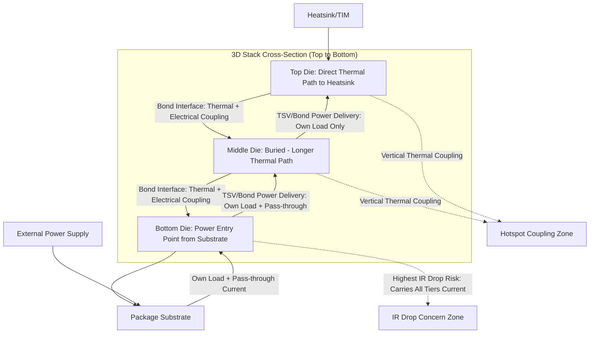

## 3D Stacking Implications for Thermal and Power Delivery Design

### Overview

Vertical 3D die stacking fundamentally changes the thermal and power delivery design problem compared to conventional 2D or 2.5D packaging. Stacking active silicon layers directly atop one another concentrates power density into a smaller footprint, buries heat-generating layers behind other silicon (impeding heat extraction), and lengthens the electrical path power must travel from the package substrate through multiple die layers to reach transistors furthest from the heatsink. These effects compound as stack height (number of tiers), interconnect pitch, and per-layer power density all increase, making thermal-aware and power-delivery-aware co-design a first-order requirement rather than an afterthought in 3D IC architectures.

---

### Thermal Design Implications

#### Fundamental Thermal Challenge of Vertical Stacking

**Key Points**

- In a conventional 2D package, all active silicon sits on a single plane close to the heatsink/lid, giving every transistor a relatively short, direct thermal path to ambient.
- In a 3D stack, only the topmost die (or die closest to the heat-removal path) has a short direct thermal path; dies buried beneath it must conduct heat through intervening silicon, bonding interfaces, and interconnect layers before reaching the heatsink, or alternatively through the substrate and PCB if a bottom-side thermal path is used.
- This creates a **thermal gradient across the Z-axis of the stack**, where junction temperatures can vary significantly between the top and bottom tiers even under uniform ambient cooling conditions.
- Total package power density effectively multiplies with stack height for a given footprint, since multiple active die layers now occupy the same X-Y silicon area that previously held only one.

#### Face-to-Face vs. Face-to-Back Thermal Paths

**Key Points**

- **Face-to-face (F2F)** stacking (common in Foveros, some SoIC configurations) places the active transistor layers of two dies directly facing each other at the bond interface, with the backside (bulk silicon, typically thinned) of each die facing outward.
- **Face-to-back (F2B)** stacking places the active layer of one die facing the backside (bulk silicon) of the adjacent die, requiring through-silicon vias (TSVs) to route signals through the bulk silicon to reach the active layer.
- [Inference] F2F configurations generally offer a more favorable thermal path for the bottom die's active layer, since heat generated at the transistor layer has a relatively short path through the (thinned) bulk silicon to an external heat removal surface, whereas F2B configurations may place additional bulk silicon and TSV structures in the thermal path depending on stack orientation.
- Bulk silicon thinning (routinely down to tens of microns in advanced 3D stacks) reduces the physical thermal resistance of each die layer but also reduces mechanical robustness and can increase susceptibility to warpage, creating a design tension between thermal and mechanical objectives.

#### Hotspot Formation and Localized Thermal Coupling

**Key Points**

- When two active die layers are stacked, hotspots on one die (e.g., a high-activity compute core) can thermally couple to the adjacent die, elevating local temperatures on both sides of the bond interface even if the adjacent die's corresponding region has lower intrinsic power density.
- This vertical thermal coupling means thermal-aware floorplanning must consider not just each die's individual power map, but the combined, spatially-aligned power map across the full stack — placing high-power blocks on different dies in non-overlapping X-Y positions where possible to avoid additive hotspot formation.
- [Inference] The degree of thermal coupling depends on the thermal conductivity of the bond interface itself; hybrid-bonded interfaces (with their thin, largely metallic/dielectric composition and minimal air gaps) are generally expected to provide better thermal coupling between layers than microbump-based interfaces with underfill, though this also means hotspots propagate more readily between layers in hybrid-bonded stacks.

#### Thermal Mitigation Strategies

**Key Points**

- **Thermal-aware 3D floorplanning**: distributing high-power-density blocks to avoid vertical stacking of hotspots across tiers, sometimes deliberately placing memory (lower power density) directly above or below high-power compute logic.
- **Backside cooling structures**: emerging techniques explore microfluidic channels or advanced heat spreaders integrated at intermediate layers within a 3D stack, though this remains an active area of research and early deployment rather than universal production practice.
- **Thermal test chips and in-package sensors**: distributed temperature sensors across multiple tiers enable dynamic thermal management (DTM) — throttling or workload migration in response to localized hotspots that would not be visible to a single package-level sensor.
- **Die thinning optimization**: balancing thinner die (better thermal conductance) against mechanical yield and warpage risk during bonding and subsequent processing.
- **Thermal interface material (TIM) selection and lid design**: even though the concern is fundamentally about the buried dies, the thermal solution engineering (TIM1, lid, TIM2, heatsink) at the package level must be sized for the cumulative power of the entire stack, not just the topmost die.

---

### Power Delivery Design Implications

#### The Vertical Power Delivery Problem

**Key Points**

- In 2D packages, power delivery network (PDN) design routes current from the package substrate/PCB through C4 bumps into a single die's power grid with a relatively short, well-characterized path.
- In 3D stacks, power must often be delivered through the bottom die (or through TSVs bypassing it) to reach upper-tier dies, meaning the bottom die's power grid and TSV array must carry not only its own current load but also the "pass-through" current for all dies stacked above it.
- This compounding current demand increases IR drop (resistive voltage loss) concerns, since higher current through the same cross-sectional TSV/via area produces proportionally higher voltage drop, and can necessitate wider TSVs, denser TSV arrays, or thicker metal layers dedicated to power delivery in lower tiers.
- [Inference] As stack height increases (more tiers), the power delivery design burden on the tiers closest to the substrate grows disproportionately, since each additional tier's full power draw must pass through every tier beneath it — making power delivery network design a potential limiting factor on practical stack height independent of thermal or mechanical constraints.

#### TSV-Based Power Delivery

**Key Points**

- Through-silicon vias (TSVs) dedicated to power delivery (as opposed to signal TSVs) are typically sized larger in diameter and pitch than signal TSVs to minimize resistance, since power delivery is generally more sensitive to resistive loss than signal integrity is to comparable parasitic effects.
- TSV power delivery arrays must be co-designed with the die's on-chip power grid (typically a mesh of thick upper metal layers) to ensure current is distributed with acceptable IR drop across the full die area, not just concentrated near TSV landing points.
- [Inference] The area overhead of dedicated power TSVs (silicon area consumed that cannot be used for active circuitry) represents a design trade-off against interconnect/compute density — an increasingly important consideration as TSV pitch does not scale as aggressively as hybrid bond pitch, potentially making TSV-based power delivery a relatively larger area cost fraction in very fine-pitch 3D stacks.

#### Backside Power Delivery Network (BSPDN) Synergy

**Key Points**

- Backside power delivery network (BSPDN) technology — where power routing is moved to the backside of the wafer, separate from the frontside signal routing — is increasingly co-deployed with 3D stacking (e.g., Intel's PowerVia used alongside Foveros Direct in Intel 18A-based products) because it directly addresses the vertical power delivery challenge.
- By routing power delivery through the backside (which, in a 3D stack, can be positioned to face the package substrate or an intermediate power-delivery layer), BSPDN reduces the routing congestion and resistive loss that would otherwise occur if power had to share frontside metal layers with signal routing, particularly beneficial when frontside routing is already congested with hybrid bond pad arrays.
- [Inference] BSPDN and 3D stacking are complementary rather than independent technologies: BSPDN's benefit (reduced IR drop, simplified power routing) is amplified in 3D stacks specifically because the vertical power delivery problem described above makes efficient power routing more critical than in 2D designs.

#### Face-to-Face Power/Signal Co-Design

**Key Points**

- In face-to-face hybrid-bonded stacks, both power and signal interconnects typically share the same fine-pitch bond pad array at the F2F interface, requiring careful co-design of pad allocation between power/ground pads and signal pads to balance IR drop performance against signal routing density.
- [Inference] Increasing the fraction of bond pads allocated to power/ground (to reduce IR drop) directly reduces the pads available for signal routing, creating a fundamental area/pad-count trade-off unique to bumpless hybrid-bonded interfaces that does not have as direct an analog in coarser-pitch bump-based stacking, where power and signal routing often have more independent scaling headroom.

---

### Combined Thermal-Power Co-Design Considerations

#### Electro-Thermal Coupling

**Key Points**

- Elevated junction temperature increases interconnect and transistor resistance, which in turn increases IR drop and power dissipation (resistive heating) — creating a positive feedback loop between thermal and power delivery domains that is more pronounced in 3D stacks due to the elevated baseline temperatures from stacked power density.
- [Inference] This electro-thermal coupling means static (room-temperature) power delivery network analysis may significantly underestimate real operating IR drop in 3D stacks; dynamic electro-thermal co-simulation is increasingly necessary for accurate PDN sign-off in high-power-density 3D designs, though the specific simulation methodologies and margins used vary by design house and are not fully standardized industry-wide.

#### Dynamic Thermal and Power Management

**Key Points**

- Per-tier or per-region dynamic voltage and frequency scaling (DVFS), informed by distributed in-package thermal sensors, allows 3D stacked systems to throttle specific regions experiencing localized thermal stress without necessarily throttling the entire package.
- Workload scheduling software (at the system/OS level) can be made thermally aware in 3D stacked systems, deliberately migrating compute-intensive tasks away from die regions already experiencing elevated temperature from vertically-coupled neighboring tiers.
- [Speculation] The maturity of cross-layer (hardware/firmware/OS) thermal-power co-management specifically tailored for 3D stacked architectures is still evolving industry-wide; while the general DVFS and thermal throttling concepts are well established for 2D systems, their extension to explicitly account for inter-tier thermal coupling in commercial 3D stacked products is an active area of development rather than a fully mature, standardized practice.

---

### Comparative Summary Table

| Design Domain | 2D/Planar Package | 3D Stacked Package |
| --- | --- | --- |
| Thermal path length | Short, direct to heatsink | Variable by tier; buried tiers have longer paths |
| Power density per footprint | Single-layer | Multiplied by number of active tiers |
| Hotspot coupling | Largely independent regions | Vertically coupled across tiers |
| Power delivery path | Direct substrate-to-die | Must traverse lower tiers via TSVs/bonds |
| IR drop sensitivity | Standard 2D PDN analysis | Compounded by pass-through current for upper tiers |
| BSPDN synergy | Beneficial independently | Amplified benefit due to vertical power challenge |
| Cooling solution scope | Sized for single die's power | Sized for cumulative stack power |

---

### Thermal and Power Path Diagram

---

### Cross-Sectional Illustration: Thermal Gradient and Power Path

<svg xmlns="http://www.w3.org/2000/svg" viewBox="0 0 700 420">
<text x="350" y="28" text-anchor="middle" font-size="16" font-weight="bold" fill="#1a1a1a">3D Stack Thermal Gradient and Power Delivery Path (svg_diagram)</text>

<rect x="200" y="50" width="300" height="30" fill="#8899aa" stroke="#333" stroke-width="1.5" />
<text x="350" y="70" text-anchor="middle" font-size="11" fill="#fff">Heatsink / TIM</text>

<rect x="220" y="90" width="260" height="55" fill="#7ab8e8" stroke="#333" stroke-width="1.5" />
<text x="350" y="115" text-anchor="middle" font-size="11" fill="#111">Top Die (Coolest, Short Thermal Path)</text>
<text x="350" y="132" text-anchor="middle" font-size="9" fill="#333">Power: Own Load Only</text>

<rect x="220" y="145" width="260" height="10" fill="#999" stroke="#333" stroke-width="0.5" />

<rect x="220" y="155" width="260" height="55" fill="#e8b85a" stroke="#333" stroke-width="1.5" />
<text x="350" y="180" text-anchor="middle" font-size="11" fill="#111">Middle Die (Warmer, Buried)</text>
<text x="350" y="197" text-anchor="middle" font-size="9" fill="#333">Power: Own + Top Die Pass-through</text>

<rect x="220" y="210" width="260" height="10" fill="#999" stroke="#333" stroke-width="0.5" />

<rect x="220" y="220" width="260" height="55" fill="#e86a4a" stroke="#333" stroke-width="1.5" />
<text x="350" y="245" text-anchor="middle" font-size="11" fill="#fff">Bottom Die (Hottest, Highest IR Drop Risk)</text>
<text x="350" y="262" text-anchor="middle" font-size="9" fill="#fff">Power: Own + All Upper Tiers Pass-through</text>

<rect x="180" y="285" width="340" height="30" fill="#c9c9c9" stroke="#333" stroke-width="1.5" />
<text x="350" y="305" text-anchor="middle" font-size="11" fill="#333">Package Substrate</text>

<line x1="150" y1="330" x2="150" y2="300" stroke="#d94a4a" stroke-width="3" marker-end="url(#arrow)" />
<text x="150" y="345" text-anchor="middle" font-size="9" fill="#d94a4a">Power In</text>

<line x1="350" y1="50" x2="350" y2="30" stroke="#4a90d9" stroke-width="3" marker-end="url(#arrow2)" />
<text x="350" y="20" text-anchor="middle" font-size="9" fill="#4a90d9">Heat Out</text>
<rect x="60" y="360" width="12" height="12" fill="#7ab8e8" />
<text x="78" y="370" font-size="10" fill="#333">Cooler Tier</text>
<rect x="180" y="360" width="12" height="12" fill="#e8b85a" />
<text x="198" y="370" font-size="10" fill="#333">Intermediate Tier</text>
<rect x="330" y="360" width="12" height="12" fill="#e86a4a" />
<text x="348" y="370" font-size="10" fill="#333">Hottest / Highest Current Tier</text>
</svg>

[Inference] This diagram illustrates the general directional relationship between stack position, thermal gradient, and cumulative power delivery current — actual temperature and IR drop distributions depend heavily on specific stack orientation (which tier faces the heatsink), per-tier power density, cooling solution design, and PDN architecture, and can differ substantially from this simplified linear representation.

---

### Design Methodology Implications

**Key Points**

- **Co-simulation requirement**: because thermal and power delivery domains are coupled (via electro-thermal feedback) and both are affected by 3D stack architecture, sign-off methodologies increasingly require combined thermal-electrical (and sometimes mechanical/stress) simulation rather than sequential, independent analysis of each domain.
- **Floorplanning as a cross-domain decision**: die floorplanning in 3D stacks must simultaneously satisfy thermal (hotspot avoidance), power delivery (TSV/bond pad placement for low IR drop), and signal integrity (routing congestion) objectives — a substantially more constrained optimization problem than single-die 2D floorplanning.
- **Early-stage power/thermal budgeting**: because retrofitting thermal or power delivery fixes after stack architecture is finalized is costly, thermal and power delivery constraints increasingly need to inform stack architecture decisions (number of tiers, F2F vs. F2B orientation, which functions go on which tier) at the earliest stages of system design rather than being treated as downstream implementation concerns.

---

### Next Steps

**Related Topics**

- Backside power delivery network (BSPDN) architecture and PowerVia implementation
- Through-silicon via (TSV) design rules and power/signal TSV co-optimization
- Thermal-aware 3D floorplanning methodologies and EDA tool support
- Hybrid bond pitch scaling roadmap and overlay/alignment control
- Face-to-face vs. face-to-back stacking architecture trade-offs
- Microfluidic and advanced cooling techniques for buried die layers
- Electro-thermal co-simulation methodologies for 3D IC sign-off
- Dynamic thermal management (DTM) and per-tier DVFS in 3D stacked systems
- Die thinning process technology and its mechanical/thermal trade-offs
- Known-good-die (KGD) testing implications for multi-tier power/thermal validation