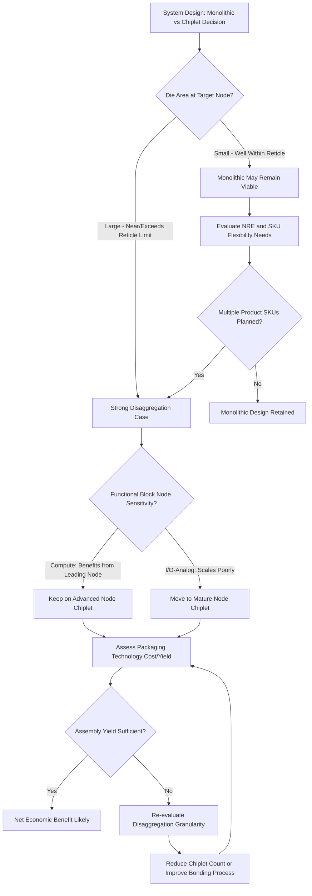

## Chiplet Architecture Philosophy and Die Disaggregation Economics

### Overview

Chiplet architecture represents a fundamental shift from monolithic system-on-chip (SoC) design toward decomposing a system into multiple smaller dies (chiplets), each optimized independently and integrated within a single package using advanced packaging interconnect technologies. This philosophy is driven primarily by economics — yield mathematics, process node cost curves, and design reuse — rather than pure performance considerations, though performance and flexibility benefits follow as secondary effects. Understanding disaggregation economics is foundational to evaluating when, how, and how far to decompose a system into chiplets.

---

### The Monolithic Scaling Problem

#### Why Monolithic SoCs Hit a Wall

**Key Points**

- As process nodes shrink, transistor cost reduction per generation has slowed (the traditional Moore's Law cost benefit has decelerated at leading-edge nodes), while mask set and design costs at each new node have risen substantially, making monolithic full-reticle die increasingly expensive to design and fabricate.
- Reticle size imposes a hard physical ceiling on maximum monolithic die area (typically around 800 $mm^2$ for standard single-exposure reticle limits), constraining how much functionality can be integrated into one die regardless of transistor budget.
- Defect density scales multiplicatively with die area: larger die have proportionally lower yield for a given defect density, since the probability of a die containing zero killer defects decreases as die area increases.
- [Inference] These combined pressures — cost-per-transistor scaling deceleration, reticle limits, and yield-area relationships — collectively make very large monolithic die economically unattractive at leading-edge nodes, motivating the shift toward disaggregation even before considering the additional flexibility benefits chiplets provide.

#### Yield Mathematics of Die Area

**Key Points**

- Die yield is commonly modeled using the Poisson yield model or the more commonly used negative binomial (Murphy/Seeds) model, where yield decreases as a function of die area and defect density.

A simplified Poisson yield model:

$$Y = e^{-D_0 \times A}$$

Where $D_0$ is the defect density (defects per unit area) and $A$ is the die area.

- Under this model, doubling die area does not merely halve yield — it squares the exponential penalty, meaning yield loss accelerates non-linearly with increasing die size.
- **Example**: For a defect density $D_0 = 0.1$ defects/$cm^2$, a die of area $A = 1\ cm^2$ yields $Y = e^{-0.1} \approx 90.5\%$, while a die of area $A = 4\ cm^2$ yields $Y = e^{-0.4} \approx 67.0\%$ — quadrupling the area reduces yield by roughly 26 percentage points, not proportionally.
- By splitting a large monolithic die into multiple smaller chiplets, each chiplet's individual yield is substantially higher (since each has smaller area), and a single defective chiplet can be discarded and replaced without scrapping the entire system, provided known-good-die (KGD) testing can identify defective chiplets prior to final package assembly.

[Inference] Real-world yield modeling in production environments often uses more sophisticated models (e.g., negative binomial with a clustering parameter) that account for non-uniform defect distribution across a wafer; the simplified Poisson model above illustrates the directional relationship but should not be treated as precisely predictive of actual foundry yield figures.

---

### Disaggregation Economics Framework

#### Cost Components in the Disaggregation Decision

**Key Points**

- **Silicon cost savings**: smaller chiplets yield better, reducing cost-per-good-die; this is the primary economic driver favoring disaggregation.
- **Packaging cost addition**: disaggregation requires advanced packaging (interposers, bridges, hybrid bonding, or organic substrate-based chiplet integration), which adds cost that must be weighed against the yield savings — packaging is not free, and its cost scales with interconnect density, bonding technology sophistication, and number of chiplets integrated.
- **Known-good-die (KGD) testing cost**: identifying defective chiplets before final assembly requires additional test infrastructure and test time investment per chiplet, adding cost and cycle time that a monolithic die (tested only once, post-fabrication) does not incur to the same degree.
- **Design and verification cost amortization**: chiplets designed for reuse across multiple products amortize their design and verification (a substantial and growing cost at leading-edge nodes) across a larger unit volume than a single monolithic SoC designed for one product line.
- **Interconnect power/performance tax**: die-to-die interconnects (even advanced hybrid-bonded ones) introduce some power and latency overhead compared to on-die wiring, representing a performance cost that must be weighed against the yield/cost benefits.

#### Break-Even Analysis Concept

**Key Points**

- The economic case for disaggregation improves as: (1) leading-edge process node cost-per-transistor rises relative to mature nodes, (2) defect density at the target node is higher (making yield loss from large die more severe), (3) packaging/interconnect cost and yield loss are lower (favoring simpler or more mature packaging technologies), and (4) design reuse volume across multiple products is higher.
- [Inference] There is no universal break-even die size or defect density threshold at which disaggregation becomes favorable — the decision is highly dependent on specific process node cost structures, packaging technology maturity and cost at the time of design, and product volume/reuse assumptions, all of which are proprietary and vary by company and generation. Published industry rules of thumb (e.g., "disaggregate above X $mm^2$") should be treated as illustrative heuristics rather than fixed engineering constants.

---

### Architectural Philosophy: What to Disaggregate and Why

#### Node-Matched Disaggregation

**Key Points**

- A central philosophical principle of chiplet architecture is **matching each functional block to the process node that best serves its requirements**, rather than forcing all functionality onto a single leading-edge node.
- Compute-critical logic (CPU/GPU cores) benefits most from leading-edge node transistor density and performance, justifying the higher cost-per-area of advanced nodes.
- I/O, analog, and SerDes circuitry often scale poorly with advanced process nodes (transistor density improvements do not translate proportionally to analog circuit area or performance) and can be more cost-effectively implemented on a mature, lower-cost node.
- Memory controllers, PCIe/CXL interfaces, and other I/O-heavy functions are frequently disaggregated onto separate "I/O die" or "base die" chiplets fabricated on mature nodes, a pattern seen across multiple industry chiplet architectures.
- [Inference] This node-matching philosophy directly reduces overall system cost by avoiding the "penalty" of fabricating poorly-scaling circuit types on expensive leading-edge silicon, though it requires the packaging technology to provide sufficiently low-parasitic, high-bandwidth interconnect between the disaggregated pieces to avoid negating the benefit with interconnect overhead.

#### Functional Disaggregation Patterns

**Key Points**

- **Compute tile disaggregation**: splitting what would be a single large compute die into multiple smaller, identical compute chiplets (a "tiled" approach), improving yield through replication of a smaller, well-characterized design and enabling product-line scalability (more or fewer compute tiles for different SKUs) from the same base chiplet design.
- **Cache/memory disaggregation**: separating large cache structures (e.g., stacked SRAM cache dies) from compute logic, allowing cache capacity to scale somewhat independently of compute core count and enabling cache to be fabricated on a node or with a technology (e.g., dense SRAM-optimized node) better suited to its specific density/cost requirements.
- **I/O and analog disaggregation**: consolidating I/O, memory controllers, and analog/mixed-signal circuitry onto separate die, as discussed above.
- **Accelerator disaggregation**: separating specialized accelerator functions (AI/ML engines, video codecs, etc.) into distinct chiplets that can be selectively included or excluded across product SKUs without redesigning the entire system.

---

### Business and Product Strategy Dimensions

#### SKU Flexibility and Product Line Economics

**Key Points**

- Chiplet architectures enable a single base chiplet design to be combined in different quantities and configurations to create multiple product SKUs (e.g., varying core counts, cache sizes, or I/O configurations) without requiring a full custom monolithic die design for each SKU.
- This modularity reduces the non-recurring engineering (NRE) cost burden per SKU, since the dominant design and verification investment is made once per chiplet rather than once per full-product variant.
- [Inference] This SKU flexibility advantage is particularly valuable in market segments with wide product stratification (e.g., server CPU lines spanning many core-count and price tiers from one base architecture), where monolithic design would otherwise require numerous distinct die designs, each individually incurring mask and verification costs.

#### Supply Chain and Sourcing Flexibility

**Key Points**

- Disaggregation allows different chiplets within the same package to potentially be sourced from different foundries or process nodes, providing supply chain diversification and negotiating leverage that a single monolithic die (necessarily fabricated entirely at one foundry/node) cannot offer.
- [Inference] This flexibility is most relevant for very large systems integrators or companies with significant volume leverage; smaller design teams may not realize meaningful supply chain diversification benefits and instead primarily benefit from the yield and cost advantages of disaggregation at a single foundry.
- Mixing chiplets across foundries within one package introduces additional design complexity (differing PDKs, differing electrical characteristics, cross-foundry interconnect standardization needs) that must be weighed against the sourcing flexibility benefit.

#### Standardization and Ecosystem Effects

**Key Points**

- Industry standardization efforts (e.g., UCIe — Universal Chiplet Interconnect Express) aim to enable an open chiplet ecosystem where chiplets from different vendors can be integrated using a common die-to-die interconnect standard, analogous in spirit to how standardized bus interfaces enabled modular board-level system design historically.
- [Inference] The degree to which a true open, multi-vendor chiplet marketplace materializes (as opposed to standardization primarily benefiting large vertically-integrated companies assembling their own chiplets internally) remains an evolving industry question, since practical chiplet integration still requires significant co-design, testing, and packaging coordination between chiplet suppliers and package integrators beyond just electrical interface compatibility.

---

### Trade-offs and Limitations of Disaggregation

**Key Points**

- **Interconnect overhead**: every die-to-die boundary introduces some combination of latency, power, and area overhead compared to on-die wiring; excessive disaggregation (too many small chiplets) can erode the yield/cost benefits through cumulative interconnect and packaging costs.
- **Packaging yield as a new yield term**: assembling multiple KGD chiplets into a package introduces its own assembly yield risk (bonding defects, misalignment, contamination) that must be multiplied against individual chiplet yields to determine overall system yield — meaning packaging yield must be sufficiently high to preserve the net benefit of disaggregation.
- **Design complexity**: coordinating power, thermal, and signal integrity co-design across multiple chiplets from potentially different design teams (or vendors) adds system-level integration complexity not present in monolithic design.
- **Testing complexity**: comprehensive known-good-die testing across multiple chiplet types, plus post-assembly system-level test, adds test development and execution cost and time compared to testing a single monolithic die.
- [Inference] There is a practical upper bound on beneficial disaggregation granularity for any given system — beyond a certain point, further splitting into smaller chiplets yields diminishing or negative net economic benefit as interconnect, packaging, and test overhead accumulate faster than yield savings.

---

### Overall System Yield Model

**Key Points**

- Total system yield for a chiplet-based package can be conceptually modeled as the product of each individual chiplet's yield and the assembly/packaging yield:

$$Y_{system} = \left(\prod_{i=1}^{n} Y_{chiplet,i}\right) \times Y_{assembly}$$

- This formulation makes explicit that adding more chiplets ($n$) to a system, while potentially improving each chiplet's individual yield ($Y_{chiplet,i}$) by keeping each smaller, simultaneously introduces more multiplicative yield terms and more assembly interconnects, both of which can erode $Y_{assembly}$ if packaging/bonding yield per interconnect or per chiplet is not sufficiently high.
- [Inference] This model illustrates why known-good-die testing rigor and packaging/bonding process yield are just as economically important to disaggregation's success as the underlying silicon yield improvement — a chiplet strategy with excellent individual die yield but poor assembly yield may not achieve a net economic advantage over monolithic design.

---

### Disaggregation Decision Framework Diagram

---

### Yield vs. Die Area Illustration

<svg xmlns="http://www.w3.org/2000/svg" viewBox="0 0 700 400">
<text x="350" y="28" text-anchor="middle" font-size="16" font-weight="bold" fill="#1a1a1a">Die Yield vs Die Area: Monolithic vs Chiplet Strategy (svg_diagram)</text>

<line x1="80" y1="340" x2="640" y2="340" stroke="#333" stroke-width="2" />
<line x1="80" y1="340" x2="80" y2="60" stroke="#333" stroke-width="2" />
<text x="360" y="375" text-anchor="middle" font-size="13" fill="#333">Die Area (mm²)</text>
<text x="35" y="200" text-anchor="middle" font-size="13" fill="#333" transform="rotate(-90 35 200)">Yield (%)</text>

<text x="70" y="345" text-anchor="end" font-size="11" fill="#333">0</text>

<text x="70" y="270" text-anchor="end" font-size="11" fill="#333">50</text>

<text x="70" y="200" text-anchor="end" font-size="11" fill="#333">75</text>

<text x="70" y="130" text-anchor="end" font-size="11" fill="#333">90</text>

<text x="70" y="65" text-anchor="end" font-size="11" fill="#333">100</text>

<text x="120" y="358" text-anchor="middle" font-size="10" fill="#333">100</text>

<text x="250" y="358" text-anchor="middle" font-size="10" fill="#333">300</text>

<text x="380" y="358" text-anchor="middle" font-size="10" fill="#333">500</text>

<text x="510" y="358" text-anchor="middle" font-size="10" fill="#333">700</text>

<text x="620" y="358" text-anchor="middle" font-size="10" fill="#333">850</text>

<path d="M 100 75 Q 250 140, 380 220 T 620 320" fill="none" stroke="#d94a4a" stroke-width="3" />
<text x="480" y="270" font-size="11" fill="#d94a4a" font-weight="bold">Monolithic Yield Decline</text>

<circle cx="150" cy="95" r="6" fill="#4a90d9" />
<circle cx="150" cy="95" r="6" fill="#4a90d9" />
<circle cx="190" cy="90" r="6" fill="#4a90d9" />
<circle cx="230" cy="88" r="6" fill="#4a90d9" />
<text x="230" y="70" text-anchor="middle" font-size="11" fill="#4a90d9" font-weight="bold">Chiplet Strategy: Multiple Smaller Die, Each High Yield</text>
<line x1="150" y1="95" x2="230" y2="88" stroke="#4a90d9" stroke-width="2" stroke-dasharray="4,3" />

<line x1="580" y1="60" x2="580" y2="340" stroke="#888" stroke-width="1.5" stroke-dasharray="6,4" />
<text x="580" y="55" text-anchor="middle" font-size="10" fill="#888">Reticle Limit (~800mm²)</text>
</svg>

[Inference] This chart is a conceptual, illustrative representation of the general inverse relationship between die area and yield; actual yield curves depend on process-specific defect density, defect clustering behavior, and yield model parameters, and will differ from this simplified visualization.

---

### Practical Example: Disaggregation Economics Comparison

**Example**

Consider a hypothetical system requiring 600 $mm^2$ of total silicon area at a leading-edge node with defect density $D_0 = 0.15$ defects/$cm^2$:

**Monolithic approach**: Single 600 $mm^2$ (6 $cm^2$) die.

$$Y_{mono} = e^{-0.15 \times 6} = e^{-0.9} \approx 40.7\%$$

**Chiplet approach**: Four 150 $mm^2$ (1.5 $cm^2$) chiplets.

$$Y_{chiplet} = e^{-0.15 \times 1.5} = e^{-0.225} \approx 79.9\%$$

Assuming an assembly yield of $Y_{assembly} = 95\%$ (a representative, illustrative figure for a mature packaging process):

$$Y_{system} = (0.799)^4 \times 0.95 \approx 0.407 \times 0.95 \approx 38.7\%$$

[Inference] In this illustrative example, the combined chiplet system yield (~38.7%) ends up close to the monolithic yield (~40.7%) once assembly yield is factored in, demonstrating that the net economic benefit of disaggregation is not guaranteed purely from individual die yield improvement — it depends critically on assembly/packaging yield remaining high, and on the actual per-good-die cost delta (accounting for smaller die's lower fabrication cost and higher effective die-per-wafer count) rather than yield percentage alone. This example is a simplified numerical illustration, not a benchmark of real industry figures.

---

### Next Steps

**Related Topics**

- Known-good-die (KGD) testing methodologies and economics
- UCIe (Universal Chiplet Interconnect Express) standard and die-to-die signaling
- Reticle limit constraints and multi-die stitching techniques
- Node-matched chiplet design: mature node I/O die vs. leading-edge compute die strategies
- Package-level yield modeling and assembly defect mechanisms
- TSMC SoIC and Intel Foveros platforms (packaging technology enabling disaggregation)
- Chiplet interconnect power/latency overhead characterization
- Multi-foundry chiplet sourcing and PDK compatibility challenges
- SKU-driven product line design using modular chiplet architectures