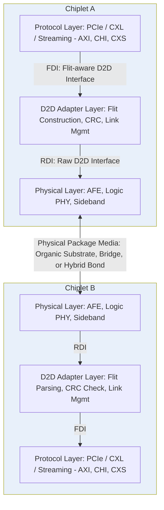

## Universal Chiplet Interconnect Express Protocol Stack

### Overview

Universal Chiplet Interconnect Express (UCIe) is an open industry standard defining a complete die-to-die interconnect stack — physical layer, adapter layer, protocol layer, and software model — intended to enable a multi-vendor chiplet ecosystem where chiplets from different silicon vendors and manufacturers can interoperate within a single package. UCIe maps established protocols like PCIe and CXL natively, allowing existing software stacks to be reused for in-package chiplet-to-chiplet communication, which lowers adoption barriers relative to fully proprietary die-to-die interconnect schemes.

**Key Points**

- Established by the UCI Consortium, with version 1.0 announced March 2, 2022, version 1.1 announced August 8, 2023, and version 2.0 released in August 2024, adding 3D packaging support.
- The UCIe Consortium has approximately 130 member companies globally, reflecting broad industry backing across foundries, IP vendors, and system integrators.
- [Inference] Given the search results reference ongoing 2026 activity (research papers, ecosystem discussion) without indicating a newer major version release, UCIe 2.0 combined with its 1.x predecessors remains the current baseline; any further version updates beyond what is covered here should be verified against the UCIe Consortium's current specification page for the latest status.

---

### Three-Layer Stack Architecture

#### Layer Overview

**Key Points**

- The UCIe specification is structured into three distinct stack layers: **Physical Layer**, **Die-to-Die (D2D) Adapter Layer**, and **Protocol Layer**.
- This layered architecture is deliberately analogous to established networking/interconnect stack philosophy (physical transport separated from link management separated from application protocol), enabling protocol independence at the physical layer and physical-media independence at the protocol layer.
- Contrary to other specifications, UCIe defines a complete stack for die-to-die interconnect, ensuring interoperability of compliant devices, which is treated as a mandatory requirement of the standard rather than an optional compliance target.

#### Physical Layer (PHY)

**Key Points**

- The Physical Layer serves as the electrical interface to the package media, encompassing the electrical analog front-end (AFE) — transmitter and receiver circuitry — and a **sideband channel** that facilitates parameter exchange and negotiation between two dies.
- The Physical Layer also includes the **logic PHY**, responsible for link initialization, training, calibration algorithms, as well as test and repair functionality.
- The sideband interface operates at 800 MT/s, independent of the main data lane data rates, and is used for low-level link management functions such as parameter negotiation before the main link is fully trained.
- Main data lanes operate over a defined set of data rates: 4, 8, 12, 16, 24, and 32 GT/s (giga-transfers per second) under UCIe 1.x/2.0 Standard and Advanced modes; UCIe supports both **Standard mode** (16 GT/s) and **Advanced mode** (32 GT/s) PHY operation.
- [Inference] The most recent UCIe specification developments (per Consortium disclosures) extend support toward 48 GT/s and 64 GT/s data rates, doubling the bandwidth of UCIe 2.0's 32 GT/s to meet higher-performance chiplet demands, alongside an extended sideband channel reaching up to 100mm to support more flexible system-in-package topologies. Exact version numbering for these enhancements should be confirmed against the current UCIe Consortium specification listing.

#### Die-to-Die (D2D) Adapter Layer

**Key Points**

- The Die-to-Die Adapter Layer takes care of link management functionality as well as protocol arbitration and negotiation.
- This layer functions as an intermediate layer that interfaces any given upper-layer protocol to the UCIe PHY layer, which is what allows UCIe to remain protocol-agnostic at the physical layer while supporting multiple upper-layer protocols.
- The Adapter Layer performs Flit (flow control unit) construction: taking data presented by the Protocol Layer and adding a Flit Header, CRC (cyclic redundancy check) for error detection, and performing barrel shifting before transmitting over the Raw D2D Interface (RDI) to the Physical Layer.
- In the 68-byte Flit format (Format 2), the Protocol Layer presents 64 bytes of Flit data on the Flit-aware D2D Interface (FDI); the D2D Adapter adds a 2-byte Flit Header and 2-byte CRC, with the CRC covering both the header and the 64 bytes of protocol information. The Flit header carries the protocol identifier, stack identifier, sequence number, Ack/Nak completion status, and pause-of-data-stream indication.

#### Protocol Layer

**Key Points**

- The Protocol Layer sits above the Adapter Layer and is responsible for mapping specific upper-layer protocols (PCIe, CXL, streaming protocols) into the UCIe Flit format for transmission.
- UCIe maps PCIe and CXL protocols natively via a **flit-aware mode**, enabling adoption of in-package integration using existing, mature software stacks already built around PCIe and CXL — a deliberate design choice to reduce ecosystem adoption friction.
- A **streaming protocol bridge** enables mapping of other protocols via the streaming mode, supporting additional SoC interface protocols such as AMBA AXI, CXS (Coherent Extensions to CHI/AMBA), CHI, and CHI C2C (Coherent Hub Interface, Chip-to-Chip) — described as a critical enabler for an open and robust chiplet ecosystem.

---

### Interface Definitions Between Layers

**Key Points**

- **FDI (Flit-aware D2D Interface)**: the interface between the Protocol Layer and the D2D Adapter Layer, enabling seamless interoperability with various protocols. This interface supports multiple Flit modes as specified in the UCIe standard.
- **RDI (Raw D2D Interface)**: the interface between the D2D Adapter Layer and the Physical Layer, over which constructed Flits (with header and CRC applied) are transmitted.
- UCIe also defines **raw modes** designed for specific protocol and application needs, such as retimer use cases and optical links, providing flexibility beyond the standard Flit-aware mode for specialized physical media.

---

### UCIe Form Factors: Standard, Advanced, and 3D

#### UCIe-Standard (UCIe-S)

**Key Points**

- UCIe-Standard (UCIe-S) covers planar (2D) interconnects with up to 25 mm channel length, suitable for organic substrate-based packaging where chiplets are connected via package traces rather than a silicon interposer or bridge.
- UCIe-S supports interoperability between two chiplets whose modules can be either stacked or unstacked, and allows connections between chiplets with different numbers of modules (1, 2, or 4), supporting graceful degradation in lane count if needed.
- As an illustrative example, a single unstacked UCIe-S module with 8 lanes (x8) uses an 8-column bump map with Tx and Rx side-by-side; at 32 GT/s and 110 µm bump pitch, the module depth is 577 µm, resulting in a module area of approximately 0.5 $mm^2$ ($872.25\ \mu m \times 577\ \mu m$).

#### UCIe-Advanced (UCIe-A)

**Key Points**

- UCIe-Advanced (UCIe-A) covers 2.5D interconnects with up to 2 mm channel length, targeting silicon interposer or bridge-die-based packaging (e.g., EMIB-style local silicon bridges or full silicon interposers) where much shorter, higher-density channels are achievable than organic substrate routing allows.
- Both UCIe-S and UCIe-A are based on the same well-defined layered protocol stack, with architected mechanisms for device discovery, configuration, control, and status/event reporting — meaning the same upper-layer software model applies regardless of which physical form factor is used underneath.

#### UCIe-3D

**Key Points**

- UCIe 2.0 introduced support for 3D packaging, offering higher bandwidth density and improved power efficiency compared to 2D and 2.5D architectures.
- UCIe-3D is optimized for hybrid bonding, with a bump pitch functional across a wide range — from as large as 10–25 microns down to as small as 1 micron or less — providing flexibility and scalability across different hybrid bonding process maturity levels.
- This directly connects UCIe's protocol stack to the physical hybrid bonding pitch scaling discussed elsewhere in 3D die stacking design, since UCIe-3D's electrical and Flit-format parameters must accommodate the much higher interconnect density achievable via bumpless hybrid bonding compared to bump-based 2.5D or organic-substrate 2D interconnects.

---

### UCIe 2.0 Key Enhancements

**Key Points**

- Holistic support for manageability, debug, and testing for any system-in-package (SiP) construction with multiple chiplets — extending management capability beyond simple data transport to encompass system-level diagnostics.
- Support for 3D packaging (UCIe-3D, described above), significantly enhancing bandwidth density and power efficiency relative to 2D/2.5D form factors.
- Improved system-level solutions with manageability defined as part of the chiplet stack, rather than left entirely to proprietary vendor implementations.
- Optimized package designs for interoperability and compliance testing, supporting the Consortium's goal of ensuring multi-vendor chiplets can be reliably mixed within one system.
- UCIe 2.0 maintains full backward compatibility with UCIe 1.1 and UCIe 1.0, meaning UCIe 2.0-compliant dies can interoperate with earlier-generation compliant dies at the capabilities supported by the earlier version.

---

### Protocol Stack Diagram

---

### Form Factor Comparison Diagram

<svg xmlns="http://www.w3.org/2000/svg" viewBox="0 0 700 400">
<text x="350" y="28" text-anchor="middle" font-size="16" font-weight="bold" fill="#1a1a1a">UCIe Form Factors: S, A, and 3D (svg_diagram)</text>

<text x="115" y="60" text-anchor="middle" font-size="13" font-weight="bold" fill="#333">UCIe-Standard</text>

<rect x="40" y="200" width="150" height="30" fill="`#c9c9c9`" stroke="#333" stroke-width="1.5" />

<text x="115" y="220" text-anchor="middle" font-size="9" fill="#333">Organic Substrate</text>

<rect x="50" y="160" width="55" height="40" fill="`#4a90d9`" stroke="#333" stroke-width="1.5" />

<text x="77" y="183" text-anchor="middle" font-size="9" fill="#fff">Die A</text>

<rect x="125" y="160" width="55" height="40" fill="`#4a90d9`" stroke="#333" stroke-width="1.5" />

<text x="152" y="183" text-anchor="middle" font-size="9" fill="#fff">Die B</text>

<line x1="105" y1="180" x2="125" y2="180" stroke="`#d94a4a`" stroke-width="2" />

<text x="115" y="250" text-anchor="middle" font-size="9" fill="#555">Channel: up to 25mm</text>

<text x="350" y="60" text-anchor="middle" font-size="13" font-weight="bold" fill="#333">UCIe-Advanced</text>

<rect x="275" y="210" width="150" height="20" fill="`#e8b04a`" stroke="#333" stroke-width="1.5" />

<text x="350" y="224" text-anchor="middle" font-size="8" fill="#333">Silicon Bridge / Interposer</text>

<rect x="280" y="160" width="55" height="40" fill="`#4a90d9`" stroke="#333" stroke-width="1.5" />

<text x="307" y="183" text-anchor="middle" font-size="9" fill="#fff">Die A</text>

<rect x="355" y="160" width="55" height="40" fill="`#4a90d9`" stroke="#333" stroke-width="1.5" />

<text x="382" y="183" text-anchor="middle" font-size="9" fill="#fff">Die B</text>

<line x1="335" y1="200" x2="335" y2="210" stroke="`#d94a4a`" stroke-width="2" />

<line x1="355" y1="200" x2="355" y2="210" stroke="`#d94a4a`" stroke-width="2" />

<text x="350" y="250" text-anchor="middle" font-size="9" fill="#555">Channel: up to 2mm</text>

<text x="580" y="60" text-anchor="middle" font-size="13" font-weight="bold" fill="#333">UCIe-3D</text>

<rect x="530" y="200" width="100" height="35" fill="`#4a90d9`" stroke="#333" stroke-width="1.5" />

<text x="580" y="221" text-anchor="middle" font-size="9" fill="#fff">Bottom Die</text>

<rect x="530" y="150" width="100" height="35" fill="`#4ac97a`" stroke="#333" stroke-width="1.5" />

<text x="580" y="171" text-anchor="middle" font-size="9" fill="#111">Top Die</text>

<rect x="530" y="185" width="100" height="15" fill="`#d94a4a`" opacity="0.6" stroke="#333" stroke-width="0.5" />

<text x="580" y="275" text-anchor="middle" font-size="9" fill="#555">Hybrid Bond: 1-25um pitch</text>

<rect x="60" y="330" width="12" height="12" fill="#4a90d9" />
<text x="78" y="340" font-size="10" fill="#333">Chiplet Die</text>
<rect x="180" y="330" width="12" height="12" fill="#d94a4a" opacity="0.7" />
<text x="198" y="340" font-size="10" fill="#333">UCIe Interconnect / Bond Interface</text>
</svg>

[Inference] This diagram is a simplified conceptual illustration of the three UCIe form factors' physical arrangement; actual bump maps, channel routing, and package cross-sections vary by specific implementation and are defined precisely in the UCIe specification documents.

---

### Software and Management Model

**Key Points**

- UCIe defines a software model alongside the physical/protocol stack, encompassing device discovery, configuration, control, and status/event reporting mechanisms, allowing system software to enumerate and manage UCIe-connected chiplets in a manner analogous to how PCIe devices are enumerated and configured in conventional systems.
- Compliance testing methodology is a core part of the specification, ensuring interoperability across chiplets from different silicon vendors, manufacturers, and OSAT (Outsourced Semiconductor Assembly and Test) vendors — critical for the standard's stated goal of enabling a genuine multi-vendor chiplet marketplace.

---

### Ecosystem Context: Competing and Complementary Standards

**Key Points**

- UCIe is one of several industry efforts addressing die-to-die interconnect standardization, alongside: the **Optical Interface Forum (OIF)**'s XSR and USR physical layer specifications optimized for die-to-die connectivity; **CHIPS Alliance**'s AIB (Advanced Interface Bus) specification, originally introduced by Intel; and the **Open Compute Project (OCP)**'s OpenHBI and Bunch-of-Wires (BOW) specifications optimized for different use cases.
- UCIe is distinguished among these by covering a comprehensive die-to-die interconnect specification spanning multiple use cases and a complete protocol stack (physical through software), rather than addressing only the physical/electrical layer as some alternative specifications do.

---

### Practical Implementation Considerations

**Key Points**

- Chip designers incorporate UCIe capabilities into GPU, accelerator, ASIC, SoC, and FPGA designs by integrating UCIe PHY IP that aligns with the published specification, either developed in-house or sourced from IP vendors.
- Because UCIe maps existing PCIe and CXL software stacks natively, system software and driver ecosystems built around those established protocols can often be reused largely unmodified for UCIe-connected chiplets, substantially lowering the software-side adoption barrier compared to a fully novel interconnect protocol.
- [Inference] Successful multi-vendor UCIe interoperability in production systems likely requires not only PHY-level and protocol-level compliance but also careful package-level co-design (bump map alignment, channel length/loss budget matching, thermal/mechanical compatibility) between chiplets from different vendors — meaning full "plug-and-play" multi-vendor chiplet assembly, while a stated goal of the standard, may still require significant system integration engineering in practice.

---

### Next Steps

**Related Topics**

- Chiplet architecture philosophy and die disaggregation economics
- PCIe and CXL protocol fundamentals as mapped through UCIe
- EMIB and silicon bridge packaging for UCIe-Advanced implementations
- Hybrid bond pitch scaling roadmap and its relationship to UCIe-3D bump pitch flexibility
- Known-good-die (KGD) testing and UCIe compliance/interoperability testing methodologies
- Chiplet IP sourcing: UCIe PHY vendors and third-party IP integration
- System-in-package (SiP) manageability and debug architecture under UCIe 2.0
- Multi-foundry, multi-vendor chiplet ecosystem development challenges