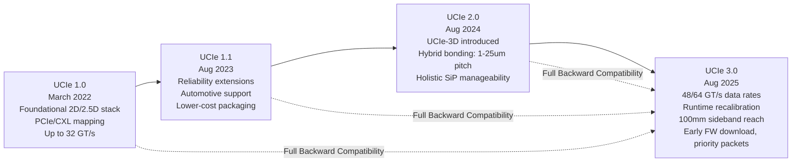

## UCIe Specification Evolution from 1.0 through 3.0

### Overview

The Universal Chiplet Interconnect Express (UCIe) specification has evolved through several major and minor releases since its introduction, progressively expanding from a baseline 2D/2.5D die-to-die interconnect standard into a comprehensive stack supporting 3D hybrid-bonded packaging, higher data rates, and richer system-level manageability. Each version has maintained full backward compatibility with its predecessors, a deliberate design philosophy intended to protect the standard's core goal of enabling a genuinely interoperable, multi-vendor chiplet ecosystem across successive generations.

---

### UCIe 1.0 (March 2022)

**Key Points**

- UCIe 1.0 stands as the inaugural open industry standard providing backing for the die-to-die I/O physical layer, die-to-die protocols, and software stack, all rooted in the established industry standards of PCI Express (PCIe) and Compute Express Link (CXL).
- The UCIe Consortium announced version 1.0 on March 2, 2022, detailing the complete standardized die-to-die interconnect with physical layer, protocol stack, software model, and compliance testing to enable end users to mix and match chiplet components from a multi-vendor ecosystem.
- UCIe 1.0 established the foundational three-layer stack architecture: Physical Layer, Die-to-Die (D2D) Adapter Layer, and Protocol Layer.
- Covered two form factors: **UCIe-Standard (UCIe-S)** for 2D planar interconnects with up to 25 mm channel length (organic substrate-based packaging), and **UCIe-Advanced (UCIe-A)** for 2.5D interconnects with up to 2 mm channel length (silicon bridge/interposer-based packaging).
- Defined data rates of 4, 8, 12, 16, 24, and 32 GT/s across both form factors, with a sideband interface operating at 800 MT/s for link parameter negotiation.
- Established architected mechanisms for device discovery, configuration, control, and status/event reporting as part of the software model.

---

### UCIe 1.1 (August 2023)

**Key Points**

- The UCIe 1.1 specification was published in July/August 2023, extending UCIe 1.0 in a fully backward compatible manner.
- Delivered valuable improvements to the chiplet ecosystem, extending reliability mechanisms to more protocols and supporting broader usage models.
- Added enhancements specifically for automotive usages, including predictive failure analysis and health monitoring — reflecting expanding UCIe adoption interest beyond pure HPC/data center applications into safety-sensitive, long-lifecycle markets.
- Enabled lower-cost packaging implementations, broadening the standard's applicability across different cost/performance tiers of chiplet integration.
- [Inference] The automotive-focused reliability enhancements in 1.1 suggest the Consortium was responding to specific member company use cases requiring functional safety and long-term field reliability monitoring not emphasized in the original 1.0 release, which appears to have been more narrowly focused on HPC/data center interoperability.

---

### UCIe 2.0 (August 2024)

**Key Points**

- The UCIe 2.0 specification was released in August 2024, marking the most architecturally significant update up to that point: introduction of **3D packaging support**.
- **UCIe-3D**: optimized for hybrid bonding, with a bump pitch functional across a wide range — from as large as 10–25 microns down to as small as 1 micron or less — providing flexibility and scalability as hybrid bonding pitch continues to scale down industry-wide.
- Offered higher bandwidth density and improved power efficiency compared to the existing 2D (UCIe-S) and 2.5D (UCIe-A) architectures, reflecting the fundamentally different interconnect density achievable via bumpless hybrid bonding versus bump-based or substrate-trace-based approaches.
- Added holistic support for manageability, debug, and testing for any system-in-package (SiP) construction with multiple chiplets — extending the standard's scope from pure data transport into system-level diagnostic capability.
- Improved system-level solutions with manageability defined as part of the chiplet stack itself, rather than left to proprietary vendor implementations layered on top.
- Optimized package designs for interoperability and compliance testing, continuing to strengthen the multi-vendor interoperability goal.
- UCIe 2.0 maintained full backward compatibility with both UCIe 1.1 and UCIe 1.0.

---

### UCIe 3.0 (August 2025)

**Key Points**

- The UCIe Consortium announced the release of the UCIe 3.0 specification on August 5, 2025, marking the next stage in the standard's evolution with a primary focus on performance, power efficiency, and manageability.
- **Doubled data rates**: UCIe 3.0 delivers 48 GT/s and 64 GT/s speeds for both UCIe-S (2D) and UCIe-A (2.5D) packaging, doubling the bandwidth of UCIe 2.0's 32 GT/s maximum to meet high-performance chiplet demands such as AI workloads.
- **Runtime recalibration**: enhancements enable power-efficient link tuning during operation by reusing initialization states, improving power efficiency without requiring full link retraining.
- **Extended sideband channel**: reaching up to 100mm (compared to the original UCIe 1.0/2.0 sideband implementations), supporting more flexible system-in-package (SiP) topologies where chiplets may be spread across larger package areas.
- **Continuous transmission protocol support**: through new mappings enabling uninterrupted data flow in Raw Mode for applications such as connectivity between SoC and DSP chiplets.
- **Early firmware download standardization**: using the Management Transport Protocol (MTP) for streamlined initialization.
- **Priority sideband packets**: allow deterministic, low-latency signaling for time-sensitive system events.
- UCIe 3.0 continues to support 3D packaging (carrying forward UCIe-3D capability from 2.0) and maintains full backward compatibility with all prior UCIe generations (1.0, 1.1, 2.0).
- [Inference] The emphasis on "continuous transmission protocols" and SoC-to-DSP connectivity in UCIe 3.0 suggests the Consortium is explicitly targeting broader system architectures beyond pure CPU/GPU/accelerator chiplet stacking — extending toward more heterogeneous, specialized-processor system-in-package designs.

---

### Version-by-Version Comparison Table

| Feature | UCIe 1.0 | UCIe 1.1 | UCIe 2.0 | UCIe 3.0 |
| --- | --- | --- | --- | --- |
| Release date | March 2022 | Aug 2023 | Aug 2024 | Aug 2025 |
| Max data rate | 32 GT/s | 32 GT/s | 32 GT/s | 64 GT/s |
| Form factors | UCIe-S, UCIe-A | UCIe-S, UCIe-A | UCIe-S, UCIe-A, UCIe-3D | UCIe-S, UCIe-A, UCIe-3D |
| 3D/hybrid bonding support | No | No | Yes (1um-25um pitch) | Yes (continued) |
| Sideband reach | Standard | Standard | Standard | Extended to 100mm |
| Manageability scope | Basic device discovery/config | Reliability extensions, automotive features | Holistic SiP manageability/debug | Enhanced: early FW download, priority packets |
| Power efficiency features | Baseline | Baseline | Baseline | Runtime recalibration |
| Backward compatibility | N/A (baseline) | Full compat. with 1.0 | Full compat. with 1.0, 1.1 | Full compat. with 1.0, 1.1, 2.0 |

---

### Evolution Timeline Diagram

---

### Bandwidth Scaling Across Versions Illustration

<svg xmlns="http://www.w3.org/2000/svg" viewBox="0 0 700 380">
<text x="350" y="28" text-anchor="middle" font-size="16" font-weight="bold" fill="#1a1a1a">UCIe Maximum Data Rate by Version (svg_diagram)</text>

<line x1="90" y1="320" x2="620" y2="320" stroke="#333" stroke-width="2" />
<line x1="90" y1="320" x2="90" y2="60" stroke="#333" stroke-width="2" />
<text x="355" y="355" text-anchor="middle" font-size="12" fill="#333">UCIe Version</text>
<text x="40" y="190" text-anchor="middle" font-size="12" fill="#333" transform="rotate(-90 40 190)">Max Data Rate (GT/s)</text>

<text x="80" y="325" text-anchor="end" font-size="10" fill="#333">0</text>

<text x="80" y="255" text-anchor="end" font-size="10" fill="#333">20</text>

<text x="80" y="185" text-anchor="end" font-size="10" fill="#333">40</text>

<text x="80" y="115" text-anchor="end" font-size="10" fill="#333">60</text>

<text x="80" y="70" text-anchor="end" font-size="10" fill="#333">64</text>

<rect x="130" y="215" width="80" height="105" fill="#4a90d9" opacity="0.85" />
<text x="170" y="335" text-anchor="middle" font-size="11" fill="#333">1.0</text>
<text x="170" y="205" text-anchor="middle" font-size="10" fill="#111" font-weight="bold">32</text>
<rect x="250" y="215" width="80" height="105" fill="#4a90d9" opacity="0.85" />
<text x="290" y="335" text-anchor="middle" font-size="11" fill="#333">1.1</text>
<text x="290" y="205" text-anchor="middle" font-size="10" fill="#111" font-weight="bold">32</text>
<rect x="370" y="215" width="80" height="105" fill="#4a90d9" opacity="0.85" />
<text x="410" y="335" text-anchor="middle" font-size="11" fill="#333">2.0</text>
<text x="410" y="205" text-anchor="middle" font-size="10" fill="#111" font-weight="bold">32</text>
<rect x="490" y="90" width="80" height="230" fill="#d94a4a" opacity="0.85" />
<text x="530" y="335" text-anchor="middle" font-size="11" fill="#333">3.0</text>
<text x="530" y="80" text-anchor="middle" font-size="10" fill="#111" font-weight="bold">64</text>

<text x="355" y="60" text-anchor="middle" font-size="10" fill="#555">UCIe 3.0 doubles peak data rate vs prior generations</text>

</svg>

[Inference] This chart illustrates the maximum published data rate per version based on the sources reviewed; actual achievable link performance in specific implementations depends on additional factors such as channel length, equalization, and PHY implementation quality, and will vary from these headline specification maximums.

---

### Cross-Version Design Implications

**Key Points**

- **Backward compatibility as ecosystem protection**: the consistent full backward compatibility across all versions (1.0 through 3.0) means a chiplet designed to an earlier UCIe version can still interoperate with a UCIe 3.0-compliant partner die, though presumably only at the capabilities (data rate, feature set) supported by the older version — critical for protecting long-lifecycle product designs (e.g., automotive, industrial) that may not be redesigned as frequently as consumer/HPC products.
- **3D support as an architectural inflection point**: the introduction of UCIe-3D in version 2.0 represents the most significant architectural expansion in the standard's history, since it extends UCIe from purely lateral (2D/2.5D) die-to-die communication into the vertical stacking domain covered elsewhere in 3D die stacking and hybrid bonding topics — directly linking UCIe's evolution to the broader hybrid bond pitch scaling roadmap.
- **Verification complexity growth**: each generation's added features increase verification burden; UCIe 3.0's higher data rates (48/64 GT/s) require tighter timing checks, advanced equalization validation, and stress testing under jitter and skew conditions substantially more demanding than earlier-generation verification requirements.
- [Inference] The progression from primarily protocol/interoperability focus (1.0), to reliability/vertical-market expansion (1.1), to physical architecture expansion (2.0's 3D support), to performance/power/manageability refinement (3.0) suggests a maturing standard that is systematically addressing successive layers of the die-to-die interconnect problem — though whether this progression continues at a similar roughly annual release cadence for future versions is not confirmed by available sources.

---

### Ecosystem Adoption Signals

**Key Points**

- IP vendors have demonstrated UCIe 3.0 compliance at advanced process nodes; for example, 3nm UCIe 3.0-compliant interface IP achieving data transfer rates up to 64 GT/s while supporting both 2.5D and 3D packaging architectures has been showcased at industry events, indicating IP ecosystem readiness is tracking closely behind specification releases.
- UCIe IP portfolios from vendors have been reported to span a wide range of process nodes (from 22nm down to 2nm in at least one vendor's disclosed portfolio), suggesting UCIe adoption is not restricted to only the most leading-edge nodes but is being integrated across a broader swath of the process technology spectrum.
- [Inference] The relatively rapid cadence of IP vendor compliance demonstrations following each UCIe specification release (often within the same year or the following year) suggests active, ongoing collaboration between the UCIe Consortium and its member IP/EDA vendors during specification development, rather than IP ecosystems lagging significantly behind published specifications.

---

### Next Steps

**Related Topics**

- Universal Chiplet Interconnect Express protocol stack (layer architecture detail)
- UCIe-3D and hybrid bond pitch scaling roadmap alignment
- Chiplet architecture philosophy and die disaggregation economics
- PCIe and CXL protocol fundamentals underlying UCIe protocol mapping
- UCIe compliance testing and multi-vendor interoperability validation
- System-in-package (SiP) manageability architecture and Management Transport Protocol (MTP)
- UCIe IP vendor landscape and process node coverage
- Runtime link recalibration techniques for power-efficient die-to-die interconnects