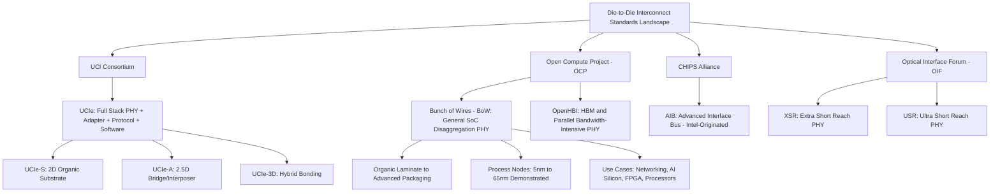

## Bunch of Wires and Other Die-to-Die Interconnect Standards

### Overview

While UCIe has emerged as the most comprehensive and widely-backed die-to-die interconnect standard, it is not the only open specification addressing chiplet interconnection. Several industry alliances have developed complementary or alternative standards, each optimized for different use cases, cost points, and packaging technologies. Understanding this broader landscape — particularly Bunch of Wires (BoW), OpenHBI, AIB, and the OIF's XSR/USR specifications — is important for evaluating the full set of options available for die-to-die connectivity beyond the UCIe ecosystem.

**Key Points**

- Several industry alliances have come together to define die-to-die interconnect standards: the Optical Interface Forum (OIF) with XSR and USR physical layer specifications; CHIPS Alliance with the AIB specification (originally introduced by Intel); the Open Compute Project (OCP) with OpenHBI and Bunch of Wires (BoW) specifications; and the UCIe Consortium with its comprehensive multi-layer standard.
- These standards are generally positioned as optimized for different use cases rather than being strictly competitive alternatives to one another — a design team's choice among them often depends on cost sensitivity, target packaging technology, bandwidth requirements, and existing ecosystem/IP availability.

---

### Bunch of Wires (BoW)

#### Origin and Governance

**Key Points**

- BoW was released by the OCP Foundation (Open Compute Project) on July 19, 2022, under its Open Domain-Specific Architecture (ODSA) sub-project, as an open-source, open-license specification for chiplet interconnect.
- The ODSA sub-project has since been renamed to the Open Chiplet Economy subproject as of August 2024, reflecting a broader scope beyond its original domain-specific architecture framing.
- BoW's authorship is credited to contributors including Elad Alon (Blue Cheetah Analog Design), with foundational technical work published in "Bunch of Wires: An Open Die-to-Die Interface" at the 2020 IEEE Symposium on High-Performance Interconnects (HOTI).

#### Technical Positioning

**Key Points**

- BoW specifies a physical layer (PHY) optimized for System-on-Chip (SoC) disaggregation, and complements the OCP ODSA Open High Bandwidth Interconnect (OpenHBI) PHY specification, which targets High Bandwidth Memory and other parallel bandwidth-intensive use cases.
- The BoW PHY specification is optimized for both commodity (organic laminate) and advanced packaging technologies, enabling cost- and energy-efficient designs as well as high-performance designs across a wide range of process nodes.
- The specification was deliberately authored to allow many use cases, driving significant economies of scale; care was taken to impose as few constraints as possible and to avoid mandating features that could increase design complexity when disaggregating an existing SoC.
- [Inference] This "minimal constraint" design philosophy positions BoW as a lighter-weight, more flexible alternative to UCIe's comprehensive, tightly-specified multi-layer stack — potentially better suited to teams wanting a simpler physical-layer-only interconnect without adopting UCIe's full protocol/software stack requirements, though this also means BoW provides less built-in interoperability guarantee than UCIe's mandatory compliance testing framework.

#### Process Node and Use Case Coverage

**Key Points**

- At the time of its release, BoW was already in use at 10 or more companies, including Samsung and NXP, across more than a dozen different use cases spanning 5, 6, 12, 16, 22, and 65nm process nodes.
- Application domains cited include chiplet-based products for networking, specialized AI silicon, FPGAs, and processors — spanning both leading-edge and legacy/mature node use cases.
- d-Matrix has cited leveraging the BoW standard to develop a die-to-die interconnect for its chiplet-based AI compute platform targeted at datacenter inference, noting the energy efficiency of the high-speed interconnect over organic substrates as an attractive, cost-effective option for connecting chiplets.
- IP vendor eTopus has reported working with multiple clients utilizing the BoW standard to connect chiplets with low power and latency, describing the ecosystem as being "only at the beginning of the adoption curve" with many additional applications anticipated.

#### Interoperability and Ecosystem Activities

**Key Points**

- The BoW ecosystem has organized a "plugfest" for BoW PHY interoperability testing, with participants including Google, Cisco, Arm, Meta, JCET, d-Matrix, Blue Cheetah, and Analog Port — indicating active multi-company interoperability validation efforts similar in spirit to UCIe's compliance testing program.
- [Inference] The breadth of plugfest participants (spanning hyperscalers, OSATs, and IP vendors) suggests BoW has achieved meaningful cross-industry engagement, though the overall scale of adoption relative to UCIe (which counts roughly 130 member companies) appears smaller based on available sources; direct market-share comparisons between the two standards were not found in the reviewed material and should be treated as an open question.

---

### OpenHBI (Open High Bandwidth Interconnect)

**Key Points**

- OpenHBI is an OCP ODSA PHY specification that complements BoW, specifically targeting High Bandwidth Memory (HBM) and other parallel, bandwidth-intensive use cases.
- [Inference] The division of labor between BoW (general SoC disaggregation) and OpenHBI (HBM/parallel bandwidth-intensive) suggests the OCP ecosystem deliberately created separate, use-case-optimized specifications rather than a single universal PHY — reflecting a philosophy that different interconnect use cases (moderate-bandwidth general chiplet disaggregation vs. very-high-bandwidth parallel memory interfaces) benefit from distinct physical layer optimizations rather than a one-size-fits-all approach.

---

### AIB (Advanced Interface Bus)

**Key Points**

- AIB is a die-to-die interconnect specification originally introduced by Intel, subsequently contributed to and maintained under the CHIPS Alliance.
- [Inference] As one of the earlier open die-to-die interface specifications to emerge from a major semiconductor company (predating both BoW and UCIe), AIB's contribution to CHIPS Alliance represented an early industry move toward open die-to-die standardization, though its current relative adoption compared to newer standards like UCIe was not detailed in the sources reviewed and would require further verification for a precise current-state comparison.

---

### OIF XSR and USR Specifications

**Key Points**

- The Optical Interface Forum (OIF) has developed XSR (Extra Short Reach) and USR (Ultra Short Reach) physical layer specifications optimized for die-to-die connectivity.
- [Inference] Given OIF's traditional focus on optical and high-speed electrical interconnect standards for networking and telecommunications equipment, XSR/USR specifications likely originated from adapting OIF's broader short-reach SerDes expertise to the specific die-to-die packaging context, though detailed technical specifications for these standards were not covered in the sources reviewed for this topic.

---

### Comparative Positioning of Die-to-Die Interconnect Standards

| Standard | Governing Body | Primary Scope | Target Packaging | Notable Characteristic |
| --- | --- | --- | --- | --- |
| UCIe | UCI Consortium | Full stack: PHY, adapter, protocol, software | 2D, 2.5D, 3D (UCIe-3D) | Comprehensive, mandatory compliance testing, PCIe/CXL native mapping |
| Bunch of Wires (BoW) | OCP (Open Chiplet Economy, formerly ODSA) | Physical layer (PHY) only | Organic laminate to advanced packaging | Minimal constraints, broad process node coverage (5nm-65nm demonstrated) |
| OpenHBI | OCP (ODSA/Open Chiplet Economy) | PHY for HBM/parallel bandwidth-intensive use | Advanced packaging (interposer-class) | Complements BoW; optimized for very high parallel bandwidth |
| AIB | CHIPS Alliance (orig. Intel) | Die-to-die interface | Advanced packaging | Early open die-to-die specification |
| XSR/USR | Optical Interface Forum (OIF) | Physical layer, short-reach SerDes | Die-to-die connectivity | Adapted from OIF's broader short-reach interconnect expertise |

[Inference] This table synthesizes positioning language directly from the sources reviewed; precise technical parameters (data rates, channel lengths, bump pitches) for BoW, OpenHBI, AIB, and XSR/USR beyond what is stated above were not comprehensively detailed in available material and would require consulting each standard's published specification directly for precise engineering comparison.

---

### Generic Die-to-Die Interface Layer Model

**Key Points**

- Across these standards, a die-to-die (D2D) interface can generally be viewed as divided into a physical layer (PHY), a link layer, and a transaction layer — a layering pattern conceptually consistent with UCIe's three-layer architecture (Physical, D2D Adapter, Protocol) even though not all standards (e.g., BoW, which is PHY-only) define equivalent upper layers themselves.
- The PHY layer in these interfaces is typically implemented using high-speed SerDes (Serializer/Deserializer) architectures for parallel-to-serial and serial-to-parallel data conversion, with the primary role of a SerDes being to minimize the number of physical I/O interconnects required for a given data bandwidth.
- [Inference] Because BoW and similar PHY-only specifications do not define their own upper-layer protocol/software stack, designs using them typically pair the PHY with either a proprietary link/transaction layer implementation or, in principle, could be paired with upper-layer protocol mapping approaches conceptually similar to UCIe's — though such cross-standard layering combinations were not explicitly confirmed in the sources reviewed and should be treated as an architectural possibility rather than a documented standard practice.

---

### Standards Landscape Diagram

---

### Ecosystem Positioning Illustration

<svg xmlns="http://www.w3.org/2000/svg" viewBox="0 0 700 380">
<text x="350" y="28" text-anchor="middle" font-size="16" font-weight="bold" fill="#1a1a1a">Die-to-Die Standards: Scope Comparison (svg_diagram)</text>

<text x="150" y="60" text-anchor="middle" font-size="13" font-weight="bold" fill="#333">UCIe</text>

<rect x="70" y="80" width="160" height="30" fill="`#4a90d9`" stroke="#333" stroke-width="1.5" />

<text x="150" y="100" text-anchor="middle" font-size="10" fill="#fff">Software Model</text>

<rect x="70" y="110" width="160" height="30" fill="`#4ac97a`" stroke="#333" stroke-width="1.5" />

<text x="150" y="130" text-anchor="middle" font-size="10" fill="#111">Protocol Layer</text>

<rect x="70" y="140" width="160" height="30" fill="`#e8b04a`" stroke="#333" stroke-width="1.5" />

<text x="150" y="160" text-anchor="middle" font-size="10" fill="#111">D2D Adapter Layer</text>

<rect x="70" y="170" width="160" height="30" fill="`#d97a4a`" stroke="#333" stroke-width="1.5" />

<text x="150" y="190" text-anchor="middle" font-size="10" fill="#fff">Physical Layer</text>

<text x="150" y="215" text-anchor="middle" font-size="9" fill="#555">Comprehensive, mandatory</text>

<text x="150" y="228" text-anchor="middle" font-size="9" fill="#555">compliance testing</text>

<text x="400" y="60" text-anchor="middle" font-size="13" font-weight="bold" fill="#333">Bunch of Wires</text>

<rect x="320" y="80" width="160" height="30" fill="`#e0e0e0`" stroke="#999" stroke-width="1" stroke-dasharray="4,3" />

<text x="400" y="100" text-anchor="middle" font-size="9" fill="#999">Not Specified</text>

<rect x="320" y="110" width="160" height="30" fill="`#e0e0e0`" stroke="#999" stroke-width="1" stroke-dasharray="4,3" />

<text x="400" y="130" text-anchor="middle" font-size="9" fill="#999">Not Specified</text>

<rect x="320" y="140" width="160" height="30" fill="`#e0e0e0`" stroke="#999" stroke-width="1" stroke-dasharray="4,3" />

<text x="400" y="160" text-anchor="middle" font-size="9" fill="#999">Not Specified</text>

<rect x="320" y="170" width="160" height="30" fill="`#d97a4a`" stroke="#333" stroke-width="1.5" />

<text x="400" y="190" text-anchor="middle" font-size="10" fill="#fff">Physical Layer Only</text>

<text x="400" y="215" text-anchor="middle" font-size="9" fill="#555">Minimal constraints,</text>

<text x="400" y="228" text-anchor="middle" font-size="9" fill="#555">wide node/use-case range</text>

<text x="600" y="60" text-anchor="middle" font-size="13" font-weight="bold" fill="#333">OpenHBI</text>

<rect x="550" y="170" width="100" height="30" fill="`#7a5ea8`" stroke="#333" stroke-width="1.5" />

<text x="600" y="190" text-anchor="middle" font-size="9" fill="#fff">HBM PHY</text>

<text x="600" y="215" text-anchor="middle" font-size="9" fill="#555">Parallel high-</text>

<text x="600" y="228" text-anchor="middle" font-size="9" fill="#555">bandwidth focus</text>

<rect x="70" y="280" width="12" height="12" fill="#d97a4a" />
<text x="88" y="290" font-size="10" fill="#333">Physical Layer</text>
<rect x="200" y="280" width="12" height="12" fill="#e0e0e0" stroke="#999" stroke-dasharray="3,2" />
<text x="218" y="290" font-size="10" fill="#333">Layer Not Defined by This Standard</text>
</svg>

[Inference] This diagram illustrates the relative scope of each standard as described in the sources reviewed — BoW and OpenHBI as PHY-only specifications versus UCIe's full-stack coverage. This is a conceptual scope comparison rather than a precise technical layering diagram of each specification's actual internal architecture.

---

### Practical Selection Considerations

**Key Points**

- **Choose UCIe when**: broad multi-vendor interoperability with mandatory compliance testing is required, native PCIe/CXL software stack reuse is valuable, or 3D hybrid-bonded stacking support is needed alongside 2D/2.5D options.
- **Choose BoW when**: a lightweight, minimally-constrained PHY is preferred, cost-effective organic substrate packaging is the target, or the design needs flexibility across a very wide range of process nodes without adopting a full protocol/software stack mandate.
- **Choose OpenHBI when**: the specific use case is HBM-class or other parallel, bandwidth-intensive memory interconnect rather than general SoC chiplet disaggregation.
- [Inference] In practice, some organizations may evaluate multiple standards in parallel or even implement compatibility with more than one, depending on target markets and existing customer/partner ecosystem requirements; the decision is not necessarily mutually exclusive at a company-wide level even if a specific chiplet product typically commits to one primary standard.

---

### Next Steps

**Related Topics**

- Universal Chiplet Interconnect Express protocol stack (detailed layer architecture)
- UCIe specification evolution from 1.0 through 3.0
- Chiplet architecture philosophy and die disaggregation economics
- High Bandwidth Memory (HBM) interconnect architecture and stacking
- SerDes (Serializer/Deserializer) fundamentals for die-to-die PHY design
- Open Compute Project (OCP) Open Chiplet Economy subproject scope and governance
- Organic substrate vs. advanced packaging interconnect cost/performance trade-offs
- Multi-standard interoperability challenges in mixed-vendor chiplet systems