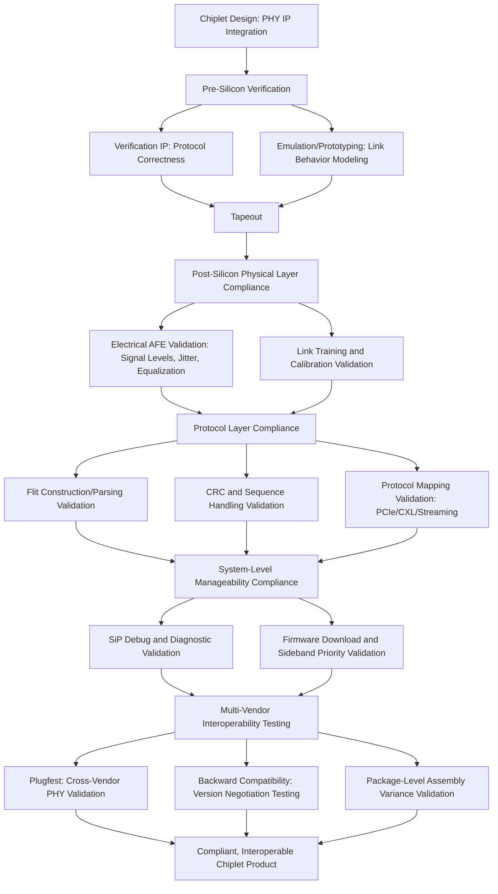

## Chiplet Ecosystem Interoperability and Compliance Testing

### Overview

Interoperability and compliance testing are the practical mechanisms by which die-to-die interconnect standards like UCIe move from paper specifications to a functioning multi-vendor chiplet marketplace. Without rigorous compliance testing, a standard's promise of "mix and match" chiplet components from different silicon vendors remains theoretical, since subtle implementation variances in electrical characteristics, protocol handling, or timing margins can prevent nominally-compliant devices from actually working together. This topic covers the testing methodologies, ecosystem structures, and validation practices that underpin real-world chiplet interoperability.

---

### Why Compliance Testing Is Foundational to the Chiplet Ecosystem

#### The Interoperability Promise and Its Challenges

**Key Points**

- The core value proposition of open die-to-die standards (UCIe and others) is enabling end users to mix and match chiplet components from a multi-vendor ecosystem for system-on-chip construction — but this promise depends entirely on genuine interoperability being achievable in practice, not merely on paper compliance with a written specification.
- A robust compliance methodology is necessary to ensure interoperability across chiplets from different silicon vendors, manufacturers, and OSAT (Outsourced Semiconductor Assembly and Test) vendors, since these different parties may each interpret specification ambiguities differently or implement optional features inconsistently absent a shared testing framework.
- [Inference] Unlike board-level standards (e.g., PCIe on a PCB), die-to-die interconnects operate over extremely short, high-density channels within a single package, where signal integrity margins are tighter and manufacturing/assembly variances (bump placement, bonding quality, channel routing) have a more direct and less forgiving impact on link functionality — making compliance testing arguably more critical for die-to-die standards than for many traditional board-level interconnects.

#### Compliance Testing as Specification Component

**Key Points**

- UCIe's specification explicitly includes compliance testing as one of its core defined components alongside the physical layer, protocol stack, and software model — not treated as a separate, optional add-on process.
- Optimized package designs for interoperability and compliance testing were specifically called out as a feature of UCIe 2.0, indicating the standard's evolution has included ongoing refinement of how compliance testing itself is structured and supported at the package design level.
- [Inference] Embedding compliance testing directly into the specification (rather than leaving it to ad hoc industry practice) reflects lessons learned from earlier interconnect standards where interoperability issues emerged primarily from testing gaps rather than specification defects — a deliberate design choice to reduce integration risk for adopters.

---

### Layers of Interoperability Validation

#### Electrical/Physical Layer Compliance

**Key Points**

- Physical layer compliance testing validates the electrical analog front-end (AFE) — transmitter and receiver characteristics — against specification-defined parameters for signal levels, timing, jitter tolerance, and equalization performance.
- For UCIe specifically, this includes validating link initialization, training, and calibration algorithms function correctly, since the logic PHY is responsible for these functions and errors here would prevent link establishment entirely regardless of upper-layer protocol correctness.
- Testing at higher data rates (as introduced in UCIe 3.0's 48/64 GT/s modes) requires tighter timing checks, advanced equalization validation, and stress testing under jitter and skew conditions substantially more demanding than earlier-generation compliance requirements.
- [Inference] As data rates increase across successive standard versions, the physical layer compliance testing burden grows non-linearly, since signal integrity margins shrink and previously acceptable manufacturing/assembly tolerances may no longer be sufficient — meaning compliance test suites themselves require ongoing revision to remain adequate validation for each new specification generation.

#### Protocol and Link Layer Compliance

**Key Points**

- Above the physical layer, compliance testing must validate correct Flit (flow control unit) construction and parsing, CRC (cyclic redundancy check) generation and verification, and correct handling of protocol identifiers, sequence numbers, and Ack/Nak completion signaling as defined in the D2D Adapter Layer.
- Transmitters are responsible for segmentation, interleaving, and flow control, while receivers handle decapsulation, reassembly, and out-of-order traffic; any weakness at this level risks data corruption or system instability, making this a critical compliance testing focus area distinct from pure physical-layer signal integrity.
- Protocol layer compliance must validate correct mapping of upper-layer protocols (PCIe, CXL, streaming modes for AXI/CHI/CXS) into the standard's Flit format, ensuring that a chiplet implementing, for example, PCIe-over-UCIe correctly interoperates with another vendor's PCIe-over-UCIe implementation at the protocol semantics level, not merely at the raw electrical level.

#### System-Level Manageability Compliance

**Key Points**

- Later UCIe generations (2.0 onward) added holistic support for manageability, debug, and testing for any system-in-package (SiP) construction with multiple chiplets, extending compliance concerns beyond point-to-point link functionality into system-level diagnostic and management capability.
- UCIe 3.0's manageability enhancements — including early firmware download standardization via the Management Transport Protocol (MTP) and priority sideband packets for deterministic, low-latency signaling — introduce additional compliance surface area, since these features must interoperate correctly not just between two directly-connected chiplets but potentially across a broader system-level management framework spanning multiple chiplets in one package.

---

### Interoperability Testing Practices Across the Industry

#### Multi-Vendor Plugfests

**Key Points**

- The BoW (Bunch of Wires) ecosystem, as an example from a related but distinct standard, has organized a dedicated "plugfest" for BoW PHY interoperability testing, with participants including hyperscalers (Google, Meta), networking companies (Cisco), IP vendors (Arm, Blue Cheetah, Analog Port), OSATs (JCET), and chiplet product companies (d-Matrix) — demonstrating a broad, cross-role industry testing model.
- [Inference] This plugfest model — bringing together silicon vendors, IP providers, OSATs, and end-product companies in shared interoperability testing events — likely represents a common industry pattern across multiple die-to-die standards (including UCIe), since the fundamental challenge of validating multi-party interoperability benefits from direct, in-person or coordinated remote testing between actual implementations rather than relying solely on each vendor's independent specification interpretation.

#### Verification IP and Emulation Platforms

**Key Points**

- EDA and IP vendors provide dedicated Verification IP (VIP) for standards like UCIe that models link behavior, protocol correctness, and system-level interaction, including newer features like early firmware loading and deterministic sideband control.
- These Verification IPs integrate with emulation and prototyping platforms to validate die-to-die connections well before tapeout, allowing design teams to identify interoperability issues during the design/verification phase rather than only discovering them after physical silicon and package assembly.
- [Inference] Pre-tapeout verification via VIP and emulation is particularly valuable for die-to-die interconnects because physical compliance testing (requiring actual bonded/packaged silicon from multiple vendors) can only occur very late in the development cycle, after significant investment in mask sets and packaging — making early-stage simulation-based verification an economically important risk-reduction practice distinct from, but complementary to, post-silicon compliance testing.

---

### IP Vendor Role in Compliance and Interoperability

**Key Points**

- Chip designers typically incorporate standard-compliant capabilities (e.g., UCIe) into their designs by integrating PHY IP that aligns with the published specification, either developed in-house or sourced from third-party IP vendors such as Cadence, Synopsys, Alphawave Semi, and Blue Cheetah.
- IP vendors have demonstrated compliance at advanced process nodes — for example, 3nm UCIe 3.0-compliant interface IP achieving data transfer rates up to 64 GT/s while supporting both 2.5D and 3D packaging architectures has been showcased at industry events, indicating that IP-level compliance validation is an active, ongoing part of the vendor ecosystem's engagement with each specification revision.
- [Inference] Because most chiplet designers license PHY IP rather than designing physical-layer circuits from scratch, the practical interoperability of the broader chiplet ecosystem depends heavily on a relatively small number of IP vendors' implementations being correctly compliant and well-characterized — meaning IP vendor compliance testing rigor has outsized influence on real-world multi-vendor interoperability outcomes compared to what the raw number of "compliant" end-product companies might suggest.

---

### Practical Interoperability Challenges

#### Specification Ambiguity and Optional Features

**Key Points**

- Even well-specified standards can contain areas of interpretive ambiguity or optional/configurable features (e.g., which protocol mappings a given implementation supports, which data rates are mandatory versus optional) that create interoperability risk if not tightly constrained by compliance testing.
- [Inference] Standards that support multiple form factors and feature sets (as UCIe does, spanning UCIe-S, UCIe-A, and UCIe-3D, plus multiple data rate tiers across versions 1.0 through 3.0) inherently create a larger compliance testing matrix than a single-configuration standard, since interoperability must be validated across combinations of form factor, data rate, and feature support rather than a single fixed configuration.

#### Package-Level and Assembly Variance

**Key Points**

- Beyond pure silicon-level compliance, die-to-die interconnect interoperability is also affected by package-level factors: bump map alignment between chiplets from different vendors, channel length and loss characteristics of the specific package substrate or bridge/interposer used, and assembly process variance (bonding alignment, thermal cycling effects).
- [Inference] This means full "compliance" at the silicon IP level does not guarantee interoperability in every physical package implementation — package-level co-design and, where applicable, package-specific compliance validation are likely necessary complements to pure silicon-level compliance testing, particularly for UCIe-3D (hybrid-bonded) implementations where bond pitch, alignment tolerance, and thermal budget introduce additional physical variables beyond what a purely electrical compliance test would capture.

#### Backward Compatibility Verification

**Key Points**

- Because standards like UCIe maintain full backward compatibility across versions (a UCIe 3.0 chiplet should interoperate with a UCIe 1.0 chiplet at the capabilities the older version supports), compliance testing must also validate correct version negotiation and graceful capability degradation, not just same-version interoperability.
- [Inference] Backward compatibility testing adds a further dimension to the compliance testing matrix, since a comprehensive test program must validate not only "does version X interoperate with version X" but also "does version X correctly negotiate down to version Y's capabilities when paired with a version Y device" — a combinatorially larger testing space as the number of supported specification versions grows over time.

---

### Compliance Testing Workflow

---

### Compliance Testing Scope Illustration

<svg xmlns="http://www.w3.org/2000/svg" viewBox="0 0 700 400">
<text x="350" y="28" text-anchor="middle" font-size="16" font-weight="bold" fill="#1a1a1a">Compliance Testing Layers in Chiplet Interoperability (svg_diagram)</text>

<circle cx="350" cy="220" r="160" fill="#e8f0fa" stroke="#4a90d9" stroke-width="2" />
<text x="350" y="80" text-anchor="middle" font-size="11" fill="#4a90d9" font-weight="bold">System-Level Manageability</text>
<circle cx="350" cy="220" r="120" fill="#d5e8f5" stroke="#4ac97a" stroke-width="2" />
<text x="350" y="120" text-anchor="middle" font-size="11" fill="#2d8a4a" font-weight="bold">Protocol / Link Layer</text>
<circle cx="350" cy="220" r="80" fill="#c0dced" stroke="#e8b04a" stroke-width="2" />
<text x="350" y="165" text-anchor="middle" font-size="11" fill="#b8860b" font-weight="bold">Physical Layer</text>
<circle cx="350" cy="220" r="40" fill="#a8ccdf" stroke="#d94a4a" stroke-width="2" />
<text x="350" y="215" text-anchor="middle" font-size="9" fill="#d94a4a" font-weight="bold">Core</text>
<text x="350" y="228" text-anchor="middle" font-size="9" fill="#d94a4a" font-weight="bold">Signal</text>

<text x="350" y="370" text-anchor="middle" font-size="11" fill="`#7a5ea8`" font-weight="bold">Cross-Cutting: Package Assembly Variance + Backward Compatibility</text>

<text x="350" y="386" text-anchor="middle" font-size="9" fill="#555">(applies across all layers above)</text>

</svg>

[Inference] This diagram is a conceptual illustration of compliance testing's layered scope (physical, protocol, system-level) plus cross-cutting concerns (package variance, backward compatibility) that apply across all layers. It is not a literal representation of any standard's official test methodology documentation, which would specify exact test procedures and pass/fail criteria.

---

### Interoperability Risk Mitigation Best Practices

**Key Points**

- **Early VIP integration**: incorporating Verification IP and emulation-based validation during the design phase, well before tapeout, to catch protocol and link-behavior issues when they are cheapest to fix.
- **Participation in multi-vendor plugfests**: engaging in cross-industry interoperability testing events rather than relying solely on internal, single-vendor validation, since real interoperability issues often only surface when genuinely independent implementations are tested against each other.
- **IP vendor selection diligence**: given the outsized influence of PHY IP vendor implementations on real-world interoperability, evaluating an IP vendor's own compliance testing rigor and track record is a practically important part of de-risking a chiplet interconnect design decision.
- **Package-level co-validation**: for hybrid-bonded (UCIe-3D) or advanced packaging implementations specifically, validating interoperability at the package/assembly level (not just the silicon IP level) to account for bump map, channel, and bonding process variance.
- [Inference] Because comprehensive physical compliance testing can only occur after significant investment (tapeout, packaging), a risk-tiered approach — heavy pre-silicon verification investment combined with targeted, well-chosen post-silicon compliance and interoperability testing — is likely the most economically practical strategy for most chiplet design teams, though the specific balance depends on product volume, risk tolerance, and available budget.

---

### Next Steps

**Related Topics**

- Universal Chiplet Interconnect Express protocol stack (layer architecture underlying compliance scope)
- UCIe specification evolution from 1.0 through 3.0 (compliance testing evolution across versions)
- Bunch of Wires and other die-to-die interconnect standards (alternative ecosystem plugfest models)
- Known-good-die (KGD) testing methodologies and economics
- Chiplet architecture philosophy and die disaggregation economics
- Verification IP (VIP) and emulation platform selection for die-to-die interconnects
- Package-level co-design considerations for multi-vendor chiplet assembly
- PHY IP vendor landscape and licensing considerations for chiplet interconnect