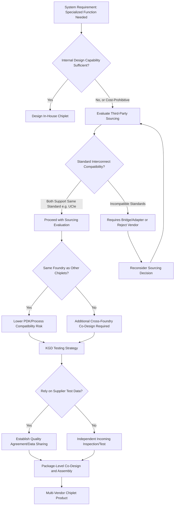

## Multi-Vendor Chiplet Sourcing and Third-Party IP Integration

### Overview

Multi-vendor chiplet sourcing refers to the practice of assembling a single package from chiplets designed, fabricated, or sourced from different companies — as opposed to a fully vertically-integrated design where one company controls every die in the stack. Third-party IP integration is the closely related practice of licensing pre-designed chiplet-level intellectual property (interconnect PHYs, controller logic, specialized accelerator dies) from external vendors rather than designing every component in-house. Together, these practices are what transform chiplet architecture from a purely internal cost-optimization technique (splitting one company's own monolithic die into smaller pieces) into a genuine ecosystem play, where the economic and strategic benefits of disaggregation extend to sourcing flexibility, specialization, and reduced internal design burden.

---

### Strategic Rationale for Multi-Vendor Sourcing

#### Sourcing Flexibility and Supply Chain Diversification

**Key Points**

- Disaggregation allows different chiplets within the same package to potentially be sourced from different foundries or process nodes, providing supply chain diversification and negotiating leverage that a single monolithic die (necessarily fabricated entirely at one foundry/node) cannot offer.
- [Inference] This flexibility is most relevant for very large systems integrators or companies with significant volume leverage; smaller design teams may not realize meaningful supply chain diversification benefits and instead primarily benefit from the yield and cost advantages of disaggregation at a single foundry.
- Mixing chiplets across foundries within one package introduces additional design complexity — differing process design kits (PDKs), differing electrical characteristics between foundries, and cross-foundry interconnect standardization needs — that must be weighed against the sourcing flexibility benefit.

#### Specialization and Design Reuse Economics

**Key Points**

- Third-party IP integration allows a design team to incorporate best-in-class specialized functionality (e.g., a high-performance SerDes PHY, an AI accelerator chiplet, a specialized RF or analog die) without bearing the full internal design and verification cost of developing that capability from scratch.
- Chip designers commonly incorporate standard-compliant die-to-die interconnect capabilities by integrating PHY IP that aligns with published specifications (such as UCIe), either developed in-house or sourced from third-party IP vendors including Cadence, Synopsys, Alphawave Semi, and Blue Cheetah — illustrating how even the interconnect layer itself is frequently a licensed, third-party component rather than an in-house design.
- [Inference] This IP-licensing model mirrors long-established practices in conventional SoC design (where third-party IP cores for interfaces, memory controllers, and processor cores have long been standard practice) but extends the same principle to the chiplet/die level — meaning a company can now potentially license an entire pre-verified chiplet rather than just an IP core to be integrated into its own monolithic design.

#### Ecosystem Vision: The "Chiplet Marketplace"

**Key Points**

- Industry standardization efforts (UCIe, and complementary standards like Bunch of Wires and OpenHBI) explicitly aim to enable an open chiplet ecosystem where chiplets from different vendors can be integrated using a common die-to-die interconnect standard, analogous in spirit to how standardized bus interfaces historically enabled modular board-level system design.
- The BoW specification was authored to allow many use cases driving significant economies of scale, with the OCP Foundation explicitly framing its release as "a catalyst for a new silicon marketplace and integrated circuit supply chain model."
- [Inference] The degree to which a true open, multi-vendor chiplet marketplace materializes — where a company could, for example, purchase a compute chiplet from Vendor A, a memory controller chiplet from Vendor B, and an I/O chiplet from Vendor C, and integrate them into one package with confidence — remains an evolving industry question, since practical chiplet integration still requires significant co-design, testing, and packaging coordination between chiplet suppliers and package integrators beyond just electrical interface compatibility.

---

### Technical Requirements for Multi-Vendor Integration

#### Standardized Die-to-Die Interconnect as Enabling Layer

**Key Points**

- A robust compliance methodology is necessary to ensure interoperability across chiplets from different silicon vendors, manufacturers, and OSAT (Outsourced Semiconductor Assembly and Test) vendors — without this, multi-vendor sourcing would require extensive bespoke, pairwise validation between every combination of chiplets a company wanted to combine.
- UCIe maps PCIe and CXL protocols natively via a flit-aware mode, enabling adoption of in-package integration using existing, mature software stacks — meaning multi-vendor chiplet integration can leverage decades of established software/driver ecosystem work around these protocols rather than requiring entirely novel software support for each new chiplet combination.
- The existence of multiple complementary standards (UCIe, BoW, OpenHBI, AIB, OIF XSR/USR) means a company's ability to source multi-vendor chiplets in practice depends on which specific interconnect standard(s) both chiplets in question support — genuine "any chiplet with any chiplet" interoperability is not automatic across the full standards landscape.

#### Process Node and PDK Compatibility Challenges

**Key Points**

- Node-matched disaggregation — placing compute-critical logic on leading-edge nodes while placing I/O, analog, and mature-technology functions on lower-cost mature nodes — is a common architectural philosophy, but when sourced from different vendors/foundries rather than designed in-house, this introduces cross-foundry PDK compatibility as an additional integration variable.
- [Inference] Even with a standardized electrical interconnect (UCIe or equivalent), differences in each foundry's specific process characteristics (voltage levels, ESD protection schemes, thermal behavior, parasitic characteristics) mean that a chiplet designed against one foundry's PDK is not automatically electrically "compatible" with a chiplet from a different foundry purely because both implement the same interconnect standard — careful electrical co-design and characterization remains necessary at the package level.

#### Known-Good-Die (KGD) Testing Across Vendor Boundaries

**Key Points**

- Known-good-die (KGD) testing — verifying each chiplet's functionality before final package assembly — becomes more operationally complex in a multi-vendor sourcing model, since the integrating company must either rely on the supplying vendor's own test coverage and quality guarantees, or conduct independent incoming inspection/test on externally-sourced chiplets before committing them to an expensive assembly process.
- [Inference] This dependency on a third-party vendor's KGD test quality represents a meaningful supply chain risk distinct from internally-designed chiplets, where the integrating company has full visibility into and control over the test methodology; contractual quality agreements and test data sharing between chiplet vendor and package integrator likely become important risk-mitigation mechanisms in multi-vendor sourcing relationships, though specific industry-standard practices for this were not detailed in the immediate sources reviewed.

---

### Business and Commercial Considerations

#### Foundry-as-Integrator Models

**Key Points**

- Major foundries offering advanced packaging services (e.g., TSMC's SoIC, accessible as a merchant foundry service) enable a form of multi-vendor integration where a foundry acts as the assembly point for chiplets that may originate from different customer design teams but are fabricated at the same foundry.
- [Inference] This foundry-centric integration model may currently be more common in practice than a fully open, cross-foundry multi-vendor marketplace, since it reduces (though does not eliminate) some of the PDK and process compatibility challenges discussed above by keeping fabrication within one foundry's process ecosystem, even if the chip designs themselves originate from different companies.

#### IP Licensing Models and Vendor Relationships

**Key Points**

- Third-party IP integration for die-to-die interconnect PHYs typically follows established semiconductor IP licensing models — upfront license fees, per-unit royalties, or hybrid arrangements — analogous to how processor core IP (e.g., Arm cores) or interface IP (e.g., USB, PCIe controllers) has long been licensed in conventional SoC design.
- IP vendors have demonstrated compliance and performance at advanced process nodes as part of their commercial offering — for example, showcasing 3nm UCIe 3.0-compliant interface IP achieving data transfer rates up to 64 GT/s — serving both as ecosystem validation and as commercial marketing to potential licensees evaluating IP vendor selection.
- [Inference] Because most chiplet designers license PHY IP rather than designing physical-layer circuits from scratch, the practical interoperability and reliability of multi-vendor chiplet sourcing depends heavily on a relatively concentrated set of IP vendors' implementations being correctly compliant and well-characterized — meaning IP vendor selection and relationship management is a strategically important, not merely tactical, part of a multi-vendor sourcing strategy.

#### Intellectual Property and Competitive Risk Considerations

**Key Points**

- [Inference] Multi-vendor chiplet sourcing inherently requires a degree of technical transparency between the integrating company and its chiplet suppliers (e.g., sharing package-level design constraints, thermal/power budgets, test data) that may raise intellectual property protection considerations, particularly when suppliers may also serve the integrating company's competitors — this is a plausible business risk consideration for multi-vendor sourcing strategies, though specific industry practices for managing this risk were not detailed in the sources reviewed and would benefit from further research into actual commercial agreements in this space.

---

### Comparison: Vertically-Integrated vs. Multi-Vendor Chiplet Sourcing

| Dimension | Vertically-Integrated (Single Company) | Multi-Vendor Sourcing |
| --- | --- | --- |
| Design control | Full control over all chiplets | Dependent on supplier design quality |
| KGD testing assurance | Direct internal visibility | Reliant on supplier test coverage or independent verification |
| PDK/process compatibility | Consistent if single foundry used internally | Must manage cross-foundry variance if suppliers use different foundries |
| Specialization access | Limited to internal design capability | Access to best-in-class external specialized IP/chiplets |
| Supply chain flexibility | Single point of failure per component | Potential diversification across suppliers |
| IP/competitive risk | Minimal external exposure | Requires technical transparency with suppliers who may also serve competitors |
| Interconnect standardization dependency | Optional (can use proprietary interconnect) | Effectively required (open standard needed for practical interoperability) |
| Integration complexity | Lower (single design methodology/tools) | Higher (must reconcile multiple vendors' design practices) |

---

### Multi-Vendor Sourcing Decision Flow

---

### Multi-Vendor Package Composition Illustration

<svg xmlns="http://www.w3.org/2000/svg" viewBox="0 0 700 380">
<text x="350" y="28" text-anchor="middle" font-size="16" font-weight="bold" fill="#1a1a1a">Example Multi-Vendor Chiplet Package Composition (svg_diagram)</text>

<rect x="60" y="290" width="580" height="30" fill="#c9c9c9" stroke="#333" stroke-width="1.5" />
<text x="350" y="310" text-anchor="middle" font-size="11" fill="#333">Package Substrate (Common Integration Point)</text>

<rect x="80" y="200" width="140" height="80" fill="#4a90d9" stroke="#333" stroke-width="1.5" />
<text x="150" y="235" text-anchor="middle" font-size="11" fill="#fff">Compute Chiplet</text>
<text x="150" y="250" text-anchor="middle" font-size="9" fill="#fff">Vendor A / Foundry X</text>
<text x="150" y="263" text-anchor="middle" font-size="9" fill="#fff">Leading-Edge Node</text>

<rect x="240" y="220" width="120" height="60" fill="#4ac97a" stroke="#333" stroke-width="1.5" />
<text x="300" y="245" text-anchor="middle" font-size="10" fill="#111">I/O Chiplet</text>
<text x="300" y="258" text-anchor="middle" font-size="9" fill="#111">Vendor B / Foundry Y</text>
<text x="300" y="271" text-anchor="middle" font-size="9" fill="#111">Mature Node</text>

<rect x="380" y="220" width="120" height="60" fill="#e8b04a" stroke="#333" stroke-width="1.5" />
<text x="440" y="245" text-anchor="middle" font-size="10" fill="#111">Accelerator Chiplet</text>
<text x="440" y="258" text-anchor="middle" font-size="9" fill="#111">Vendor C (Licensed IP)</text>
<text x="440" y="271" text-anchor="middle" font-size="9" fill="#111">Specialized Function</text>

<rect x="520" y="200" width="100" height="80" fill="#d97a4a" stroke="#333" stroke-width="1.5" />
<text x="570" y="235" text-anchor="middle" font-size="10" fill="#fff">Memory Chiplet</text>
<text x="570" y="250" text-anchor="middle" font-size="9" fill="#fff">Vendor D</text>
<text x="570" y="263" text-anchor="middle" font-size="9" fill="#fff">(HBM-class)</text>

<line x1="220" y1="250" x2="240" y2="250" stroke="#7a5ea8" stroke-width="3" />
<line x1="360" y1="250" x2="380" y2="250" stroke="#7a5ea8" stroke-width="3" />
<line x1="500" y1="245" x2="520" y2="240" stroke="#7a5ea8" stroke-width="3" />

<text x="350" y="345" text-anchor="middle" font-size="10" fill="`#7a5ea8`" font-weight="bold">Purple lines: Standardized Die-to-Die Interconnect (e.g., UCIe)</text>

<text x="350" y="360" text-anchor="middle" font-size="9" fill="#555">enabling integration across different vendors and foundries</text>

</svg>

[Inference] This diagram illustrates a conceptual example of a multi-vendor chiplet package composition, showing how a standardized interconnect could enable integration of chiplets from different vendors and foundries within one package. It is an illustrative composite rather than a depiction of any specific commercial product.

---

### Practical Considerations for Adopting Multi-Vendor Sourcing

**Key Points**

- **Start with standard-compliant interconnect selection**: choosing chiplets and IP that support a well-established open standard (UCIe or a complementary standard like BoW) is the foundational enabler for any multi-vendor sourcing strategy, since proprietary interconnects effectively lock a company into single-vendor or fully in-house sourcing.
- **Evaluate IP vendor track record**: given the outsized influence of PHY IP vendor implementations on real-world interoperability (as discussed in compliance testing), the reliability and compliance track record of a third-party IP vendor is a practically important part of multi-vendor sourcing due diligence.
- **Plan for package-level co-design early**: because full compliance at the silicon/IP level does not guarantee interoperability in every physical package implementation, engaging with package-level co-design (bump map alignment, channel/thermal budget matching) early in the multi-vendor sourcing relationship reduces late-stage integration risk.
- **Establish quality and test data agreements**: since KGD testing assurance is more complex across vendor boundaries, establishing clear contractual quality agreements and test data sharing practices with chiplet suppliers is a practical risk-mitigation step.
- [Inference] Companies newer to multi-vendor chiplet sourcing may benefit from starting with lower-risk combinations — e.g., sourcing from a single foundry's ecosystem of compatible chiplet offerings, or working with well-established IP vendors with demonstrated multi-customer track records — before attempting more ambitious cross-foundry, cross-standard integration scenarios.

---

### Next Steps

**Related Topics**

- Chiplet ecosystem interoperability and compliance testing
- Universal Chiplet Interconnect Express protocol stack
- Chiplet architecture philosophy and die disaggregation economics
- Known-good-die (KGD) testing methodologies and economics
- TSMC SoIC and Intel Foveros platforms as foundry-centric integration models
- Bunch of Wires and other die-to-die interconnect standards
- Semiconductor IP licensing models and commercial agreement structures
- Cross-foundry PDK compatibility and electrical characterization challenges
- Package-level co-design methodologies for multi-vendor chiplet assembly