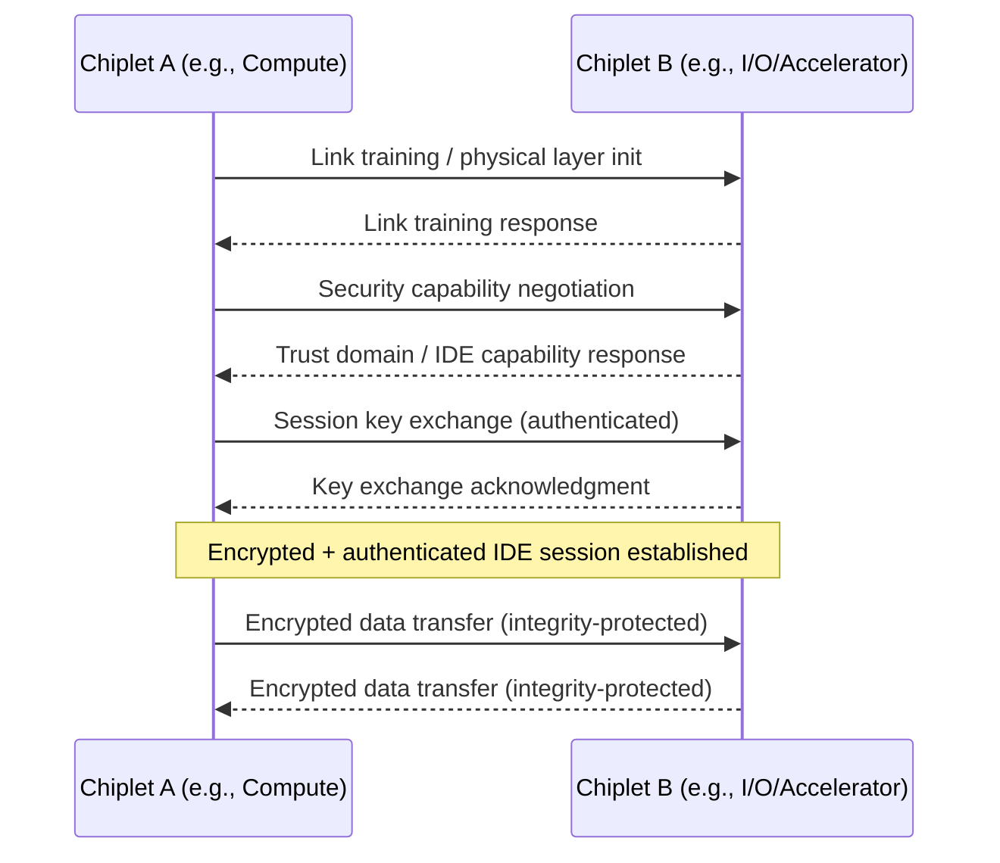
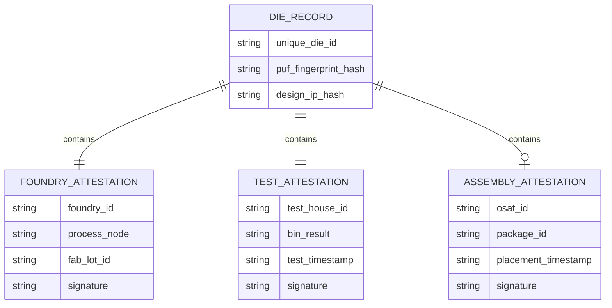

## Chiplet Security, Provenance, and Supply Chain Assurance

### Overview

**Key Points**

- Chiplet-based disaggregation introduces a distinct security surface compared to monolithic SoCs: dies originating from different foundries, IP vendors, and geographies are physically integrated into a single package, expanding trust boundaries beyond a single manufacturing entity
- Core concerns span three interrelated domains: **provenance** (verifying die origin and manufacturing integrity), **interconnect security** (protecting die-to-die communication from tampering/eavesdropping), and **supply chain assurance** (ensuring no counterfeit, recycled, or maliciously modified dies enter the assembly flow)
- Industry standardization efforts, most notably UCIe (Universal Chiplet Interconnect Express), have begun incorporating security primitives directly into the interconnect protocol stack
- This domain intersects hardware security engineering, supply chain logistics, and increasingly, national security policy given the geographic concentration of advanced packaging capacity

---

### Why Chiplets Change the Security Model

**Key Points**

- A monolithic SoC has a single point of manufacturing trust (one foundry, one mask set, one test flow); a chiplet-based package may combine dies from multiple foundries, multiple process nodes, and multiple corporate entities
- Each die-to-package integration step (die procurement, known-good-die test, placement, bonding) introduces a potential insertion point for hardware Trojans, counterfeit substitution, or reverse-engineering exposure
- Unlike board-level supply chain security (which has decades of established practice), chiplet-level assurance must operate at post-singulation, pre-package granularity — individual bare or minimally packaged dies are far harder to physically inspect, mark, and trace than finished packaged parts
- The "split manufacturing" security benefit sometimes cited for multi-foundry chiplet designs (no single foundry sees the complete system) is a double-edged property: it can *reduce* IP theft risk at any single fab, but it *increases* the integration-time trust burden on the entity assembling the final package

---

### Threat Taxonomy for Chiplet-Based Systems

**Key Points — Threat Categories**

- **Counterfeit/recycled die insertion** — substitution of a genuine die with a counterfeit, remarked, or recycled part during the supply chain between die fabrication and package assembly
- **Hardware Trojans** — malicious circuit modifications inserted at any stage where a third party has access to GDSII/mask data or physical die handling, including at an untrusted foundry, IP core vendor, or EDA tool supply chain
- **Die-to-die interconnect eavesdropping/tampering** — since chiplets communicate over die-to-die interfaces (e.g., UCIe, BoW, AIB) that may traverse an interposer or bridge accessible to package-level probing, these links represent a new physical attack surface absent in monolithic designs
- **IP extraction via de-packaging/imaging** — physical or side-channel analysis targeting individual chiplets, potentially easier when a chiplet is a smaller, more homogeneous unit than a full SoC
- **Supply chain substitution at test/assembly houses (OSATs)** — outsourced assembly and test facilities represent an additional trust boundary where die swapping, cloning, or overproduction (unauthorized excess die fabrication) can occur
- **Provenance ambiguity in the second-hand/gray market** — as chiplet ecosystems mature toward more open die marketplaces, the absence of standardized provenance metadata increases risk of unverified-origin dies entering legitimate assembly flows

**Threat surface by chiplet lifecycle stage:**

| Lifecycle Stage | Primary Threat | Mitigation Domain |
| --- | --- | --- |
| Design/IP sourcing | Malicious IP core insertion | Design verification, trusted IP vendor vetting |
| Foundry fabrication | Hardware Trojan insertion, overproduction | Trusted foundry programs, split manufacturing |
| Die test/binning | Test result falsification | Cryptographic test attestation |
| Die transport to OSAT | Substitution, counterfeiting | Physical tagging, chain-of-custody logging |
| Package assembly | Die swap, tampering during placement | Known-good-die (KGD) verification, secure assembly audit |
| Die-to-die operation | Interconnect eavesdropping/tampering | Link-layer encryption/authentication (e.g., UCIe security) |
| Field deployment | Cloning, recycled-part resale | Unique die identifiers, remote attestation |

---

### UCIe Security Architecture

**Key Points**

- UCIe (Universal Chiplet Interconnect Express) is the leading open industry standard for die-to-die interconnect, and its later specification revisions explicitly incorporate a security layer intended to address die-to-die trust
- UCIe's security model is built around **Integrity and Data Encryption (IDE)**, conceptually aligned with PCIe's IDE mechanism, providing confidentiality, integrity, and replay protection for data traversing the die-to-die link
- The standard defines a trust model in which each chiplet can be associated with a **Trust Domain**, allowing package integrators to reason about which chiplets are trusted to handle sensitive data and which require encrypted/authenticated channel protection even for intra-package communication
- Key management for UCIe security is designed to support per-link session key establishment, so that compromise of one die-to-die link does not necessarily compromise others within the same package

**Conceptual UCIe secure link establishment flow:**

[Inference] The sequence above is a conceptual synthesis of standard secure-link establishment patterns consistent with published UCIe security objectives (IDE-based confidentiality/integrity, trust domain negotiation); it is not a verbatim reproduction of the UCIe specification's exact protocol state machine, which is governed by the UCIe Consortium's published specification documents.

---

### Provenance and Traceability Mechanisms

**Key Points**

- **Physically Unclonable Functions (PUFs)** — silicon-intrinsic PUFs can assign each die a unique, unclonable fingerprint derived from manufacturing process variation, enabling cryptographic identity without requiring stored secret keys vulnerable to extraction
- **Unique die identifiers (die ID / e-Fuse serialization)** — burned-in identifiers assigned at wafer test, enabling chain-of-custody tracking from fabrication through packaging and into field deployment
- **Cryptographic attestation chains** — each stage of the supply chain (foundry, test house, OSAT, system integrator) can cryptographically sign attestations of what was done to a given die ID, forming a verifiable chain of custody analogous to a blockchain/ledger model, though not necessarily requiring distributed-ledger technology specifically
- **Secure Device Identity (e.g., DICE — Device Identifier Composition Engine)** — layered identity architectures originally developed for platform security can be extended to chiplet-level identity, deriving cryptographic identities from a hardware root of trust plus each stage of firmware/configuration applied

**Example: Simplified die provenance attestation record structure**

---

### Supply Chain Assurance Frameworks

**Key Points**

- **Trusted Foundry / Trusted Supplier programs** — government and industry programs (e.g., historically the U.S. Department of Defense's Trusted Foundry Program, now largely superseded by broader microelectronics assurance initiatives) establish accreditation for fabrication and packaging facilities meeting defined security and chain-of-custody standards
- **Split manufacturing** — deliberately fabricating different portions of a design at different (potentially less-trusted) foundries so that no single facility has visibility into the complete design, reducing IP theft and Trojan-insertion risk at any one node; chiplet architectures make this substantially more practical than it was for monolithic SoC design
- **Zero-trust die integration model** — treating every incoming die, regardless of claimed origin, as unverified until cryptographic attestation and physical verification (e.g., imaging, electrical fingerprinting) confirm authenticity — conceptually analogous to zero-trust network architecture applied to physical hardware supply chains
- **Anti-counterfeiting physical inspection** — X-ray imaging, scanning acoustic microscopy (SAM), and decapsulation-based physical verification remain foundational (if labor-intensive) tools for detecting die substitution, particularly for high-assurance/defense applications

**Comparative assurance approaches:**

| Approach | Primary Protection | Applicability |
| --- | --- | --- |
| Trusted Foundry accreditation | Facility-level trust baseline | Government/defense-grade supply chains |
| Split manufacturing | IP/Trojan risk reduction via fab compartmentalization | Any multi-foundry chiplet design |
| PUF-based die identity | Unclonable per-die authentication | Commercial and high-assurance systems |
| UCIe IDE / Trust Domains | Interconnect-level confidentiality/integrity | Any UCIe-compliant chiplet system |
| Physical inspection (X-ray, SAM, decap) | Post-hoc counterfeit/tamper detection | Spot-check and high-assurance QA |
| Cryptographic attestation chains | End-to-end chain-of-custody verification | Systems requiring auditable provenance |

---

### Geopolitical and Policy Dimension

**Key Points**

- Advanced packaging capacity, particularly for leading-edge 2.5D/3D chiplet integration, remains geographically concentrated (notably Taiwan, and increasingly parts of the U.S., South Korea, and Japan under national incentive programs), which intersects directly with export control and national security policy
- Government initiatives such as the U.S. CHIPS Act have included specific funding and policy attention toward advanced packaging as a strategic supply chain node, partly motivated by the recognition that packaging is now as strategically consequential as front-end fabrication for certain applications (e.g., AI accelerators)
- [Unverified] Specific current export control designations, entity lists, and country-level restrictions affecting chiplet supply chains change frequently and should be verified against current government and regulatory publications rather than treated as static; this domain is subject to material change even within short time windows.

---

### Design and Verification Practices for Secure Chiplet Systems

**Key Points**

- **Hardware root of trust per chiplet** — rather than relying solely on a single package-level root of trust, security-critical chiplet architectures increasingly embed independent roots of trust in each participating die, so a compromised or malicious chiplet cannot silently impersonate a trusted one
- **Secure boot and attestation at power-up** — package-level firmware/controller logic (often on a dedicated management die or the primary compute die) verifies each chiplet's attestation before enabling full-speed operation, analogous to secure boot chains in monolithic SoCs but extended across the die-to-die topology
- **Formal verification of die-to-die protocol implementations** — given that UCIe and similar protocols are relatively new, formal methods and extensive protocol-conformance testing are recommended to catch implementation-level vulnerabilities distinct from protocol-level design flaws
- **Side-channel resistance at the package level** — power and electromagnetic side-channel leakage can potentially propagate between adjacent chiplets sharing a substrate/interposer; package-level (not just die-level) side-channel analysis is an emerging area of concern

---

### Illustrative Example: Secure Chiplet Package Assembly Flow

**Example**

A package integrator receiving compute, memory-controller, and I/O chiplets from three different suppliers would, under a zero-trust assurance model:

1. Verify each die's cryptographic attestation chain against the originating foundry's and test house's signed records before accepting the die for assembly
2. Cross-reference each die's unique identifier against a supply chain ledger to confirm no duplicate or previously-flagged identifiers appear (detecting cloning/overproduction)
3. Perform physical sampling inspection (e.g., X-ray) on a statistically determined subset of the lot to detect gross substitution
4. During package-level power-up test, execute an attestation handshake across all die-to-die UCIe links, confirming each chiplet's identity and establishing encrypted/authenticated sessions before enabling production-mode operation
5. Log the finished package's composition (constituent die IDs, attestation results, assembly timestamp) into a package-level provenance record for downstream field traceability

[Inference] This flow illustrates standard zero-trust and provenance principles applied to chiplet assembly; it is a synthesized best-practice pattern rather than a documented procedure from a specific named company or standards body.

---

### Common Pitfalls

- **Treating package-level test as sufficient security verification.** Functional test confirms a die *works*, not that it is *authentic* or *unmodified* — a counterfeit or Trojan-inserted die can pass functional test while still representing a security compromise.
- **Assuming UCIe's security layer is universally implemented.** Security features in interconnect standards are frequently optional or tiered by specification profile; system architects must confirm which security capabilities a given UCIe implementation actually supports rather than assuming baseline encryption/authentication is present.
- **Overlooking OSAT-stage risk.** Outsourced assembly and test facilities are sometimes treated as a lower-risk "commodity" step relative to fabrication, but die handling, placement, and test at the OSAT stage represents a distinct and consequential trust boundary.

---

**Related Topics**

- UCIe Protocol Stack and Physical Layer Fundamentals
- Physically Unclonable Functions (PUF) Design and Implementation
- Known-Good-Die (KGD) Test Methodologies
- Hardware Root of Trust Architectures
- Split Manufacturing and Design Obfuscation Techniques
- Side-Channel Analysis in Multi-Die Packages
- CHIPS Act and National Advanced Packaging Policy
- Zero-Trust Architecture Applied to Hardware Supply Chains
- X-Ray and Scanning Acoustic Microscopy for Package Inspection