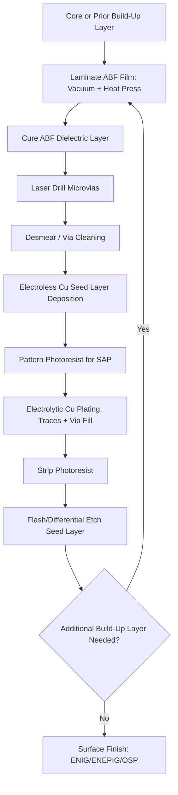

## Organic Substrate Materials: BT Resin and Ajinomoto Build-Up Film

### Overview

**Key Points**

- Organic package substrates form the interconnection platform between the semiconductor die (or interposer) and the printed circuit board (PCB), providing electrical routing, mechanical support, and thermal/environmental protection
- Two materials dominate conventional organic substrate construction: **BT (Bismaleimide Triazine) resin**, historically the primary core laminate material, and **ABF (Ajinomoto Build-up Film)**, the dominant dielectric material for build-up layers in high-layer-count, fine-pitch substrates
- These materials are largely complementary rather than competing: BT resin typically forms the rigid core layer of a substrate, while ABF forms the sequential build-up (SBU) layers on top of and around that core
- Material selection directly affects electrical performance (dielectric constant, loss tangent), thermal reliability (CTE matching, glass transition temperature), and achievable interconnect density (minimum line/space, via pitch)

---

### BT Resin (Bismaleimide Triazine)

**Key Points**

- BT resin is a thermosetting polymer laminate, typically reinforced with woven glass fiber cloth, used predominantly as the **core layer** of organic package substrates
- Chemically, BT resin is a copolymer system combining bismaleimide and triazine (cyanate ester) chemistries, chosen for a favorable balance of thermal stability, dimensional stability, and electrical insulation properties
- BT core substrates have been the workhorse material for flip-chip BGA (FC-BGA) and wire-bond BGA packages since the 1990s–2000s, valued for mechanical rigidity that helps control substrate warpage during assembly and reflow

**Representative BT resin material properties:**

| Property | Typical Value | Significance |
| --- | --- | --- |
| Glass transition temperature ($T_g$) | ~180–220°C | Determines thermal reliability margin above reflow temperatures |
| Dielectric constant ($D_k$) | ~3.8–4.2 (at 1 MHz) | Affects signal propagation delay and impedance |
| Dissipation factor ($D_f$) | ~0.008–0.015 | Affects high-frequency signal loss |
| CTE (x-y plane) | ~13–17 ppm/°C | Must be reasonably matched to die and board CTE to minimize warpage-induced stress |
| Moisture absorption | Low-moderate | Affects reliability during reflow (popcorn cracking risk) |

[Inference] Exact property values vary meaningfully by specific BT resin formulation, glass fabric weave style, and resin-to-glass ratio; the ranges above represent typical industry values for conventional BT laminates rather than a single standardized specification.

**Role in substrate stack-up:**

BT core layers serve as the mechanically rigid foundation onto which build-up layers (typically ABF-based) are sequentially added. The core provides through-hole or via-in-pad connections between top and bottom build-up layers and contributes the majority of the substrate's overall mechanical stiffness, which is critical for controlling warpage in large-body FC-BGA packages used in server and networking applications.

---

### Ajinomoto Build-Up Film (ABF)

**Key Points**

- ABF is a photo-definable or laser-via-definable epoxy-based dielectric film, commercialized by the Japanese company Ajinomoto (originally an amino-acid/food science company that diversified into electronic materials), and has become the de facto industry-standard build-up dielectric for high-performance organic substrates
- Unlike BT resin's role as a rigid glass-reinforced core, ABF is typically an unreinforced (or lightly filled) resin film applied in thin layers to build up sequential redistribution layers above and below the core, enabling much finer line/space geometries than core-layer processing alone permits
- ABF's widespread adoption is closely tied to the rise of flip-chip BGA packaging for high-pin-count, high-performance processors (CPUs, GPUs, FPGAs), where fine-pitch build-up layers are required to fan out die-side microbump pitches to board-side ball pitches

**Representative ABF material properties:**

| Property | Typical Value | Significance |
| --- | --- | --- |
| Dielectric constant ($D_k$) | ~3.0–3.5 (varies by grade) | Lower than BT, benefiting high-speed signal integrity |
| Dissipation factor ($D_f$) | ~0.005–0.010 (varies by grade) | Lower loss supports higher-frequency operation |
| Via formation method | Laser-drilled (UV or CO₂ laser ablation) | Enables microvia diameters well below mechanical drilling limits |
| Achievable line/space | Sub-10µm in advanced grades | Enables fine-pitch RDL fan-out for high-density die interconnect |
| Layer thickness per build-up | Typically 20–40µm per layer | Multiple layers stacked for multi-layer RDL stacks |

[Inference] ABF is supplied in multiple generational grades (often informally referred to by industry participants using Ajinomoto's internal product naming conventions) with differing electrical and mechanical properties optimized for different applications; specific current-generation grade specifications should be verified against Ajinomoto's published material datasheets, as formulations are periodically updated to support finer design rules.

---

### BT vs. ABF: Comparative Role in Substrate Architecture

| Attribute | BT Resin (Core) | ABF (Build-Up) |
| --- | --- | --- |
| Primary function | Rigid mechanical core | Fine-pitch dielectric build-up layers |
| Reinforcement | Glass fiber woven cloth | Typically unreinforced or minimally filled |
| Achievable feature size | Coarser (core-layer processing) | Finer (enables sub-10µm L/S in advanced grades) |
| Via formation | Mechanical drilling (through-hole) or laser | Laser-drilled microvias |
| Primary contribution to reliability | Warpage control, mechanical rigidity | Electrical performance, interconnect density |
| Typical position in stack-up | Center of substrate | Sequential layers above/below core |

---

### Substrate Stack-Up Architecture (Conceptual)

(svg_diagram)

<svg xmlns="http://www.w3.org/2000/svg" viewBox="0 0 640 420" font-family="Helvetica, Arial, sans-serif">
<text x="320" y="26" text-anchor="middle" font-size="17" font-weight="bold" fill="#1a1a1a">BT Core / ABF Build-Up Stack-Up (svg_diagram)</text>

<rect x="220" y="45" width="200" height="35" fill="#607d8b" stroke="#37474f" stroke-width="1.5" />
<text x="320" y="67" text-anchor="middle" font-size="12" fill="#fff">Die (Flip-Chip)</text>

<text x="320" y="90" text-anchor="middle" font-size="10" fill="#555">microbumps</text>

<rect x="150" y="100" width="340" height="22" fill="#a5d6a7" stroke="#2e7d32" stroke-width="1" />
<text x="320" y="115" text-anchor="middle" font-size="10" fill="#1b5e20">ABF Build-Up Layer (RDL + laser microvias)</text>
<rect x="150" y="124" width="340" height="22" fill="#a5d6a7" stroke="#2e7d32" stroke-width="1" />
<text x="320" y="139" text-anchor="middle" font-size="10" fill="#1b5e20">ABF Build-Up Layer (RDL + laser microvias)</text>
<rect x="150" y="148" width="340" height="22" fill="#c8e6c9" stroke="#2e7d32" stroke-width="1" />
<text x="320" y="163" text-anchor="middle" font-size="10" fill="#1b5e20">ABF Build-Up Layer</text>

<rect x="120" y="172" width="400" height="55" fill="#ffcc80" stroke="#e65100" stroke-width="2" />
<text x="320" y="195" text-anchor="middle" font-size="12" font-weight="bold" fill="#e65100">BT Resin Core</text>
<text x="320" y="212" text-anchor="middle" font-size="10" fill="#e65100">(glass-fiber reinforced, through-hole vias)</text>

<rect x="150" y="229" width="340" height="22" fill="#c8e6c9" stroke="#2e7d32" stroke-width="1" />
<text x="320" y="244" text-anchor="middle" font-size="10" fill="#1b5e20">ABF Build-Up Layer</text>
<rect x="150" y="253" width="340" height="22" fill="#a5d6a7" stroke="#2e7d32" stroke-width="1" />
<text x="320" y="268" text-anchor="middle" font-size="10" fill="#1b5e20">ABF Build-Up Layer (RDL + laser microvias)</text>
<rect x="150" y="277" width="340" height="22" fill="#a5d6a7" stroke="#2e7d32" stroke-width="1" />
<text x="320" y="292" text-anchor="middle" font-size="10" fill="#1b5e20">ABF Build-Up Layer (RDL + laser microvias)</text>

<text x="320" y="312" text-anchor="middle" font-size="10" fill="#555">BGA solder balls</text>

<circle cx="180" cy="330" r="8" fill="`#90a4ae`" />

<circle cx="230" cy="330" r="8" fill="`#90a4ae`" />

<circle cx="280" cy="330" r="8" fill="`#90a4ae`" />

<circle cx="330" cy="330" r="8" fill="`#90a4ae`" />

<circle cx="380" cy="330" r="8" fill="`#90a4ae`" />

<circle cx="430" cy="330" r="8" fill="`#90a4ae`" />

<circle cx="460" cy="330" r="8" fill="`#90a4ae`" />

<rect x="120" y="345" width="400" height="30" fill="#4e342e" stroke="#3e2723" stroke-width="1.5" />
<text x="320" y="365" text-anchor="middle" font-size="11" fill="#fff">System PCB</text>

<rect x="40" y="400" width="14" height="14" fill="#ffcc80" stroke="#e65100" />
<text x="60" y="411" font-size="10" fill="#333">BT Resin Core</text>
<rect x="200" y="400" width="14" height="14" fill="#a5d6a7" stroke="#2e7d32" />
<text x="220" y="411" font-size="10" fill="#333">ABF Build-Up Layers</text>
</svg>

---

### Manufacturing Process Flow: ABF Build-Up Layer Formation

**Key Points**

- ABF is typically applied as a pre-formed film laminated onto the core or previous build-up layer under heat and vacuum pressure, rather than liquid-cast
- Laser via formation (commonly UV or CO₂ laser ablation) creates microvias through the cured ABF layer at target locations for inter-layer connection
- Copper metallization (typically via semi-additive process, SAP) forms the redistribution traces and via fill

---

### Reliability Considerations

**Key Points**

- **CTE mismatch management** — the composite BT core + ABF build-up stack must maintain reasonable CTE matching relative to both the silicon die (CTE ~2.6 ppm/°C) and the system PCB (CTE ~15–17 ppm/°C typical FR-4), since large mismatches drive warpage and solder joint fatigue over thermal cycling
- **Warpage control at panel/substrate level** — as substrate body sizes grow (driven by larger die and multi-die packages), BT core rigidity becomes increasingly important for maintaining flatness through the reflow process; thinner or more flexible cores exacerbate warpage risk in large-body FC-BGA substrates
- **Moisture sensitivity** — both BT and ABF materials absorb some moisture in ambient storage; substrates are subject to moisture sensitivity level (MSL) classification and require controlled bake-out procedures prior to reflow to avoid delamination ("popcorning") from trapped moisture vaporization
- **Adhesion and delamination risk at Cu/dielectric interfaces** — repeated thermal cycling stresses the ABF-to-copper interface; surface roughening treatments and adhesion-promotion chemistries are commonly applied to ABF surfaces prior to metallization to mitigate delamination risk

---

### Trends and Evolving Requirements

**Key Points**

- As package sizes grow to accommodate multi-die/chiplet designs and larger reticle-exceeding packages, substrate designers face increasing pressure on core rigidity, flatness, and warpage control — motivating exploration of alternative core materials (e.g., glass-core substrates) as a potential complement or eventual alternative to BT resin in the highest-density, largest-body applications
- ABF formulations continue to evolve toward finer achievable line/space geometries to keep pace with shrinking die-side microbump pitches, particularly for high-performance computing and AI accelerator packages requiring extremely high I/O density fan-out
- [Unverified] The pace and specific roadmap for next-generation ABF grades and potential BT-alternative core materials are proprietary to material suppliers and package integrators; readers should consult current Ajinomoto and substrate manufacturer technical literature for the latest generational specifications, as this is an actively evolving materials domain.

---

**Related Topics**

- Glass-Core Substrate Materials as an Emerging BT Alternative
- Semi-Additive Process (SAP) for Fine-Pitch Copper Metallization
- Substrate Warpage Characterization and Mitigation Techniques
- Flip-Chip BGA (FC-BGA) Package Architecture
- Moisture Sensitivity Level (MSL) Classification and Bake-Out Procedures
- Laser Via Drilling Techniques for Microvia Formation
- Surface Finish Technologies (ENIG, ENEPIG, OSP) for Substrate Bond Pads
- Dielectric Loss and Signal Integrity in High-Speed Substrate Design