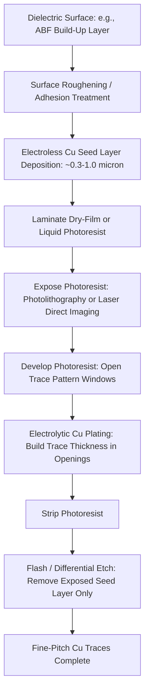

## Substrate Fine-Line and Fine-Space Scaling and Semi-Additive Processes

### Overview

**Key Points**

- Substrate fine-line/fine-space (L/S) scaling refers to the continuous reduction of copper trace width and inter-trace spacing on package substrates, driven by the need to fan out increasingly fine die-side microbump pitches to board-side interconnects
- Semi-additive process (SAP) technology is the dominant manufacturing method enabling modern fine-line substrates, having largely displaced older subtractive (etch-based) copper patterning for high-density layers
- Achievable line/space geometry is a key differentiator between substrate performance tiers: standard PCB-grade substrates typically achieve L/S in the tens of micrometers, while advanced package substrate build-up layers using SAP now routinely achieve single-digit micrometer geometries
- Continued scaling is constrained by a combination of photolithographic resolution, copper adhesion/seed-layer control, and dielectric material (typically ABF) surface roughness characteristics

---

### Why Fine-Line Scaling Matters

**Key Points**

- Modern flip-chip dies present microbump or copper-pillar pitches that have scaled well below 100µm, and in advanced 2.5D/3D configurations, hybrid bonding pitches now reach single-digit micrometers at the die level
- The substrate must fan out this fine die-side pitch to the coarser board-side ball pitch (typically hundreds of micrometers to ~1mm), and each build-up layer's achievable L/S directly determines how many routing layers are needed to accomplish this fan-out
- Insufficient L/S scaling forces designers to add build-up layers to route the same signal count, increasing substrate cost, package thickness, and electrical parasitic effects (additional via stubs, longer signal paths)
- Finer L/S also directly enables higher I/O density per unit substrate area, which is increasingly critical for high-performance computing and AI accelerator packages with very high pin counts

**Illustrative relationship between die pitch and required substrate fan-out layers:**

| Die-Side Bump Pitch | Board-Side Ball Pitch | Approx. Build-Up Layers Needed (illustrative) |
| --- | --- | --- |
| ~150µm (mature flip-chip) | ~1.0mm | 2–4 |
| ~80–100µm (advanced flip-chip) | ~0.8mm | 4–6 |
| ~40–55µm (fine-pitch flip-chip/RDL) | ~0.5–0.8mm | 6–10 |
| <40µm (advanced RDL/bridge-adjacent) | ~0.5mm | 8+ |

[Inference] The layer counts shown are illustrative approximations for routing feasibility and vary substantially based on signal count, power/ground plane requirements, and specific design rules; they are not a fixed industry formula.

---

### Semi-Additive Process (SAP): Core Methodology

**Key Points**

- SAP contrasts with the older **subtractive process**, in which a full-thickness copper foil is laminated onto the dielectric and then selectively etched away to leave the desired trace pattern — a method that struggles with fine geometries because etching undercuts trace sidewalls proportionally to copper thickness
- In SAP, a thin copper seed layer is first deposited (typically via electroless plating or sputtering) across the entire dielectric surface, after which a patterned photoresist defines *only* the areas where copper traces should form, and electrolytic copper plating builds up trace thickness selectively within those openings
- Because SAP builds traces additively within resist openings rather than etching away bulk copper, it avoids the undercut and sidewall taper problems inherent to subtractive etching, enabling substantially finer L/S at a given copper thickness
- After electrolytic plating and resist stripping, only the thin seed layer remains exposed between traces, which is removed via a brief "flash etch" or differential etch step — since the seed layer is far thinner than the plated traces, this step removes minimal material from the traces themselves

**Standard SAP process sequence:**

---

### SAP vs. Subtractive Process: Comparative Capability

| Attribute | Subtractive (Etch-Based) | Semi-Additive Process (SAP) |
| --- | --- | --- |
| Starting copper | Full-thickness foil laminated | Thin seed layer (~0.3–1.0µm) |
| Pattern formation | Etch away unwanted copper | Plate copper only where needed |
| Sidewall profile | Tapered/undercut (worsens with thickness) | Near-vertical, well-controlled |
| Practical fine-line limit | ~30–50µm L/S (conventional) | Sub-10µm L/S achievable in advanced grades |
| Copper thickness control | Limited by etch uniformity across panel | Precisely controlled via plating time/current |
| Typical application tier | Standard PCB, coarser substrate layers | Advanced package substrate build-up layers |

---

### Photolithography and Exposure Technology for Fine-Line Patterning

**Key Points**

- **Dry-film photoresist lamination** remains common for coarser geometries, while **liquid photoresist (LPR)** is increasingly used for the finest-pitch layers due to better thickness uniformity and resolution control over the non-planar, roughened dielectric surfaces typical of build-up substrates
- **Laser Direct Imaging (LDI)** has substantially displaced traditional photomask-based exposure for advanced substrate fine-line layers, since it avoids photomask-to-panel registration error accumulation across large-format, dimensionally variable substrate panels, and enables layer-to-layer alignment correction on a per-panel basis
- Exposure resolution, resist thickness, and resist aspect ratio (height-to-width of the resist opening) jointly bound the finest achievable trace width — as target L/S shrinks, resist thickness must also be reduced to maintain a processable aspect ratio, which in turn constrains achievable plated copper thickness

---

### Key Scaling Limiters

**Key Points**

- **Dielectric surface roughness** — ABF and similar build-up dielectrics are often deliberately roughened to promote copper adhesion (mechanical interlocking), but higher roughness increases high-frequency signal loss and can limit the minimum achievable trace width, since fine traces require correspondingly controlled, often reduced, surface roughness — creating a direct tension between adhesion reliability and fine-line/electrical performance goals
- **Seed layer removal precision** — the differential/flash etch step that removes exposed seed copper between traces must be tightly controlled; excessive etch time attacks the sidewalls of the already-plated fine traces, while insufficient etch leaves residual seed copper causing shorts between adjacent traces
- **Panel-level dimensional stability** — as panel formats grow (see panel-level packaging trends), maintaining consistent dielectric shrinkage/expansion and layer-to-layer registration across a larger working area becomes progressively more difficult, directly constraining achievable fine-line yield at scale
- **Via-to-trace interaction** — at the finest geometries, laser-drilled microvia land pad size and trace width scaling must be co-optimized, since via capture pads consume routing area that competes directly with fine-line trace routing channels

---

### Cross-Section: Fine-Line Trace Geometry (Conceptual)

(svg_diagram)

<svg xmlns="http://www.w3.org/2000/svg" viewBox="0 0 600 320" font-family="Helvetica, Arial, sans-serif">
<text x="300" y="26" text-anchor="middle" font-size="16" font-weight="bold" fill="#1a1a1a">SAP Fine-Line Cross-Section (svg_diagram)</text>

<rect x="60" y="200" width="480" height="60" fill="#c8e6c9" stroke="#2e7d32" stroke-width="1.5" />
<text x="300" y="235" text-anchor="middle" font-size="11" fill="#1b5e20">ABF Dielectric (roughened surface)</text>

<rect x="60" y="195" width="480" height="6" fill="#ffb74d" stroke="#e65100" stroke-width="0.5" />

<rect x="90" y="160" width="28" height="35" fill="#d84315" stroke="#bf360c" stroke-width="1" />
<rect x="160" y="160" width="28" height="35" fill="#d84315" stroke="#bf360c" stroke-width="1" />
<rect x="230" y="160" width="28" height="35" fill="#d84315" stroke="#bf360c" stroke-width="1" />
<rect x="300" y="160" width="28" height="35" fill="#d84315" stroke="#bf360c" stroke-width="1" />

<line x1="118" y1="180" x2="160" y2="180" stroke="#333" stroke-width="1" stroke-dasharray="3,2" />
<text x="139" y="175" text-anchor="middle" font-size="9" fill="#333">Space (S)</text>
<line x1="90" y1="205" x2="118" y2="205" stroke="#333" stroke-width="1" stroke-dasharray="3,2" />
<text x="104" y="215" text-anchor="middle" font-size="9" fill="#333">Line (L)</text>

<text x="430" y="145" text-anchor="middle" font-size="10" fill="#555" font-style="italic">Subtractive (tapered):</text>

<polygon points="400,160 445,160 435,195 410,195" fill="`#90a4ae`" stroke="`#455a64`" stroke-width="1" />

<text x="470" y="180" font-size="9" fill="#555">undercut</text>

<rect x="60" y="280" width="14" height="14" fill="#d84315" />
<text x="80" y="291" font-size="10" fill="#333">Plated Cu Trace (SAP)</text>
<rect x="220" y="280" width="14" height="14" fill="#ffb74d" />
<text x="240" y="291" font-size="10" fill="#333">Cu Seed Layer</text>
<rect x="360" y="280" width="14" height="14" fill="#90a4ae" />
<text x="380" y="291" font-size="10" fill="#333">Subtractive-Etched Trace (tapered)</text>
</svg>

---

### Electrical Performance Implications of Fine-Line Scaling

**Key Points**

- Trace resistance scales inversely with cross-sectional area; as line width shrinks for a given plated thickness, DC resistance per unit length increases, which becomes a meaningful design constraint for power delivery network (PDN) traces even as it remains manageable for low-current signal traces
- Trace width and spacing directly set characteristic impedance for controlled-impedance signal routing; fine-line scaling requires corresponding dielectric thickness and $D_k$ co-optimization to maintain target impedance (commonly 50Ω single-ended or 85–100Ω differential) as geometries shrink
- Signal integrity trade-offs mean fine-line scaling is not purely beneficial in isolation — routing density gains must be balanced against increased resistive loss and tighter impedance control tolerances

The characteristic impedance of a microstrip-like fine-line trace can be approximated as:

$$Z_0 \approx \frac{87}{\sqrt{\varepsilon_r + 1.41}} \ln\left(\frac{5.98h}{0.8w + t}\right)$$

where $Z_0$ is characteristic impedance, $\varepsilon_r$ is the dielectric constant of the surrounding material, $h$ is the dielectric height above the reference plane, $w$ is trace width, and $t$ is trace thickness. [Inference] This is a standard simplified microstrip impedance approximation commonly used for first-order design estimation; precise substrate impedance modeling for production designs requires full 2D/3D field-solver simulation accounting for surface roughness, non-uniform dielectric, and adjacent trace coupling effects not captured by this closed-form approximation.

---

### Process Control and Yield Considerations

**Key Points**

- **Line width/space uniformity across panel** — as panel formats grow (per panel-level packaging trends), maintaining consistent L/S across the full working area becomes progressively harder due to exposure system field limitations, dielectric shrinkage variation, and plating current density non-uniformity
- **Defect classes specific to fine-line SAP** — include resist scumming (incomplete resist removal in narrow openings), plating voids in narrow trace openings, seed layer residue causing micro-shorts, and trace-to-trace bridging from over-plating
- **Metrology requirements** — fine-line production increasingly requires automated optical inspection (AOI) with resolution capable of reliably detecting sub-micron-scale defects at production throughput, alongside cross-sectional SEM sampling for periodic process validation

---

**Related Topics**

- Ajinomoto Build-Up Film (ABF) Material Properties and Surface Treatment
- Laser Direct Imaging (LDI) Systems for Substrate Patterning
- Controlled-Impedance Design for Package Substrate Routing
- Panel-Level Processing and Dimensional Stability Challenges
- Power Delivery Network (PDN) Design in Fine-Pitch Substrates
- Automated Optical Inspection (AOI) for Substrate Defect Detection
- Redistribution Layer (RDL) Design Rules for Advanced Packaging
- Copper Electroplating Process Control and Current Density Uniformity