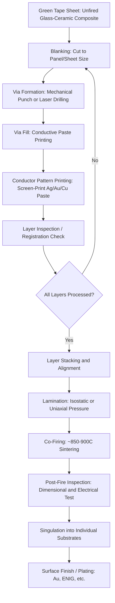

## Ceramic and Low-Temperature Co-Fired Ceramic Substrates

### Overview

**Key Points**

- Ceramic substrates provide an alternative to organic (BT/ABF-based) package substrates, offering superior thermal, mechanical, and electrical properties for applications demanding high reliability, hermeticity, or extreme thermal management
- **Low-Temperature Co-Fired Ceramic (LTCC)** is the dominant ceramic substrate technology for multilayer packaging, distinguished from **High-Temperature Co-Fired Ceramic (HTCC)** by its lower sintering temperature and compatibility with high-conductivity metallization (silver, gold, copper) rather than tungsten/molybdenum
- Ceramic substrates are especially prevalent in RF/microwave modules, automotive power electronics, aerospace/defense, and MEMS/sensor packaging — domains where hermeticity, CTE matching to specific die materials, or extreme temperature operation outweigh the cost and processing advantages of organic substrates
- LTCC's ability to embed passive components (resistors, capacitors, inductors) directly within the ceramic layers makes it particularly valuable for RF module miniaturization

---

### LTCC vs. HTCC: Fundamental Distinction

**Key Points**

- **HTCC** uses alumina (Al₂O₃) or aluminum nitride (AlN) ceramic layers co-fired at temperatures typically around 1500–1600°C, which restricts internal metallization to refractory metals such as tungsten (W) or molybdenum-manganese (Mo-Mn) that can withstand the firing temperature without melting
- **LTCC** uses glass-ceramic composite tape formulations that sinter at substantially lower temperatures, typically in the 850–900°C range, which is below the melting point of silver, gold, and copper — enabling these high-conductivity metals to be co-fired directly within the ceramic structure
- The lower firing temperature and high-conductivity metallization give LTCC significantly better electrical conductivity for internal traces compared to HTCC's tungsten-based metallization, directly benefiting RF/microwave insertion loss performance

**Comparative properties:**

| Attribute | HTCC | LTCC |
| --- | --- | --- |
| Firing temperature | ~1500–1600°C | ~850–900°C |
| Typical ceramic base | Alumina (Al₂O₃), AlN | Glass-ceramic composite |
| Internal metallization | Tungsten, Mo-Mn (refractory) | Silver, gold, copper (high-conductivity) |
| Conductor resistivity | Higher | Lower |
| Mechanical strength | Generally higher | Moderate |
| Embedded passive capability | Limited | Extensive (R, L, C embeddable) |
| Typical application | High-reliability hermetic packages, substrates requiring maximum mechanical strength | RF/microwave modules, multilayer passives integration |
| Relative cost | Higher (higher-temp processing, refractory metals) | Lower |

---

### LTCC Manufacturing Process

**Key Points**

- LTCC fabrication begins with unfired ceramic "green tape" — a flexible glass-ceramic/organic binder composite sheet cast from slurry and supplied in roll or sheet form
- Each layer is individually processed (via formation, metallization printing) before the full layer stack is aligned, laminated under pressure, and co-fired as a single monolithic structure
- Because all layers are fired together in a single co-firing step, internal via and trace registration accuracy across layers depends heavily on green tape dimensional stability and shrinkage control during firing

**Standard LTCC process sequence:**

---

### Embedded Passive Components in LTCC

**Key Points**

- LTCC's multilayer co-fired structure enables **buried/embedded passive components** — resistors, capacitors, and inductors formed directly within internal ceramic layers rather than as discrete surface-mounted components
- Embedded capacitors are typically formed using high-dielectric-constant ceramic layer formulations sandwiched between internal electrode patterns; embedded inductors are formed as spiral or meander conductor patterns across one or more internal layers; embedded resistors use resistive paste materials printed on internal layers
- This embedding capability is a primary driver for LTCC adoption in RF front-end modules, filters, and antenna structures, where minimizing surface-mounted discrete component count directly reduces module footprint and improves high-frequency performance by shortening interconnect parasitic paths

**Representative embedded passive types and typical use:**

| Passive Type | Formation Method | Typical Application |
| --- | --- | --- |
| Embedded resistor | Resistive paste on internal layer | Termination resistors, bias networks |
| Embedded capacitor | High-$k$ dielectric layer + electrode plates | RF coupling/decoupling, filter elements |
| Embedded inductor | Spiral/meander conductor across layers | RF matching networks, filter elements |
| Cavity structures | Co-fired void formation | Die cavity for flip-chip or wire-bond die attach within the substrate body |

---

### Key Material and Electrical Properties

**Key Points**

- LTCC dielectric constants vary substantially by formulation, generally ranging from approximately 5 to over 90 depending on whether the tape is optimized for low-loss RF transmission or high-capacitance embedded structures
- Low dielectric loss tangent is a primary selection driver for RF/microwave applications, since insertion loss in transmission structures scales directly with loss tangent at a given frequency
- CTE of LTCC materials is generally well-matched to alumina and can be formulated to approximate silicon or GaAs die CTE more closely than typical organic substrates, reducing thermomechanical stress at die attach interfaces

**Representative property ranges:**

| Property | Typical LTCC Range | Significance |
| --- | --- | --- |
| Dielectric constant ($D_k$) | ~5–90+ (formulation dependent) | Low-$D_k$ tapes for RF transmission; high-$D_k$ tapes for embedded capacitors |
| Dissipation factor ($D_f$) | ~0.001–0.004 (low-loss grades) | Substantially lower than organic substrates, benefiting high-frequency insertion loss |
| CTE | ~5–8 ppm/°C (formulation dependent) | Closer match to silicon/GaAs than typical organic substrates |
| Thermal conductivity | ~2–5 W/m·K (higher with AlN-loaded formulations) | Better heat spreading than standard organic substrates |
| Camber/shrinkage control | Requires formulation-specific shrinkage compensation | Critical for multilayer registration accuracy |

[Inference] These ranges reflect commonly cited industry values across multiple LTCC tape system vendors; specific commercial tape systems vary significantly, and designers should consult specific vendor datasheets for a given tape system's precise properties.

---

### Comparative Cross-Section: Ceramic vs. Organic Substrate (Conceptual)

(svg_diagram)

<svg xmlns="http://www.w3.org/2000/svg" viewBox="0 0 640 340" font-family="Helvetica, Arial, sans-serif">
<text x="320" y="26" text-anchor="middle" font-size="16" font-weight="bold" fill="#1a1a1a">LTCC vs Organic Substrate Cross-Section (svg_diagram)</text>

<text x="150" y="55" text-anchor="middle" font-size="12" font-weight="bold" fill="`#4527a0`">LTCC (Co-Fired)</text>

<rect x="60" y="65" width="180" height="20" fill="`#d1c4e9`" stroke="`#4527a0`" stroke-width="1" />

<text x="150" y="79" text-anchor="middle" font-size="9" fill="`#311b92`">Ceramic Layer + Ag traces</text>

<rect x="60" y="87" width="180" height="20" fill="`#b39ddb`" stroke="`#4527a0`" stroke-width="1" />

<text x="150" y="101" text-anchor="middle" font-size="9" fill="`#311b92`">Embedded Capacitor Layer</text>

<rect x="60" y="109" width="180" height="20" fill="`#d1c4e9`" stroke="`#4527a0`" stroke-width="1" />

<text x="150" y="123" text-anchor="middle" font-size="9" fill="`#311b92`">Ceramic Layer + Ag traces</text>

<rect x="60" y="131" width="180" height="20" fill="`#b39ddb`" stroke="`#4527a0`" stroke-width="1" />

<text x="150" y="145" text-anchor="middle" font-size="9" fill="`#311b92`">Embedded Inductor Layer</text>

<rect x="60" y="153" width="180" height="20" fill="`#d1c4e9`" stroke="`#4527a0`" stroke-width="1" />

<text x="150" y="167" text-anchor="middle" font-size="9" fill="`#311b92`">Ceramic Layer + Ag traces</text>

<rect x="60" y="175" width="180" height="30" fill="`#9575cd`" stroke="`#4527a0`" stroke-width="1.5" />

<text x="150" y="193" text-anchor="middle" font-size="9" fill="#fff">Co-Fired Monolithic Body</text>

<text x="150" y="220" text-anchor="middle" font-size="9" fill="#555">Single simultaneous firing</text>

<line x1="320" y1="45" x2="320" y2="230" stroke="#999" stroke-width="1" stroke-dasharray="4,3" />

<text x="480" y="55" text-anchor="middle" font-size="12" font-weight="bold" fill="`#e65100`">Organic (BT/ABF)</text>

<rect x="400" y="65" width="180" height="18" fill="`#a5d6a7`" stroke="`#2e7d32`" stroke-width="1" />

<text x="490" y="78" text-anchor="middle" font-size="9" fill="`#1b5e20`">ABF Build-Up Layer</text>

<rect x="400" y="85" width="180" height="18" fill="`#c8e6c9`" stroke="`#2e7d32`" stroke-width="1" />

<text x="490" y="98" text-anchor="middle" font-size="9" fill="`#1b5e20`">ABF Build-Up Layer</text>

<rect x="400" y="105" width="180" height="45" fill="`#ffcc80`" stroke="`#e65100`" stroke-width="1.5" />

<text x="490" y="130" text-anchor="middle" font-size="10" fill="`#e65100`">BT Resin Core</text>

<rect x="400" y="152" width="180" height="18" fill="`#c8e6c9`" stroke="`#2e7d32`" stroke-width="1" />

<text x="490" y="165" text-anchor="middle" font-size="9" fill="`#1b5e20`">ABF Build-Up Layer</text>

<rect x="400" y="172" width="180" height="18" fill="`#a5d6a7`" stroke="`#2e7d32`" stroke-width="1" />

<text x="490" y="185" text-anchor="middle" font-size="9" fill="`#1b5e20`">ABF Build-Up Layer</text>

<text x="490" y="220" text-anchor="middle" font-size="9" fill="#555">Sequential build-up layers</text>

</svg>

---

### Application Domains

**Key Points**

- **RF/microwave modules** — LTCC is heavily used in cellular front-end modules, filters, couplers, and antenna structures where low dielectric loss and embedded passive integration directly reduce module size and improve performance
- **Automotive and power electronics** — ceramic substrates (both LTCC and thick-film-on-alumina variants) are used where high thermal conductivity, CTE stability, and long-term reliability under thermal cycling are required, such as engine-compartment electronics and power module substrates
- **Aerospace/defense and hermetic packaging** — ceramic packages provide inherent hermeticity (impermeability to moisture) that organic substrates cannot match without additional encapsulation, making them preferred for applications requiring guaranteed long-term environmental sealing
- **MEMS and sensor packaging** — ceramic cavity packages are commonly used for MEMS devices requiring a protected, often hermetically sealed cavity environment around a mechanically sensitive structure

---

### Comparison to Organic Substrates: Trade-Off Summary

| Attribute | Ceramic (LTCC/HTCC) | Organic (BT/ABF) |
| --- | --- | --- |
| Achievable line/space | Coarser (typically tens of microns) | Finer (sub-10µm in advanced SAP grades) |
| Thermal conductivity | Higher (especially AlN-based) | Lower |
| Hermeticity | Inherent | Requires additional encapsulation |
| Embedded passive integration | Extensive, mature | Limited, more constrained |
| Cost | Higher (specialized processing, materials) | Lower (higher-volume, mature infrastructure) |
| Substrate size scalability | More limited (firing shrinkage/camber control) | Better suited to large-format panel scaling |
| Typical volume application | RF modules, automotive, aerospace/defense | Consumer electronics, HPC, AI accelerators |

---

### Manufacturing and Reliability Considerations

**Key Points**

- **Shrinkage control** — LTCC green tape shrinks during co-firing (typically on the order of 10–20% in the x-y plane, formulation-dependent), and this shrinkage must be precisely characterized and compensated in the original layer artwork to achieve accurate final feature registration across a multilayer stack
- **Camber and warpage** — differential shrinkage between layers with different metallization loading or embedded passive density can induce substrate camber; via and trace design must account for this during layout to avoid excessive warpage in the fired part
- **Via registration across layers** — since all layers are fired simultaneously as a monolithic structure, inter-layer via misalignment cannot be corrected after firing, making pre-fire dimensional control and tooling accuracy critical to yield
- **Thermal cycling reliability** — the CTE match between LTCC and common die materials (silicon, GaAs) generally provides good long-term thermal cycling reliability for die-attach interfaces, though the ceramic's inherent brittleness (versus organic substrate flexibility) requires careful mechanical design to avoid cracking under mechanical shock or board-level flexure

---

**Related Topics**

- RF Front-End Module Design Using LTCC Integration
- HTCC Hermetic Packaging for Aerospace/Defense Applications
- Embedded Passive Component Design Rules in Multilayer Ceramics
- Thick-Film-on-Alumina Substrate Technology
- Ceramic-to-Organic Hybrid Substrate Approaches
- CTE Matching Strategies for Die Attach Reliability
- Green Tape Shrinkage Characterization and Compensation
- Thermal Management in Power Electronics Substrate Selection