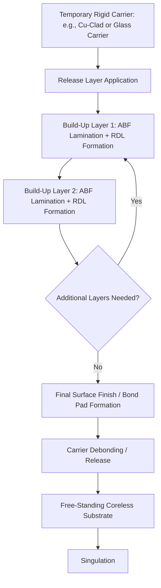
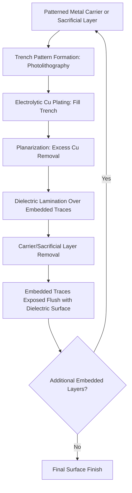

## Coreless and Embedded-Trace Substrate Architectures

### Overview

**Key Points**

- Coreless substrates eliminate the rigid core layer (traditionally BT resin) found in conventional substrate stack-ups, building the entire structure from sequential build-up (SBU) layers alone
- **Embedded-Trace Substrate (ETS)** technology, most prominently commercialized by Unimicron and adopted widely for smartphone application processor packaging, embeds copper traces *within* the dielectric layer surface rather than plating them on top of it
- Both architectures address different but related goals: coreless designs primarily target reduced substrate thickness and electrical performance improvement by removing the thick, higher-loss core layer, while ETS primarily targets finer line/space and improved trace reliability through a fundamentally different metallization approach
- These are complementary rather than mutually exclusive technologies — ETS techniques can be applied within either cored or coreless stack-ups

---

### Coreless Substrate Architecture

**Key Points**

- Conventional substrates use a BT resin core as the mechanically rigid foundation, with ABF build-up layers added sequentially above and below; a coreless substrate instead builds the entire multilayer structure directly from build-up layers on a temporary carrier, which is removed after lamination
- Eliminating the core reduces overall substrate thickness substantially, since the BT core layer (often the thickest single element in a conventional stack-up) is removed entirely
- Reduced thickness directly shortens via lengths and overall signal path length through the substrate, reducing parasitic inductance and improving high-frequency electrical performance — a significant driver for high-performance computing and RF applications
- The absence of a rigid core, however, removes the primary source of mechanical stiffness in the substrate, making warpage control substantially more challenging, particularly for large-body substrates used in server/HPC-class packages

**Conceptual coreless substrate build process (carrier-based):**

**Comparison: Cored vs. Coreless substrate:**

| Attribute | Cored (BT Core + ABF Build-Up) | Coreless |
| --- | --- | --- |
| Overall thickness | Thicker (core adds significant bulk) | Thinner (core eliminated) |
| Mechanical rigidity | Higher (core provides stiffness) | Lower (relies on build-up layer stack alone) |
| Warpage control difficulty | Moderate | Higher, requires careful stack symmetry |
| Electrical path length | Longer (through-core vias add length) | Shorter (reduced parasitic inductance) |
| Manufacturing complexity | Established, mature process | Requires carrier-based process and precise debonding control |
| Typical application | General-purpose FC-BGA, larger-body packages | High-performance, thickness-sensitive, RF-sensitive applications |

---

### Warpage Management in Coreless Designs

**Key Points**

- Without a rigid core to anchor overall substrate flatness, coreless substrates rely heavily on **stack symmetry** — designing the build-up layer sequence to be as close to mirror-symmetric above and below the notional center plane as possible, minimizing net bending moment from differential layer shrinkage/CTE mismatch
- Temporary carrier selection and debonding process control are critical: the carrier must provide sufficient rigidity during build-up processing while allowing clean, low-stress release once the structure is complete, since debonding-induced stress can itself introduce warpage at the moment of carrier removal
- Coreless designs are generally more thickness- and warpage-sensitive to panel/substrate size than cored designs, which historically has constrained coreless adoption toward small-to-moderate body-size, thickness-critical applications (e.g., mobile application processors) rather than the largest server-class packages, though this constraint has been progressively addressed through improved process control

[Inference] The relative maturity and size-scalability of coreless processes vary meaningfully by substrate manufacturer and specific process generation; current-state capability at any given supplier should be verified against that supplier's published design rules rather than assumed from general industry trends.

---

### Embedded-Trace Substrate (ETS) Architecture

**Key Points**

- Conventional SAP-based build-up layers form copper traces that sit *on top of* the dielectric surface, with the trace's full height protruding above the dielectric plane
- ETS instead forms a recessed trench in the dielectric (or on a patterned carrier that is later removed) and plates/fills copper into that trench, so the finished trace sits *embedded within* the dielectric surface, typically with the trace top surface roughly flush with, or only slightly proud of, the surrounding dielectric
- This embedded geometry provides mechanical advantages: buried traces are less susceptible to delamination-inducing stress concentration at the trace/dielectric interface edge (a common failure initiation point in surface-mounted SAP traces) and can support finer L/S with improved sidewall control since the trench itself defines trace geometry precisely

**Conceptual ETS process sequence:**

---

### ETS vs. Conventional SAP Surface Traces: Cross-Section Comparison

(svg_diagram)

<svg xmlns="http://www.w3.org/2000/svg" viewBox="0 0 600 300" font-family="Helvetica, Arial, sans-serif">
<text x="300" y="26" text-anchor="middle" font-size="16" font-weight="bold" fill="#1a1a1a">Surface SAP Trace vs Embedded Trace (svg_diagram)</text>

<text x="150" y="55" text-anchor="middle" font-size="12" font-weight="bold" fill="`#e65100`">Surface SAP Trace</text>

<rect x="70" y="150" width="160" height="60" fill="`#c8e6c9`" stroke="`#2e7d32`" stroke-width="1.5" />

<text x="150" y="185" text-anchor="middle" font-size="9" fill="`#1b5e20`">Dielectric</text>

<rect x="100" y="120" width="30" height="30" fill="`#d84315`" stroke="`#bf360c`" stroke-width="1" />

<rect x="170" y="120" width="30" height="30" fill="`#d84315`" stroke="`#bf360c`" stroke-width="1" />

<text x="150" y="230" text-anchor="middle" font-size="9" fill="#555">Trace protrudes above surface</text>

<text x="450" y="55" text-anchor="middle" font-size="12" font-weight="bold" fill="`#4527a0`">Embedded Trace (ETS)</text>

<rect x="370" y="130" width="160" height="80" fill="`#d1c4e9`" stroke="`#4527a0`" stroke-width="1.5" />

<text x="450" y="165" text-anchor="middle" font-size="9" fill="`#311b92`">Dielectric</text>

<rect x="400" y="150" width="30" height="30" fill="`#7e57c2`" stroke="`#4527a0`" stroke-width="1" />

<rect x="470" y="150" width="30" height="30" fill="`#7e57c2`" stroke="`#4527a0`" stroke-width="1" />

<line x1="380" y1="150" x2="520" y2="150" stroke="`#4527a0`" stroke-width="1" stroke-dasharray="3,2" />

<text x="450" y="230" text-anchor="middle" font-size="9" fill="#555">Trace flush within dielectric</text>

</svg>

---

### Comparative Trace Attributes: SAP Surface vs. ETS

| Attribute | Surface SAP Trace | Embedded-Trace (ETS) |
| --- | --- | --- |
| Trace position relative to dielectric | Protrudes above surface | Recessed/flush within dielectric |
| Sidewall definition mechanism | Photoresist opening (plating boundary) | Trench geometry (etched/patterned mold) |
| Delamination stress concentration | Higher (exposed trace edge/interface) | Lower (trace supported on more sides) |
| Achievable fine-line capability | Sub-10µm in advanced grades | Comparable or finer, with improved sidewall control |
| Surface planarity after build-up | Trace topology creates surface unevenness | Generally flatter surface post-lamination |
| Process complexity | Mature, widely established | Requires trench/carrier-based patterning step, additional planarization |

---

### Reliability and Manufacturing Considerations

**Key Points**

- **Coreless-specific risks:** carrier debonding-induced warpage, reduced mechanical robustness during handling/transport prior to final package assembly, and greater sensitivity to build-up layer CTE symmetry
- **ETS-specific risks:** trench sidewall roughness/definition quality directly determines final trace fidelity (unlike SAP, where photoresist opening quality plays this role), and planarization step control is critical to avoid excess copper (causing shorts) or insufficient fill (causing open circuits or resistance variation)
- **Combined coreless + ETS designs** are increasingly used together in advanced mobile and high-performance packages, capturing both the thickness/electrical benefits of coreless construction and the fine-line/reliability benefits of embedded trace formation, though this combination further compounds process control requirements across both dimensions simultaneously

---

### Application Drivers

**Key Points**

- **Mobile application processor packaging** — thickness reduction is a primary driver in smartphone/tablet form factors, making coreless and ETS technologies particularly well-suited to this segment, where ETS has seen substantial commercial adoption
- **High-performance computing / AI accelerator packaging** — reduced via length and improved high-frequency electrical performance from coreless construction is increasingly relevant as signal speeds increase, though warpage control at large body sizes remains a more significant engineering challenge in this segment than in mobile form factors
- **RF and high-frequency modules** — reduced parasitic inductance from shorter, more direct signal paths in coreless designs benefits RF performance, complementing the broader industry trend toward electrical-performance-optimized substrate architectures

---

**Related Topics**

- BT Resin and ABF Build-Up Material Fundamentals
- Semi-Additive Process (SAP) Methodology
- Substrate Warpage Characterization and Symmetric Stack Design
- Temporary Carrier and Debonding Technologies
- Panel-Level Processing Considerations for Thin Substrates
- Fine-Line and Fine-Space Scaling Limits
- Via Design and Parasitic Inductance Reduction Strategies
- Mobile Application Processor Package Architecture Trends