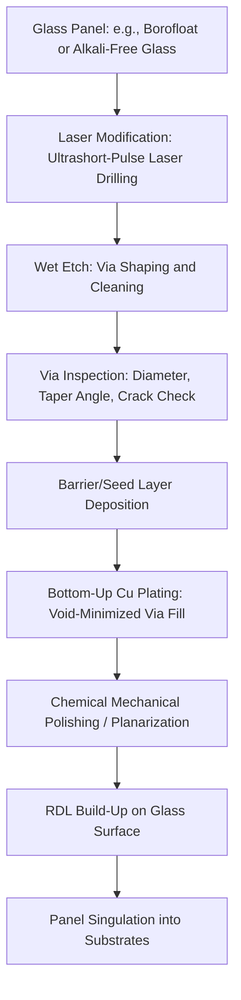

## Glass Core Substrate Technology and Through-Glass Via Formation

### Overview

**Key Points**

- Glass core substrates use a glass panel (rather than glass-fiber-reinforced BT resin) as the rigid core layer of an advanced package substrate, offering superior flatness, dimensional stability, and mechanical/thermal properties for the largest, highest-density AI and HPC packages
- **Through-Glass Vias (TGVs)** are the glass-core analog of through-core vias in BT substrates, providing electrical connections between the top and bottom faces of the glass core layer
- Glass core technology is being actively pursued by TSMC, Intel, Samsung, Absolics (SKC), and others as a next-generation substrate material to address warpage, flatness, and fine-line limitations that organic (BT/ABF) substrates increasingly face at very large package body sizes
- This is a technology still transitioning from pilot/sample stage toward broader commercialization; timelines and specific technical parameters remain fluid across different companies' roadmaps

Let me verify current details on glass substrate development before proceeding, since this is an actively evolving technology.

Searched the webglass core substrate through-glass via TGV formation process 2026

## Glass Core Substrate Technology and Through-Glass Via Formation

### Overview

**Key Points**

- Glass core substrates use a glass panel — rather than glass-fiber-reinforced BT resin — as the rigid core layer of an advanced package substrate, offering superior flatness, dimensional stability, and electrical properties for the largest, highest-density AI and HPC packages
- **Through-Glass Vias (TGVs)** are the glass-core analog of plated through-holes (PTH) in organic substrates, forming electrical interconnects between the top and bottom faces of the glass core layer
- Glass core technology is being actively pursued by TSMC, Intel, Samsung, Absolics (SKC), Rapidus, and specialized process/equipment suppliers as a next-generation substrate material addressing warpage, flatness, and fine-line limitations that organic (BT/ABF) substrates increasingly face at very large package body sizes
- As semiconductor packaging technology evolves from two-dimensional to three-dimensional integration, TGV is emerging as a strong candidate interconnect method for advanced packaging, offering electrical insulation, low dielectric loss, and tunable thermal expansion characteristics not simultaneously available in organic substrates

[Unverified] This remains an actively evolving, pre-high-volume-manufacturing technology as of the sources reviewed (2025–2026 industry reporting). Specific process parameters, thicknesses, and commercialization timelines vary across suppliers and continue to change; figures below should be treated as representative of current industry direction rather than fixed specifications.

---

### Why Glass as a Core Material

**Key Points**

- Glass offers substantially better dimensional stability and flatness than glass-fiber-reinforced organic laminates (BT resin), since glass panels lack the woven fiber weave pattern that can introduce localized CTE and stiffness non-uniformity in organic cores
- Glass's coefficient of thermal expansion (CTE) can be tuned via glass composition to more closely match silicon and other die materials than typical organic core CTE, reducing thermomechanical stress at die-to-substrate interfaces
- Glass provides excellent electrical insulation and low dielectric loss compared to organic core materials, benefiting high-frequency and high-speed signal integrity in large, high-I/O-count packages
- Glass core panels are compatible with large-scale, panel-level manufacturing approaches, aligning with the broader industry shift toward panel-based advanced packaging (e.g., TSMC's CoPoS platform)

**Comparative core material properties (illustrative):**

| Property | BT Resin Core | Glass Core |
| --- | --- | --- |
| Flatness/warpage stability | Moderate (fiber-weave dependent) | High (superior dimensional stability) |
| CTE tunability | Limited (fixed by resin/glass-fiber system) | Tunable via glass composition |
| Dielectric loss | Moderate | Low |
| Via formation method | Mechanical drilling (PTH) | Laser drilling + wet/dry etch (TGV) |
| Panel-scale manufacturability | Established | Emerging, actively being developed |
| Brittleness/handling risk | Low (organic, flexible) | Higher (inherently brittle) |

---

### Through-Glass Via (TGV) Formation Process

**Key Points**

- For glass core substrate processing, the most common TGV formation method combines **laser drilling with a subsequent wet etch process**, in contrast to organic substrates' mechanically drilled plated-through-holes (PTH)
- The resulting via geometry is commonly **hourglass-shaped** (narrower at the mid-thickness point, wider at both surfaces) due to the physics of laser-induced modification followed by etch-based hole formation, though some manufacturers are experimenting with more cylindrical via profiles
- The general TGV formation sequence involves: laser modification/drilling to define via locations, wet or dry etching to shape and clean the via hole, and metallization (typically copper) to form the conductive interconnect

**Representative TGV process sequence:**

**Key TGV process details:**

- **Bottom-up plating** — a copper plating approach that grows metal from the bottom of the TGV hole upward, which helps reduce void formation even at high aspect ratios, as opposed to conformal plating that can trap voids in narrow, deep vias
- **Taper angle control** — laser drilling studies report achievable taper angles down to approximately 6–7 degrees using femtosecond pulse durations, though microcracks and backside ablation remain observed challenges even at optimized parameters in some reported studies
- **Thickness-dependent difficulty** — as glass substrates trend thicker (industry reporting references active development and evaluation of "2T-class," i.e., approximately 2mm-class, glass substrates in response to customer requirements), TGV processing difficulty increases substantially, since greater via depth increases susceptibility to cracking and deformation during processing

---

### Cross-Section: TGV Structure (Conceptual)

(svg_diagram)

<svg xmlns="http://www.w3.org/2000/svg" viewBox="0 0 560 340" font-family="Helvetica, Arial, sans-serif">
<text x="280" y="26" text-anchor="middle" font-size="16" font-weight="bold" fill="#1a1a1a">Through-Glass Via (TGV) Cross-Section (svg_diagram)</text>

<rect x="120" y="60" width="320" height="200" fill="#e3f2fd" stroke="#1565c0" stroke-width="2" />
<text x="280" y="80" text-anchor="middle" font-size="11" fill="#0d47a1">Glass Core Panel</text>

<path d="M 190,70 L 210,150 L 190,250 L 240,250 L 220,150 L 240,70 Z" fill="#ffab91" stroke="#bf360c" stroke-width="1.5" />
<path d="M 320,70 L 340,150 L 320,250 L 370,250 L 350,150 L 370,70 Z" fill="#ffab91" stroke="#bf360c" stroke-width="1.5" />

<text x="215" y="290" text-anchor="middle" font-size="9" fill="#333">TGV (hourglass profile)</text>

<text x="345" y="290" text-anchor="middle" font-size="9" fill="#333">TGV (hourglass profile)</text>

<rect x="120" y="45" width="320" height="14" fill="#a5d6a7" stroke="#2e7d32" stroke-width="1" />
<text x="280" y="55" text-anchor="middle" font-size="9" fill="#1b5e20">RDL / Bond Pad</text>
<rect x="120" y="260" width="320" height="14" fill="#a5d6a7" stroke="#2e7d32" stroke-width="1" />
<text x="280" y="270" text-anchor="middle" font-size="9" fill="#1b5e20">RDL / Bond Pad</text>

<line x1="190" y1="70" x2="210" y2="150" stroke="#555" stroke-width="0.75" stroke-dasharray="2,2" />
<text x="150" y="110" font-size="9" fill="#555">taper angle</text>

<rect x="180" y="300" width="14" height="14" fill="#ffab91" stroke="#bf360c" />
<text x="200" y="311" font-size="10" fill="#333">Cu-Filled TGV</text>
<rect x="330" y="300" width="14" height="14" fill="#e3f2fd" stroke="#1565c0" />
<text x="350" y="311" font-size="10" fill="#333">Glass Core</text>
</svg>

---

### Key Process Challenges

**Key Points**

- **Void formation in via fill** — filling deep, high-aspect-ratio TGVs with defect-free copper is challenging; bottom-up plating techniques and additive chemistries (e.g., studies referencing polyvinylpyrrolidone molecular weight effects on fill quality) are active areas of process development aimed at defect-free filling
- **Crack propagation and mechanical stress** — the inherently brittle nature of glass makes it highly susceptible to cracking due to stress concentration around vias, which threatens both immediate structural integrity and long-term package reliability; residual stress evolution and via protrusion behavior over time and temperature remain active research topics
- **Via-to-via registration and pitch control** — research reporting on glass core substrates has demonstrated tight dimensional control, with one study reporting an average measured distance of 200.072µm against a 200µm designed target for adjacent through-glass hole spacing, indicating achievable sub-micron-level registration accuracy in controlled research conditions
- **Metallization diffusion/contamination control** — copper diffusion through patterned metallization layers near TGVs can produce oxide particle contamination on adjacent metal surfaces; barrier layers (e.g., titanium nitride, tantalum nitride, deposited via CVD/PVD/ALD) are used to mitigate metal diffusion, an approach adapted from through-silicon via (TSV) barrier layer practice though more challenging to implement at TGV's typically larger physical dimensions

---

### Equipment and Supply Chain Developments

**Key Points**

- Industry demonstrations reported at trade exhibitions (e.g., the KPCA Show) indicate specialized suppliers are showcasing actual TGV-processed glass substrate products rather than only development roadmaps, including demonstrations on thicker "2T-class" glass substrates
- Key process equipment categories required for glass substrate manufacturing include TGV etching and cleaning systems, and bottom-up plating equipment specifically engineered to reduce void formation at high aspect ratios
- The TGV substrate market has been estimated at approximately $60 million in 2022, projected to grow to approximately $480.5 million by 2029 at a compound annual growth rate of roughly 34.2%, reflecting the technology's early-stage but rapidly industrializing status
- Established organic substrate PCB process infrastructure does not directly transfer to glass core processing; various steps that previously relied on basic PCB technology take on substantially greater complexity when applied to glass substrates, requiring largely new equipment and process development rather than incremental adaptation of existing organic substrate lines

---

### Comparison: TGV vs. Conventional Organic Substrate PTH

| Attribute | Plated Through-Hole (PTH, Organic) | Through-Glass Via (TGV) |
| --- | --- | --- |
| Hole formation method | Mechanical drilling | Laser modification + wet/dry etch |
| Typical via profile | Cylindrical | Hourglass-shaped (commonly); cylindrical variants in development |
| Core material brittleness | Low (organic, more forgiving) | High (glass, crack-prone) |
| Achievable via pitch/density | Moderate | Finer pitch achievable, actively improving |
| Dimensional stability of core | Moderate | High |
| Manufacturing process maturity | Highly mature, decades of production experience | Emerging; transitioning from pilot to early high-volume manufacturing |

---

### Relationship to Broader Advanced Packaging Trends

**Key Points**

- Glass core substrates are being developed in close conjunction with panel-level packaging platforms (such as TSMC's CoPoS), since glass panels are well suited to large-format, panel-scale processing approaches
- Glass core adoption directly addresses the warpage and flatness limitations that organic BT-core substrates face as package body sizes grow to accommodate multi-die/chiplet AI accelerator designs
- Multiple companies (Intel with EMIB-plus-glass-core sample structures, TSMC evaluating glass integration within CoPoS, Samsung, Rapidus, and Absolics/SKC operating dedicated glass substrate manufacturing facilities) are pursuing parallel but distinct glass substrate development paths, indicating this is viewed industry-wide as a strategically important next-generation substrate technology rather than a single-company initiative

[Unverified] The relative technical maturity and commercialization timeline differ meaningfully across these companies' individual programs; readers should consult each company's current published roadmap disclosures for authoritative, company-specific status rather than treating the technology as uniformly mature across the industry.

---

**Related Topics**

- TSMC CoPoS and Panel-Level Packaging Platforms
- BT Resin and ABF Build-Up Material Fundamentals
- Intel EMIB and Glass-Core Substrate Integration
- Coreless and Embedded-Trace Substrate Architectures
- Through-Silicon Via (TSV) Formation and Comparison to TGV
- Barrier Layer Materials for Via Metallization (TiN, TaN)
- Warpage and Residual Stress Characterization in Glass Substrates
- Bottom-Up Copper Plating for High-Aspect-Ratio Via Fill