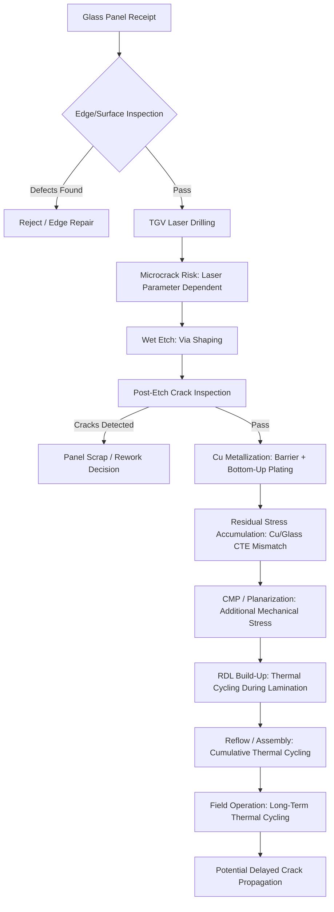

## Glass Substrate Defect Modes: Cracking, Metallization, and Warpage Control

### Overview

**Key Points**

- Glass core substrates offer superior flatness and dimensional stability compared to organic (BT resin) cores, but their inherent material brittleness introduces a distinct set of defect modes not present, or present to a much lesser degree, in organic substrate processing
- The three primary defect categories are **cracking** (mechanical failure from stress concentration, typically initiated at via features or edges), **metallization defects** (voiding, incomplete fill, and contamination during through-glass via and RDL copper formation), and **warpage** (panel-level bow/twist arising from CTE mismatch and asymmetric processing, distinct from but related to organic substrate warpage mechanisms)
- These defect modes are interrelated: metallization-induced residual stress can drive cracking, and warpage-inducing stress can concentrate at via locations to accelerate crack initiation, so process control across all three domains must generally be addressed together rather than in isolation

[Unverified] Glass substrate manufacturing is an actively developing, pre-high-volume-manufacturing technology as of currently available industry reporting; specific defect rates, root-cause statistics, and process control thresholds are proprietary to individual substrate and equipment suppliers and continue to evolve. The mechanisms described below reflect general materials-science principles and published research trends rather than a single standardized industry specification.

---

### Cracking: Mechanisms and Sources

**Key Points**

- Glass is inherently brittle relative to organic laminates, making it highly susceptible to cracking driven by stress concentration rather than the more gradual plastic deformation or delamination failure modes typical of organic substrates
- **Via-induced cracking** — through-glass via (TGV) formation is a primary crack initiation source; laser drilling and etch processes can leave microcracks radiating from the via wall, particularly when taper angle, pulse energy, or etch parameters are not tightly controlled
- **Edge/handling-induced cracking** — panel edges and corners represent high-stress-concentration regions during handling, transport, and clamping in process equipment; chipped or micro-fractured edges can propagate into larger cracks under subsequent thermal or mechanical loading
- **Thermally induced cracking** — CTE mismatch between the glass core and adjacent metallization (copper) or dielectric/RDL materials generates residual stress during thermal cycling (reflow, testing, field operation); repeated cycling can propagate existing microcracks or initiate new ones at stress concentration points
- **Residual stress from via metallization** — copper's CTE substantially exceeds that of most glass compositions, so copper-filled TGVs are a persistent built-in source of residual stress around each via location, even without external thermal cycling; published research specifically studies time- and temperature-dependent residual stress evolution and via protrusion behavior as a consequence of this mismatch

**Comparative crack sources:**

| Source | Mechanism | Primary Mitigation Approach |
| --- | --- | --- |
| TGV laser/etch formation | Microcracks radiating from via wall | Optimized laser pulse parameters, taper angle control |
| Panel edge/corner handling | Stress concentration at chipped edges | Edge-strengthening treatments, careful handling protocols |
| Thermal cycling | CTE mismatch-driven cyclic stress | CTE-matched glass composition selection, controlled reflow profiles |
| Cu-filled via residual stress | Cu/glass CTE mismatch, built-in stress | Via fill process control, stress-relief via design geometry |

---

### Crack Propagation Risk by Process Stage

---

### Metallization Defect Modes

**Key Points**

- **Via fill voiding** — incomplete or non-uniform copper fill within TGVs, particularly problematic at higher aspect ratios where conformal plating tends to seal the via opening before the interior is fully filled, trapping voids; bottom-up plating techniques (growing copper from the via bottom upward) are used specifically to mitigate this failure mode
- **Fill chemistry-dependent defects** — additive chemistries used in plating baths (e.g., research on polyvinylpyrrolidone molecular weight effects) directly influence fill uniformity and defect-free plating outcomes, indicating that plating bath formulation is a meaningful, tunable lever for defect reduction rather than a fixed constraint
- **Metal diffusion/contamination** — copper atoms can diffuse through patterned metallization layers near TGVs, producing oxide particle contamination (predominantly CuO/Cu₂O) on adjacent metal surfaces such as gold-finished pads; this is mitigated using diffusion barrier layers (titanium nitride or tantalum nitride, deposited via CVD, PVD, or ALD), an approach adapted from through-silicon via practice
- **Seed/barrier layer adhesion failure** — as with organic substrate SAP processing, inadequate seed or barrier layer adhesion to the glass via wall can cause delamination or incomplete plating coverage, though glass's smoother, non-fiber-reinforced surface presents different adhesion characteristics than roughened organic dielectric

**Metallization defect summary:**

| Defect Mode | Root Cause | Detection Method | Mitigation |
| --- | --- | --- | --- |
| Via fill voiding | High aspect ratio, conformal plating sealing | X-ray, cross-section SEM | Bottom-up plating, optimized bath chemistry |
| Non-uniform fill | Plating current density variation, additive imbalance | Cross-section inspection | Additive chemistry tuning (e.g., molecular weight optimization) |
| Metal diffusion contamination | Cu diffusion through metallization near TGV | SEM/EDS surface analysis | Barrier layer deposition (TiN, TaN) |
| Barrier/seed adhesion failure | Insufficient surface preparation or barrier deposition quality | Cross-section SEM, pull/peel test | Optimized deposition process, surface pretreatment |

---

### Warpage: Mechanisms and Distinctions from Organic Substrates

**Key Points**

- Glass core panels offer inherently better baseline flatness and dimensional stability than glass-fiber-reinforced organic cores, since glass lacks the woven fiber weave pattern that introduces localized stiffness and CTE non-uniformity in BT resin substrates
- Despite this baseline advantage, glass substrates remain susceptible to warpage driven by **asymmetric processing** — differential stress accumulation between the top and bottom faces of the panel from sequential build-up layer lamination, RDL formation, and via metallization steps
- **CTE mismatch-driven bow** — even with tunable glass composition, some residual CTE mismatch between glass, copper metallization, and organic RDL/dielectric build-up layers generates panel-level bow and twist during thermal processing steps
- Because glass is brittle rather than compliant, warpage-induced stress in glass substrates is more likely to manifest as localized cracking (particularly at via sites or panel edges) rather than the more gradual plastic bending deformation that organic substrates can tolerate before failure

**Comparative warpage behavior:**

| Attribute | Organic (BT Core) Substrate | Glass Core Substrate |
| --- | --- | --- |
| Baseline flatness | Moderate (fiber-weave dependent) | High |
| Response to warpage-inducing stress | Gradual bending, some plastic deformation tolerance | Limited compliance; stress concentrates and can crack |
| Primary warpage driver | Core/build-up CTE mismatch, asymmetric stack-up | Asymmetric processing, Cu/glass CTE mismatch at vias |
| Failure mode under excess stress | Progressive bow, eventual delamination | Sudden brittle cracking |

---

### Warpage Control Strategies

**Key Points**

- **Stack symmetry design** — designing build-up layer sequences to be as close to mirror-symmetric above and below the glass core as possible minimizes net bending moment, analogous to symmetric design practices used in coreless organic substrates
- **Controlled thermal profiles** — carefully ramped heating/cooling profiles during lamination, curing, and reflow reduce the rate of thermal stress accumulation, giving the glass/metal system more time to reach mechanical equilibrium rather than experiencing rapid, high-gradient thermal shock
- **Via layout and density management** — since copper-filled TGVs are a persistent localized stress source, via placement density and pattern (avoiding excessive local clustering) can be optimized to distribute stress more evenly across the panel rather than concentrating it in specific regions
- **Panel-scale process uniformity** — as glass substrate manufacturing moves toward larger panel formats (consistent with the broader panel-level packaging trend), maintaining uniform processing conditions (plating current density, etch rate, lamination pressure) across the full panel area becomes increasingly critical to avoiding localized warpage hot spots

---

### Cross-Section: Stress Concentration at TGV Sites (Conceptual)

(svg_diagram)

<svg xmlns="http://www.w3.org/2000/svg" viewBox="0 0 560 320" font-family="Helvetica, Arial, sans-serif">
<text x="280" y="26" text-anchor="middle" font-size="16" font-weight="bold" fill="#1a1a1a">Stress Concentration Around TGV (svg_diagram)</text>

<rect x="100" y="60" width="360" height="180" fill="#e3f2fd" stroke="#1565c0" stroke-width="2" />
<text x="280" y="80" text-anchor="middle" font-size="10" fill="#0d47a1">Glass Core</text>

<path d="M 250,70 L 270,150 L 250,230 L 300,230 L 280,150 L 300,70 Z" fill="#d84315" stroke="#bf360c" stroke-width="1.5" />
<text x="275" y="250" text-anchor="middle" font-size="9" fill="#333">Cu-Filled TGV</text>

<ellipse cx="275" cy="150" rx="45" ry="80" fill="none" stroke="#e53935" stroke-width="1" stroke-dasharray="3,2" opacity="0.7" />
<ellipse cx="275" cy="150" rx="70" ry="100" fill="none" stroke="#ef9a9a" stroke-width="1" stroke-dasharray="3,2" opacity="0.5" />

<line x1="250" y1="120" x2="225" y2="105" stroke="#b71c1c" stroke-width="1.5" />
<line x1="300" y1="180" x2="325" y2="195" stroke="#b71c1c" stroke-width="1.5" />
<text x="180" y="100" font-size="9" fill="#b71c1c">microcrack</text>
<text x="330" y="200" font-size="9" fill="#b71c1c">microcrack</text>

<rect x="120" y="270" width="14" height="14" fill="#d84315" />
<text x="140" y="281" font-size="10" fill="#333">Cu Via (CTE mismatch source)</text>
<line x1="330" y1="277" x2="350" y2="277" stroke="#e53935" stroke-width="1.5" stroke-dasharray="3,2" />
<text x="355" y="281" font-size="10" fill="#333">Residual stress field</text>
</svg>

---

### Inspection and Metrology for Defect Detection

**Key Points**

- **Optical and SEM inspection** — via diameter, taper angle, and visible crack detection are commonly assessed using optical microscopy for rapid screening and scanning electron microscopy (SEM) for higher-resolution defect characterization
- **X-ray inspection** — used to detect internal via fill voids non-destructively, allowing statistical process monitoring without requiring destructive cross-sectioning of every panel
- **Cross-sectional analysis** — remains the definitive method for characterizing via fill quality, barrier layer integrity, and internal crack propagation, though it is inherently destructive and used for periodic process validation sampling rather than full-panel inspection
- **Residual stress and protrusion measurement** — specialized metrology tracks via copper protrusion (expansion of the copper via slightly above the glass surface due to CTE mismatch) over time and temperature as an indirect indicator of accumulated residual stress and potential long-term reliability risk

---

### Integrated Defect Control Philosophy

**Key Points**

- Because cracking, metallization defects, and warpage are mechanistically interconnected — via metallization introduces residual stress, residual stress contributes to warpage, and warpage-concentrated stress accelerates cracking — effective process control strategies generally address the three domains jointly rather than treating them as independent problems
- A representative integrated approach combines: optimized TGV laser/etch parameters to minimize initial microcrack formation, bottom-up plating with tuned bath chemistry to minimize fill-related stress and voiding, symmetric stack design and controlled thermal ramping to minimize warpage-driving stress accumulation, and layered inspection (optical, X-ray, periodic cross-section) to catch defects at the earliest feasible process stage before they propagate into yield-limiting failures downstream

[Inference] This integrated framing reflects standard materials-reliability engineering practice applied to the specific mechanisms reported for glass substrate processing in current research and industry literature; it synthesizes a coherent control philosophy rather than reproducing a single named company's or standard's formal quality system.

---

**Related Topics**

- Through-Glass Via (TGV) Formation Process Fundamentals
- Glass Core Substrate Technology and Composition Selection
- Barrier Layer Materials and Deposition (TiN, TaN, CVD/PVD/ALD)
- Bottom-Up Copper Plating for High-Aspect-Ratio Vias
- Panel-Level Packaging and Large-Format Process Uniformity
- Coreless Substrate Warpage Management (Comparative Reference)
- X-Ray and SEM Metrology for Package Defect Detection
- Residual Stress Characterization in Multi-Material Packages