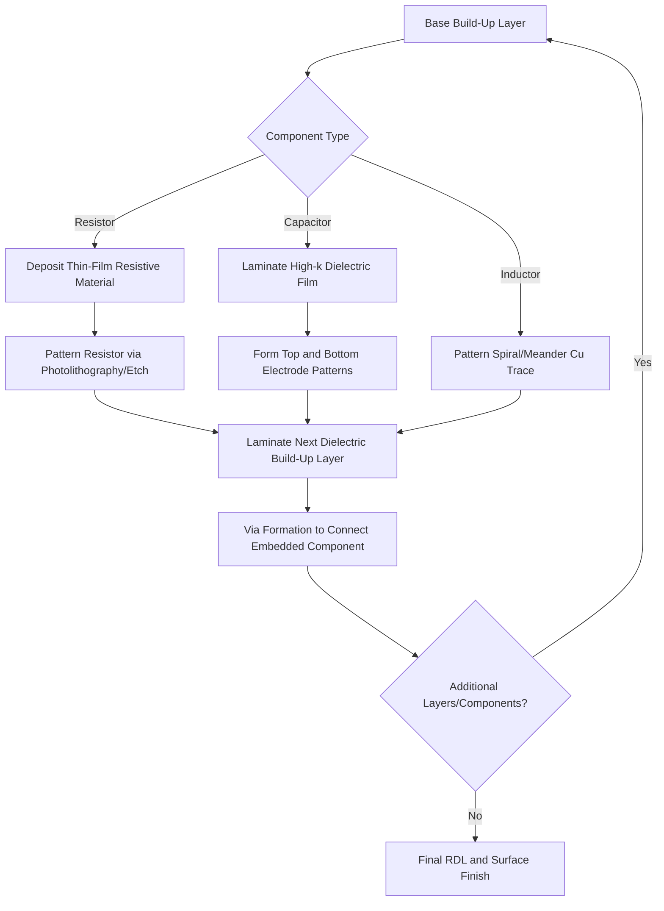
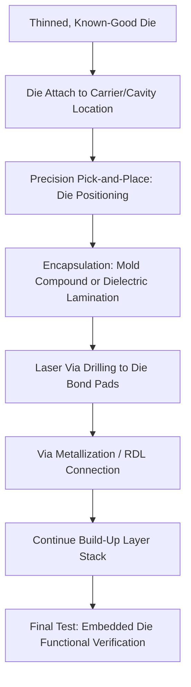

## Embedded Passive and Active Components in Substrates

### Overview

**Key Points**

- Component embedding integrates passive devices (resistors, capacitors, inductors) and, in more advanced implementations, active devices (bare die, thin ICs) directly within the internal layers of a package substrate rather than mounting them as discrete surface components
- This approach reduces overall package footprint and height, shortens interconnect paths (reducing parasitic inductance/resistance), and can improve electrical performance for high-frequency and power delivery applications
- Embedding methods differ substantially by material system: organic substrates (BT/ABF) use cavity-formation and thin-film deposition techniques, while ceramic substrates (particularly LTCC) achieve embedding more naturally through their inherent co-fired multilayer construction
- Active component embedding (embedded die) represents a more advanced and mechanically demanding extension of the same underlying principle, requiring precise die placement and interconnection within the substrate build-up process itself

---

### Rationale for Component Embedding

**Key Points**

- **Footprint reduction** — moving passives from the substrate surface into internal layers frees surface area for additional surface-mounted components, die attach area, or a smaller overall package outline
- **Height reduction** — embedded components eliminate the z-height contribution of discrete component bodies and their solder joints, directly benefiting thickness-constrained applications such as mobile devices
- **Electrical performance improvement** — shorter interconnect paths between embedded passives and adjacent active circuitry reduce parasitic inductance and resistance, which is particularly valuable for high-frequency decoupling capacitors and RF matching networks where interconnect parasitics can dominate circuit behavior at target frequencies
- **Reliability considerations** — embedded components eliminate discrete solder joint interfaces (a common field-failure site under thermal cycling and mechanical shock), though they introduce different reliability considerations tied to the embedding process itself (voiding, delamination at embedded component interfaces)

---

### Embedded Passive Components

**Key Points**

- **Embedded resistors** — commonly formed using thin-film resistive materials (e.g., nickel-phosphorus, tantalum nitride) deposited and patterned within internal substrate layers, or in LTCC, using printed resistive pastes on internal ceramic layers
- **Embedded capacitors** — formed using high-dielectric-constant thin-film or ceramic layers sandwiched between internal electrode plates; in organic substrates this may use specialized high-$k$ laminate materials, while in LTCC this uses high-$k$ ceramic tape formulations
- **Embedded inductors** — typically formed as spiral or meander-pattern conductor traces across one or more internal layers, functioning similarly to planar inductors but positioned within the substrate body rather than on its surface

**Comparative embedding approach by substrate type:**

| Passive Type | Organic Substrate Approach | LTCC Approach |
| --- | --- | --- |
| Resistor | Thin-film deposition (NiP, TaN) on internal layer | Resistive paste printed on internal layer |
| Capacitor | High-$k$ laminate sandwiched between electrodes | High-$k$ ceramic tape layer + internal electrodes |
| Inductor | Spiral/meander Cu trace across build-up layers | Spiral/meander conductor across co-fired layers |
| Formation timing | Sequential, layer-by-layer during build-up | Simultaneous, co-fired as part of monolithic lamination |

---

### Embedded Passive Component Formation: Organic Substrate Process Flow

---

### Active Component Embedding (Embedded Die)

**Key Points**

- Embedded die technology places a thinned bare die (often a small controller IC, power management IC, or passive-integration chip) within a cavity or directly within the build-up layer stack of the substrate, rather than mounting it externally
- This requires the die to be thinned to a compatible thickness with the surrounding build-up layers, precisely placed (often using pick-and-place equipment with fine placement accuracy tolerances), and then encapsulated within subsequent lamination steps
- Electrical connection to an embedded die is typically made via laser-drilled microvias landing on the die's bond pads, integrated into the same RDL build-up sequence used for the surrounding substrate wiring
- Embedded die approaches are more process-intensive and yield-sensitive than embedded passives, since a defective or misplaced embedded die cannot be reworked once encapsulated — a full substrate panel section may need to be scrapped, making known-good-die (KGD) testing prior to embedding particularly critical

**Embedded die process sequence (conceptual):**

---

### Reliability and Process Considerations for Active Embedding

**Key Points**

- **Pre-embedding test criticality** — since embedded die cannot be replaced after encapsulation without scrapping the surrounding substrate structure, rigorous known-good-die (KGD) testing prior to placement is essential to avoid yield loss propagating from a single defective die into an otherwise good substrate panel
- **Thermal management** — an embedded active die generates heat within the substrate body rather than at an externally accessible surface, requiring thermal path design (e.g., thermal vias, embedded heat spreaders) to avoid localized hotspots that surrounding organic dielectric materials may not tolerate well over sustained operation
- **CTE mismatch at die/dielectric interface** — silicon die CTE differs from surrounding organic build-up material CTE, introducing localized stress concentration around the embedded die perimeter, analogous to but distinct from the die-attach stress considerations in conventional flip-chip packaging
- **Via landing accuracy on die bond pads** — laser via drilling to reach embedded die bond pads requires tight alignment tolerance between the die's as-placed position and the via drilling coordinate system, since placement tolerance stack-up directly affects via-to-pad landing yield

---

### Comparative Summary: Embedded Passive vs. Embedded Active Components

| Attribute | Embedded Passive | Embedded Active (Die) |
| --- | --- | --- |
| Process complexity | Moderate | High |
| Rework capability after embedding | Generally limited | None (encapsulated die cannot be replaced) |
| Pre-embedding test requirement | Lower criticality | Critical (KGD testing essential) |
| Thermal management concern | Minimal (passives generate little/no heat) | Significant (active die heat generation) |
| Typical component examples | Resistors, capacitors, inductors | PMICs, small controller ICs, passive-integration chiplets |
| Primary benefit driver | Footprint/height reduction, parasitic reduction | Footprint/height reduction, interconnect length reduction for active circuitry |

---

### Application Context

**Key Points**

- **Mobile/consumer electronics** — embedded passives are widely used in space- and thickness-constrained mobile application processor and RF module packaging, where every millimeter of footprint and height reduction has direct product design value
- **RF/microwave modules** — LTCC's mature embedded passive capability makes it a natural fit for RF front-end modules and filters, where embedded inductors and capacitors directly form filter network elements within the substrate body itself
- **Power delivery applications** — embedded decoupling capacitors positioned close to power-hungry active die reduce power delivery network (PDN) impedance at the point of load, improving transient response and reducing voltage droop under fast load current changes
- **Emerging embedded die adoption** — active component embedding remains a more specialized technique, generally applied selectively to specific high-value integration cases (e.g., embedding a small PMIC near a high-power die) rather than broad general-purpose adoption, reflecting its higher process complexity and yield sensitivity relative to embedded passives

---

**Related Topics**

- LTCC Multilayer Ceramic Substrate Fabrication
- BT Resin and ABF Build-Up Material Fundamentals
- Known-Good-Die (KGD) Testing Methodologies
- Power Delivery Network (PDN) Design and Decoupling Strategies
- Thermal Via Design for Embedded Component Heat Management
- Fan-Out Wafer/Panel-Level Packaging as an Alternative Embedding Approach
- RF Front-End Module Design Using Embedded Passives
- CTE Matching and Stress Management at Embedded Component Interfaces