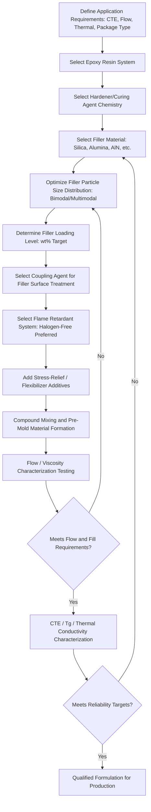

## Mold Compound Formulation and Filler Engineering

### Overview

**Key Points**

- Mold compounds are epoxy-based composite materials used to encapsulate semiconductor die and interconnects, providing mechanical protection, electrical insulation, and environmental barrier properties across nearly all package types — from wire-bond QFP to fan-out wafer-level packaging
- A mold compound formulation is a multi-component system: epoxy resin matrix, hardener/curing agent, inorganic filler particles, coupling agents, flame retardants, stress-relief additives, and colorants/mold-release agents
- **Filler engineering** — the selection, sizing, and loading of inorganic filler particles (predominantly fused silica) — is the primary lever for tuning a mold compound's coefficient of thermal expansion (CTE), thermal conductivity, viscosity/flow behavior, and mechanical strength
- Advanced packaging trends (larger die, fan-out packages, panel-level formats, thinner packages) have driven mold compound formulation toward finer, more precisely controlled filler systems to meet increasingly demanding flow, warpage, and reliability requirements simultaneously

---

### Core Formulation Components

**Key Points**

- **Epoxy resin matrix** — the base polymer system, typically a novolac or biphenyl-type epoxy, chosen for balance of cure behavior, moisture resistance, and adhesion to die/lead-frame/substrate surfaces
- **Hardener/curing agent** — reacts with the epoxy resin during the molding/cure cycle to form the cross-linked thermoset network; curing agent chemistry affects cure speed, final glass transition temperature ($T_g$), and cured material toughness
- **Inorganic filler** — predominantly fused (amorphous) silica particles, loaded at high volume fraction (commonly 70–90 wt% in modern high-filler formulations) to reduce the compound's effective CTE toward that of silicon and surrounding package materials, while also improving thermal conductivity and mechanical rigidity
- **Coupling agents** — typically silane-based, applied to filler particle surfaces to promote strong adhesion between the inorganic filler and the organic epoxy matrix, directly affecting moisture resistance and mechanical integrity at the filler/resin interface
- **Flame retardants** — historically often halogenated (e.g., brominated epoxy systems), with substantial industry transition toward halogen-free formulations (e.g., phosphorus-based or metal hydroxide flame retardant systems) driven by environmental regulation (RoHS and related directives)
- **Stress-relief additives** — flexibilizing agents or rubber-modified epoxy components that reduce internal stress and improve crack resistance, particularly important for large-die and thin-package applications where die-to-mold-compound CTE mismatch stress is more severe

---

### Filler Engineering: Particle Size and Distribution

**Key Points**

- Filler particle size distribution directly affects mold compound flow behavior during the molding process: larger average particle size generally increases viscosity and can impede flow into narrow gaps (fine-pitch wire bonds, narrow mold cavity features), while excessively fine particle size increases surface area and can raise viscosity through increased particle-particle interaction
- **Bimodal or multimodal particle size distributions** are commonly engineered to achieve high filler loading while maintaining acceptable flow viscosity — smaller particles fill the interstitial spaces between larger particles, enabling higher overall packing density than a single particle size distribution could achieve at equivalent viscosity
- As package features shrink (fine-pitch wire bonds, narrow gaps in fan-out RDL structures, thin mold cap thickness), maximum filler particle size must correspondingly decrease to avoid particle-induced flow blockage or incomplete fill (a defect mode sometimes termed "filler settling" or "wire sweep" when combined with flow-induced wire displacement)

**Filler particle size considerations by application:**

| Application Context | Typical Filler Size Range (illustrative) | Key Driver |
| --- | --- | --- |
| Standard wire-bond QFP/BGA | Larger average particle size acceptable | Cost, bulk mechanical properties |
| Fine-pitch wire-bond packages | Reduced maximum particle size | Avoid wire sweep, ensure complete fill between wires |
| Fan-out WLP/PLP (die-first or die-last) | Fine, tightly controlled distribution | Thin mold cap, fine RDL feature compatibility |
| Underfill-adjacent or capillary-flow applications | Very fine particle size | Flow into narrow die-to-substrate gaps |

[Inference] Specific particle size figures vary substantially by supplier formulation and target application; the qualitative trend (finer features require finer, more tightly controlled filler distributions) is well established, but precise micron-level specifications should be sourced from individual mold compound manufacturer datasheets.

---

### CTE Tuning via Filler Loading

**Key Points**

- Unfilled epoxy resin has a CTE substantially higher than silicon (silicon CTE ≈ 2.6 ppm/°C); increasing fused silica filler loading progressively reduces the compound's effective CTE toward the filler's own low CTE (fused silica CTE is very low, well below the resin matrix)
- CTE matching between the mold compound, die, substrate, and lead-frame/interconnect materials is a primary design lever for minimizing warpage and thermomechanical stress across the assembled package during both manufacturing (post-mold cure cooling) and subsequent thermal cycling in application
- There are two temperature-dependent CTE regimes to consider: **CTE1** (below the compound's glass transition temperature, $T_g$) and **CTE2** (above $T_g$, where the material's thermal expansion coefficient increases substantially due to the transition from glassy to rubbery polymer behavior); both regimes must be characterized since packages experience temperature excursions spanning both regimes during reflow and operation

**Simplified relationship: composite CTE as a function of filler loading (Kerner/Turner-type approximation concept):**

$$\alpha_{composite} \approx \alpha_{filler} \cdot V_f + \alpha_{resin} \cdot (1 - V_f)$$

where $\alpha_{composite}$ is the effective composite CTE, $\alpha_{filler}$ and $\alpha_{resin}$ are the filler and resin CTEs respectively, and $V_f$ is the filler volume fraction. [Inference] This is a simplified rule-of-mixtures approximation for conceptual illustration; actual composite CTE behavior in filled epoxy systems is more accurately modeled using established composite micromechanics models (e.g., Turner or Kerner equations) that account for filler particle shape, modulus mismatch, and interfacial bonding effects not captured by a simple linear mixing rule.

---

### Thermal Conductivity Enhancement

**Key Points**

- Standard fused silica filler provides moderate thermal conductivity improvement over unfilled resin, but as power density in advanced packages increases (particularly for high-performance computing and power electronics applications), higher-thermal-conductivity filler alternatives are increasingly used
- **Alumina (Al₂O₃)** and **aluminum nitride (AlN)** fillers offer substantially higher thermal conductivity than fused silica, at the trade-off of generally higher cost and, in AlN's case, moisture sensitivity requiring careful formulation control
- Filler thermal conductivity enhancement must be balanced against CTE and flow requirements simultaneously — a filler system optimized purely for thermal conductivity may not simultaneously deliver the CTE matching or flow behavior required for a given package's reliability and manufacturability targets, requiring formulation-level trade-off optimization rather than single-property optimization

**Comparative filler material properties:**

| Filler Material | Relative Thermal Conductivity | CTE Contribution | Typical Trade-off |
| --- | --- | --- | --- |
| Fused (amorphous) silica | Baseline/moderate | Low CTE, well-established | Cost-effective, most widely used |
| Crystalline silica | Higher than fused silica | Low CTE | Higher hardness, can increase mold wear |
| Alumina (Al₂O₃) | High | Moderate | Higher cost, higher hardness |
| Aluminum nitride (AlN) | Very high | Moderate | Higher cost, moisture sensitivity considerations |

---

### Mold Compound Formulation Process Overview

---

### Key Performance Trade-Offs

**Key Points**

- **Flow vs. filler loading** — higher filler loading generally improves CTE matching and mechanical/thermal properties but increases viscosity, which can compromise mold flow into fine-pitch or thin-cavity package geometries; formulation optimization balances these competing requirements rather than maximizing filler loading unconditionally
- **Moisture resistance vs. flame retardant chemistry** — transitioning from halogenated to halogen-free flame retardant systems has, in some formulations, required corresponding adjustments to maintain equivalent moisture resistance and reliability performance, since flame retardant chemistry interacts with the broader resin/hardener/filler system
- **Mold wear vs. filler hardness** — harder filler materials (e.g., crystalline silica, alumina) that offer thermal or mechanical benefits can increase abrasive wear on mold tooling over production volume, a manufacturing cost consideration distinct from the encapsulated package's own reliability performance
- **Warpage vs. stress-relief additive loading** — flexibilizing/stress-relief additives reduce internal stress and improve crack resistance but can reduce overall modulus and glass transition temperature if over-formulated, requiring careful balance against the CTE-matching benefits of filler loading

---

### Application-Driven Formulation Trends

**Key Points**

- **Fan-out wafer/panel-level packaging** — requires mold compounds with tightly controlled, fine filler distribution and precisely tuned flow characteristics to achieve uniform die encapsulation and low, controlled post-mold warpage across large panel formats, since warpage directly affects downstream RDL processing yield in fan-out flows
- **Large-die, high-power packages** — increasingly favor higher thermal conductivity filler systems (alumina, AlN blends) to manage heat dissipation, particularly relevant for AI accelerator and HPC packages with substantial power density
- **Thin/ultra-thin packages** — require finer filler particle size distributions to maintain flow and fill quality within reduced mold cap thickness, while simultaneously managing warpage risk that increases as package thickness (and thus mechanical stiffness) decreases
- **Environmental/regulatory-driven reformulation** — ongoing transition toward halogen-free flame retardant systems and broader environmental compliance requirements continues to drive formulation updates across the industry, requiring requalification of reliability performance with each formulation change

---

**Related Topics**

- Package Warpage Characterization and Root-Cause Analysis
- Fan-Out Wafer-Level Packaging (FOWLP) Encapsulation Requirements
- Glass Transition Temperature ($T_g$) and Its Role in Package Reliability
- Underfill Material Formulation (Capillary and Molded Underfill)
- Moisture Sensitivity Level (MSL) Classification and Reliability Testing
- Coupling Agent Chemistry for Filler-Resin Interface Adhesion
- Thermal Interface Material (TIM) Selection for Power Package Applications
- Halogen-Free Flame Retardant Chemistry in Electronic Materials