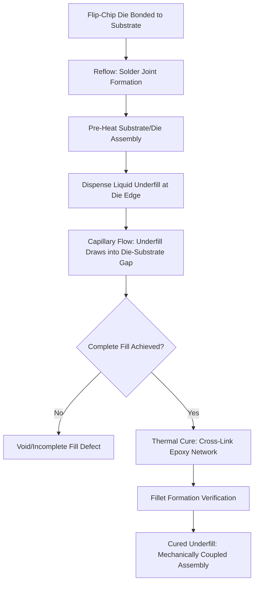

## Underfill and Capillary Flow Material Design

### Overview

**Key Points**

- Underfill is an epoxy-based encapsulant material dispensed into the gap between a flip-chip die and its substrate after solder joint reflow, mechanically coupling the die and substrate to redistribute thermomechanical stress away from the solder joints
- **Capillary Underfill (CUF)** is the traditional and most widely used approach: liquid underfill is dispensed at the die edge and drawn into the narrow die-to-substrate gap by capillary action after reflow, then thermally cured
- Underfill material design must simultaneously satisfy competing requirements: low viscosity for complete capillary flow into increasingly narrow gaps, high filler loading for CTE matching and mechanical reinforcement, and cure kinetics compatible with production throughput
- Alternative underfill approaches — **No-Flow Underfill (NUF)**, **Molded Underfill (MUF)**, and **Wafer-Level Underfill (WLUF)** — address specific process integration or narrow-gap limitations that conventional post-reflow capillary underfill increasingly faces as bump pitch shrinks

---

### Why Underfill Is Needed

**Key Points**

- Flip-chip solder joints (or copper pillar interconnects) directly bear the mechanical stress arising from CTE mismatch between the silicon die (CTE ≈ 2.6 ppm/°C) and the organic package substrate (CTE typically 13–17 ppm/°C for BT-based substrates), since the die and substrate expand/contract at different rates during thermal cycling
- Without underfill, this CTE mismatch concentrates stress at the solder joints themselves, which are mechanically the weakest link in the die-to-substrate interconnect structure, leading to solder joint fatigue cracking under thermal cycling — a primary field failure mode for unreinforced flip-chip assemblies
- Underfill mechanically couples the die and substrate across their full interface area (not just at discrete solder joint locations), distributing thermomechanical stress across a much larger bonded area and dramatically improving solder joint fatigue life
- As bump pitch and bump size shrink (finer flip-chip pitches, copper pillar interconnects), the mechanical role of underfill becomes proportionally more important, since smaller solder joints have correspondingly lower inherent fatigue resistance and rely more heavily on underfill-provided stress redistribution

---

### Capillary Underfill (CUF): Process and Material Requirements

**Key Points**

- CUF process sequence: die is first flip-chip bonded and reflowed onto the substrate (leaving the gap between die and substrate unfilled), then liquid underfill is dispensed along one or more edges of the die and drawn into the gap by capillary action, followed by thermal cure
- Capillary flow rate depends on gap height, underfill viscosity, surface tension/wetting behavior, and filler particle size relative to the gap dimension — all of which must be co-optimized as bump pitch (and thus gap height) continues to shrink in advanced packages
- CUF materials typically use fused silica filler at controlled particle size distributions well below the target gap height, since filler particles approaching or exceeding the gap dimension can bridge and block flow, causing incomplete fill (voiding) — a critical defect mode that directly compromises the stress-redistribution function underfill is intended to provide

**Standard capillary underfill process flow:**

---

### Underfill Material Formulation

**Key Points**

- **Epoxy resin base** — similar in general chemistry class to mold compound resin systems, but formulated for substantially lower viscosity and different cure kinetics compatible with capillary flow rather than transfer molding
- **Filler system** — fused silica filler is standard, loaded to balance CTE matching and mechanical reinforcement against the viscosity constraints imposed by capillary flow into narrow gaps; filler loading in underfill is generally more constrained than in mold compounds specifically because of the flow-into-narrow-gap requirement
- **Flux-compatible or fluxing underfill chemistry** — some underfill formulations incorporate flux activity directly into the underfill material itself (fluxing underfill), combining the flux and underfill dispensing steps to simplify process flow, though this requires careful chemistry balance so that flux residue does not compromise underfill cure or long-term reliability
- **Cure kinetics tuning** — cure temperature and time must be compatible with production throughput targets while achieving sufficient cross-link density for target mechanical and thermal reliability performance; snap-cure formulations (faster cure at given temperature) are used where throughput is a primary driver

**Comparative underfill formulation priorities vs. mold compound:**

| Attribute | Capillary Underfill | Mold Compound (for reference) |
| --- | --- | --- |
| Target viscosity | Very low (capillary flow into narrow gap) | Higher (transfer molding flow) |
| Typical filler loading | Moderate (flow-constrained) | High (70-90 wt% in advanced formulations) |
| Primary function | Stress redistribution across die-substrate interface | Encapsulation/protection of die and wire bonds |
| Flow driving mechanism | Capillary action (post-reflow) | Transfer molding pressure |
| Cure process | Thermal cure, often single-step | Thermal cure, often part of mold press cycle |

---

### Filler Particle Size vs. Gap Height Relationship

**Key Points**

- A widely cited rule-of-thumb design guideline is that maximum filler particle size should be meaningfully smaller than the minimum die-to-substrate gap height to avoid particle bridging/blocking during capillary flow, though the precise ratio depends on gap uniformity and specific formulation flow characteristics
- As advanced flip-chip and copper-pillar interconnect pitches shrink, standoff gap height correspondingly decreases, driving underfill filler systems toward progressively finer particle size distributions — directly analogous to the filler scaling trend seen in mold compound formulations for fine-pitch fan-out packaging
- [Inference] Specific particle-size-to-gap-height ratio guidelines vary by underfill supplier and are typically proprietary to formulation development; the qualitative principle (finer gaps require finer filler) is well-established, but exact ratios should be sourced from supplier application notes for a specific underfill product and target package geometry.

---

### Alternative Underfill Approaches

**Key Points**

- **No-Flow Underfill (NUF)** — underfill material is dispensed onto the substrate *before* die placement and reflow, rather than after; the reflow process itself both forms the solder joints and cures (or partially cures) the underfill simultaneously, eliminating the separate post-reflow capillary flow step and associated cycle time, at the cost of more complex process control to ensure proper solder joint formation through the underfill material during reflow
- **Molded Underfill (MUF)** — combines die encapsulation and underfill functions into a single molding step, using a specially formulated mold compound with sufficiently fine filler and low viscosity to flow both around the die (standard encapsulation) and into the die-to-substrate gap (underfill function) simultaneously, reducing process steps compared to separate mold and capillary underfill operations
- **Wafer-Level Underfill (WLUF)** — underfill material is applied at the wafer level (before die singulation), either as a film laminate or dispensed layer, so that each singulated die carries its own pre-applied underfill material into the subsequent flip-chip bonding process, shifting underfill application earlier in the overall process flow and potentially improving throughput at the package assembly stage

**Comparative underfill approach summary:**

| Approach | Application Timing | Key Benefit | Key Trade-off |
| --- | --- | --- | --- |
| Capillary Underfill (CUF) | Post-reflow | Mature, well-characterized, flexible | Additional process step, flow time constraint |
| No-Flow Underfill (NUF) | Pre-reflow (dispensed before die placement) | Eliminates separate flow step, reduces cycle time | Complex reflow process control through underfill material |
| Molded Underfill (MUF) | Combined with encapsulation molding | Single-step encapsulation + underfill | Requires specialized formulation for dual flow function |
| Wafer-Level Underfill (WLUF) | Pre-singulation (wafer level) | Shifts process earlier, per-die pre-application | Requires wafer-level process integration, film/dispense uniformity control |

---

### Reliability Considerations

**Key Points**

- **Void-free fill verification** — incomplete capillary flow leaving voids within the die-to-substrate gap is a primary underfill defect mode, since voids create localized stress concentration points that can initiate solder joint fatigue cracking at the void location during subsequent thermal cycling; acoustic microscopy (C-SAM) is commonly used for non-destructive void detection
- **Fillet formation and consistency** — the underfill fillet (the material that extends slightly beyond the die edge during capillary flow) contributes to edge stress redistribution; inconsistent or insufficient fillet formation can leave die-corner regions inadequately reinforced, since die corners typically experience the highest thermomechanical stress concentration in a flip-chip assembly
- **CTE matching and $T_g$ characterization** — as with mold compounds, underfill CTE (in both below-$T_g$ and above-$T_g$ regimes) must be characterized and matched appropriately to the surrounding die/substrate/solder system to minimize thermomechanical stress across the full operating temperature range
- **Rework limitations** — cured underfill is generally very difficult or impossible to remove without damaging the die or substrate, meaning defective underfilled assemblies typically cannot be reworked in the way that some other assembly defects can be corrected, making upstream process control (dispense accuracy, flow verification, cure profile control) particularly important for yield management

---

### Application Context and Scaling Trends

**Key Points**

- **Fine-pitch flip-chip and copper pillar interconnects** — as interconnect pitch continues to shrink for high-performance computing and mobile application processor packages, standoff gap height decreases correspondingly, pushing underfill material design toward progressively finer, more precisely controlled filler systems and lower baseline viscosity formulations
- **2.5D/3D heterogeneous integration** — multi-die packages with stacked or side-by-side chiplet arrangements introduce more complex underfill flow geometries (e.g., flow around interposer edges, between adjacent chiplets), requiring underfill material and process design that accounts for these more intricate flow paths compared to a single-die flip-chip assembly
- **Throughput-driven formulation choices** — as production volumes for advanced packages (particularly AI accelerator packages) scale, underfill approaches offering reduced cycle time (NUF, MUF, WLUF) become increasingly attractive relative to traditional CUF, provided their respective process control and reliability trade-offs can be adequately managed for the target application

---

**Related Topics**

- Mold Compound Formulation and Filler Engineering
- Flip-Chip Solder Joint Reliability and Fatigue Mechanisms
- Copper Pillar Interconnect Design and Scaling Trends
- Acoustic Microscopy (C-SAM) for Void Detection
- CTE Matching Strategies Across Package Material Systems
- 2.5D/3D Heterogeneous Integration Assembly Flow Design
- Glass Transition Temperature ($T_g$) and Thermomechanical Reliability
- Known-Good-Die (KGD) Testing Prior to Flip-Chip Assembly