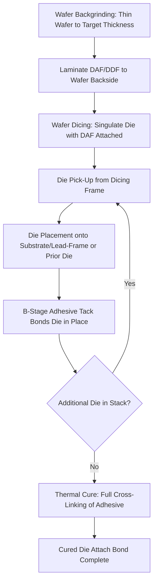

## Die Attach Film and Adhesive Materials

### Overview

**Key Points**

- Die attach materials mechanically and, in many cases, thermally and/or electrically connect a die to its substrate, lead-frame, or another die (in stacked-die configurations), forming the foundational bonding interface beneath wire-bond or other interconnect structures
- **Die Attach Film (DAF)** — a pre-formed adhesive film laminated to the wafer backside prior to dicing — has become the dominant die attach method for advanced packaging, particularly for stacked-die and thin-die applications, largely displacing liquid/paste die attach adhesives in high-volume, high-reliability contexts
- Material selection spans several functional categories: **non-conductive DAF/adhesive** for standard electrical isolation applications, **electrically conductive adhesive (ECA)** for applications requiring die-to-substrate electrical connection, and **thermally conductive (but electrically insulating) adhesive** for power/thermal management applications
- Die attach material properties directly affect package reliability (die crack resistance, delamination resistance), thermal performance, and manufacturability (die pick-up yield, stacking accuracy in multi-die packages)

---

### Die Attach Film (DAF) vs. Paste/Liquid Adhesive

**Key Points**

- **DAF** is manufactured as a uniform-thickness adhesive film, laminated onto the wafer backside before dicing (or in some flows, applied to individual singulated die), providing highly consistent bond line thickness (BLT) across all die from a given wafer/lamination lot
- **Paste/liquid adhesive** is dispensed onto the substrate or lead-frame just prior to die placement, offering formulation and dispense-volume flexibility but with generally less consistent bond line thickness control and greater sensitivity to dispense pattern, volume, and die placement force
- DAF's superior thickness uniformity is particularly valuable for **stacked-die packages**, where consistent, thin, and reproducible bond lines across multiple stacked die layers are essential for controlling overall package height and maintaining uniform mechanical/thermal performance across all die interfaces in the stack
- Paste adhesives remain used in applications where DAF's pre-lamination process integration is less advantageous — for example, some lower-volume, larger-die, or non-standard form factor applications where dispense flexibility outweighs DAF's thickness-uniformity benefit

**Comparative DAF vs. paste adhesive attributes:**

| Attribute | Die Attach Film (DAF) | Paste/Liquid Adhesive |
| --- | --- | --- |
| Bond line thickness control | High uniformity (pre-formed film) | Variable (dispense/placement dependent) |
| Stacked-die suitability | Well-suited, widely used | Less consistent for multi-die stacks |
| Process integration point | Wafer backside lamination pre-dicing | Dispensed at die placement |
| Formulation/dispense flexibility | Lower (fixed film properties) | Higher (adjustable dispense volume/pattern) |
| Voiding risk | Generally lower (uniform pre-formed layer) | Higher (dispense pattern/void entrapment dependent) |
| Typical high-volume application | Mobile/consumer stacked-die, standard flip-chip-adjacent attach | Larger die, specialized/lower-volume applications |

---

### DAF Manufacturing and Application Process

**Key Points**

- DAF is manufactured as a multi-layer film structure: typically a release liner, the adhesive layer itself (often a B-stage, partially cured thermosetting adhesive), and sometimes a dicing-tape-integrated backing for combined dicing/die-attach film (DDF) products that streamline wafer processing
- The adhesive layer is formulated to be in a **B-stage** condition during wafer lamination and dicing — partially cured, tacky enough for die pick-up and placement handling, but not yet fully cross-linked — with final cure occurring during a dedicated post-placement thermal cure step
- For stacked-die applications, DAF is often laminated as part of a combined dicing-die-attach film (DDF) that integrates the dicing tape and die attach adhesive into a single laminated structure, simplifying wafer-level process flow by eliminating a separate die attach film lamination step after dicing tape removal

**Standard DAF process flow:**

---

### Material Formulation Categories

**Key Points**

- **Non-conductive DAF/adhesive** — the most common category, used where the die attach layer only needs to provide mechanical bonding and electrical isolation between the die backside and substrate/lead-frame, typically epoxy or polyimide-based thermosetting adhesive systems with filler loading tuned for CTE matching and thermal conductivity balance similar in principle to mold compound and underfill filler engineering
- **Electrically Conductive Adhesive (ECA)** — formulated with conductive filler (commonly silver flake or silver-coated particles) at sufficient loading to achieve percolation-threshold electrical conductivity through the cured adhesive, used where the die backside must be electrically connected to the substrate or lead-frame (e.g., for die backside ground or bias connection in certain device types)
- **Thermally conductive, electrically insulating adhesive** — formulated with thermally conductive but electrically insulating filler (e.g., aluminum oxide, boron nitride) to maximize heat transfer from die to substrate/lead-frame without introducing an electrical connection, relevant for power device and high-heat-flux applications where thermal path optimization is a primary die attach design driver

**Comparative formulation categories:**

| Category | Primary Filler Type | Primary Function | Typical Application |
| --- | --- | --- | --- |
| Non-conductive (standard) | Silica or similar, moderate loading | Mechanical bond, electrical isolation | General-purpose die attach |
| Electrically conductive (ECA) | Silver flake/coated particles | Die-to-substrate electrical path | Backside ground/bias connection applications |
| Thermally conductive, electrically insulating | Al₂O₃, BN, or similar | Maximize heat transfer, maintain isolation | Power devices, high-heat-flux applications |

---

### Key Material Properties and Reliability Considerations

**Key Points**

- **Bond line thickness (BLT) control** — thinner, more uniform bond lines generally reduce thermal resistance across the die attach interface and, for stacked-die packages, directly determine achievable overall package height; DAF's manufacturing consistency is a primary reason for its dominance in thickness-critical, stacked-die applications
- **Void content** — voids within the cured die attach layer create localized thermal resistance hotspots and mechanical stress concentration points, directly analogous to void concerns in underfill and mold compound applications; void-free or low-void attach is particularly critical for power devices where thermal path integrity directly affects device performance and reliability
- **Die crack resistance during cure and thermal cycling** — die attach adhesive modulus and cure shrinkage behavior must be controlled to avoid inducing excessive stress on the die during cure or subsequent thermal cycling, since die cracking originating at the attach interface is a known failure mode, particularly relevant for thinned die used in stacked-die packages where die thickness (and thus inherent mechanical robustness) is substantially reduced
- **Adhesion reliability across the operating temperature range** — die attach adhesive must maintain sufficient adhesion strength to both the die backside and the substrate/lead-frame surface across the full specified operating and storage temperature range, with delamination at either interface representing a reliability failure mode that can propagate into wire bond or other downstream interconnect failures

---

### Stacked-Die Specific Considerations

**Key Points**

- Multi-die stacked packages (common in memory stacking and some logic-plus-memory combinations) place particular emphasis on DAF's thickness uniformity, since cumulative bond line thickness variation across multiple stacked die layers directly compounds into overall package height variation
- Thin-die handling combined with DAF adhesion characteristics must be jointly optimized, since progressively thinner die (required to keep multi-die stack height within package height budget) are correspondingly more fragile and sensitive to stress induced during die attach placement, cure, and subsequent processing
- Wire bond loop height and bond pad access in stacked-die configurations depend on precise, predictable die-to-die offset (often achieved via staggered stacking with DAF spacer layers of controlled thickness), making DAF thickness consistency directly relevant not just to die attach reliability but to downstream interconnect process feasibility

---

### Comparison to Adjacent Package Materials

**Key Points**

- Die attach materials share underlying materials-science principles with mold compounds and underfill (epoxy resin matrix, filler engineering for CTE/thermal property tuning, coupling agent use for filler-resin adhesion), but are formulated specifically for controlled thin-film or paste application at the die-to-substrate interface rather than for bulk encapsulation (mold compound) or narrow-gap capillary flow (underfill)
- Unlike mold compound and underfill, which are typically fully cured in a single process step following their respective application methods, DAF's B-stage intermediate cure state is a defining formulation characteristic, specifically engineered to support the wafer lamination → dicing → pick-and-place → final cure process sequence unique to film-based die attach

---

**Related Topics**

- Mold Compound Formulation and Filler Engineering
- Underfill and Capillary Flow Material Design
- Wafer Backgrinding and Thin-Die Handling Techniques
- Stacked-Die Package Architecture and Wire Bond Loop Design
- Thermal Interface Material (TIM) Selection for Power Applications
- Void Detection via Acoustic Microscopy (C-SAM)
- CTE Matching Strategies Across Package Material Systems
- Dicing-Die-Attach Film (DDF) Integrated Process Flow