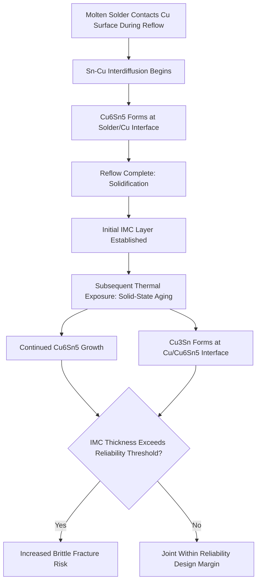

## Interconnect Metallurgy: Copper, Solder Alloys, and Intermetallics

### Overview

**Key Points**

- Interconnect metallurgy governs the electrical and mechanical joint formed between a die and its package substrate, encompassing the copper structures (pillars, traces, RDL), the solder alloy that forms the reflowed joint, and the intermetallic compound (IMC) layers that form at the copper-solder interface
- Since the industry-wide transition away from lead-based solders (driven primarily by RoHS and related environmental regulation), **lead-free solder alloys** — predominantly tin-silver-copper (SAC) systems — have become the standard for the vast majority of interconnect applications
- **Intermetallic compound (IMC) formation** at the copper-to-solder interface is both necessary (IMC bonding is what creates a true metallurgical joint rather than a simple mechanical contact) and a reliability concern (excessive or brittle IMC growth is a primary driver of interconnect fatigue failure)
- As interconnect pitch continues to shrink toward copper pillar and hybrid bonding structures, the volume fraction of the joint occupied by IMC increases substantially, making IMC growth kinetics and morphology control an increasingly first-order reliability consideration rather than a secondary concern

---

### Copper in Interconnect Structures

**Key Points**

- Copper serves multiple interconnect roles: as **redistribution layer (RDL) traces** carrying signal/power routing, as **copper pillars** forming the primary vertical interconnect between die and substrate (increasingly displacing traditional solder bumps), and as the **under-bump metallization (UBM)** layer providing a controlled, adhesion-promoting interface beneath solder bump structures
- Copper pillar interconnects offer several advantages over traditional eutectic or high-lead solder bumps: finer achievable pitch (since the copper pillar's rigid, well-defined geometry allows tighter bump spacing than a reflow-formed solder ball shape permits), improved current-carrying capacity, and better electromigration resistance due to copper's superior electromigration characteristics compared to solder alone
- A typical copper pillar structure includes a copper pillar body, a thin solder cap (or solder alloy layer) at the pillar tip to enable reflow bonding to the substrate pad, and often a nickel barrier layer between the copper pillar and solder cap to control and limit intermetallic compound growth during reflow and subsequent thermal exposure

---

### Solder Alloy Systems

**Key Points**

- **SAC (Tin-Silver-Copper) alloys** — the dominant lead-free solder family, with common compositions including SAC305 (Sn-3.0Ag-0.5Cu) and SAC405 (Sn-4.0Ag-0.5Cu) among others; silver content affects mechanical strength and melting behavior, while the small copper addition helps stabilize IMC formation and reduce excessive copper dissolution from adjacent copper structures during reflow
- **Eutectic and near-eutectic tin-lead (SnPb)** solders remain used in specific legacy, aerospace/defense, or other RoHS-exempt applications, offering well-characterized reliability behavior and lower melting point compared to SAC alloys, but are increasingly a minority use case in mainstream commercial electronics
- **Low-silver and no-silver alloy variants** (e.g., SAC105, SnCu-based alloys) are used in some applications to reduce material cost or tune mechanical compliance (lower silver content generally reduces solder stiffness, which can be beneficial for certain drop-shock reliability requirements in mobile applications), at some trade-off in creep resistance and high-temperature mechanical strength compared to higher-silver SAC alloys
- **High-temperature solder alternatives** (e.g., gold-based, bismuth-containing, or other specialty alloy systems) are used in specific applications requiring higher reflow/operating temperature capability than standard SAC systems provide, such as sequential reflow processes in multi-die stacked packages where earlier-formed joints must survive the reflow temperature of subsequently formed joints

**Comparative solder alloy attributes:**

| Alloy System | Representative Composition | Melting Point (approx.) | Typical Application Context |
| --- | --- | --- | --- |
| Eutectic SnPb | Sn-37Pb | ~183°C | Legacy, RoHS-exempt applications |
| SAC305 | Sn-3.0Ag-0.5Cu | ~217-220°C | General-purpose lead-free standard |
| SAC105 | Sn-1.0Ag-0.5Cu | ~217-220°C | Drop-shock-sensitive (mobile) applications, cost reduction |
| High-Ag SAC (e.g., SAC405) | Sn-4.0Ag-0.5Cu | ~217-220°C | Higher mechanical strength/creep resistance requirements |

[Inference] Melting point ranges are approximate and can vary somewhat by exact alloy composition and measurement methodology; precise phase transition temperatures should be verified against specific alloy supplier datasheets or established solder phase diagram references for design-critical applications.

---

### Intermetallic Compound (IMC) Formation

**Key Points**

- When molten tin-based solder contacts a copper surface during reflow, tin and copper atoms diffuse across the interface and react to form intermetallic compounds — primarily **Cu₆Sn₅** (forms first, at the solder/copper interface during reflow) and **Cu₃Sn** (forms secondarily, typically at the copper/Cu₆Sn₅ interface, growing more prominently during subsequent solid-state thermal aging after the initial reflow)
- IMC formation is metallurgically necessary for a true solder joint: the IMC layer is what constitutes the actual chemical/metallurgical bond between the solder and the copper structure, as opposed to a simple physical contact interface that would lack real bond strength
- However, IMC compounds are inherently more brittle than either the surrounding copper or solder, and **excessive IMC layer thickness** — whether from reflow process conditions or accumulated solid-state growth during extended thermal exposure/aging — increases the joint's susceptibility to brittle fracture under mechanical stress, particularly under high strain-rate loading such as drop or shock events
- IMC growth continues during solid-state thermal aging (elevated temperature storage/operation after initial reflow) following approximately diffusion-controlled kinetics, meaning IMC layer thickness increases progressively over a package's thermal history, not just during the initial reflow event — a critical consideration for long-service-life reliability prediction

**IMC growth process (conceptual):**

---

### Nickel Barrier Layers and IMC Growth Control

**Key Points**

- A thin nickel (Ni) barrier layer is commonly incorporated between the copper structure (pillar, UBM, or substrate pad) and the solder, specifically to slow the rate of copper-tin interdiffusion and thereby control IMC growth kinetics
- With a nickel barrier present, the primary IMC that forms is typically a nickel-tin compound (e.g., Ni₃Sn₄) rather than the copper-tin compounds that would form at a direct copper-solder interface, and nickel-tin IMC generally grows more slowly than copper-tin IMC under comparable thermal conditions, extending the joint's usable reliability life for a given thermal exposure history
- Nickel barrier layer thickness and quality (e.g., absence of pinhole defects that would allow localized direct copper-solder contact) directly affect the barrier's long-term effectiveness; a compromised or insufficiently thick nickel barrier can permit localized copper-tin IMC formation even in a nominally nickel-barrier-protected structure

---

### Copper Pillar with Solder Cap: Structural Cross-Section

(svg_diagram)

<svg xmlns="http://www.w3.org/2000/svg" viewBox="0 0 560 340" font-family="Helvetica, Arial, sans-serif">
<text x="280" y="26" text-anchor="middle" font-size="16" font-weight="bold" fill="#1a1a1a">Cu Pillar Interconnect Structure (svg_diagram)</text>

<rect x="150" y="45" width="260" height="35" fill="#607d8b" stroke="#37474f" stroke-width="1.5" />
<text x="280" y="67" text-anchor="middle" font-size="11" fill="#fff">Die (RDL / UBM)</text>

<rect x="240" y="80" width="80" height="90" fill="#d2691e" stroke="#8b4513" stroke-width="1.5" />
<text x="280" y="130" text-anchor="middle" font-size="10" fill="#fff">Cu Pillar</text>

<rect x="240" y="170" width="80" height="10" fill="#bdbdbd" stroke="#616161" stroke-width="1" />
<text x="380" y="178" font-size="9" fill="#555">Ni barrier</text>

<rect x="240" y="180" width="80" height="8" fill="#9575cd" stroke="#5e35b1" stroke-width="0.75" />
<text x="380" y="187" font-size="9" fill="#5e35b1">IMC layer</text>

<ellipse cx="280" cy="210" rx="45" ry="25" fill="#c0c0c0" stroke="#808080" stroke-width="1.5" />
<text x="280" y="214" text-anchor="middle" font-size="9" fill="#333">Solder Cap</text>

<rect x="240" y="235" width="80" height="8" fill="#9575cd" stroke="#5e35b1" stroke-width="0.75" />

<rect x="230" y="243" width="100" height="15" fill="#ffb74d" stroke="#e65100" stroke-width="1" />
<text x="380" y="253" font-size="9" fill="#e65100">Substrate Cu pad</text>

<rect x="120" y="258" width="320" height="40" fill="#ffcc80" stroke="#e65100" stroke-width="1.5" />
<text x="280" y="282" text-anchor="middle" font-size="10" fill="#e65100">Package Substrate</text>

<rect x="60" y="320" width="14" height="14" fill="#d2691e" />
<text x="80" y="331" font-size="10" fill="#333">Cu Pillar</text>
<rect x="180" y="320" width="14" height="14" fill="#bdbdbd" />
<text x="200" y="331" font-size="10" fill="#333">Ni Barrier</text>
<rect x="300" y="320" width="14" height="14" fill="#9575cd" />
<text x="320" y="331" font-size="10" fill="#333">IMC (Cu-Sn or Ni-Sn)</text>
<rect x="440" y="320" width="14" height="14" fill="#c0c0c0" />
<text x="460" y="331" font-size="10" fill="#333">Solder</text>
</svg>

---

### Reliability Implications

**Key Points**

- **Electromigration** — at high current density, particularly relevant in fine-pitch copper pillar structures carrying substantial current in a small cross-sectional area, directional atomic migration under electrical current flow can cause void formation on the cathode side and hillock/extrusion formation on the anode side of an interconnect, potentially leading to open-circuit or short-circuit failure over extended operation; copper's superior electromigration resistance relative to solder alone is a key driver for copper pillar adoption over traditional solder-ball-dominant interconnects
- **Thermal cycling fatigue** — CTE mismatch between die and substrate drives cyclic mechanical strain in the solder joint during thermal cycling; solder alloy mechanical properties (creep resistance, fatigue ductility) directly determine cycles-to-failure under a given thermal cycling profile, with alloy selection (e.g., silver content in SAC alloys) representing a direct design lever for tuning this reliability characteristic
- **Kirkendall voiding** — the differential diffusion rates of copper and tin during IMC formation can lead to vacancy accumulation and void formation (Kirkendall voids) near the IMC/copper interface, particularly associated with Cu₃Sn formation during extended thermal aging; excessive Kirkendall void density can weaken the joint independent of IMC brittleness concerns
- **Brittle fracture under high strain-rate loading** — excessive IMC thickness increases susceptibility to brittle interfacial fracture specifically under high strain-rate mechanical loading (drop, shock events), which is a distinct failure mode from the more gradual fatigue cracking associated with thermal cycling, making IMC thickness control particularly important for mobile and portable electronics reliability qualification

---

### Interconnect Metallurgy Trends

**Key Points**

- As interconnect pitch continues shrinking toward hybrid bonding structures (direct copper-to-copper bonding without an intervening solder layer, used in advanced 3D stacking applications), the entire solder/IMC paradigm described above is bypassed for those specific interconnect types, replaced by solid-state copper-to-copper diffusion bonding — representing a fundamentally different metallurgical joint formation mechanism relevant primarily to the finest-pitch 3D stacking applications rather than conventional flip-chip bump/pillar interconnects
- For continuing solder-based interconnects at shrinking pitch, the IMC layer's volume fraction of total joint volume increases as overall joint size decreases (since IMC thickness does not scale down proportionally with joint size as readily as bulk solder volume does), making IMC growth control progressively more consequential to joint reliability at finer pitches
- Alloy and barrier layer formulation continues to be an active area of development specifically targeting extended reliability life under the combined thermal cycling and current density demands of modern high-performance computing and AI accelerator packages, where both electromigration and thermal fatigue considerations are simultaneously more demanding than in prior-generation lower-power, lower-pitch-density applications

---

**Related Topics**

- Hybrid Bonding and Copper-to-Copper Direct Bonding
- Electromigration Fundamentals in Fine-Pitch Interconnects
- Underfill and Capillary Flow Material Design
- Flip-Chip Bump and Copper Pillar Design Rules
- Thermal Cycling Fatigue and Solder Joint Reliability Testing
- Under-Bump Metallization (UBM) Structure and Function
- Reflow Process Profile Design for Multi-Die Sequential Bonding
- Low-k Dielectric Interaction with Interconnect-Induced Package Stress