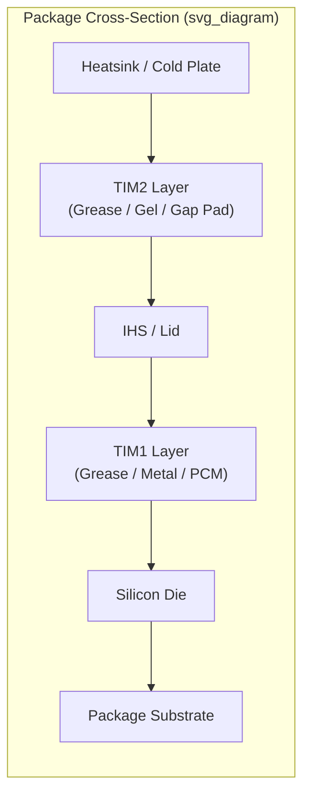

## Thermal Interface Materials: Greases, Gels, Metals, and Phase-Change Materials

### Overview and Role in the Package Thermal Stack

A thermal interface material (TIM) is a compliant medium inserted between two solid surfaces to displace air gaps and reduce the total thermal resistance of a heat-flow path. In advanced packaging, TIMs sit at two principal locations:

- **TIM1**: between the die (or lid-side of the die) and the integrated heat spreader (IHS)/lid
- **TIM2**: between the IHS/lid and the external heatsink or cold plate

Because both mating surfaces exhibit microscopic roughness, waviness, and (in multi-die or 2.5D/3D assemblies) height variation across the package, a rigid solid-to-solid contact would trap air pockets. Air has thermal conductivity around $0.026\ \text{W/(m·K)}$, roughly three orders of magnitude below metals, so even sub-micron air gaps dominate contact resistance. The TIM's job is to conform to both surfaces, wet out the asperities, and provide a continuous conduction path with the highest practical bulk conductivity and lowest possible bond line thickness (BLT).

### Thermal Resistance Model

The total interface thermal resistance is commonly modeled as:

$$R_{TIM} = \frac{BLT}{k \cdot A} + R_{c1} + R_{c2}$$

where $BLT$ is bond line thickness, $k$ is the bulk thermal conductivity of the TIM, $A$ is the contact area, and $R_{c1}$, $R_{c2}$ are the contact resistances at each interface (die-to-TIM and TIM-to-lid). This decomposition matters because a material can have excellent bulk $k$ but poor performance if its contact resistance is high (e.g., due to poor wetting or high viscosity preventing full surface contact).

**Key Points**

- Minimizing $R_{TIM}$ requires jointly minimizing BLT, maximizing $k$, and minimizing contact resistance — these three levers often trade against each other.
- Contact resistance typically dominates for low-viscosity, well-wetting materials at thin BLT; bulk resistance dominates for thick, high-conductivity gap-filler applications.
- Pump-out and dry-out over thermal cycling primarily degrade the $BLT/(k \cdot A)$ term by increasing effective BLT or reducing effective $k$ through void formation.

### Category 1: Thermal Greases

Thermal greases are suspensions of thermally conductive filler particles (typically metal oxides, metal nitrides, or silver) in a silicone or non-silicone (hydrocarbon/synthetic oil) carrier matrix.

**Composition and Filler Systems**

- Common fillers: aluminum oxide ($Al_2O_3$), zinc oxide (ZnO), boron nitride (BN), aluminum nitride (AlN), and silver (Ag) flakes/particles for premium formulations.
- Carrier: polydimethylsiloxane (PDMS) oils for silicone-based greases; synthetic hydrocarbon or ester oils for silicone-free formulations (used where silicone outgassing/migration is a contamination concern, e.g., near optical components or connector contacts).
- Loading fraction is tuned to balance thermal conductivity against viscosity/pumpability; typical bulk conductivities range from roughly $1$–$8\ \text{W/(m·K)}$ for oxide/nitride-filled greases, and up to $\sim 8$–$12\ \text{W/(m·K)}$ for silver-filled high-performance greases.

**Mechanical and Application Characteristics**

- Applied as a thin, uncured, flowable paste; achieves very low BLT (often $< 25\ \mu\text{m}$) because it conforms under modest clamping pressure without curing shrinkage.
- No mechanical adhesion — held in place purely by capillary/wetting forces and the compressive clamp load of the heatsink assembly.
- Dispensed via syringe, stencil, or automated dot/line/spiral patterns designed to spread evenly under clamp-down without trapping air or overflowing onto the substrate.

**Failure Modes**

- **Pump-out**: repeated thermal cycling causes differential CTE (coefficient of thermal expansion) mismatch between die, TIM, and lid, producing a "pumping" mechanical action at the interface that progressively displaces grease outward, thinning the BLT at the center and increasing it at the edges — degrading $R_{TIM}$ over device lifetime.
- **Dry-out**: volatile carrier components evaporate over time/temperature, increasing effective viscosity and reducing conformability, which raises contact resistance.
- [Inference] Silicone-free greases are generally selected specifically to mitigate long-term dry-out and outgassing-related contamination risk in sealed or optically sensitive assemblies, though exact degradation rates are formulation- and application-condition-dependent.

**Example**

A typical CPU TIM1 application: grease dispensed as a small dot or spiral pattern (~2–5 mg) at package center, spread to a thin uniform film ($15$–$50\ \mu\text{m}$ BLT) upon lid attach under controlled clamp force, achieving thermal resistance in the range of roughly $0.05$–$0.15\ °\text{C·cm}^2/\text{W}$ depending on filler system and BLT control.

### Category 2: Gap Fillers and Gels

Gap pads (gap fillers) and thermal gels are softer, often pre-cured or partially cured silicone (or silicone-free elastomer) materials designed to accommodate larger, variable gaps between components of differing heights — common in multi-die modules, memory stacks, and board-level assemblies with height tolerance stack-up.

**Gap Pads**

- Supplied as pre-formed sheets of filled silicone elastomer, die-cut to shape, with conductivities typically $1$–$6\ \text{W/(m·K)}$ (higher for specialty ceramic- or metal-filled pads).
- Compressible (commonly 10–50% compression under assembly force) to conform to height variation across multiple components without requiring tight mechanical tolerances.
- Mechanically robust and easy to rework/replace since they are solid at room temperature — advantageous for manufacturing and repair but at the cost of somewhat higher bulk thermal resistance than greases at comparable BLT (elastomer matrices generally have lower intrinsic conductivity than thin liquid films).

**Thermal Gels**

- Two-part, dispensed-and-cured (typically low-temperature or room-temperature cure) silicone systems that combine grease-like initial flowability (enabling low BLT and good wetting) with post-cure elastomeric properties (eliminating pump-out risk since the cured gel does not flow under thermal cycling stress).
- Cure mechanism is usually addition-cure (platinum-catalyzed hydrosilylation), which is sensitive to certain contaminants (sulfur compounds, amines, tin-based catalysts) that can inhibit cure — a process control consideration in mixed-material assembly lines.
- Bridges the performance gap between grease (best initial $k$ and BLT) and gap pad (best long-term mechanical stability), commonly used for TIM2 or module-level applications with moderate gap tolerances.

**Key Points**

- Gap pads trade thermal performance for mechanical robustness and manufacturing tolerance to height variation.
- Gels trade some of the low-BLT advantage of grease for elimination of pump-out failure mode via post-application cure.
- Selection between grease, gel, and pad is frequently driven by the height tolerance stack-up of the assembly (uniform, tightly controlled gaps favor grease; variable gaps favor pads or thicker gels).

### Category 3: Metal-Based TIMs

Metal TIMs use low-melting-point alloys or engineered metal structures to exploit the intrinsically high thermal conductivity of metals (typically $20$–$80\ \text{W/(m·K)}$ for solder-type TIMs, versus single-digit $\text{W/(m·K)}$ for polymer-based TIMs).

**Solder TIMs (Metal TIMs / mTIMs)**

- Common alloys: indium (In) and indium-based alloys (e.g., In-Ag), tin-based alloys, and bismuth-based low-melt alloys.
- Applied as a preform or paste, reflowed to wet both the die backside (typically requiring a metallized/solderable finish such as Ti/Ni/Au or similar) and the lid, forming a true metallurgical bond rather than a mechanically-clamped interface.
- Achieves the lowest bulk thermal resistance of any TIM category due to high $k$ and can achieve thin, well-controlled BLT via reflow.

**Advantages**

- Highest bulk thermal conductivity among common TIM classes.
- Metallurgical bond eliminates pump-out (no viscous flow mechanism under thermal cycling in the way greases exhibit).
- Excellent long-term reliability when properly qualified, since there is no organic carrier to dry out.

**Challenges**

- **CTE mismatch and fatigue**: silicon die (CTE $\approx 2.6\ \text{ppm/°C}$), solder TIM, and copper/aluminum lid (CTE $\approx 17$–$24\ \text{ppm/°C}$) have substantially different thermal expansion coefficients. Repeated thermal cycling induces shear strain in the rigid metal bond, which can lead to fatigue cracking and delamination over device lifetime — this is the dominant reliability failure mode for metal TIMs.
- Requires metallization/solderable surface preparation on both the die backside and lid, adding process steps and cost versus a simple grease dispense.
- Reflow process introduces thermal budget and potential warpage considerations for large die or thin packages.
- Indium is a comparatively expensive and supply-constrained material, a cost/sourcing factor in high-volume adoption decisions. [Unverified: exact current market pricing and supply dynamics vary and should be checked against current sourcing data.]

**Example**

High-performance server and GPU packages have used indium-based metal TIM1 specifically because die power densities exceeding roughly $1\ \text{W/mm}^2$ push polymer-based TIM bulk resistance to an unacceptable fraction of total junction-to-ambient thermal resistance; the metallurgical bond's low bulk resistance is needed to keep junction temperature within specification despite the added CTE-fatigue reliability engineering burden.

### Category 4: Phase-Change Materials (PCMs)

Phase-change TIMs are solid at room temperature (facilitating clean handling, pick-and-place, and dry assembly) but transition to a low-viscosity, flowable state at or near device operating temperature (typically formulated to transition in the range of roughly $45$–$60\ °\text{C}$).

**Composition**

- Base materials are typically paraffin waxes or low-melting-point polymer resins, loaded with thermally conductive filler (similar filler chemistry to greases: ceramic oxides, nitrides, sometimes metal particles).
- Supplied as a solid pre-form (film or pad) applied dry during assembly.

**Operating Principle**

- At room temperature, the PCM behaves as a solid, allowing standard pick-and-place handling without the mess or dispense-control challenges of wet grease.
- Once the device powers on and the interface reaches the phase-transition temperature, the PCM softens and flows under the clamp load of the heatsink, wetting out surface asperities and reducing effective BLT — approaching grease-like conformability without requiring a wet-dispense process step.
- Upon cooldown, the material re-solidifies, which can help resist pump-out relative to a permanently liquid-phase grease, since flow only occurs above the transition temperature.

**Trade-offs**

- Initial (pre-power-on) thermal performance is poor since the material has not yet phase-changed; this generally is not a practical concern since the interface reaches operating temperature quickly after power-on in most use cases.
- Reflow/re-flow behavior over many power cycles is formulation-dependent; some PCMs are engineered for a single "reflow and set" behavior optimized at first power-on, with more limited conformability improvement on subsequent cycles. [Inference] This makes initial assembly clamp force and flatness control particularly important for PCM interfaces, since later thermal cycling may not fully compensate for an initially poor bond line.
- Bulk conductivity is generally comparable to or somewhat below filled greases (commonly in the $1$–$5\ \text{W/(m·K)}$ range), since the matrix chemistry (wax/resin) is not fundamentally more conductive than silicone/hydrocarbon oils.

**Key Points**

- PCM's principal manufacturing advantage is dry, clean handling versus wet grease dispense, which simplifies automated assembly and reduces mess-related yield loss.
- PCM's principal performance advantage over static gap pads is closer-to-grease BLT once the interface has cycled through its transition temperature at least once.

### Comparative Summary

| Attribute | Grease | Gel | Gap Pad | Metal (Solder) | Phase-Change |
| --- | --- | --- | --- | --- | --- |
| Typical $k$ (W/(m·K)) | 1–12 | 2–6 | 1–6 | 20–80 | 1–5 |
| Typical BLT | Very thin | Thin–moderate | Moderate–thick | Very thin | Thin (post-transition) |
| Cure/Bond | None (mechanical) | Chemical cure | None (compression) | Metallurgical (reflow) | Physical phase change |
| Pump-out risk | High | Low (cured) | None | None | Low |
| Handling | Wet dispense | Wet dispense + cure | Dry, pre-formed | Reflow process | Dry, pre-formed |
| Rework ease | Moderate | Difficult (cured) | Easy | Difficult | Moderate |
| Primary reliability risk | Pump-out, dry-out | Cure inhibition | Compression set | CTE fatigue crack | Reflow limitations |

### Selection Criteria in Package Design

- **Power density**: high power density (>1 W/mm²) pushes selection toward metal TIMs where bulk resistance becomes the dominant term.
- **Height tolerance stack-up**: variable or loosely toleranced gaps favor gap pads or thicker-BLT gels; tightly controlled, uniform gaps allow thin-BLT greases or PCMs.
- **Reliability/lifetime requirements**: automotive and long-lifecycle industrial applications often avoid greases prone to pump-out in favor of gels, PCMs, or metal TIMs, depending on power density.
- **Manufacturing process fit**: high-volume automated assembly favors dry, pre-formed materials (gap pads, PCM films) over wet dispense (grease, gel) to reduce process variability and cleaning steps.
- **Contamination sensitivity**: silicone-free formulations are selected where silicone outgassing risks contaminating adjacent optical or electrical contact surfaces.

### Illustrative Cross-Section Diagram

### Related Topics

- Bond line thickness (BLT) control and clamp-force engineering in heatsink attach processes
- CTE mismatch and fatigue modeling in metallurgically bonded interfaces
- Voiding and reliability testing methods for TIMs (X-ray, C-SAM/acoustic microscopy)
- Thermal resistance measurement standards (e.g., ASTM D5470) for TIM characterization
- Vapor chamber and heat pipe integration with TIM2 interfaces
- Liquid metal TIMs (gallium-based alloys) and galvanic corrosion considerations
- Die backside metallization schemes for solder TIM compatibility
- Thermal simulation and compact modeling of TIM contribution to junction-to-ambient resistance