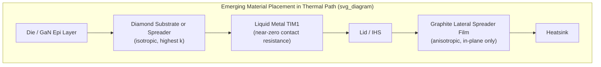

## Emerging Thermal Materials: Liquid Metal, Graphene, and Diamond

### Overview and Motivation

Conventional thermal interface materials (polymer-bound greases, gels, gap pads) and even solder-based metal TIMs are approaching intrinsic limits as power densities in advanced packages climb — driven by 2.5D/3D integration, chiplet stacking, and high-performance compute/AI accelerator die exceeding $1$–$2\ \text{W/mm}^2$. Three material classes are being pursued specifically because their intrinsic thermal conductivity exceeds that of any conventional filled-polymer or standard solder system by roughly one to two orders of magnitude: **liquid metals**, **graphene/graphitic carbon films**, and **synthetic diamond**. Each addresses the same underlying goal — reducing $R_{TIM} = BLT/(k \cdot A) + R_{c1} + R_{c2}$ — but through fundamentally different physical mechanisms, and each introduces distinct integration challenges that have so far limited them to niche or emerging production use rather than mainstream commodity adoption.

**Key Points**

- All three materials target the bulk-conductivity term ($k$) of the TIM resistance equation, since conventional filled polymers plateau around $1$–$12\ \text{W/(m·K)}$ while these materials offer $k$ values from roughly $20\ \text{W/(m·K)}$ (liquid metal) up to $>1000\ \text{W/(m·K)}$ (diamond, graphene in-plane).
- Adoption is gated less by raw thermal performance and more by integration reliability, cost, and manufacturability at scale — each material trades a thermal-performance gain for a new engineering risk.

### Liquid Metal Thermal Interface Materials

**Composition and Physical Properties**

Liquid metal TIMs are primarily gallium-based eutectic alloys — most commonly gallium-indium (Ga-In) and gallium-indium-tin (Galinstan-type Ga-In-Sn) — which remain liquid at or near room temperature (melting points typically below $20\ °\text{C}$ for common eutectic formulations). Their thermal conductivity, roughly $16$–$40\ \text{W/(m·K)}$ depending on exact alloy composition, is one to two orders of magnitude above silicone-based greases while their liquid state at operating temperature gives near-zero contact resistance through excellent surface wetting.

**Integration Approach**

- Applied similarly to grease (dispensed as a thin film) but without a polymer carrier — the pure metal alloy itself is the conductive and conforming medium.
- Because the material remains liquid indefinitely (rather than transitioning like a PCM), it maintains low BLT and full wetting across the device's operating temperature range without a phase-change threshold.
- Some commercial implementations use a thickened or gelled liquid-metal formulation (with a minor thickening additive) to reduce flow/migration risk while retaining most of the bulk conductivity advantage.

**Reliability Challenges**

- **Galvanic corrosion**: gallium readily forms intermetallic alloys with aluminum, which can cause severe corrosion/degradation if the liquid metal contacts an aluminum surface (heatsink fins, aluminum lids) without a diffusion barrier. Copper and nickel surfaces are generally more compatible but still require a barrier coating (commonly Ni or Ni/Au) for long-term reliability. [Inference] This compatibility constraint is the primary reason liquid metal TIMs have historically been restricted to enthusiast/niche cooling products and specific qualified industrial applications rather than broad commodity adoption.
- **Pump-out and migration**: as a true liquid at operating temperature, the material can migrate outward under repeated thermal cycling or vibration, or under capillary action along contamination paths on the board, unless well-contained by the mechanical design (dams, coatings, or a thickened formulation).
- **Electrical conductivity**: unlike polymer-based TIMs, liquid metal is electrically conductive, so any migration or spillage onto adjacent circuitry poses a short-circuit risk — a design and process-control consideration not present with silicone-based TIMs.

**Example**

A liquid-metal TIM1 applied between a high-power die and a nickel-plated copper lid, with the lid surface, die backside, and surrounding solder mask/dam structure specifically engineered to contain the material within the intended footprint and prevent contact with any aluminum-containing surface in the thermal path.

### Graphene and Graphitic Carbon Films

**Structure and Anisotropic Conductivity**

Graphene is a single-atom-thick sheet of sp²-bonded carbon atoms arranged in a hexagonal lattice. In practical TIM applications, materials are typically multi-layer graphene, graphite films, or pyrolytic graphite sheets (PGS) rather than true monolayer graphene, since single-layer graphene is impractical to manufacture and handle at package scale. These materials exhibit strongly **anisotropic** thermal conductivity: in-plane (along the sheet) conductivity can reach roughly $1500$–$5000\ \text{W/(m·K)}$ for high-quality graphene/graphite films — exceeding copper (~$400\ \text{W/(m·K)}$) by several times — while through-plane (across the stacked layers, the direction typically needed for TIM1/TIM2 applications) conductivity is dramatically lower, often only $5$–$20\ \text{W/(m·K)}$, because heat must hop between weakly-bonded (van der Waals) layers.

**Integration Approaches**

- **Heat-spreading films**: because of the strong in-plane conductivity, graphitic films are more commonly deployed as lateral heat-spreading layers embedded in or laminated onto lids, substrates, or heat spreaders — moving heat efficiently across the plane of the package before it transitions vertically through a conventional TIM — rather than as the primary through-thickness TIM1/TIM2 layer itself.
- **Composite/hybrid TIMs**: graphene or graphite flakes are incorporated as filler particles within polymer or elastomer matrices to boost the effective bulk conductivity of a gap-filler or grease beyond what oxide/nitride fillers alone achieve, while retaining the mechanical compliance of the polymer matrix.
- **Vertically-aligned graphene/carbon structures**: [Inference] a more advanced approach under research and early development orients graphitic sheets or carbon nanotube-like structures perpendicular to the substrate specifically to exploit the high in-plane conductivity in the through-thickness direction needed for TIM applications, though this remains largely a research/emerging manufacturing technique rather than a mainstream production process as of current public information.

**Trade-offs**

- The anisotropy mismatch (excellent in-plane, poor through-plane) is the central engineering challenge — a material engineered for one application (planar heat spreading) is not automatically suited to the orthogonal application (through-thickness TIM conduction) without additional structural engineering.
- Cost and manufacturing scale for high-quality, large-area, defect-minimized graphitic films remain higher than conventional filled-polymer sheets. [Unverified: exact cost-per-area figures are formulation- and supplier-dependent and should be checked against current market data.]

**Example**

A graphite heat-spreader film laminated onto the inner surface of an IHS lid to rapidly distribute heat laterally from a hot-spot region of a multi-die package before it passes vertically through a conventional TIM1 material into the lid bulk — improving effective spreading resistance without replacing the TIM1 material itself.

### Diamond as a Thermal Material

**Physical Basis**

Diamond (sp³-bonded carbon) has the highest bulk thermal conductivity of any known natural material, with high-quality single-crystal or high-purity polycrystalline synthetic diamond exhibiting thermal conductivity in the range of roughly $1000$–$2200\ \text{W/(m·K)}$ — several times higher than copper and comparable to or exceeding graphene's in-plane value, but critically **isotropic** (uniform in all directions), avoiding the anisotropy limitation of graphitic films.

**Manufacturing Routes**

- **Chemical Vapor Deposition (CVD) diamond**: polycrystalline diamond films are grown via CVD processes (commonly microwave-plasma-assisted or hot-filament CVD) directly onto or separately from the device, then integrated as a discrete spreader layer or, in more advanced approaches, grown directly onto the die backside or GaN/wide-bandgap semiconductor epitaxial stack.
- **Diamond-filled composites**: synthetic diamond particles (produced via high-pressure high-temperature, HPHT, synthesis, or CVD-derived diamond powder) are incorporated as filler in polymer or metal-matrix composite TIMs to raise effective bulk conductivity substantially above conventional oxide/nitride fillers, without requiring a full CVD diamond film process.

**Integration Applications**

- **GaN-on-diamond and wide-bandgap device substrates**: a prominent emerging application replaces or supplements the silicon or SiC substrate beneath GaN RF/power devices with a CVD diamond layer, addressing self-heating directly at the device level (rather than only at the package TIM level) because the heat-generating region is closest to the diamond layer, minimizing the thermal path length before reaching a high-$k$ material.
- **Diamond heat spreaders**: discrete diamond plates or films inserted between the hottest die (or hot-spot region of a multi-die package) and the lid/heatsink, functioning as a highly efficient lateral and vertical heat-spreading layer for localized hot spots exceeding what a uniform lid material can adequately spread.

**Challenges**

- **Cost**: synthetic diamond material and CVD growth processes are substantially more expensive per unit area than conventional metals, polymers, or even graphitic films, historically restricting diamond thermal solutions to high-value applications (RF power amplifiers, specialized high-power modules) rather than commodity digital packaging.
- **Interface/adhesion engineering**: achieving low contact resistance between diamond and the semiconductor or metal it contacts requires careful interface engineering (nucleation layers, bonding techniques), since diamond's chemical inertness that gives it excellent thermal and electrical insulation properties also makes strong, low-resistance bonding to dissimilar materials non-trivial.
- **CTE mismatch**: diamond's CTE (~$1$–$2\ \text{ppm/°C}$) differs from silicon and especially from GaN or copper, introducing thermomechanical stress considerations analogous to (though smaller in magnitude than) the CTE mismatch challenges seen in metal TIMs.
- [Inference] Because of cost, diamond-based thermal solutions are likely to remain concentrated in high-power-density, high-value niches (RF/power electronics, select AI accelerator hot-spot mitigation) for the foreseeable term rather than displacing conventional TIMs broadly, though this depends heavily on future CVD manufacturing cost reduction.

### Comparative Summary

| Attribute | Liquid Metal | Graphene/Graphite Film | Diamond |
| --- | --- | --- | --- |
| Typical $k$ | 16–40 W/(m·K) | 1500–5000 W/(m·K) in-plane; 5–20 W/(m·K) through-plane | 1000–2200 W/(m·K), isotropic |
| Primary role | TIM1/TIM2 replacement | Lateral heat spreader / composite filler | Substrate-level or hot-spot spreader |
| Key failure/limit mode | Galvanic corrosion, migration, electrical shorting | Anisotropy mismatch for through-plane use | Cost, interface bonding, CTE mismatch |
| Electrical behavior | Conductive (short risk) | Conductive (carbon) | Excellent electrical insulator |
| Maturity | Niche commercial + industrial | Emerging commercial (spreaders), research (vertical structures) | High-value niche (RF/power), emerging GaN-on-diamond |

### Integration Path in the Thermal Stack

### Selection Criteria and Outlook

- **Power density and hot-spot severity**: extreme localized hot spots favor diamond spreaders or GaN-on-diamond substrates; broadly elevated but more uniform power density favors liquid metal TIM1 for its bulk conductivity gain without the cost of diamond.
- **Electrical isolation requirements**: applications where TIM proximity to exposed circuitry poses a short risk generally disfavor liquid metal unless containment structures are robust; diamond's electrical insulation is an advantage in RF/power contexts where the thermal path must remain electrically isolated.
- **Cost sensitivity**: consumer and mainstream digital packaging remain more cost-sensitive, favoring incremental improvement to conventional greases/gels/pads or graphite-filled composites over the higher cost of liquid metal containment engineering or diamond substrates.
- **Manufacturing scale-up**: [Speculation] broader adoption of any of these three materials in mainstream high-volume packaging likely depends on manufacturing cost reduction (CVD throughput for diamond, defect-free large-area graphene/graphite production, reliable low-cost containment/barrier coatings for liquid metal) more than on further gains in intrinsic material thermal performance, which are already substantially ahead of what current package architectures fully exploit.

### Related Topics

- GaN-on-diamond and wide-bandgap power device thermal management
- Vapor chamber and embedded heat pipe integration with emerging TIMs
- Galvanic corrosion mitigation and barrier coating design for liquid metal interfaces
- Vertically-aligned carbon nanostructure TIMs and carbon nanotube arrays
- CVD diamond growth processes (microwave-plasma vs. hot-filament) for semiconductor substrates
- Anisotropic thermal conductivity measurement techniques for graphitic films
- Cost-performance modeling for emerging TIM adoption in high-volume packaging
- Reliability qualification standards for novel TIM materials (thermal cycling, HAST, corrosion testing)