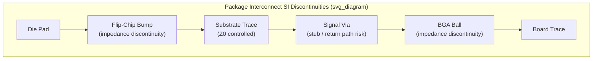

## Signal Integrity Fundamentals for Package Interconnects

### Overview

Signal integrity (SI) in advanced packaging concerns preserving the fidelity of high-speed electrical signals as they traverse package interconnects — die-to-substrate bonds (wirebond or flip-chip bumps/pillars), substrate traces and vias, package-to-package interconnects (e.g., through-silicon vias, interposer routing), and the substrate-to-board interface (BGA/LGA balls). As data rates climb into multi-Gb/s and tens-of-Gb/s ranges for modern SerDes, HBM, and chiplet-to-chiplet links, package-level parasitics that were once negligible now dominate the total channel budget. SI analysis quantifies how interconnect geometry, material properties, and topology distort signal amplitude, timing, and shape, and provides the design levers to keep those distortions within budget for reliable data recovery at the receiver.

**Key Points**

- At low frequencies, package interconnects can be approximated as ideal wires; at high frequencies, they must be treated as distributed transmission-line structures with frequency-dependent loss, reflection, and coupling behavior.
- The central SI design goal is delivering an "open eye" at the receiver — sufficient voltage margin and timing margin for the receiver to correctly sample each bit despite all distortion mechanisms in the channel.

### Transmission Line Behavior in Package Interconnects

**Why Transmission-Line Theory Applies**

A conductor behaves as a transmission line (rather than a lumped-element wire) when its physical length becomes a non-negligible fraction of the signal's wavelength — commonly, when the interconnect length exceeds roughly one-tenth of the signal's rise-time-equivalent wavelength. Given that modern signal rise times are in the tens-of-picoseconds range, even package-scale interconnects (millimeters to a few centimeters) fall into transmission-line regime for the frequency content relevant to signal edges.

**Characteristic Impedance**

The characteristic impedance $Z_0$ of a transmission line is determined by its per-unit-length inductance $L$ and capacitance $C$:

$$Z_0 = \sqrt{\frac{L}{C}}$$

For package traces (typically implemented as microstrip or stripline structures in substrate build-up layers), $Z_0$ depends on trace width, thickness, dielectric height, and dielectric constant ($D_k$). Common target impedances are $50\ \Omega$ single-ended or $100\ \Omega$ differential, matched to the driver/receiver and board-level channel to minimize reflections.

**Impedance Discontinuities**

Any local deviation from the nominal $Z_0$ — caused by via transitions, bond pad geometry, bump/pillar interconnects, connector transitions, or trace width changes — creates a reflection characterized by the reflection coefficient:

$$\Gamma = \frac{Z_L - Z_0}{Z_L + Z_0}$$

where $Z_L$ is the local impedance at the discontinuity. In package interconnects, common discontinuity sources include:

- Wirebond loop inductance transitions at the die pad and substrate finger
- Flip-chip bump/pillar arrays presenting localized capacitive loading
- Via stubs (unused portions of a plated via barrel beyond the signal layer) acting as resonant stub reflectors
- BGA/LGA ball transitions from package substrate to board

### Loss Mechanisms

**Conductor (Ohmic) Loss**

Resistive loss in the conductor increases with frequency due to the **skin effect** — at high frequency, current density concentrates near the conductor surface, with skin depth $\delta$ given by:

$$\delta = \sqrt{\frac{2\rho}{\omega \mu}}$$

where $\rho$ is resistivity, $\omega$ is angular frequency, and $\mu$ is permeability. As $\delta$ shrinks with increasing frequency, effective conductor cross-section decreases and AC resistance rises, producing frequency-dependent attenuation that increases with the square root of frequency in the skin-effect-dominated regime.

**Dielectric Loss**

The surrounding dielectric material (package substrate build-up film, mold compound near signal paths, or interposer dielectric) dissipates energy from the propagating field, characterized by the dielectric's **loss tangent** ($\tan\delta$). Dielectric loss increases linearly with frequency, and becomes the dominant loss mechanism (over conductor loss) at the higher end of the frequency spectrum relevant to multi-Gb/s and higher signaling, because dielectric loss scales with frequency to the first power while conductor loss scales more slowly.

**Insertion Loss**

The combined effect of conductor and dielectric loss is commonly characterized as insertion loss ($S_{21}$ in S-parameter terms), plotted versus frequency; package and channel designers typically budget insertion loss at the Nyquist frequency of the target data rate to ensure adequate signal amplitude survives to the receiver.

### Crosstalk

**Mechanism**

Crosstalk arises from electromagnetic coupling (mutual inductance and mutual capacitance) between adjacent signal traces or interconnects routed in close proximity — a significant concern in dense package routing where trace pitch is aggressively scaled to accommodate high I/O counts (e.g., HBM interfaces, chiplet die-to-die links).

- **Near-end crosstalk (NEXT)**: coupled noise appearing at the same end of the victim trace as the aggressor's driver.
- **Far-end crosstalk (FEXT)**: coupled noise appearing at the opposite end of the victim trace from the aggressor's driver; FEXT polarity and magnitude depend on the relative contributions of mutual inductance and mutual capacitance, which can partially cancel or reinforce depending on the coupling regime (backward- vs. forward-coupled structures).

**Mitigation Strategies**

- Increasing spacing between adjacent traces (trace-to-trace pitch) to reduce coupling coefficient — directly trading routing density for SI margin.
- Inserting ground shielding traces or ground via fences between aggressor and victim signals.
- Differential signaling, which inherently rejects common-mode coupled noise at the receiver (see below).
- Routing orthogonally on adjacent layers (e.g., alternating horizontal/vertical routing direction layer-to-layer) to minimize parallel-run coupling length.

### Differential Signaling

Most modern high-speed package interconnects (SerDes, HBM data lanes, PCIe, high-speed chiplet links) use **differential pairs** rather than single-ended signaling, for several SI-driven reasons:

- **Common-mode noise rejection**: a differential receiver responds to the voltage difference between the two lines; noise coupled equally onto both lines (common-mode) is rejected, providing substantial immunity to crosstalk, power supply noise, and other environmental coupling.
- **Reduced return-current discontinuity sensitivity**: the return current for a differential pair primarily flows in the complementary trace rather than solely relying on a solid reference plane, somewhat reducing (though not eliminating) sensitivity to reference-plane discontinuities.
- **Differential impedance control**: differential pairs are designed to a target differential impedance $Z_{diff}$ (commonly $100\ \Omega$), which depends on both the individual trace $Z_0$ and the coupling between the two lines of the pair — tighter coupling (closer spacing) lowers $Z_{diff}$ for a given individual trace geometry.

**Key Points**

- **Skew** (timing mismatch between the two lines of a differential pair) converts differential signal energy into common-mode energy, degrading the very noise immunity differential signaling is meant to provide — length-matching between the two lines of a pair is therefore a standard package routing constraint.
- Mode conversion (differential-to-common-mode) at package discontinuities is a specific SI analysis metric (often reported as mixed-mode S-parameters, e.g., $S_{cd21}$) used to verify pair symmetry through vias, bumps, and connector transitions.

### Return Path and Reference Plane Integrity

Every signal current requires a return current path; in package structures, this return path is typically the adjacent reference (ground or power) plane in the substrate stack-up. **Return path discontinuities** occur when a signal transitions between layers (via a via) without a corresponding low-impedance return path transition — for example, a signal via that changes reference planes without an adjacent ground via to carry the displacement return current. This forces return current to find an alternate, longer, higher-impedance path, increasing loop inductance and introducing additional reflection and radiated emission at the discontinuity.

**Mitigation**: placing ground/stitching vias adjacent to signal vias at layer transitions to provide a direct, low-inductance return path — a standard package and PCB design rule often specified as a maximum via-to-ground-via distance.

### Power Delivery Network (PDN) Interaction with SI

Although PDN design is often treated as a distinct discipline, it directly interacts with SI because voltage noise on power/ground planes (from switching current transients) modulates signal reference levels, contributing to a broader category of jitter and voltage noise sometimes termed **simultaneous switching noise (SSN)** or ground bounce. High-density I/O interconnects (e.g., flip-chip bump arrays with many simultaneously switching drivers) are particularly susceptible, since the collective $di/dt$ from many drivers switching together induces voltage droop across the parasitic inductance of the power delivery path — package designers mitigate this through decoupling capacitor placement, low-inductance power/ground via structures, and dedicated power/ground bump allocation adjacent to signal bumps.

### Interconnect-Specific SI Considerations

**Wirebond Interconnects**

- Wirebonds present significant series inductance (loop inductance typically in the range of roughly $1$ nH per mm of wire length, [Unverified: exact value is geometry- and wire-diameter-dependent]) due to their arched, non-planar geometry, making them a comparatively higher-inductance interconnect relative to flip-chip.
- Loop inductance limits practical bandwidth and is a key reason flip-chip and other short, planar interconnects are favored for the highest-speed signal paths in advanced packages.

**Flip-Chip Bumps/Pillars**

- Shorter, more direct vertical interconnects than wirebonds, offering substantially lower parasitic inductance and better high-frequency performance, which is a primary SI-driven motivation for flip-chip adoption in high-speed packaging alongside its density advantages.
- Bump/pillar arrays still present local impedance discontinuities relative to substrate trace impedance, requiring careful pad and via design at the transition to minimize reflection.

**Through-Silicon Vias (TSVs) and Interposer Routing**

- TSVs used in 2.5D/3D integration (e.g., silicon interposers, HBM stacks) present their own characteristic impedance and coupling behavior distinct from planar substrate traces, requiring dedicated TSV-specific SI modeling given their different aspect ratio, dielectric liner, and dense array proximity to neighboring TSVs.
- Interposer routing (typically fine-pitch copper damascene traces) offers tighter impedance control and lower loss than organic substrate routing at a given pitch, a key reason silicon interposers are used for the highest-density, highest-speed die-to-die links (e.g., HBM-to-logic interfaces).

### Analysis and Measurement Methodology

**S-Parameters**

Package interconnect SI characterization is standardly performed using scattering parameters (S-parameters), extracted via full-wave electromagnetic simulation (e.g., method-of-moments or finite-element solvers) or physical measurement (vector network analyzer). Key metrics include insertion loss ($S_{21}$), return loss ($S_{11}$), and, for differential structures, mixed-mode parameters capturing mode conversion.

**Eye Diagrams**

Time-domain SI quality is commonly visualized via eye diagrams, generated by overlaying many bit periods of a received waveform. Eye height (voltage margin) and eye width (timing margin) directly indicate available margin against the receiver's minimum requirements; eye closure results from the cumulative effect of loss, reflection, crosstalk, and jitter mechanisms discussed above.

**Key Points**

- SI signoff for package interconnects typically requires closing the loop between S-parameter-based frequency-domain channel models and time-domain eye diagram or bit-error-rate (BER) simulation incorporating the actual driver/receiver equalization scheme (e.g., transmitter pre-emphasis, receiver continuous-time linear equalization/CTLE, decision feedback equalization/DFE).
- Because modern SerDes rely heavily on equalization to compensate for channel loss, package SI budgets are increasingly evaluated in terms of what residual channel impairment remains "correctable" by the receiver's equalization capability, rather than requiring a fully flat, lossless channel.

### Illustrative Channel Discontinuity Diagram

### Related Topics

- Package substrate stack-up design and controlled-impedance routing rules
- HBM interface signal integrity and interposer routing constraints
- Power delivery network (PDN) design and decoupling strategies for advanced packages
- Equalization techniques (CTLE, DFE, transmitter pre-emphasis) for SerDes channels
- Via stub minimization techniques (back-drilling, blind/buried via design)
- Full-wave electromagnetic simulation methodology for package interconnect extraction
- Jitter decomposition (deterministic vs. random) in high-speed channel analysis
- TSV electrical modeling for 2.5D/3D interposer-based integration