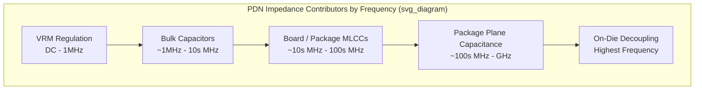

## Power Delivery Network Design and Impedance Modeling

### Overview

The power delivery network (PDN) is the composite electrical structure — voltage regulator (VRM), board planes, package planes and vias, and on-die/decoupling capacitance — that delivers stable DC voltage to a die's active circuits while suppressing the voltage noise caused by rapidly varying transient current demand. In advanced packaging, PDN design has become a first-order design discipline because die switching currents scale with transistor density and clock frequency while allowable voltage margin shrinks with each process node, making the package-level PDN impedance a critical determinant of whether a chip meets its voltage noise budget.

**Key Points**

- The fundamental PDN design goal is keeping the network's impedance, as seen from the die, below a target value ($Z_{target}$) across the full frequency range spanned by the die's transient current demand.
- Unlike signal integrity, which concerns a single channel's fidelity, PDN design concerns a shared, distributed resource that all circuits on the die draw from simultaneously — making it inherently a system-level, multi-domain (VRM to board to package to die) design problem.

### The Target Impedance Concept

**Derivation**

PDN design is most commonly framed using the **target impedance** method, derived from Ohm's law applied to allowable voltage ripple:

$$Z_{target} = \frac{\Delta V}{\Delta I}$$

where $\Delta V$ is the maximum allowable voltage ripple (typically a percentage of the nominal supply voltage, e.g., 3–5%) and $\Delta I$ is the maximum transient current step the die can demand. As supply voltages have scaled down (sub-1V core voltages common in advanced nodes) while transient currents have scaled up (tens to hundreds of amps for high-performance die), $Z_{target}$ has shrunk into the milliohm range for many modern high-performance packages — a substantially more stringent requirement than PDNs of a decade prior.

**Frequency-Dependent Target Impedance**

Because actual die current transients contain a broad spectrum of frequency content (from DC/low-frequency load-line variation up to GHz-range switching edges), $Z_{target}$ is typically specified not as a single value but as a frequency-dependent mask — the PDN impedance profile across frequency must remain below this mask everywhere, not merely at one operating point.

### PDN Impedance Regimes by Frequency

The composite PDN impedance, as measured or simulated looking into the die's power pins, exhibits distinct behavior across frequency ranges, each dominated by a different physical element of the network:

**Low Frequency (DC to ~1 MHz): VRM Regulation**

At low frequencies, the voltage regulator's closed-loop control response dominates — the VRM actively senses and corrects output voltage deviation. PDN impedance in this range is primarily set by VRM loop bandwidth and output filter design, which is largely a board/system-level (not package-level) concern but forms the low-frequency anchor of the overall impedance curve the package PDN must integrate with smoothly.

**Mid Frequency (~1 MHz to ~10s of MHz): Bulk/Board Decoupling Capacitance**

Bulk capacitors (typically larger electrolytic or polymer capacitors on the board) provide charge storage that responds faster than the VRM's control loop but slower than smaller ceramic capacitors, bridging the gap between VRM regulation and higher-frequency decoupling.

**Mid-High Frequency (~10s of MHz to ~100s of MHz): Board and Package Ceramic Decoupling Capacitors**

Surface-mount ceramic capacitors (MLCCs) placed on the board near the package, and increasingly embedded within or mounted directly on the package substrate itself, provide the primary decoupling in this range. Their effectiveness is limited at the high end by their own parasitic inductance — primarily equivalent series inductance (ESL) from the capacitor's physical construction and mounting (via and trace) inductance.

**High Frequency (~100s of MHz to several GHz): Package Plane Capacitance and On-Die Decoupling**

At the highest frequencies relevant to fast switching edges, discrete capacitors become ineffective because their mounting inductance dominates their impedance at these frequencies (see below); the PDN relies instead on the **distributed plane capacitance** of closely-spaced power/ground plane pairs within the package substrate, and ultimately on-die decoupling capacitance (deliberately placed MOS or deep-trench capacitors on the die itself) which sits electrically closest to the switching transistors and therefore has the lowest loop inductance to the load.

**Key Points**

- Each decoupling element (bulk cap, board MLCC, package cap, on-die cap) is effective over a specific, roughly non-overlapping frequency band determined by its own parasitic inductance — a well-designed PDN uses a coordinated hierarchy of capacitance values and placements to blanket the full frequency range without impedance "gaps."
- On-die decoupling is the most effective high-frequency mitigation because it has essentially zero loop inductance to the switching transistors, but die area is a scarce and expensive resource, so on-die capacitance is typically sized only to cover the highest-frequency portion of the spectrum, above which package/board capacitance cannot respond in time.

### Capacitor Self-Resonance and the "Anti-Resonance" Problem

**Self-Resonant Frequency (SRF)**

A real decoupling capacitor is not an ideal capacitance; it presents parasitic equivalent series resistance (ESR) and equivalent series inductance (ESL) in series with the ideal capacitance $C$, forming an RLC series circuit. Below its self-resonant frequency, the capacitor behaves capacitively (impedance decreasing with frequency); above SRF, ESL dominates and the capacitor behaves inductively (impedance increasing with frequency). SRF is given by:

$$f_{SRF} = \frac{1}{2\pi\sqrt{LC}}$$

**Anti-Resonance**

When two capacitors with different capacitance values (and hence different SRFs) are placed in parallel — as is standard practice to cover a broad frequency range — their individual capacitive and inductive regions can interact to create a local impedance **peak** (anti-resonance) at a frequency between their two SRFs, where the inductive reactance of the larger-value (lower-SRF) capacitor resonates with the capacitive reactance of the smaller-value (higher-SRF) capacitor. This anti-resonance peak can locally violate the target impedance mask even though each individual capacitor's own impedance curve looks acceptable — a well-known PDN design pitfall requiring careful capacitor value selection, damping (via capacitor ESR or added series resistance), or additional capacitance values to smooth the composite curve.

**Example**

A PDN using only 1 µF and 0.01 µF ceramic capacitors in parallel may exhibit an anti-resonance peak in the tens-of-MHz range even though both capacitor values individually provide low impedance at their respective effective frequency ranges — mitigated by adding an intermediate capacitance value (e.g., 0.1 µF) to fill the gap and dampen the peak.

### Package-Level PDN Structures

**Plane Capacitance**

Closely spaced power and ground planes within the package substrate build-up form a distributed parallel-plate capacitor, with capacitance per unit area increasing as the dielectric thickness between the planes decreases and as dielectric constant increases. This plane capacitance is a key high-frequency decoupling element precisely because it is distributed (no lumped mounting inductance) and located physically close to the die.

**Via Inductance**

Power and ground vias connecting substrate planes to the die attach or ball-grid interface introduce loop inductance proportional to via length and inversely related to the proximity/count of adjacent return-path (opposite polarity) vias. Package PDN design commonly specifies dense, interleaved power/ground via arrays directly beneath the die's power/ground bump or wirebond pad regions specifically to minimize this loop inductance.

**Embedded/Integrated Passive Capacitors**

Advanced packages increasingly integrate discrete or embedded thin-film capacitors directly within the substrate or as a die-attached component (sometimes termed a "voltage regulator module" die or embedded capacitor die) to place high-value, low-inductance capacitance as close as physically possible to the switching die — reducing the loop inductance that a board-mounted discrete capacitor cannot avoid.

### Modeling and Simulation Methodology

**Frequency-Domain Impedance Analysis**

PDN impedance is most commonly characterized in the frequency domain, either through full-wave or quasi-static electromagnetic extraction of the plane/via structures (yielding a frequency-dependent impedance, $Z(f)$, at the die's power pins) or through measurement using a vector network analyzer on physical hardware. The resulting impedance profile is directly compared against the target impedance mask across the full relevant frequency range.

**Equivalent Circuit Modeling**

For design-stage analysis before full extraction is available, PDN elements are commonly represented as a lumped or distributed equivalent circuit — VRM output impedance, bulk/ceramic/package capacitors each as RLC branches, and plane/via structures as inductance and capacitance elements — solved via standard circuit simulation to predict the composite impedance curve and identify anti-resonance risks early in the design cycle.

**Time-Domain Co-Simulation**

Because ultimate concern is voltage noise under realistic transient current waveforms (not merely frequency-domain impedance), mature PDN design flows co-simulate the extracted PDN impedance model with realistic die current transient profiles (derived from power/timing analysis of the actual workload or test pattern) to directly predict voltage droop and ripple in the time domain, validating against the die's actual voltage margin specification rather than only the idealized target impedance abstraction.

**Key Points**

- Target impedance is a useful first-order design target but is itself a simplification; real die current transients are non-sinusoidal and workload-dependent, so final PDN signoff increasingly relies on time-domain co-simulation with representative current waveforms rather than frequency-domain target impedance alone.
- [Inference] As die transient current profiles become more complex (e.g., due to fine-grained power gating and dynamic voltage/frequency scaling creating sharp, localized current steps), purely frequency-domain target-impedance-based design is increasingly supplemented rather than replaced by time-domain and even localized (per-region) PDN analysis, since a single global target impedance can under-represent highly localized transient events.

### Illustrative PDN Impedance-vs-Frequency Behavior

### Related Topics

- Voltage regulator module (VRM) design and control loop bandwidth
- Embedded/integrated passive capacitor technologies for substrate-level decoupling
- On-die decoupling capacitor structures (deep-trench, MOS) and area/performance trade-offs
- Package substrate stack-up design for plane capacitance optimization
- Die-package co-design flows for coordinated PDN signoff
- Dynamic voltage/frequency scaling (DVFS) impact on transient current profiles
- Chip-package-system (CPS) PDN co-simulation methodologies
- Power integrity measurement techniques (VNA-based PDN impedance characterization)