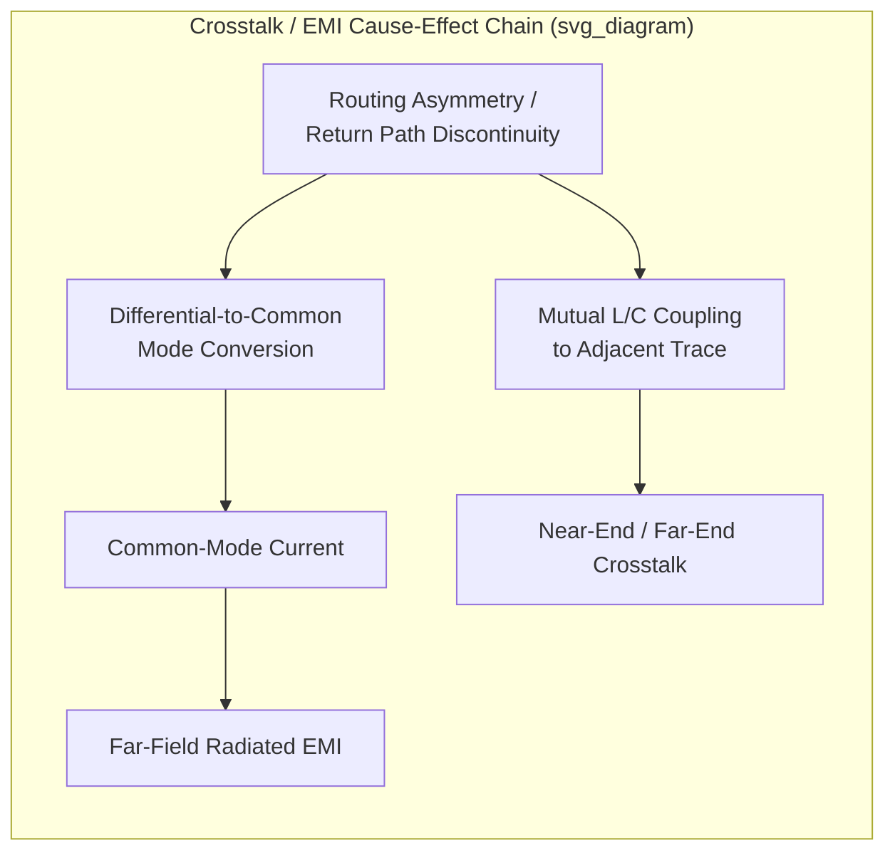

## Electromagnetic Interference and Crosstalk Mitigation

### Overview

Electromagnetic interference (EMI) and crosstalk are related but distinct signal-quality and system-compliance concerns in advanced package design. EMI refers to unintended electromagnetic energy radiated or conducted from the package/system that can disrupt other circuits or fail regulatory emissions limits; crosstalk refers to unwanted coupling between signals *within* the package or system itself, degrading signal integrity on victim nets. Both arise from the same underlying physics — time-varying currents and voltages create electromagnetic fields that couple to nearby conductors — but differ in scope (external victim/aggressor vs. internal) and in the mitigation techniques emphasized.

**Key Points**

- Crosstalk is fundamentally a near-field coupling phenomenon between nearby conductors (traces, vias, bumps) within centimeters of each other; EMI often (though not exclusively) concerns far-field radiation and conducted emissions that must meet external regulatory limits (e.g., FCC, CISPR).
- Package-level design choices — stack-up, shielding, via placement, differential routing — simultaneously affect both crosstalk and EMI, so the two are typically addressed together in an integrated SI/EMI design flow rather than as fully separate disciplines.

### Physical Mechanisms of Crosstalk

**Mutual Inductance and Mutual Capacitance**

Crosstalk between two adjacent conductors arises from two coupling mechanisms operating simultaneously:

- **Mutual capacitance ($C_m$)**: the changing voltage on the aggressor trace induces a displacement current onto the victim trace through the coupling capacitance between them.
- **Mutual inductance ($L_m$)**: the changing current on the aggressor trace induces a voltage on the victim trace through their shared magnetic flux linkage.

The relative contribution of each mechanism depends on the interconnect geometry and the reference plane configuration (stripline vs. microstrip), which determines whether the coupled noise from the two mechanisms reinforces or partially cancels at each end of the victim line.

**Near-End and Far-End Crosstalk**

- **Near-end crosstalk (NEXT)**: appears at the end of the victim trace nearest the aggressor's driver; magnitude depends on coupled length and coupling coefficients but is largely independent of line length beyond a saturation length.
- **Far-end crosstalk (FEXT)**: appears at the far end of the victim trace; its magnitude and even its sign depend on the balance between inductive and capacitive coupling contributions, and it scales with coupled length (unlike NEXT, which saturates).

**Coupling in Package-Specific Structures**

- **Bump/pillar arrays**: dense flip-chip bump fields present significant proximity-based capacitive coupling between adjacent power, ground, and signal bumps, requiring careful bump assignment (grounding/shielding patterns) in high-speed regions.
- **Via fields**: densely packed via arrays (common in HBM interfaces, high-I/O-count interposers) present both via-to-via coupling and coupling through shared antipad clearances in reference planes.
- **Wirebond arrays**: wirebond loops, being non-planar and comparatively long relative to flip-chip interconnects, present higher mutual inductance coupling risk between adjacent bonds, particularly in tightly pitched high-pin-count wirebond packages.

### EMI Fundamentals: Radiated and Conducted Emission Mechanisms

**Differential-Mode vs. Common-Mode Radiation**

- **Differential-mode currents** (equal and opposite currents in a signal/return pair) produce radiated fields that largely cancel in the far field due to their opposing orientation, provided the two conductors are closely spaced — differential-mode radiation is generally the smaller contributor to far-field EMI for well-designed differential structures.
- **Common-mode currents** (equal, in-phase currents on both conductors of a pair, often induced by mode conversion from differential-to-common-mode coupling at asymmetric discontinuities) radiate far more efficiently because they do not cancel, and are frequently the dominant source of problematic far-field EMI in digital systems even at comparatively small common-mode current magnitudes.

**Sources of Common-Mode Current Generation**

- Asymmetry in differential pair routing (unequal trace lengths, unequal via structures on the two lines of a pair) converts a portion of differential signal energy into common-mode energy — the same mode-conversion mechanism discussed in signal integrity analysis, here viewed through its EMI consequence rather than its SI consequence.
- Return path discontinuities (a signal via transitioning reference planes without an adjacent ground stitching via) force return current onto a longer, less-controlled path, which can inject common-mode current onto the chassis or nearby structures.
- Ground bounce and simultaneous switching noise (SSN) from the power delivery network can appear as common-mode voltage across signal reference structures, coupling into differential pairs asymmetrically.

**Key Points**

- Because common-mode current is typically the dominant far-field radiator, a large share of practical EMI mitigation work in package and board design focuses on eliminating the *sources* of differential-to-common-mode conversion (symmetric routing, controlled via transitions, robust return paths) rather than attempting to shield or filter common-mode energy after it is generated.

### Crosstalk Mitigation Techniques

**Spacing and the "3W Rule"**

Increasing trace-to-trace spacing directly reduces coupling coefficients for both mutual capacitance and mutual inductance, since coupling falls off with distance. A widely used heuristic, the "3W rule," suggests spacing traces by at least three times the trace width (center-to-center) to keep coupled crosstalk below roughly a few percent, though [Unverified: the exact acceptable crosstalk percentage and required spacing multiplier are application- and stack-up-dependent] a specific package's true requirement should be confirmed by field-solver extraction rather than the heuristic alone at high data rates.

**Ground Shielding and Guard Traces**

Inserting a grounded conductor (a shielding trace or via fence) between an aggressor and victim signal path intercepts coupled field lines, providing isolation beyond what spacing alone achieves within a constrained routing pitch. This is particularly relevant in dense package regions (HBM channels, chiplet-to-chiplet interfaces) where routing density prevents adequate spacing alone.

**Reference Plane Continuity**

Maintaining an unbroken, low-impedance reference plane beneath signal traces minimizes the loop area of the signal's return current, which reduces both crosstalk coupling and radiated emission, since larger return-current loop area directly increases both mutual inductive coupling to neighbors and the trace's own radiating loop antenna characteristics.

**Orthogonal Layer Routing**

Routing adjacent stack-up layers in perpendicular directions (e.g., alternating horizontal and vertical preferred routing direction layer-to-layer) minimizes the parallel-run length between traces on adjacent layers, directly reducing the coupled length term that both NEXT and FEXT scale with.

**Differential Pair Symmetry**

Precisely matching the two lines of a differential pair (length, via structure, reference plane transitions) minimizes mode conversion, simultaneously improving signal integrity margin (less common-mode noise injected into the differential signal) and reducing EMI (less common-mode current generated to radiate).

### EMI Mitigation Techniques

**Package/Die Shielding**

Conductive shielding structures (metal lids, shield cans, or grounded package-level structures) can be used to contain radiated emissions from high-frequency switching regions, particularly relevant for RF front-end packages or high-power digital packages co-located with sensitive analog/RF circuitry.

**Return Via Stitching**

As discussed in signal integrity contexts, placing ground/stitching vias adjacent to signal via transitions maintains a low-impedance return path, directly suppressing the return-path-discontinuity mechanism that generates common-mode current and hence radiated EMI.

**Decoupling and PDN Design**

Because power delivery network noise (ground bounce, simultaneous switching noise) is a significant source of common-mode current injection, robust PDN design — adequate decoupling capacitance across the relevant frequency spectrum, low-inductance via structures — directly reduces EMI generation at its source, illustrating the tight coupling between PDN design and EMI mitigation disciplines.

**Filtering**

Where a signal or power path must cross a shielding boundary or connector interface, common-mode chokes or filter components can suppress residual common-mode current before it reaches a structure capable of efficient radiation (e.g., a cable or long board trace acting as an antenna) — though within the package itself, this is typically less applicable than the source-suppression techniques above, since discrete filter components are impractical at package-internal scale.

**Spread-Spectrum Clocking**

At the system level, deliberately dithering (frequency-modulating) clock signals spreads the emitted spectral energy across a wider frequency band rather than concentrating it at discrete harmonic frequencies, reducing peak emission amplitude at any single frequency to help meet regulatory emission limits — a system/board-level technique that interacts with, but is largely independent of, package-level physical design.

### Analysis and Verification Methodology

**Field Solver Extraction**

Both crosstalk and EMI-relevant parameters (coupling coefficients, common-mode conversion, radiated near-field patterns) are commonly extracted using full-wave electromagnetic field solvers applied to the package 3D geometry, since analytical formulas provide only first-order estimates for the complex, non-uniform geometries typical of package interconnects (bump arrays, via fields, wirebond loops).

**Mixed-Mode S-Parameters**

As referenced in signal integrity analysis, mode-conversion metrics (e.g., $S_{cd21}$, differential-to-common-mode conversion) extracted from mixed-mode S-parameter analysis serve as a direct, quantitative proxy for EMI risk at a given package structure, since common-mode conversion is the primary generator of far-field radiation from otherwise well-designed differential structures.

**Near-Field Scanning**

Physical validation of EMI-prone regions is commonly performed via near-field probe scanning of a populated package/board, identifying localized hot-spots of radiated emission that correlate with specific structural discontinuities (via transitions, asymmetric routing, connector interfaces) for targeted design correction.

**Key Points**

- EMI compliance verification is ultimately validated against regulatory far-field emission limits (e.g., FCC Part 15, CISPR 32) in a certified test chamber, but package-level near-field scanning and simulation-based mode-conversion analysis are used earlier in the design cycle to catch and correct EMI risk before committing to a physical prototype.

### Illustrative Coupling and Mitigation Diagram

### Related Topics

- Signal integrity fundamentals for package interconnects (transmission line and loss modeling)
- Power delivery network design and impedance modeling
- Differential pair routing rules and mode-conversion minimization
- Package/die-level shielding structures for RF and mixed-signal integration
- Full-wave electromagnetic field solver methodologies for package extraction
- Regulatory EMI compliance standards (FCC Part 15, CISPR 32) and test methodology
- Via stitching and return-path design rules for multilayer substrates
- Near-field scanning techniques for EMI hot-spot identification