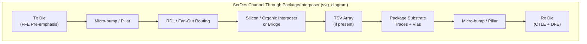

## High-Speed SerDes Channel Design Through Package and Interposer

### Overview

A SerDes (serializer/deserializer) channel spans from the transmitting die's silicon output driver, through the package interconnect, across the board (or, for die-to-die links, through an interposer or bridge), to the receiving die's input. In advanced packaging, the "package and interposer" segment of this channel — die bumps, redistribution layers (RDL), through-silicon vias (TSVs), substrate traces/vias, and interposer routing — has become an increasingly large fraction of the total channel loss and discontinuity budget as data rates climb into the tens-of-Gb/s and multi-tens-of-Gb/s regime (e.g., 56/112/224 Gb/s PAM4 SerDes standards, UCIe die-to-die links, HBM interfaces). Channel design at this level requires co-optimizing the physical interconnect geometry with the transmit/receive equalization capability of the SerDes IP to close a target bit-error-rate (BER) budget.

**Key Points**

- The package/interposer segment was historically a minor contributor to total channel loss relative to board traces and connectors; at current multi-tens-of-Gb/s data rates, it is frequently a comparable or dominant contributor, especially for die-to-die links where the entire channel may reside within the package or interposer.
- SerDes channel design is inherently co-design between package/interposer physical design and the SerDes transceiver's equalization architecture — a channel that is "too lossy" for a fixed-equalization receiver may be entirely viable for a receiver with adequate DFE/CTLE range, so channel budgets are defined relative to a specific SerDes IP's compensation capability, not against an absolute loss target alone.

### Channel Segments and Their Electrical Character

**Die-to-Package Interconnect**

The transition from the die's on-chip routing to the package substrate — via flip-chip micro-bumps/pillars, wirebonds, or hybrid bonding for 3D stacks — introduces the first impedance discontinuity and parasitic inductance/capacitance in the channel. Flip-chip micro-bump interconnects are generally preferred for the highest-speed SerDes I/O specifically because their shorter, more direct vertical path presents substantially lower parasitic inductance than wirebond alternatives.

**Redistribution Layers (RDL) and Fan-Out Routing**

In fan-out wafer-level packaging (FOWLP) and similar architectures, RDL traces route signals from the die's native bump pitch to a coarser package-level pitch. RDL traces are typically thin, fine-pitch copper structures with controllable but comparatively higher resistive loss per unit length than substrate core traces, making RDL length a meaningful contributor to the die-side portion of channel insertion loss budget in fine-pitch fan-out architectures.

**Substrate Traces and Vias**

Organic package substrate routing (build-up film layers with copper traces) provides the majority of the lateral routing distance in conventional (non-interposer) packages. Substrate dielectric loss tangent and trace geometry (width, thickness, reference plane spacing) set the substrate's contribution to insertion loss; via transitions between substrate layers introduce stub-related reflections unless via stub length is minimized (e.g., through back-drilling or careful layer assignment) or eliminated via blind/buried via structures.

**Silicon and Organic Interposers**

For 2.5D integration (die-on-interposer-on-substrate architectures), the interposer provides an intermediate, typically much finer-pitch and lower-loss routing layer between dies:

- **Silicon interposers** use damascene copper routing at fine pitch with excellent impedance control and comparatively low loss (silicon substrate itself, if not adequately isolated, can introduce some substrate-coupling loss depending on resistivity and frequency, though standard high-resistivity silicon interposer processes mitigate this).
- **Organic interposers** (a lower-cost alternative gaining adoption, sometimes as part of a "bridge" architecture) offer coarser routing pitch than silicon but at substantially lower cost, appropriate where die-to-die pitch and channel length requirements permit.
- **Local silicon bridges** (embedded within an organic substrate, e.g., Intel's EMIB-type approach) provide silicon-grade fine-pitch, low-loss routing only in the specific localized region between two dies requiring the highest-density, highest-speed connection, avoiding the cost of a full-reticle silicon interposer.

**Through-Silicon Vias (TSVs)**

Where a silicon interposer or 3D-stacked die uses TSVs to route signals vertically through the silicon substrate, TSVs present their own characteristic impedance and coupling behavior (as discussed in general SI fundamentals), with dense TSV arrays (common in HBM base die and interposers) requiring dedicated per-TSV and array-level electromagnetic modeling due to their proximity to neighboring TSVs and their distinct aspect ratio compared to planar traces.

### Loss Budgeting Across the Composite Channel

**Insertion Loss Aggregation**

Total channel insertion loss at the Nyquist frequency of the target data rate is the (approximately additive, in dB) sum of contributions from each segment: die-to-package interconnect, RDL/fan-out routing, package substrate traces and vias, interposer routing (if present), and any remaining board/connector segment for off-package destinations. Each segment's contribution is characterized (via simulation or measurement) as its own S-parameter block and cascaded to build the total channel model.

**Return Loss and Discontinuity Budgeting**

Beyond aggregate insertion loss, the channel design process budgets allowable reflection (return loss, $S_{11}$) at each discontinuity — bump transitions, via stubs, interposer-to-substrate transitions — since even a channel with acceptable total insertion loss can fail if a single severe localized discontinuity creates a strong reflection that interacts destructively with the transmitted signal at specific frequencies (creating notches in the insertion loss response, sometimes called "suck-outs").

**Crosstalk Budget in Dense Routing**

Given the extremely fine pitch typical of interposer and RDL routing (often at or below what board-level routing can achieve), crosstalk coupling coefficients tend to be higher than board-level channels for equivalent routing density, making crosstalk budget allocation (NEXT/FEXT contribution to total noise budget) a comparatively larger share of the overall channel margin analysis for package/interposer-heavy channels than for traditional board-dominated channels.

### Equalization Co-Design

**Transmitter Equalization**

Transmit-side pre-emphasis/de-emphasis (feed-forward equalization, FFE) pre-distorts the transmitted signal to partially compensate for known channel loss characteristics before the signal enters the lossy channel, effective primarily for compensating the frequency-dependent attenuation (higher loss at higher frequency) characteristic of dielectric and skin-effect loss mechanisms.

**Receiver Equalization**

- **Continuous-time linear equalizer (CTLE)**: applies frequency-dependent gain (boosting high frequencies relative to low) to partially invert the channel's low-pass loss characteristic, implemented as an analog continuous-time filter at the receiver front end.
- **Decision feedback equalizer (DFE)**: uses previously decided bit values to cancel inter-symbol interference (ISI) contributions from prior bits on the current bit decision, effective at compensating reflections and longer-tail ISI that CTLE alone cannot fully address, without the noise-amplification penalty CTLE incurs at very high boost levels.

**Channel-Equalization Co-Optimization**

Because equalization can compensate for a substantial portion of channel loss and ISI, package/interposer channel design targets are commonly expressed relative to the specific SerDes IP's known equalization range (e.g., "channel must have no more than X dB insertion loss at Nyquist, given Y dB of available CTLE boost and Z taps of DFE") rather than an absolute, IP-independent loss ceiling. [Inference] This means package physical design and SerDes IP selection are often iterated together in practice, since a more capable (but typically higher-power) SerDes IP can tolerate a lossier, cheaper, or more compact package/interposer channel, while a lower-power SerDes IP requires tighter physical-layer control.

### Standards-Relevant Design Contexts

**Die-to-Die Interconnect Standards (e.g., UCIe)**

Emerging die-to-die interconnect standards for chiplet architectures specify channel reach and loss requirements tailored specifically to package and interposer-scale distances (as opposed to traditional board-scale SerDes standards), reflecting the recognition that die-to-die channels entirely within a package/interposer have fundamentally different loss and reach characteristics (shorter reach, but often at higher per-pin bandwidth density) than conventional board-level or cable SerDes links. [Unverified: specific numerical channel loss/reach targets should be confirmed against the current published version of the relevant standard, as these specifications continue to evolve across standard revisions.]

**HBM Interface Channels**

High Bandwidth Memory interfaces represent a channel design case where the entire signal path (base logic die to HBM stack, typically via a silicon interposer) is package/interposer-internal, with very high pin-count, moderate per-pin data rate, and extremely tight length-matching and crosstalk control requirements given the dense parallel bus architecture.

### Verification Methodology

**Extraction and Cascading**

Standard practice extracts each channel segment (die bump model, RDL, substrate, interposer, TSV array) as a separate S-parameter network via full-wave electromagnetic simulation, then cascades these networks into a composite channel model spanning transmitter to receiver — allowing individual segment contributions to be isolated and optimized before committing to a full physical design.

**Statistical and Time-Domain Signoff**

Final channel signoff typically combines statistical eye analysis (applying standardized methodologies such as those defined in IEEE 802.3 channel operating margin, COM, or similar industry-standard statistical eye methodologies) with time-domain simulation incorporating the target SerDes IP's actual transmit/receive equalization behavior, jitter budget, and noise sources, to predict achievable bit-error-rate margin against the link's target BER specification (commonly $10^{-12}$ to $10^{-15}$ or better for high-reliability links).

**Key Points**

- Channel signoff for package/interposer SerDes links increasingly relies on standardized statistical margin methodologies (COM-like approaches) rather than simple eye-diagram inspection alone, because at very low target bit-error rates, direct time-domain simulation of enough bits to observe rare error events becomes computationally impractical, requiring statistical extrapolation methods instead.

### Illustrative Channel Segment Diagram

### Related Topics

- Signal integrity fundamentals for package interconnects
- UCIe and other die-to-die interconnect standard channel specifications
- Silicon interposer and local silicon bridge (EMIB-type) architecture design
- HBM interface routing and length-matching requirements
- Statistical channel margin methodologies (COM-based signoff)
- TSV array electromagnetic modeling for 2.5D/3D integration
- Fan-out wafer-level packaging (FOWLP) RDL design rules
- Transmit/receive equalization architecture trade-offs (FFE, CTLE, DFE)