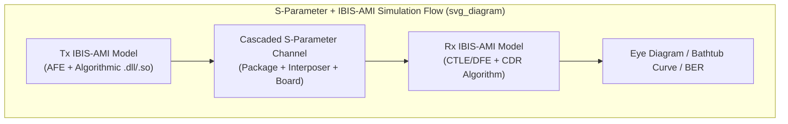

## S-Parameter Extraction and IBIS and IBIS-AMI Modeling

### Overview

S-parameter extraction and IBIS/IBIS-AMI modeling together form the standard model-exchange framework used to characterize and simulate high-speed package interconnects and driver/receiver behavior without requiring proprietary transistor-level netlists to be shared between silicon vendors, package designers, and system integrators. S-parameters characterize the passive interconnect (package, interposer, board) as a linear, frequency-domain network; IBIS and IBIS-AMI characterize the active driver/receiver behavior in a standardized, vendor-neutral format that can be combined with the passive S-parameter channel model to predict end-to-end link performance.

**Key Points**

- S-parameters describe *passive* structures (traces, vias, bumps, connectors); IBIS and IBIS-AMI describe *active* structures (driver output stages, receiver input stages, and — critically for high-speed links — equalization behavior).
- The two model types are combined in simulation: an IBIS-AMI transmitter model drives a cascaded S-parameter channel model, which feeds an IBIS-AMI receiver model, allowing full-link time-domain or statistical eye/BER analysis without any party needing to disclose underlying circuit implementation details.

### S-Parameter Fundamentals

**Definition and Physical Meaning**

Scattering parameters (S-parameters) characterize a linear network in terms of how power waves incident on each port are reflected and transmitted to other ports, expressed as a matrix of complex-valued (magnitude and phase), frequency-dependent coefficients. For a two-port network (e.g., a single-ended trace segment):

- $S_{11}$: reflection at port 1 (input return loss)
- $S_{21}$: transmission from port 1 to port 2 (insertion loss/gain)
- $S_{12}$: transmission from port 2 to port 1 (reverse insertion loss)
- $S_{22}$: reflection at port 2 (output return loss)

For multi-port structures (e.g., a differential pair, modeled as a 4-port network, or a coupled multi-trace bus), the S-parameter matrix expands accordingly, and **mixed-mode S-parameters** ($S_{dd}$, $S_{cc}$, $S_{dc}$, $S_{cd}$ — differential and common-mode combinations) are derived to separately characterize differential transmission, common-mode transmission, and mode conversion, which is essential for differential channel and EMI-related analysis.

**Extraction Methods**

- **Full-wave electromagnetic simulation**: 3D structures (bump arrays, via transitions, connector geometries, interposer routing) are modeled in a field solver (method-of-moments, finite-element, or finite-difference time-domain solvers) that solves Maxwell's equations directly on the physical geometry to produce frequency-swept S-parameters. This is the standard approach for package-internal structures too complex or too electrically small relative to wavelength considerations for simplified analytical or 2D-cross-section approaches.
- **2D/2.5D field solvers**: for long, uniform cross-section transmission lines (straight substrate traces, interposer routing runs), a 2D cross-sectional field solver can efficiently compute per-unit-length $L$, $C$, $R$, $G$ parameters, which are then combined with the known physical length to construct the S-parameter model — substantially faster than full 3D extraction for geometrically simple, uniform-cross-section segments.
- **Vector network analyzer (VNA) measurement**: physical hardware (test coupons, populated packages) can be directly measured with a VNA to obtain measured S-parameters, used both to validate simulation-based extraction and, in some flows, as the primary source of channel characterization when physical prototypes are available.

**Quality and Validity Considerations**

- **Passivity**: a physically realizable passive network cannot generate energy; extracted S-parameter models should satisfy passivity criteria, and simulation tools commonly include passivity enforcement algorithms to correct for small violations introduced by numerical extraction error, since a non-passive model can produce non-physical (unstable) results in downstream time-domain simulation.
- **Causality**: the model's time-domain response derived from the frequency-domain S-parameters should respect causality (no response before excitation); causality violations, again typically arising from extraction/interpolation artifacts rather than true physical behavior, are checked and corrected in mature extraction and model-preparation flows.
- **Frequency range and interpolation/extrapolation**: S-parameter models are extracted over a finite frequency range sufficient to capture the Nyquist frequency and relevant harmonic content of the target data rate; behavior outside the extracted range requires careful extrapolation to avoid introducing artifacts in time-domain conversion (e.g., via inverse Fourier transform for time-domain simulation).

### IBIS: I/O Buffer Information Specification

**Purpose and Scope**

IBIS is a standardized, vendor-neutral format for describing the electrical behavior of a chip's I/O buffers (drivers and receivers) using behavioral data — current-voltage (I-V) and voltage-time (V-T) tables — rather than a proprietary SPICE transistor netlist. This allows a silicon vendor to share sufficient information for accurate board/package-level SI simulation without disclosing the underlying transistor-level circuit design, protecting intellectual property while still enabling accurate system-level simulation.

**Model Structure**

An IBIS model characterizes:

- **Pull-up and pull-down I-V curves**: DC current-voltage behavior of the output driver's pull-up and pull-down transistors under various process/voltage/temperature (PVT) corners (typically "typical," "fast," and "slow" corners provided).
- **Ramp rate / V-T waveforms**: switching transition behavior (rise/fall characteristics) captured as voltage-versus-time tables under specified loading conditions.
- **Package parasitics**: simplified lumped R-L-C values representing the package's contribution to the pin's parasitic behavior (a coarser representation than a full S-parameter model, historically sufficient for lower-speed analysis but increasingly supplemented or replaced by S-parameter-based package models at high speed).
- **Receiver thresholds and input characteristics**: input capacitance and switching threshold behavior for receiver buffer models.

**Limitations for High-Speed SerDes**

Standard IBIS models describe simple driver/receiver behavior adequately for lower-speed, non-equalized I/O, but do not capture the complex, often proprietary and non-linear behavior of modern SerDes equalization circuitry (FFE, CTLE, DFE, clock-data recovery) — a limitation that motivated the development of the IBIS-AMI extension.

### IBIS-AMI: Algorithmic Modeling Interface

**Purpose**

IBIS-AMI (Algorithmic Modeling Interface) extends the IBIS standard specifically to model the complex, often adaptive and non-linear equalization and clock-recovery behavior of modern high-speed SerDes transmitters and receivers, which cannot be adequately captured by the simpler I-V/V-T tabular approach of base IBIS.

**Architecture**

An IBIS-AMI model consists of:

- **Analog front-end (AFE) model**: a simplified linear or behavioral representation of the driver/receiver analog characteristics, often still expressed via IBIS-style I-V/V-T data or a simplified transfer function.
- **Executable algorithmic model**: a compiled, platform-specific executable (typically a shared library, e.g., a DLL or `.so` file) provided by the silicon vendor, which implements the actual proprietary equalization algorithm (adaptive FFE coefficients, CTLE gain adaptation, DFE tap adaptation, clock-data recovery loop behavior) as executable code rather than disclosed circuit or algorithm details — the simulation tool calls into this executable at defined points in the simulation flow, receiving processed waveform data back without ever having access to the underlying algorithm implementation.

**Simulation Flow Modes**

- **Statistical (bit-error-rate) flow**: for linear, time-invariant (LTI) portions of the channel and equalization, a statistical approach convolves impulse responses to rapidly predict eye/BER without simulating individual bits explicitly — computationally efficient and standard for early-stage or LTI-dominated channel analysis.
- **Time-domain (bit-by-bit) flow**: for non-linear or time-varying elements (adaptive equalization convergence behavior, non-linear driver behavior, jitter injection), explicit bit-by-bit time-domain simulation is required, since the statistical/convolution approach assumes linearity and time-invariance that adaptive algorithms and non-linear circuits violate.

**Key Points**

- IBIS-AMI's core value proposition is enabling accurate simulation of proprietary adaptive equalization behavior across a full channel (including package/interposer S-parameter segments) without any exchange of proprietary algorithm details between the silicon IP vendor and the system/package designer performing channel simulation.
- Because the AMI executable is compiled, platform- and often simulator-API-version-specific, model compatibility (correct executable format for the target simulation tool and OS platform) is a practical integration consideration distinct from the model's underlying algorithmic accuracy.

### Combined Simulation Flow: S-Parameters + IBIS-AMI

**Cascading the Full Channel**

A complete link simulation combines: (1) an IBIS-AMI transmitter model (including its AFE and algorithmic equalization behavior) driving (2) a cascaded S-parameter network representing the full passive channel — package, interposer, board, connector segments extracted and combined as described above — feeding (3) an IBIS-AMI receiver model (including its AFE, CTLE/DFE algorithmic behavior, and clock-data recovery).

**Output Metrics**

The combined simulation produces standard link-quality metrics: eye diagrams (height/width margin), bathtub curves (BER versus sampling phase offset), and jitter/noise budget decomposition — directly usable for channel signoff against the target SerDes standard's specified BER requirement.

**Example**

A package/interposer designer receives an IBIS-AMI model from the SerDes IP vendor, extracts S-parameters for the proposed package and interposer routing via full-wave field-solver simulation, cascades these with board-level S-parameters for the remaining channel segment, and runs the combined statistical/time-domain AMI simulation to verify the proposed physical design closes eye margin at the target data rate before committing to substrate fabrication — allowing physical design iteration entirely in simulation prior to hardware.

### Verification and Correlation

**Simulation-to-Measurement Correlation**

Mature design flows validate extracted S-parameter models and IBIS-AMI-based link simulation predictions against physical hardware measurement (VNA-measured S-parameters on test coupons, and oscilloscope-captured eye diagrams or BER testing on populated boards/packages) to build confidence in the simulation methodology and identify any systematic extraction or modeling error before relying on simulation-only signoff for subsequent design iterations.

**Key Points**

- Because full-wave extraction and complex adaptive-equalization simulation both carry meaningful risk of modeling error (from meshing/convergence issues in field solvers to AMI model implementation bugs), correlation against physical measurement remains a standard verification step even in simulation-heavy design flows, rather than treating simulation results as unconditionally authoritative.

### Illustrative Combined Model Flow

### Related Topics

- High-speed SerDes channel design through package and interposer
- Signal integrity fundamentals for package interconnects
- Statistical channel margin methodologies (IEEE 802.3 COM-based signoff)
- Full-wave electromagnetic field solver methodologies (MoM, FEM, FDTD)
- Passivity and causality enforcement in S-parameter model preparation
- Clock-data recovery (CDR) algorithm modeling in AMI receivers
- Jitter decomposition and budget allocation in link simulation
- Vector network analyzer (VNA) measurement techniques for package characterization