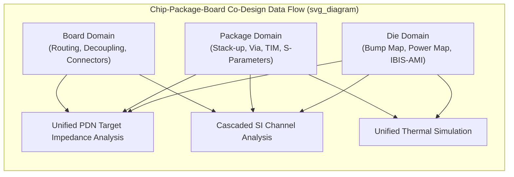

## Chip-Package-Board Co-Design Methodology

### Overview

Chip-package-board (sometimes termed chip-package-system, CPS) co-design is a design methodology that treats the die, package, and board not as sequentially designed, independently optimized layers but as a single integrated electrical/thermal/mechanical system analyzed and optimized concurrently. As advanced packaging has moved toward tighter die-package interaction (finer bump pitch, 2.5D/3D integration, chiplet architectures), the traditional sequential flow — design the die, hand off a fixed set of I/O assumptions to package design, hand off a fixed package footprint to board design — increasingly produces suboptimal or infeasible designs at the interfaces between domains, motivating concurrent, cross-domain co-design flows.

**Key Points**

- The central problem co-design addresses is that decisions made in one domain (die bump assignment, package stack-up, board via structure) directly constrain and interact with decisions in the other domains, such that optimizing each domain independently, using fixed assumptions about the others, frequently converges to a globally suboptimal or electrically/thermally infeasible result.
- Co-design is as much an organizational and data-flow methodology (which teams share what information, when, and in what format) as it is a technical simulation methodology, since the underlying obstacle is often that die, package, and board design have traditionally been executed by separate teams (sometimes separate companies) using separate tools and separate design databases.

### Why Sequential Design Breaks Down at Advanced Nodes

**Traditional Sequential Flow**

Conventionally, die design fixes bump/pad locations and electrical characteristics (driver strength, receiver type) based on internal assumptions about expected package and board loading; package design then designs substrate routing, stack-up, and via structures to connect the fixed die bump pattern to a fixed BGA ball pattern; board design then routes traces from the fixed ball pattern to other system components. Each handoff treats the prior domain's output as a fixed boundary condition.

**Failure Modes of Sequential Design at Advanced Packaging Scale**

- **PDN infeasibility**: a die's power/ground bump assignment, fixed early in die design, may prove insufficient to meet the package and board PDN's target impedance once the actual package via structure and board plane capacitance are analyzed — discovered too late in the flow to change the die bump map without significant schedule and cost impact.
- **Signal integrity infeasibility**: die-side driver/receiver equalization capability, package channel loss, and board channel loss are each designed with assumed (not co-optimized) budgets for the other segments; if the actual package or board loss exceeds the assumption, the composite channel may fail to close eye margin even though the die's SerDes IP and package/board design each individually met their own local specifications.
- **Thermal-mechanical infeasibility**: die power map (where on the die power is dissipated) interacts with package thermal design (TIM selection, lid/heatsink design) and mechanical stress (warpage, solder joint reliability); a die floorplan optimized purely for logical/electrical reasons without thermal co-consideration can create localized hot spots the package thermal solution cannot adequately address.
- **Bump/via congestion**: die-side bump pitch and assignment, if not coordinated with package substrate routing capability (achievable trace width/spacing and via pitch in the substrate technology), can create routing congestion or force additional costly substrate layers to resolve — a cost and yield consequence discovered only after both die and initial package design are substantially fixed.

### Co-Design Domains and Interactions

**Electrical Co-Design**

- **PDN co-optimization**: die power/ground bump placement, package via structure and plane capacitance, and board decoupling capacitor placement are jointly analyzed against a unified target impedance model spanning the full chip-package-board PDN, rather than each domain independently meeting a locally-assumed sub-budget.
- **Signal integrity co-optimization**: die driver/receiver equalization capability (IBIS-AMI models), package channel S-parameters, and board channel S-parameters are jointly simulated as a cascaded system to verify end-to-end eye/BER margin, with loss budget allocated across domains based on actual achievable performance in each rather than fixed a priori assumptions.
- **Bump/pin assignment co-optimization**: die bump/pad locations are chosen with awareness of package substrate routing capability and board-level connection requirements, potentially iterating the bump map itself (where die design flexibility permits) to resolve routing congestion or improve PDN/SI performance identified through package/board analysis.

**Thermal-Mechanical Co-Design**

- Die power/floorplan data (where and how much power is dissipated across the die area) feeds directly into package thermal simulation (TIM selection, heat spreader/lid design, thermal via placement) and can, where floorplan flexibility exists, be adjusted to better align hot-spot locations with the package's most effective heat-extraction paths.
- Package and board mechanical stress analysis (warpage, solder joint fatigue) depends on the actual die size, position, and stack-up — increasingly relevant for multi-die and 2.5D/3D packages where die-to-die and die-to-interposer mechanical interaction adds complexity beyond single-die package mechanical analysis.

**Cost and Manufacturability Co-Design**

- Package substrate layer count and via technology (directly driving cost) depend on the routing density demanded by the die's bump map and I/O count; co-design allows evaluating whether adjusting bump assignment or die floorplan (where flexible) can reduce required substrate complexity and cost, a trade-off invisible to a sequential flow that treats the bump map as fixed before package cost is evaluated.

### Data Exchange and Modeling Standards

**Standardized Model Formats**

Effective co-design depends on the availability of standardized, tool-agnostic model formats that allow each domain's data to be consumed by another domain's analysis tools without requiring full design database access (which is often impractical due to tool incompatibility, IP protection concerns between separate companies, or simply data volume):

- **IBIS/IBIS-AMI**: standardized behavioral models for die-side driver/receiver electrical and equalization behavior, consumable by package/board SI simulation without requiring the die's transistor-level netlist.
- **S-parameters (Touchstone format)**: standardized passive network characterization for package and board interconnect segments, consumable across tools and organizational boundaries.
- **Chip power/thermal model exchange formats**: standardized die power map and thermal model formats (e.g., approaches aligned with or inspired by standards such as the Digital Twin/Chiplet Design Exchange efforts and thermal model exchange formats used in JEDEC-aligned thermal characterization) allow package thermal simulation to consume die-side power distribution data without requiring full die design disclosure.

**Key Points**

- The practical enabler of chip-package-board co-design at organizational boundaries (e.g., a fabless die design company, an independent package design/assembly house, and a system OEM board design team) is precisely these standardized, behavioral (non-disclosing) model exchange formats — without them, co-design would require either full design data sharing (often commercially/competitively infeasible) or reverting to conservative, fixed-assumption sequential design.

### Iterative Co-Design Flow

**Early-Stage Concurrent Planning**

Rather than waiting for a completed die design before beginning package design, mature co-design flows begin package (and sometimes board) planning concurrently with die floorplanning, using preliminary die power, I/O count, and bump pitch estimates to explore package feasibility (substrate layer count, achievable PDN impedance, thermal solution class) early enough that findings can still influence die-side decisions.

**Iterative Refinement Loop**

As each domain's design matures (die floorplan solidifies, package stack-up is defined, board layout progresses), the cross-domain analyses (PDN target impedance, SI channel budget, thermal simulation) are re-run with updated, more accurate data, and any infeasibility discovered triggers a targeted iteration — ideally in the domain with the most design margin remaining to absorb the change, rather than automatically pushing the fix to whichever domain is design-complete earliest (often, historically, the board, which becomes the default "fix it here" domain in sequential flows since it is typically finalized last).

**Signoff Convergence**

Final signoff requires all co-design domains (electrical PDN/SI, thermal, mechanical, cost/manufacturability) to simultaneously satisfy their respective margin requirements using the actual, as-designed data from all three domains — rather than each domain separately signing off against its own locally-assumed boundary conditions, which is the core methodological shift co-design represents relative to sequential design.

**Key Points**

- [Inference] The value of co-design scales with the degree of electrical/thermal/mechanical interaction between domains; for a simple, low-power, low-pin-count package with generous margin in every domain, a full concurrent co-design flow may offer limited benefit over sequential design, whereas for high-power, high-pin-count, multi-die advanced packages with tight margins, co-design is often necessary rather than merely beneficial to achieve a feasible, first-pass-correct design.

### Illustrative Co-Design Interaction Diagram

### Related Topics

- Power delivery network design and impedance modeling
- High-speed SerDes channel design through package and interposer
- S-parameter extraction and IBIS and IBIS-AMI modeling
- Die-package thermal co-simulation methodologies
- Package warpage and mechanical stress modeling for multi-die assemblies
- Chiplet interconnect standards and design exchange formats (UCIe ecosystem)
- Substrate technology selection and cost/routing-density trade-offs
- Organizational and IP-protection considerations in cross-company co-design flows