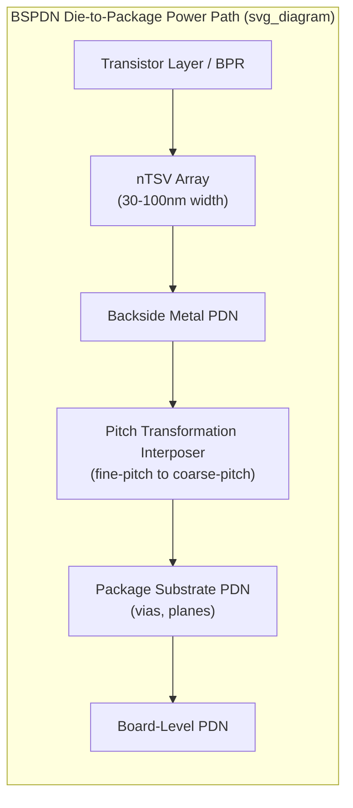

## Backside Power Delivery Network Integration with Packaging

### Overview

Backside power delivery network (BSPDN) technology relocates the entire power delivery network — supply and ground rails historically routed in the front-side metal stack above the transistor layer — to the wafer's backside, connected to the transistor layer through nano-through-silicon vias (nTSVs) and buried power rails (BPRs). This is a die-level (front-end/BEOL architecture) innovation, but it has substantial and direct consequences for package design: it changes how power reaches the die from the package, how the die's thermal path interacts with its power delivery structures, and how package-level PDN, thermal, and mechanical co-design must be performed. The BSPDN approach involves routing power lines through the backside of the wafer, freeing the frontside for signal routing and active device regions. [Lamresearch](https://newsroom.lamresearch.com/transistor-channel-stress-backside-power-delivery-networks)

**Key Points**

- BSPDN is primarily a foundry/front-end process technology (implemented at the transistor and BEOL/backside-BEOL level), but its package-facing consequences — where power now enters/exits the die, altered thermal paths, and new bonding/thinning requirements — make it a first-order topic for package and system co-design.
- By moving the power network to the backside of the chip, BSPDN improves power-delivery efficiency while freeing frontside space to accommodate denser logic routing. [fiisual](https://fiisual.com/blog/post/2026/bspdn-introduction)

### Why Backside Power Delivery Emerged

**IR Drop and Voltage Droop Motivation**

By moving the power delivery network to the backside, BPD reduces the voltage droop experienced by transistors, because the power interconnects can be made larger and less resistive, providing a more stable power supply, which allows transistors to operate at higher frequencies with less risk of performance degradation. In conventional front-side PDN architectures, power and signal routing compete for the same limited front-side metal layers, forcing power rails to be thinner and more resistive than would otherwise be desirable, which directly increases IR drop (resistive voltage loss) across the die. [Wikipedia](https://en.wikipedia.org/wiki/Backside_power_delivery)

**Separation of Power and Signal Domains**

Moving the power delivery network to the backside of the wafer separates the power delivery network from the signal network, which improves power delivery efficiency and reduces interference between the two networks. This separation is functionally significant for both electrical and, as discussed below, thermal and mechanical package-level design, since power and signal routing no longer share the same physical layer stack and can be optimized independently. [Teldevice](https://us.teldevice.com/news-event/news/p1176/)

**Foundry Adoption Timelines**

Foundries have adopted differing terminology and timelines for BSPDN implementation. Intel took the lead in BSP mass production timing, with its PowerVia technology debuting with the Intel 20A process and refined for the subsequent 18A node. TSMC's Super Power Rail (its BSPDN implementation) is expected in the A16 process, planned for introduction in Q3 2026 as one of the indispensable technologies for advanced nodes, and Samsung also plans to introduce BSPDN in its SF2Z process. [Unverified: exact production timelines for any foundry node are subject to change and should be confirmed against the foundry's most current public roadmap disclosures.] [What is Backside Power Delivery (BSP)? Redefining the Chip Power Map for the 2nm Revolution +2](https://www.aminext.blog/en/post/backside-power-delivery-bsp-explained-1)

### Structural Elements of a BSPDN Die

**Buried Power Rails (BPRs)**

Buried power rails are power/ground rail structures placed below or within the standard cell layer (beneath the transistor active area) rather than in front-side BEOL metal, forming the die-side connection point that backside vias ultimately reach. IBM's patent work on improved contact structures for power transfer states that BPR technology releases resources for dense logic interconnects that limit modern processor performance, enabling further scaling of standard logic cell density, since front-side metal layers no longer need to accommodate wide, low-resistance power rails alongside signal routing. [PatSnap](https://www.patsnap.com/resources/blog/articles/back-side-power-delivery-networks-cut-ir-drop-by-10/)

**Nano-Through-Silicon Vias (nTSVs)**

nTSVs are the vertical conductive structures connecting the buried power rail/transistor layer to the backside power distribution network, distinguished from conventional (larger) TSVs used in 2.5D/3D die stacking by their substantially smaller dimensions. In some embodiments, the nTSVs may have a width between 30 nm and 100 nm and a height between 50 nm and 200 nm, embedded within the substrate between the front side and back side of the die. This extreme miniaturization relative to conventional TSVs reflects their role connecting individual transistor-level power rails rather than routing die-to-die or die-to-interposer signals at coarser pitch. [uspto](https://image-ppubs.uspto.gov/dirsearch-public/print/downloadPdf/11984384)

**Backside Metal Layers**

Following wafer thinning (removing bulk silicon substrate from the backside to expose the nTSV structures), backside metal layers are built up to form the actual power distribution routing — analogous in function to front-side BEOL metal, but dedicated entirely to power/ground distribution rather than shared with signal routing.

**Pitch Transformation to Package Level**

A structural challenge specific to package integration is bridging the pitch mismatch between the die's extremely fine backside contact pitch and the coarser pitch practical at the package substrate level. A recurring challenge in BSPDN deployment is the pitch mismatch between the fine-pitch contact requirements at the die's back side and the coarser pitches practical at the package substrate level. Industry patent activity addresses this directly: a power redistribution element hybrid-bonded to the active die's back side, with a first set of contact pads on its front face at fine pitch to match die via landing requirements, and a second set on its back face at coarser pitch, functions as an interposer specifically for pitch transformation. [PatSnap](https://www.patsnap.com/resources/blog/articles/back-side-power-delivery-networks-cut-ir-drop-by-10/)[PatSnap](https://www.patsnap.com/resources/blog/articles/back-side-power-delivery-networks-cut-ir-drop-by-10/)

**Key Points**

- BSPDN integrates structural elements from transistor epitaxial regions through to package-level pitch transformation, each addressing a distinct electrical or manufacturing challenge — meaning BSPDN's engineering scope explicitly extends into the package interface, not just the die's internal BEOL/backside stack. [PatSnap](https://www.patsnap.com/resources/blog/articles/back-side-power-delivery-networks-cut-ir-drop-by-10/)
- IBM, ARM Limited, and Adeia Semiconductor Bond Technologies are the dominant patent assignees in BSPDN technology, with IBM focusing on cell-level integration and contact geometry, Adeia on packaging-level interposers and pitch transformation for volume manufacturing, and ARM on memory subsystem multi-domain power supply and dual-use buried signal rails. This division of technical focus illustrates that packaging-level pitch transformation and interposer integration is treated as a distinct, dedicated engineering problem within the broader BSPDN ecosystem. [PatSnap](https://www.patsnap.com/resources/blog/articles/back-side-power-delivery-networks-cut-ir-drop-by-10/)

### Package-Level Electrical Integration Consequences

**Package PDN Target Impedance Interaction**

Because BSPDN reduces on-die resistive (IR drop) loss by design, the relative contribution of the package and board PDN segments (via inductance, plane capacitance, decoupling placement) to total system voltage droop becomes proportionally larger — a die-side improvement effectively shifts more of the remaining PDN budget's "weight" onto the package/board segments, reinforcing the general chip-package-board PDN co-design principle but with backside power delivery specifically altering where on the die (and package footprint) the highest-current, lowest-impedance connections must land.

**Backside Contact as the New Die-to-Package Power Interface**

Since power now exits the die from the backside rather than sharing front-side bump/pad locations with signal I/O, the physical location and density of power connections presented to the package substrate changes — package-side power via and plane structures must be co-designed against this backside-originated power contact pattern rather than the traditional front-side bump map assumption, directly extending the pitch-transformation challenge above into standard PDN via/plane co-design practice.

### Thermal Implications for Package Design

**Altered Thermal Path**

BSPDN structurally changes the die's thermal stack-up: backside metal and via structures, and any pitch-transformation/interposer layer bonded to the die backside, now sit in the path between the transistor layer (heat source) and whichever side of the package provides the primary heat-extraction route. Package-level thermal analysis of backside power delivery network configurations has been an active area of dedicated research specifically because this altered stack changes the effective thermal resistance path compared to a conventional front-side PDN die. [arxiv](https://arxiv.org/pdf/2508.02284)

**Non-Uniform Power Map Sensitivity**

Research modeling BSPDN-enabled 2.5D/3D chiplet packages has emphasized that traditional thermal analyses often employ uniform power maps to simplify computational complexity, but this practice neglects localized heating effects, leading to inaccuracies in thermal estimations, especially when comparing power delivery networks in 3D integration. This finding is particularly relevant to package thermal co-design because BSPDN implementation involves extreme silicon [thinning and altered heat spreading characteristics], meaning package-level thermal simulation increasingly requires accurate, non-uniform die power maps rather than simplified uniform assumptions to correctly size TIM, heat spreader, and cooling solutions. [arxiv](https://arxiv.org/pdf/2508.02284v1)[arxiv](https://arxiv.org/pdf/2508.02284v1)

**Example Thermal Stack Parameters**

Representative package-level thermal modeling of a BSPDN-enabled 2.5D chiplet-on-interposer system used stack parameters including a heat sink (3000 µm thick, 400 W/(m·K)), heat spreader (5000 µm, 400 W/(m·K)), TIM (250 µm, 30 W/(m·K)), micro-bumps (10 µm, 3.5 W/(m·K)), interposer BEOL (5 µm, 1.2 W/(m·K)), interposer core (50 µm, 140 W/(m·K)), substrate (300 µm, 0.6 W/(m·K)), and PCB (800 µm, 5.0 W/(m·K)), illustrating the granularity at which package thermal stack layers must be characterized when evaluating BSPDN-specific non-uniform heating effects. [arxiv](https://arxiv.org/pdf/2508.02284)

**Dual Thermal Dissipation Paths**

The same research modeled heat dissipation through two distinct paths: a primary path through the package topside via a forced-air multi-fin heatsink (heat transfer coefficient of 2500 W/(m²·K)), and a secondary path through the interposer and PCB representing typical chassis-air cooling conditions (heat transfer coefficient of 200 W/(m²·K)). This dual-path framing is directly relevant to BSPDN package integration because backside power structures alter the die's own internal thermal resistance, changing the relative effectiveness of top-side versus substrate-side heat extraction compared to a conventional front-side-PDN die. [arxiv](https://arxiv.org/pdf/2508.02284)

**Emerging Backside-Integrated Active Components**

Beyond passive power routing, research has explored integrating active power management components (such as low-dropout regulators, LDOs) directly into the backside structure. Thermal feasibility of backside integrated LDOs in 2.5D/3D system-in-package using nanosheet technology has been examined as a late-breaking research topic, indicating that package thermal co-design considerations for BSPDN may need to extend beyond passive power routing to actively dissipating components embedded within the backside stack. [Inference] This suggests package-level thermal budgets for future BSPDN-integrated systems may need to account for additional, spatially concentrated heat sources not present in current-generation backside-power-only implementations. [imec-publications](https://imec-publications.be/entities/publication/6977cbfd-5c6c-4697-b83a-00c2bfebb4c8/full)

### Mechanical and Process Integration Considerations

**Wafer Thinning and Bonding**

BSPDN requires substantial wafer thinning (removing bulk silicon to expose backside via structures) and typically wafer-to-wafer or die-to-wafer bonding to attach a carrier or the backside power distribution structure — process steps with direct package-level mechanical consequences (die warpage, thickness variation, handling constraints during subsequent package assembly) beyond their front-end process origin.

**Transistor Channel Stress Effects**

Backside power delivery network integration involves stress evolution differences between frontside and backside integration approaches for gate-all-around transistor structures, an effect originating at the transistor level but with downstream implications for die mechanical behavior that package-level warpage and reliability modeling must account for as BSPDN dies proceed through packaging assembly. [Lamresearch](https://newsroom.lamresearch.com/transistor-channel-stress-backside-power-delivery-networks)

**Package-Level Manufacturing Supply Chain Impact**

Broad adoption of backside power delivery could drive structural upgrades across upstream and downstream segments, with demand for advanced equipment and materials likely to rise in parallel — touching wafer thinning, backside bonding, high-precision inspection, and advanced packaging. This reflects that BSPDN's package-level impact extends beyond electrical/thermal co-design into the physical assembly and inspection process chain connecting front-end fabrication to package assembly. [fiisual](https://fiisual.com/blog/post/2026/bspdn-introduction)

### System-Level and Ecosystem Context

**Performance and Efficiency Gains Cited by Foundries**

TSMC claims that its A16 process (incorporating BSPDN) can achieve a 10% higher clock speed or a 15% to 20% decrease in power consumption compared to the N2P node, while also increasing chip density by up to 10%. [Unverified: these figures are foundry-published performance claims for a specific process node and should be treated as vendor-reported targets rather than independently verified, generally applicable results.] [Wikipedia](https://en.wikipedia.org/wiki/Backside_power_delivery)

**Relevance to High-Performance and AI Accelerator Packaging**

TSMC's positioning of Super Power Rail as part of BSPDN at A16 is aimed at meeting increasingly demanding power integrity and energy-efficiency requirements for AI accelerators, HPC platforms, and cloud data centers, potentially offering better performance-per-watt and more design headroom for power integrity, especially for chips that integrate large compute blocks and high-bandwidth memory. This directly ties BSPDN adoption to the same class of high-power-density, multi-die advanced packages (chiplet architectures, HBM-integrated accelerators) where chip-package-board PDN co-design is already most critical, reinforcing that BSPDN and package-level PDN co-design are complementary rather than substitute approaches to the same underlying power integrity challenge. [fiisual](https://fiisual.com/blog/post/2026/bspdn-introduction)

**Key Points**

- [Inference] Because BSPDN concentrates power delivery improvements at the die level while shifting new integration burdens (pitch transformation, altered thermal paths, backside bonding) onto the package interface, its successful deployment in complex multi-die packages likely depends on the same chip-package-board co-design discipline used for other advanced packaging challenges, rather than being a purely die-side innovation that packaging can treat as a fixed, unchanged boundary condition.

### Illustrative BSPDN Package Interface Diagram

### Related Topics

- Power delivery network design and impedance modeling
- Chip-package-board co-design methodology
- Through-silicon via (TSV) electrical and thermal modeling for 2.5D/3D integration
- Wafer thinning and backside bonding process integration
- Non-uniform die power mapping for package thermal simulation
- Buried power rail (BPR) architectures and standard cell density scaling
- Hybrid bonding techniques for backside pitch-transformation structures
- Gate-all-around transistor mechanical stress in backside-integrated processes