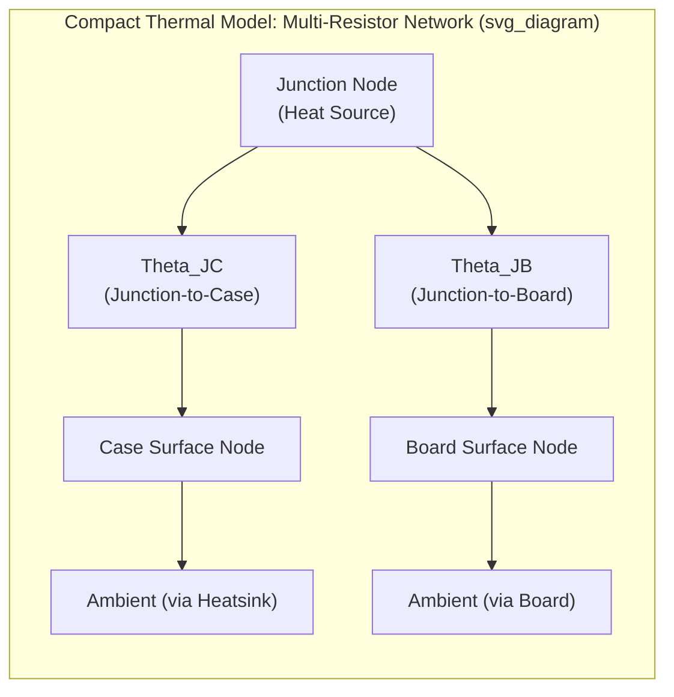

## Thermal Simulation and Compact Thermal Modeling

### Overview

Thermal simulation and compact thermal modeling (CTM) together form the standard methodology for predicting temperature distribution in semiconductor packages without requiring full-detail, computationally prohibitive finite-element or finite-volume models at every stage of the design and system-integration process. Detailed thermal simulation captures the full physical geometry and material stack of a package for accurate, high-fidelity prediction during package design; compact thermal models distill that detailed behavior into simplified, standardized representations that can be efficiently exchanged and simulated at the board, system, or data-center level — analogous in purpose to how IBIS/IBIS-AMI models allow electrical behavior exchange without disclosing full transistor-level detail.

**Key Points**

- Detailed simulation and compact modeling serve different but complementary purposes: detailed models answer "does this specific package design meet its thermal budget," while compact models answer "how does this package behave as one thermal element within a larger system" — a distinction that mirrors the general engineering trade-off between simulation fidelity and simulation speed/portability.
- Compact thermal models are the standard vehicle for exchanging thermal behavior information between semiconductor vendors and system/board-level integrators without requiring disclosure of proprietary die and package construction details.

### Physical Basis of Thermal Simulation

**Governing Equations**

Thermal simulation solves the heat diffusion (conduction) equation, in steady-state or transient form, across the package's material domains:

$$\rho c_p \frac{\partial T}{\partial t} = \nabla \cdot (k \nabla T) + Q$$

where $\rho$ is density, $c_p$ is specific heat, $k$ is thermal conductivity (which may be anisotropic, particularly relevant for materials like graphite TIMs discussed elsewhere in this curriculum), $T$ is temperature, and $Q$ is the volumetric heat generation rate (from die power dissipation). Boundary conditions at external surfaces (heatsink-to-air convection, radiation where relevant) couple the conduction problem to the package's actual cooling environment.

**Discretization Methods**

- **Finite element method (FEM)**: divides the 3D package geometry into a mesh of elements (commonly tetrahedral or hexahedral) and solves the governing equation across the mesh; well-suited to complex, irregular geometries typical of real package structures (wirebonds, bump arrays, non-uniform stack-ups).
- **Finite volume method (FVM)**: divides the domain into control volumes and enforces conservation of energy across volume boundaries; commonly used in computational fluid dynamics (CFD)-coupled thermal simulation where conjugate heat transfer (simultaneous solid conduction and fluid convection) must be captured, such as forced-air or liquid-cooled heatsink analysis.
- **Finite difference method (FDM)**: applies a structured grid and differential approximation, historically used for simpler geometries and still relevant in some compact/reduced-order modeling contexts due to its computational simplicity.

**Conjugate Heat Transfer**

For package-level thermal simulation that includes the external cooling solution (heatsink fins, forced-air or liquid flow), the simulation must couple solid conduction (within the package materials) with fluid convection (within the airflow or liquid flow around the heatsink), termed conjugate heat transfer analysis — computationally more demanding than pure conduction analysis but necessary to accurately capture the interaction between package thermal resistance and cooling solution effectiveness.

### Package-Level Thermal Simulation Inputs

**Power Map**

The spatial distribution of heat generation across the die (and, for multi-die packages, across all dies) is a critical simulation input. As emphasized in research on backside power delivery network thermal effects, traditional thermal analyses often employ uniform power maps to simplify computational complexity, but this practice neglects localized heating effects, leading to inaccuracies in thermal estimations — meaning accurate, spatially-resolved (non-uniform) power maps are increasingly necessary for realistic thermal simulation results, particularly for multi-core, multi-block, or multi-die designs with heterogeneous activity across the die area.

**Material Stack Properties**

Each material layer in the package (die, TIM1, lid, TIM2, heatsink, substrate, mold compound, underfill) requires accurate thermal conductivity, and for transient analysis, density and specific heat, as simulation inputs. As referenced in the materials science context of this curriculum, TIM selection (grease, gel, gap pad, metal, phase-change, or emerging materials like liquid metal, graphene, or diamond) directly sets a key thermal resistance term in the simulated stack, and anisotropic materials (graphite films, certain composite substrates) require direction-dependent conductivity values rather than a single scalar $k$.

**Boundary Conditions**

External boundary conditions — ambient temperature, heatsink convective heat transfer coefficient (a function of airflow rate, heatsink fin geometry, and whether cooling is natural or forced convection), and, where applicable, board-level heat spreading into the PCB — must be specified to close the simulation problem; heat transfer coefficients spanning roughly 200 W/(m²·K) for typical chassis-air cooling conditions to 2500 W/(m²·K) or higher for forced-air multi-fin heatsink configurations illustrate the substantial range these boundary conditions can span depending on cooling architecture.

### Compact Thermal Modeling Fundamentals

**Purpose and the Two-Resistor Model**

The simplest and most historically established compact thermal model represents a package as two thermal resistances: **junction-to-case** ($\theta_{JC}$) characterizing the path from the die junction to the package's top (case) surface, typically used when a heatsink is directly attached to the case, and **junction-to-board** ($\theta_{JB}$) characterizing the path from the die junction to the package's bottom (board-attached) surface, used when heat is primarily extracted through the board. These two values, provided in a component's datasheet, allow a system designer to perform a basic first-order thermal estimate without needing the package's internal construction details.

**Limitations of the Two-Resistor Model**

The two-resistor model is boundary-condition-dependent — $\theta_{JC}$ and $\theta_{JB}$ values are only strictly valid under the specific test/measurement boundary conditions (cooling configuration, heat spreading assumptions) under which they were characterized, and applying them under substantially different actual system boundary conditions can produce inaccurate temperature predictions. This limitation motivated the development of more physically-grounded, boundary-condition-independent compact model standards.

**DELPHI-Style Compact Models (Multi-Resistor Networks)**

More advanced compact thermal models represent the package as a network of multiple thermal resistances connecting several external package boundary surfaces (top, bottom, and sometimes side surfaces) to an internal junction node, calibrated against detailed simulation results across a range of boundary conditions specifically so the resulting compact network remains reasonably accurate across a broader range of actual system cooling configurations than the simple two-resistor model allows. This approach, developed and standardized through international collaborative efforts (historically associated with the DELPHI and subsequent JEDEC-aligned initiatives), produces a resistor-network model that can be directly instantiated in a board or system-level thermal/electrical co-simulation tool.

**Key Points**

- The fundamental value proposition of a well-constructed compact thermal model is boundary-condition independence (or at least reduced boundary-condition sensitivity) relative to the simple two-resistor approach — allowing the same compact model to be reused accurately across a reasonable range of system cooling scenarios rather than requiring re-characterization for every specific application context.
- Compact models are typically generated by calibrating/reducing a detailed, full-fidelity simulation model (or correlated physical measurement data) against a target compact network topology and resistance values, meaning compact model quality is fundamentally bounded by the quality of the detailed model or measurement data used to generate it.

### Standardization: JEDEC Thermal Standards

**JEDEC JESD51 Series**

The JEDEC JESD51 family of standards defines standardized test methods and environmental conditions for measuring package thermal characteristics ($\theta_{JA}$ junction-to-ambient, $\theta_{JC}$, $\theta_{JB}$, and related metrics) to ensure thermal specifications from different vendors are measured consistently and thus comparable. [Unverified: specific standard numbers and their exact current scope should be confirmed against the current JEDEC publication, as the JESD51 series has been extended and revised over time to cover additional package types and test conditions.]

**DELPHI/JEDEC Compact Model Standards**

Standardized compact thermal model generation methodology (building on the DELPHI project's original multi-resistor network approach) has been incorporated into JEDEC standards to provide a consistent, vendor-neutral format for compact model exchange, analogous in spirit to how IBIS standardizes electrical behavioral model exchange — allowing a component vendor to supply a standardized compact thermal model to a system integrator without disclosing proprietary internal package construction details.

### Compact Model Application in System-Level Analysis

**Board and System-Level Thermal Co-Simulation**

Once generated, a compact thermal model for a package can be instantiated within board-level or system-level thermal simulation (alongside compact models for other heat-generating components on the same board) to predict overall system thermal behavior — including component-to-component thermal coupling (heat from one component raising the local ambient temperature seen by a neighboring component) that would be impractical to capture if every component were modeled at full detailed-simulation fidelity within the same system-level model.

**Multi-Die and 2.5D/3D Package Compact Modeling**

Extending compact thermal modeling to multi-die, 2.5D, and 3D packages introduces additional complexity because thermal coupling between adjacent or stacked dies (and their potentially very different individual power maps) is not adequately captured by a simple single-junction-node model — research on package-level thermal assessment for backside power delivery networks and related multi-die architectures has specifically emphasized that non-uniform, spatially-resolved power maps and correspondingly more detailed thermal models are increasingly necessary as die count, stacking, and power density increase, since simplified compact representations calibrated for single-die packages can under-represent localized hot-spot behavior in these more complex architectures.

**Key Points**

- As advanced packaging trends (2.5D/3D integration, chiplet architectures, backside power delivery) increase the spatial and thermal complexity of a "package" as a single thermal element, compact thermal modeling methodology is evolving toward multi-node, per-die or per-region representations rather than the traditional single-junction-node abstraction, to adequately capture inter-die thermal coupling and non-uniform power map effects.

### Verification and Correlation Methodology

**Simulation-to-Measurement Correlation**

Detailed thermal simulation results and derived compact models are standardly validated against physical measurement — using techniques such as thermal test die (a specially designed die with embedded heaters and temperature sensors at known locations) or infrared thermography of a populated package under controlled power dissipation — to confirm the simulation methodology and resulting compact model accurately predict real device behavior before relying on simulation-based thermal signoff for production design decisions.

**Mesh Convergence and Numerical Validation**

For detailed FEM/FVM simulation, mesh convergence studies (confirming that further mesh refinement does not meaningfully change the predicted temperature result) are standard practice to distinguish genuine physical prediction from numerical discretization artifact, particularly important near high-gradient regions such as localized hot spots or fine-geometry features like TSV arrays or micro-bump fields.

**Key Points**

- Both detailed simulation and compact model generation carry meaningful risk of systematic error (from meshing/convergence issues, incomplete or inaccurate material property data, or oversimplified boundary condition assumptions), so physical correlation remains a standard verification step even in simulation-heavy thermal design flows, mirroring the same correlation discipline applied to electrical S-parameter and IBIS-AMI model verification.

### Illustrative Compact Model Network

### Related Topics

- Thermal interface materials: greases, gels, metals, and phase-change materials
- Emerging thermal materials: liquid metal, graphene, and diamond
- Backside power delivery network integration with packaging
- JEDEC JESD51 thermal characterization standards
- Thermal test die design and infrared thermography measurement techniques
- Multi-die and 2.5D/3D package thermal coupling modeling
- Conjugate heat transfer simulation for heatsink and cold-plate design
- Non-uniform die power mapping for advanced package thermal analysis