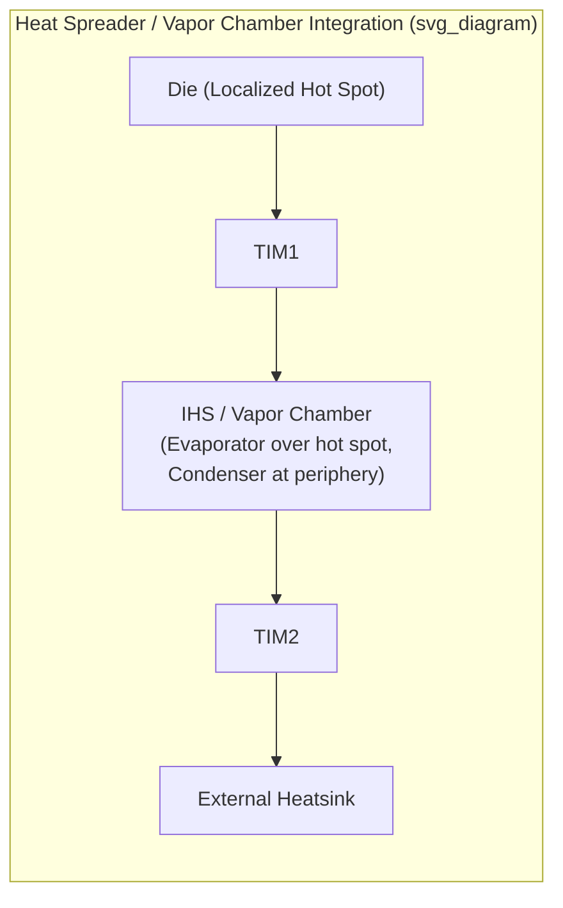

## Heat Spreaders, Lids, and Vapor Chamber Integration

### Overview

Heat spreaders and lids form the mechanical and thermal structure that sits directly atop (or in place of) the die, providing mechanical protection, a uniform heat-spreading surface, and the interface to the external cooling solution. Vapor chambers extend this function using two-phase heat transfer to achieve substantially higher effective thermal conductivity than solid metal spreaders, becoming increasingly relevant as die power densities and localized hot-spot intensities rise in advanced packages. Together these elements bridge the gap between the concentrated heat generation at the die (and its TIM1 interface) and the more diffuse dissipation capability of external heatsinks or cold plates.

**Key Points**

- The functional distinction between a lid and a heat spreader is one of degree rather than kind: a lid primarily provides mechanical protection and a flat mounting surface with heat-spreading as a secondary benefit, while a dedicated heat spreader (or vapor chamber) is optimized primarily for lateral heat distribution, though in most modern packages the same physical component (the integrated heat spreader, IHS) serves both roles simultaneously.
- As localized hot spots become more severe with advancing power density (particularly in multi-die and 2.5D/3D packages with non-uniform power maps), the heat-spreading function of the lid/IHS becomes an increasingly active design lever rather than an assumed, largely passive mechanical cover.

### Integrated Heat Spreaders (IHS)

**Function and Placement**

The integrated heat spreader is a metal cap (most commonly copper, sometimes copper with a nickel-plated finish, or aluminum for lower-cost/lower-performance applications) attached over the die via TIM1, forming the TIM1/IHS/TIM2 sandwich structure discussed in thermal interface material topics. Its primary functions are: (1) laterally spreading concentrated heat from the die's (often smaller) footprint across the IHS's larger surface area before it reaches the external cooling solution, and (2) providing mechanical protection for the die and a flat, robust surface for heatsink clamping and handling during manufacturing and system assembly.

**Material Selection**

- **Copper**: high thermal conductivity (~$400\ \text{W/(m·K)}$) makes copper the preferred choice for high-performance applications where heat-spreading effectiveness is a priority; its higher cost and higher CTE relative to silicon (a consideration for TIM1 reliability, as discussed in thermal interface material and CTE mismatch topics) are the primary trade-offs.
- **Aluminum**: lower thermal conductivity (~$200$–$235\ \text{W/(m·K)}$) but lower cost and lighter weight, used where thermal performance requirements are less stringent or cost sensitivity is higher.
- **Composite and engineered materials**: some high-performance applications use copper-tungsten, copper-molybdenum, or other engineered composite materials specifically to tune the CTE closer to silicon (reducing TIM1 and solder-TIM CTE mismatch stress) at some cost to peak thermal conductivity relative to pure copper — an explicit trade-off between thermal performance and mechanical reliability.

**Geometric and Design Considerations**

- **Thickness**: thicker IHS structures provide more lateral heat-spreading volume (improving spreading resistance) but increase the total vertical thermal path length and add mass/cost; IHS thickness is therefore an explicit optimization parameter balancing spreading effectiveness against added series thermal resistance and mechanical/cost constraints.
- **Footprint relative to die size**: the ratio of IHS footprint to die footprint directly affects spreading effectiveness — a larger IHS footprint relative to the die allows more lateral spreading area but requires a correspondingly larger, more expensive package and heatsink footprint.
- **Surface flatness and finish**: IHS surface flatness directly affects TIM1 and TIM2 bond line thickness uniformity (as discussed in thermal interface material topics), making flatness specification and control a coupled mechanical/thermal design parameter rather than a purely mechanical one.

### Lid Attach and Sealing

**Lid Attach Process**

The IHS/lid is typically attached to the substrate (around the die perimeter) using an adhesive sealant (often a silicone- or epoxy-based adhesive) that provides mechanical bonding and environmental sealing of the die cavity, while the TIM1 material separately provides the thermal path between die and lid within that sealed cavity. This dual-material approach (structural adhesive at the perimeter, thermal material at the die-lid interface) allows each material to be optimized independently for its distinct function (mechanical/environmental versus thermal).

**Mechanical and Reliability Considerations**

- Lid attach adhesive must accommodate CTE mismatch-induced stress between the lid, substrate, and die over the product's thermal cycling lifetime without delaminating or cracking, since a compromised lid seal can expose the die cavity to moisture and contamination.
- Lid stiffness contributes to overall package warpage behavior, particularly relevant for large-die or multi-die packages where package-level warpage affects both TIM bond line thickness uniformity and board-level solder joint reliability — connecting lid mechanical design to the broader thermal-mechanical co-design considerations discussed in chip-package-board co-design.

### Vapor Chamber Fundamentals

**Two-Phase Heat Transfer Principle**

A vapor chamber is a sealed, typically flat, hermetically enclosed structure containing a small quantity of working fluid (commonly water for electronics cooling applications, given its favorable thermal properties in the relevant temperature range) under partial vacuum, along with an internal wick structure. Heat applied at the evaporator region (the hot side, positioned over the concentrated heat source) vaporizes the working fluid; the vapor travels rapidly through the chamber's vapor space to cooler regions (the condenser, typically the broader surface in contact with the external heatsink), where it condenses and releases its latent heat of vaporization; the wick structure then returns the condensed liquid to the evaporator via capillary action, completing the closed cycle.

**Why Vapor Chambers Outperform Solid Metal Spreaders**

Because heat transport occurs via the latent heat of phase change (vaporization/condensation) rather than solid conduction alone, a vapor chamber's effective thermal conductivity in the lateral (spreading) direction can substantially exceed that of even high-conductivity solid metals like copper — solid copper conducts via a continuous conduction gradient limited by its fixed $k \approx 400\ \text{W/(m·K)}$, whereas a vapor chamber's effective conductivity can reach values corresponding to many times that figure because the phase-change transport mechanism moves heat far more efficiently across the chamber's lateral extent, particularly valuable for spreading heat away from small, high-intensity hot spots before it reaches the external heatsink interface.

**Wick Structure Design**

The wick structure (commonly sintered metal powder, metal mesh, or grooved channel structures) must balance capillary pumping capability (returning condensed liquid to the evaporator against gravity and pressure losses) against flow resistance for the liquid return path; wick design directly determines the vapor chamber's maximum heat flux capability and its orientation sensitivity (performance dependence on gravity-assisted versus gravity-opposed operating orientation), a consideration relevant to system-level mounting orientation assumptions.

### Vapor Chamber Integration in Package-Level Thermal Design

**Replacing or Augmenting the Solid IHS**

In the highest power-density applications, a vapor chamber can be integrated directly as (or in place of) the package's IHS/lid structure, or as an intermediate spreading layer between the IHS and the external heatsink, specifically to address localized hot spots that a solid copper IHS's finite lateral conduction cannot adequately spread before the heat reaches the external cooling interface.

**Hot-Spot Mitigation for Multi-Die and Non-Uniform Power Maps**

As emphasized in thermal simulation and compact modeling discussions of non-uniform power maps, advanced packages (multi-die, 2.5D/3D, backside-power-delivery-enabled) increasingly exhibit spatially concentrated, high-intensity hot spots rather than uniform die-wide heat generation. Vapor chamber integration is a direct architectural response to this trend — its two-phase transport mechanism is specifically effective at rapidly spreading heat away from a small, intense hot-spot region across the chamber's full area, a task a solid metal spreader performs comparatively less efficiently due to its lower effective lateral conductivity.

**Integration Constraints**

- **Thickness and form factor**: vapor chambers require sufficient internal volume for the vapor space and wick structure, generally making them thicker than an equivalent solid metal spreader of comparable footprint — a form-factor trade-off relevant in thickness-constrained package or system designs.
- **Hermetic sealing reliability**: because vapor chamber performance depends entirely on maintaining the sealed internal vacuum/working-fluid environment, any breach of the hermetic seal over the product's operating lifetime (from mechanical stress, thermal cycling fatigue, or manufacturing defect) can catastrophically degrade performance — making seal reliability qualification a critical, vapor-chamber-specific reliability consideration beyond what a solid metal spreader requires.
- **Manufacturing cost and complexity**: vapor chamber fabrication (precision sealing, wick structure fabrication, vacuum/fluid charging) is inherently more complex and costly than machining or stamping a solid metal spreader, restricting vapor chamber adoption to applications where the hot-spot mitigation benefit justifies the added cost — historically high-performance computing, gaming, and select high-power mobile/laptop applications, with increasing relevance to high-power-density AI accelerator packaging as die power densities climb.

**Key Points**

- Vapor chamber integration is best understood as a targeted response to localized hot-spot severity rather than a general-purpose replacement for solid heat spreaders across all package thermal designs — the added cost and complexity are justified specifically when hot-spot intensity, not average die power, is the binding thermal design constraint.
- [Inference] As backside power delivery, 2.5D/3D chiplet integration, and non-uniform power map effects (as discussed in the thermal simulation and BSPDN topics of this curriculum) become more prevalent in high-performance packages, vapor chamber and other two-phase spreading solutions are likely to see expanded adoption specifically to address the more severe, spatially concentrated hot spots these architectures tend to produce, though the added cost still restricts this to higher-value application segments rather than commodity packaging.

### Comparative Summary: Solid Spreader vs. Vapor Chamber

| Attribute | Solid Copper IHS/Spreader | Vapor Chamber |
| --- | --- | --- |
| Heat transport mechanism | Solid conduction | Two-phase (evaporation/condensation) |
| Effective lateral conductivity | ~400 W/(m·K), fixed | Substantially higher (effective, direction-dependent) |
| Best suited for | Uniform or moderate power density | Concentrated, high-intensity hot spots |
| Thickness/form factor | Thinner, simpler | Thicker (requires internal vapor space) |
| Reliability risk profile | CTE mismatch, lid seal integrity | CTE mismatch, lid seal integrity, PLUS hermetic seal/working-fluid retention |
| Relative cost | Lower | Higher |
| Orientation sensitivity | None | Potentially significant (wick/gravity dependent) |

### Illustrative Cross-Section Diagram

### Related Topics

- Thermal interface materials: greases, gels, metals, and phase-change materials
- Emerging thermal materials: liquid metal, graphene, and diamond
- Thermal simulation and compact thermal modeling
- Package warpage and lid attach reliability engineering
- Backside power delivery network integration with packaging (non-uniform power map effects)
- Liquid cooling and cold plate integration for advanced packages
- Hermetic sealing qualification methods for two-phase thermal devices
- CTE-matched composite materials for lid and spreader applications