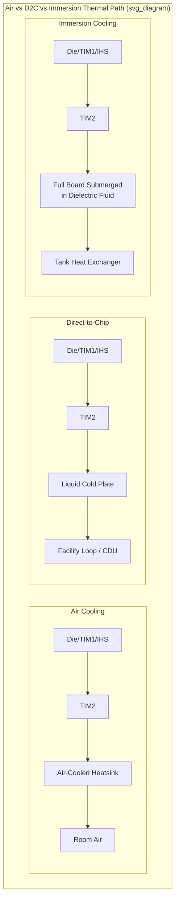

## Direct-to-Chip and Immersion Liquid Cooling

### Overview

As die and package power density has risen with successive generations of high-performance compute and AI accelerator silicon, conventional air cooling has reached practical limits for the highest-power packages, driving adoption of liquid cooling architectures at the package and system level. Direct-to-chip (D2C) cooling delivers coolant directly to the most thermally demanding components via cold plates mounted on the chips themselves, extracting heat at the source, while immersion cooling submerges IT equipment (including the full board, not just individual chips) into a dielectric fluid for cooling, allowing the cooling medium to absorb heat from more components at once. Both represent a fundamental shift from the package-to-heatsink-to-air thermal path assumed by conventional air cooling toward a package-to-liquid thermal path with substantially higher achievable heat flux capability.

**Key Points**

- Direct-to-chip cooling replaces only the air-to-heatsink portion of the thermal path with a liquid-cooled cold plate, while the rest of the server can still use conventional airflow for lower-power components; immersion cooling replaces the entire board-level air-cooling paradigm by submerging the whole assembly.
- GPU and AI accelerator power has risen rapidly, with NVIDIA's H100 operating at roughly 700 W and the Blackwell-generation B200 reaching nearly 1,000 W per GPU, directly driving the shift from air toward liquid cooling architectures as the practical ceiling for air-cooled heat rejection is exceeded at these power levels.

### Direct-to-Chip (D2C) Cooling Architecture

**Cold Plate Fundamentals**

A cold plate is a liquid-cooled heat exchanger attached directly to the package (typically in place of, or integrated with, the conventional air-cooled heatsink) in place of the TIM2/heatsink stack discussed in prior thermal management topics. Coolant flows through internal channels or a microchannel structure within the cold plate, absorbing heat from the package via conduction through the cold plate base and TIM2 interface, then carrying that heat away to be rejected elsewhere in the facility's liquid cooling infrastructure.

**Single-Phase vs. Two-Phase D2C**

- **Single-phase D2C**: coolant (typically a water-based or water-glycol mixture, sometimes proprietary dielectric fluids) remains in liquid phase throughout the cold plate, absorbing heat via sensible heat (temperature rise of the fluid) as it passes through the cold plate's flow channels. Most liquid-cooled capacity in use today is single-phase direct liquid cooling, and it is expected to continue dominating thanks to advances in cold plate design as heat loads from next-generation accelerator chips continue to rise.
- **Two-phase D2C**: coolant undergoes phase change (boiling) within the cold plate, absorbing heat via latent heat of vaporization rather than sensible heat alone, enabling substantially higher heat flux capability per unit coolant flow rate at the cost of greater system complexity (managing the vapor/liquid phase transition, condensation, and return).

**System-Level Infrastructure**

D2C systems route coolant fluid through a closed loop, extracting heat at the source before it can accumulate in the surrounding air. This closed loop typically connects to a coolant distribution unit (CDU) that interfaces the server-level cold plate loop with the facility's broader liquid cooling infrastructure (often a secondary loop connecting to facility chillers or dry coolers), allowing the server-level loop to use a controlled, filtered coolant while the facility-level loop handles ultimate heat rejection to ambient or a building cooling system.

**Deployment Practicality**

For most operators upgrading existing facilities, direct-to-chip cooling offers a practical retrofit path: it provides dramatically higher performance and efficiency than air cooling while requiring substantially lower infrastructure upheaval than full immersion, since much of the server (and rack-level infrastructure) can remain air-cooled for lower-power components while only the highest-power chips receive dedicated cold plates.

### Immersion Cooling Architecture

**Single-Phase Immersion**

In single-phase immersion cooling, the entire server board (or a substantial portion of it) is submerged in a dielectric fluid that remains in liquid phase throughout the cooling process, with the fluid itself circulated through the immersion tank and an external heat exchanger to reject absorbed heat, analogous in principle to single-phase D2C but applied to the entire board rather than only individual chips via a cold plate.

**Two-Phase Immersion**

In two-phase immersion cooling, the dielectric fluid is engineered to boil at a temperature close to the target component operating temperature; heat from the submerged components vaporizes the fluid locally, and the vapor rises to a condenser coil (typically at the top of the sealed tank) where it condenses and returns to the liquid pool — a self-circulating, largely passive two-phase cycle conceptually similar to the vapor chamber principle discussed in the heat spreader topic of this curriculum, but implemented at the scale of an entire server or rack rather than within a single package.

**Dielectric Fluid Requirements**

Immersion cooling fluids must be electrically non-conductive (dielectric) since electronic components remain energized while submerged, along with material compatibility with board components, low volatility/evaporation loss (particularly critical for single-phase systems using an open or lightly-sealed tank), and appropriate viscosity and boiling point characteristics for the chosen single-phase or two-phase approach.

**Coverage and Density Advantages**

Because immersion cooling submerges the full board, it provides broader heat removal coverage than D2C, extending cooling benefit to voltage regulators, memory, and other board-level components beyond just the primary processor/accelerator die — this broader coverage is why immersion cooling can support extremely high-density rack and tank configurations, since essentially the entire heat load of the submerged hardware is captured by the liquid medium rather than only the highest-power chips.

### Comparative Trade-offs

**Serviceability and Operational Model**

D2C cooling changes the operating model less dramatically than immersion — individual components can generally still be serviced using largely familiar procedures with the cold plate loop disconnected, whereas immersion cooling requires removing hardware from the dielectric fluid tank for service, along with fluid handling procedures, representing a more substantial departure from conventional data center operational practice. Single-phase direct liquid cooling has gained particular traction for its practicality advantages, including serviceability benefits compared to full immersion approaches, alongside scalable deployment models supporting both new-build ("greenfield") AI facilities and retrofits of existing ("brownfield") facilities.

**Retrofit vs. Greenfield Suitability**

Direct-to-chip cooling is usually easier to introduce into existing environments, while immersion cooling becomes more attractive when very high-density AI or HPC workloads are planned from the beginning of a facility's design, reflecting that immersion's more substantial infrastructure requirements (tanks, fluid handling, structural/floor loading considerations) are more readily accommodated when designed in from the outset rather than retrofitted.

**Selection Criteria**

For most data centers, the right choice between D2C and immersion depends on rack density, server hardware compatibility, retrofit constraints, staff familiarity with liquid cooling maintenance procedures, energy efficiency targets, and the long-term IT hardware roadmap — there is no single universally superior technology, and the appropriate choice is deployment-context-dependent.

**Key Points**

- D2C cooling is currently the dominant liquid cooling approach for AI/HPC deployments given its practicality, serviceability, and compatibility with partial (rather than wholesale) infrastructure transition, while immersion cooling is used more selectively for the highest-density, purpose-built deployments where its broader coverage and density advantages outweigh its greater operational departure from conventional practice.
- [Unverified: specific market adoption percentages, deployment tonnage/megawatt figures, and cost/TCO crossover thresholds cited in industry sources vary across publications and should be verified against current, primary industry data (e.g., Uptime Institute survey data or vendor-published figures) rather than treated as settled figures, since this is a rapidly evolving deployment landscape.]

### Package-Level Design Implications

**Cold Plate Interface and TIM2 Considerations**

The transition from an air-cooled heatsink to a liquid-cooled cold plate changes the TIM2 interface's boundary conditions (the cold plate's contact surface temperature and clamping mechanism differ from a conventional heatsink), but the fundamental TIM2 selection and bond-line-thickness principles discussed in the thermal interface materials topics of this curriculum continue to apply — the cold plate still requires a low-resistance, reliable thermal interface to the package's IHS/lid.

**Interaction with On-Package Thermal Solutions**

Liquid cooling at the cold-plate or immersion level does not eliminate the need for effective on-package thermal management (TIM1, IHS/lid, and potentially vapor chamber integration for localized hot-spot mitigation as discussed in the prior heat spreader topic) — it changes the boundary condition at the *external* interface (replacing air convection with liquid convection or two-phase heat transfer), but the internal package thermal stack (die to TIM1 to lid/spreader to TIM2) remains the same fundamental structure requiring the same design discipline.

**Enabling Higher Package Power Density**

Because liquid cooling (whether D2C or immersion) can sustain substantially higher heat flux extraction at the external boundary than air cooling, it directly enables package and system designers to target higher die power density and more aggressive multi-die/2.5D/3D integration than would be thermally feasible under air-cooling constraints alone — reinforcing the connection between package-level design trends discussed elsewhere in this curriculum (backside power delivery, multi-die integration, non-uniform power maps) and the parallel evolution of liquid cooling infrastructure needed to support them.

**Key Points**

- [Inference] As accelerator thermal design power continues to rise across successive hardware generations, the external cooling boundary condition (air, D2C cold plate, or immersion) increasingly becomes a binding constraint on achievable package power density, making cooling architecture selection an input to package thermal design rather than solely a downstream, independent facility-engineering decision.

### Illustrative Thermal Path Comparison

### Related Topics

- Heat spreaders, lids, and vapor chamber integration
- Thermal interface materials: greases, gels, metals, and phase-change materials
- Thermal simulation and compact thermal modeling
- Backside power delivery network integration with packaging (power density drivers)
- Coolant distribution unit (CDU) and facility-level liquid cooling loop design
- Dielectric fluid material compatibility and long-term reliability qualification
- Two-phase cold plate design and vapor management
- Data center rack density and retrofit planning for liquid cooling adoption