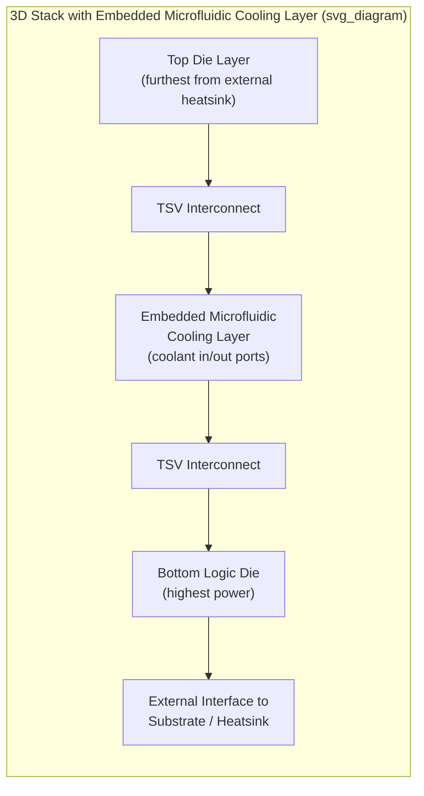

## Embedded Microfluidic and Microchannel Cooling for 3D Stacks

### Overview

Embedded microfluidic and microchannel cooling brings the liquid coolant path inside the package itself — etched or fabricated directly into the silicon (die backside, interposer, or dedicated cooling layer within a 3D stack) — rather than applying liquid cooling only at the external package surface as direct-to-chip cold plates do. This approach directly addresses a limitation that conventional external cooling (even direct-to-chip cold plates) cannot solve for 3D-stacked die: internal dies in a vertical stack are thermally shielded from the external cold plate by the layers above or below them, so heat generated deep within the stack must still conduct through multiple die and bonding interfaces before reaching an external heat sink. Embedding coolant channels between or within the active die layers themselves shortens this thermal path dramatically, extracting heat closer to its point of generation.

**Key Points**

- The fundamental problem embedded microfluidic cooling solves is unique to 3D and dense multi-die stacking: as die count in a vertical stack increases, the interior dies face progressively longer, higher-resistance conduction paths to any external cooling surface, a problem that cannot be solved by improving the external cooling solution (better cold plates, more aggressive liquid cooling) alone since the bottleneck is internal to the stack.
- This is a research-active and increasingly production-relevant area rather than a fully mature, widely standardized package technology; specific implementation architectures continue to evolve, and design practices synthesized here reflect established thermal/fluidic engineering principles applied to this emerging integration context.

### Motivation: The 3D Stacking Thermal Bottleneck

**Conduction Path Length in Stacked Die**

In a conventional single-die package, heat generated at the die travels through a relatively short, well-characterized path (TIM1, IHS, TIM2, external heatsink) to ambient. In a 3D-stacked package (multiple active dies bonded vertically, connected by through-silicon vias), only the die closest to the external heat-extraction surface has this short path; dies further from that surface must conduct heat through the intervening die layers, bonding interfaces (which typically have non-negligible thermal resistance), and any TSV structures, each adding series thermal resistance to an already elevated heat flux path.

**Interaction with Non-Uniform Power Maps and Multi-Die Density**

As discussed in the thermal simulation and backside power delivery topics of this curriculum, advanced packages increasingly exhibit non-uniform, spatially concentrated power dissipation. In a 3D stack, this compounds with the vertical conduction bottleneck: a hot spot on an interior die layer must both spread laterally within that die's plane and conduct vertically through neighboring layers, a substantially more constrained thermal problem than a single-die hot spot with a direct path to an external spreader.

### Embedded Microchannel Cooling Architecture

**Microchannel Fabrication Approaches**

- **Backside-etched silicon microchannels**: channels are etched directly into the backside (or a dedicated interposer/spacer layer) of a die using standard semiconductor fabrication processes (e.g., deep reactive-ion etching), forming a network of fine channels through which coolant flows in direct thermal contact with the silicon substrate immediately adjacent to the active transistor layer — minimizing the conduction path between heat source and coolant.
- **Interposer-embedded channels**: for 2.5D architectures, microfluidic channels can be embedded within the silicon interposer layer itself (functionally separate from the interposer's TSV-based electrical routing), positioned to draw heat from adjacent dies mounted on the interposer without requiring channels to be fabricated within the active die itself.
- **Dedicated cooling layer/interposer**: a purpose-built cooling layer (a silicon or other substrate layer fabricated specifically to contain the microfluidic network, with minimal or no active electrical function) can be inserted between active die layers in a 3D stack specifically to provide an internal heat-extraction plane close to the hottest layers.

**Coolant Delivery and Manifold Design**

Coolant must be delivered to and extracted from the embedded microchannel network via inlet/outlet manifolds that connect the internal channel structure to external plumbing — typically requiring dedicated through-package fluidic vias or ports distinct from (though potentially co-located with) the electrical TSV/via structures used for signal and power routing. Manifold design must balance flow distribution uniformity across the channel network (avoiding localized under-cooled regions from uneven flow) against the added area and structural complexity these fluidic through-package connections introduce.

**Channel Geometry and Heat Transfer Characteristics**

Microchannel heat transfer performance depends on channel width, depth, spacing, and coolant flow rate, following standard forced-convection heat transfer principles but at a scale (channel dimensions often tens to low-hundreds of micrometers) where the high surface-area-to-volume ratio of narrow channels provides substantially enhanced convective heat transfer coefficients compared to larger-scale liquid cooling structures like conventional direct-to-chip cold plates. [Inference] Finer channels generally improve heat transfer coefficient but increase pressure drop and pumping power requirements, and are more susceptible to fouling/blockage risk, so channel geometry represents a design optimization rather than a "smaller is always better" parameter.

### Integration with 3D-Stacked and 2.5D Architectures

**Interstitial Cooling Layers in 3D Stacks**

For vertically stacked die (e.g., logic-on-logic or memory-on-logic 3D integration), a microfluidic cooling layer can be inserted between specific die layers — most valuably between the highest-power layer and the layers thermally "behind" it relative to the external heatsink — to intercept and extract heat before it must conduct through additional stacked layers, directly shortening the effective thermal path for the layers that would otherwise face the longest conduction distance to ambient.

**Relationship to Through-Silicon Vias**

Because 3D-stacked dies already use TSVs for electrical interconnect between layers, embedded microfluidic cooling architectures must be co-designed with the electrical TSV layout — fluidic channels and TSV arrays occupy the same die area and layer stack-up, requiring careful floorplanning to avoid fluidic channels interfering with electrical via placement (and vice versa), an integration challenge analogous in spirit to the pitch-transformation and co-design challenges discussed for backside power delivery network integration, but applied to thermal rather than electrical through-die structures.

**Application to High-Bandwidth Memory (HBM) and Logic-on-Logic Stacks**

HBM stacks (multiple DRAM die layers atop a base logic die, connected via TSVs) and emerging logic-on-logic 3D integration are natural candidates for embedded microfluidic cooling, given their inherently long vertical conduction paths for upper-layer dies and, in logic-on-logic architectures, potentially very high combined power density from two active logic layers rather than one.

### Reliability and Manufacturing Considerations

**Hermeticity and Leak Risk**

Because coolant channels are embedded within or between active silicon layers carrying sensitive electrical structures (transistors, TSVs, bonding interfaces), any breach of channel hermeticity poses a substantially more severe failure risk than an external cooling leak (which might damage a heatsink or nearby board area) — an internal microfluidic leak directly risks catastrophic damage to the active die stack itself, making hermetic seal integrity and leak-detection/prevention a first-order reliability requirement for embedded microfluidic architectures.

**CTE and Mechanical Stress from Fluidic Structures**

Etched microchannel networks locally alter the mechanical properties (stiffness, effective density) of the silicon layer they are fabricated in, which can interact with the CTE mismatch and warpage considerations already present in multi-die 3D stacks (as discussed in chip-package-board co-design), requiring mechanical/structural analysis of the microchannel layer alongside its thermal design.

**Coolant Chemistry and Long-Term Reliability**

Coolant used in embedded microfluidic channels must be compatible with the silicon, any exposed metal (TSV, bonding, or channel-wall materials), and bonding adhesives over the product's operating lifetime — corrosion, electrochemical migration risk (particularly relevant given the close proximity of coolant channels to active electrical structures), and coolant degradation over time are all reliability considerations distinct from and generally more stringent than those applicable to external, board-level liquid cooling loops.

**Manufacturing and Yield Impact**

Fabricating microfluidic channels and their associated through-package fluidic vias adds process steps and potential yield-loss mechanisms (channel blockage, incomplete sealing, structural defects) to what is already a complex 3D-integration manufacturing flow, meaning embedded microfluidic cooling's practical adoption depends on demonstrating that its thermal benefit justifies this added manufacturing complexity and potential yield impact relative to simpler (if thermally less capable) alternatives like improved external cold-plate cooling or vapor chamber integration.

**Key Points**

- The central engineering trade-off for embedded microfluidic cooling is thermal benefit (shortened conduction path, higher achievable power density for interior stack layers) versus substantially increased manufacturing complexity, yield risk, and a more severe failure consequence (internal coolant leak) compared to external liquid cooling approaches — a trade-off that currently favors adoption primarily in the highest-value, highest-power-density 3D-stacked applications where conventional external cooling cannot adequately serve interior die layers.

### Comparison to External Liquid Cooling Approaches

| Attribute | Direct-to-Chip Cold Plate | Embedded Microfluidic Cooling |
| --- | --- | --- |
| Coolant location | External, atop package/lid | Internal, between/within die layers |
| Addresses interior 3D-stack layers | No — only nearest-surface die benefits directly | Yes — directly targets interior layer heat extraction |
| Leak consequence severity | Moderate (external damage risk) | Severe (direct exposure to active silicon) |
| Manufacturing complexity | Lower (external assembly step) | Higher (integrated into die/interposer fabrication) |
| Maturity | Established, widely deployed | Emerging/research-active, selective production use |
| Primary use case | General high-power single/multi-die packages | 3D-stacked and logic-on-logic architectures with interior hot layers |

### Illustrative Embedded Cooling Layer Diagram

### Related Topics

- Direct-to-chip and immersion liquid cooling
- Heat spreaders, lids, and vapor chamber integration
- Thermal simulation and compact thermal modeling (non-uniform, multi-die power maps)
- Backside power delivery network integration with packaging (TSV co-design considerations)
- Through-silicon via (TSV) fabrication and electrical/thermal co-design
- High-bandwidth memory (HBM) stack architecture and thermal characterization
- Hermetic sealing and leak-detection methods for internal fluidic structures
- Logic-on-logic 3D integration thermal and mechanical co-design