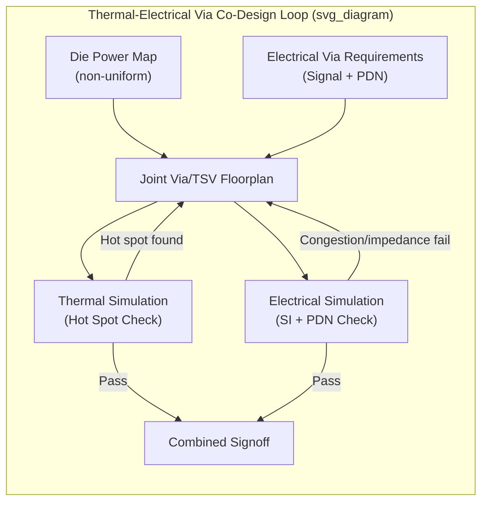

## Thermal Via Design and Thermal-Electrical Co-Design in Dense Stacks

### Overview

Thermal vias are dedicated vertical conductive structures placed through package substrate layers, interposers, or die layers primarily (or exclusively) to conduct heat rather than carry electrical signals or power. In dense multi-die, 2.5D, and 3D-stacked packages, thermal vias must be planned alongside — and often compete for the same physical space and layer resources as — electrical signal and power vias/TSVs, making thermal-electrical co-design a necessary discipline rather than a sequential afterthought once electrical routing is finalized.

**Key Points**

- A thermal via's function is purely to provide a low-resistance vertical conduction path for heat; it carries no signal or power information, but it occupies physical area and layer resources that could otherwise be used for electrical routing, creating a direct area/resource competition that must be resolved through co-design.
- As die stacking density and TSV/via density both increase in advanced 2.5D/3D packages, the available physical space for dedicated thermal vias shrinks precisely as the thermal need for them grows — a tension that makes thermal-electrical co-design increasingly critical rather than optional as packages scale.

### Thermal Via Fundamentals

**Physical Structure and Materials**

Thermal vias are typically fabricated using the same conductive materials and, often, the same process flow as electrical vias/TSVs in a given package technology — commonly copper-filled vias through silicon (thermal TSVs) or through organic substrate/interposer dielectric layers, since copper's high thermal conductivity (~$400\ \text{W/(m·K)}$) makes it effective for both electrical and thermal conduction purposes, and reusing an established via fabrication process avoids introducing an entirely separate manufacturing flow solely for thermal structures.

**Thermal Resistance Contribution**

A thermal via's effectiveness is governed by the same conduction physics as any vertical thermal path: resistance is proportional to via length (layer thickness) and inversely proportional to via cross-sectional area and the material's thermal conductivity. Dense arrays of thermal vias placed beneath or near a high-power die region reduce the effective thermal resistance of that vertical path by providing multiple parallel low-resistance conduction routes, analogous in principle to how densely packed power/ground vias reduce electrical loop inductance in PDN design.

**Thermal Via Placement Strategy**

Thermal vias are most effective when placed directly beneath (or immediately adjacent to) the highest-power-density regions of a die, following the die's power map rather than being distributed uniformly across the package — reinforcing the connection to non-uniform power map awareness discussed in the thermal simulation and backside power delivery topics of this curriculum, since a uniformly distributed thermal via array may under-serve a concentrated hot spot while over-provisioning lower-power regions.

### The Thermal-Electrical Via Competition

**Shared Physical Resources**

In any given layer of a package, interposer, or 3D-stacked die, the available area for through-layer vertical structures (vias/TSVs) is finite, constrained by minimum via pitch, keep-out zones around active circuitry, and the layer's total routing capacity. Electrical signal vias, power/ground vias (including the dense via arrays required for low-inductance PDN paths discussed in power delivery network design), and thermal vias all compete for this same finite via budget.

**Trade-off Dynamics**

- Allocating more via area to thermal vias directly reduces the area available for electrical routing (signal density or PDN via density), potentially forcing additional routing layers (added cost) or accepting reduced electrical performance (higher via-limited PDN impedance, more constrained signal routing) to accommodate thermal needs.
- Conversely, prioritizing electrical routing density without adequate thermal via allocation risks leaving high-power regions without sufficient vertical heat-extraction capacity, potentially causing localized hot spots that exceed the die's reliable operating temperature even if the package's overall (average) thermal budget appears satisfied.

**Dual-Use and Shared Structures**

Some package architectures exploit structures that serve both electrical and thermal functions simultaneously to reduce this competition — for example, dense power/ground via arrays (already required for PDN performance) inherently also provide meaningful thermal conduction benefit as a secondary function, since a well-designed low-inductance power via array is, by virtue of being a dense array of high-conductivity copper structures, also a reasonably effective thermal conduction path. [Inference] Explicitly designing power/ground via placement with this dual electrical-thermal benefit in mind, rather than treating thermal vias as an entirely separate allocation, is one practical way co-design can reduce the net area competition between the two needs, though the electrical requirement (target impedance, current-carrying capacity) should remain the primary design driver for these shared structures given their electrical function is non-optional.

### Co-Design Methodology for Dense Stacks

**Joint Floorplanning**

Effective thermal-electrical co-design begins with joint floorplanning that considers the die's power map (from electrical/architectural design), the required electrical via density (signal routing and PDN requirements), and the required thermal via density (derived from thermal simulation of the power map against the package's thermal budget) simultaneously, rather than finalizing electrical floorplan and via allocation before thermal requirements are assessed. This mirrors the general chip-package-board co-design principle — that sequential, domain-isolated design frequently produces infeasible or suboptimal results at the interfaces between domains — applied specifically to the via/TSV layer resource allocation problem.

**Iterative Thermal-Electrical Simulation Loop**

- An initial via floorplan (informed by electrical requirements) is thermally simulated (using the compact or detailed thermal modeling approaches discussed earlier in this curriculum) against the die's actual (ideally non-uniform) power map to identify any hot spots exceeding the target temperature.
- Where hot spots are identified, thermal via density in the affected region is increased, potentially displacing or rerouting electrical vias in that local area, and the electrical impact (routing congestion, local PDN impedance change) of that displacement is re-evaluated.
- This loop iterates until both the thermal budget (no hot spot exceeding target temperature) and electrical budget (adequate routing density, PDN target impedance met) are simultaneously satisfied — the co-design signoff criterion mirrors the "all domains must simultaneously satisfy their requirements using actual, as-designed data" principle central to chip-package-board co-design generally.

**Application to 2.5D/3D Stacks Specifically**

In 2.5D interposer-based and 3D-stacked architectures, this co-design challenge compounds across multiple layers — an interposer's TSV floorplan must simultaneously serve electrical die-to-die routing, PDN distribution to multiple dies, and thermal conduction for potentially several dies with independent (and potentially quite different) power maps mounted on the same interposer, while a 3D stack's TSV floorplan must additionally account for the interior-layer thermal bottleneck discussed in the embedded microfluidic cooling topic, where thermal vias may need to be prioritized specifically to serve interior die layers that would otherwise face the longest conduction path to external cooling.

### Interaction with Backside Power Delivery

**BSPDN's Effect on the Via Resource Competition**

As discussed in the backside power delivery network integration topic, BSPDN relocates power delivery structures (nano-TSVs, buried power rails) to the die backside, which changes — but does not eliminate — the thermal-electrical via competition. Freeing front-side metal layers from power routing duties (since power now uses dedicated backside nTSVs) can reduce front-side electrical-thermal via competition, but introduces a new competition at the backside/package interface, where nTSVs, backside power distribution metal, and any thermal vias needed to route heat from the transistor layer to a backside- or frontside-facing cooling solution must now be co-planned within the backside structure and its interface to the package substrate.

**Key Points**

- [Inference] Because BSPDN fundamentally restructures where and how power reaches the die, its adoption likely requires re-deriving thermal-electrical via co-design practices specifically for the backside interface context, rather than assuming established front-side co-design heuristics transfer directly — an implication of BSPDN's package-level consequences that connects directly to the thermal via allocation challenge discussed here.

### Verification Methodology

**Combined Electrical-Thermal Signoff**

Signoff for a dense stack's via/TSV floorplan requires demonstrating that both the electrical simulation (SI channel analysis, PDN target impedance, as discussed in the corresponding electrical design topics of this curriculum) and the thermal simulation (junction temperature against target, using accurate non-uniform power maps) pass simultaneously using the actual, final via floorplan — a joint signoff criterion rather than two independently-run, independently-signed-off analyses that happen to use the same physical design as input.

**Sensitivity Analysis for Via Allocation Trade-offs**

Because the electrical/thermal via trade-off involves genuine competing requirements rather than a design that can trivially satisfy both without compromise, mature co-design flows commonly perform sensitivity analysis — quantifying how much electrical performance margin is lost for each increment of added thermal via density, and vice versa — to identify an efficient allocation point rather than either domain unilaterally claiming via resources based on its own requirements alone.

### Illustrative Via Allocation Trade-off Diagram

### Related Topics

- Power delivery network design and impedance modeling
- Backside power delivery network integration with packaging
- Thermal simulation and compact thermal modeling
- Embedded microfluidic and microchannel cooling for 3D stacks
- Chip-package-board co-design methodology
- Through-silicon via (TSV) electrical and thermal modeling for 2.5D/3D integration
- Non-uniform die power mapping for advanced package thermal analysis
- Interposer floorplanning for multi-die 2.5D integration