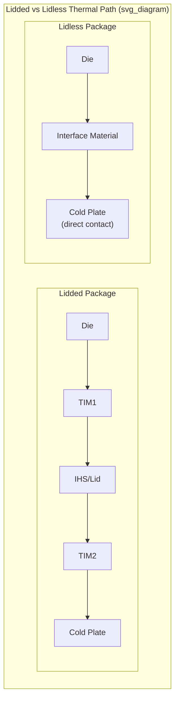

## Lidless Package Designs for High-TDP AI Accelerators

### Overview

A lidless (or "bare die") package design omits the integrated heat spreader/lid discussed in the prior heat spreader topic, exposing the die's backside directly to the cooling solution — most commonly a liquid cold plate — rather than routing heat through a TIM1/lid/TIM2 sandwich before reaching the external cooling interface. As AI accelerator thermal design power has pushed beyond 1,000 W in recent GPU and accelerator generations, removing an entire thermal interface and its associated resistance has become an increasingly attractive lever for extending achievable cooling capacity, at the cost of new mechanical, reliability, and system-integration challenges that a conventional lidded package does not face.

**Key Points**

- The core motivation for going lidless is straightforward from the thermal resistance model introduced in the thermal interface materials topic: eliminating the lid removes one entire TIM interface (TIM1) and its associated bond-line-thickness and contact-resistance terms from the total junction-to-coolant thermal resistance stack, directly lowering total thermal resistance for a given cooling solution.
- Removing the lid is not a strictly one-directional improvement — it trades away the lid's mechanical protection function and its lateral heat-spreading benefit, both of which must be otherwise addressed by the package and cold-plate design.

### Thermal Rationale: Removing a TIM Interface

**Resistance Stack Comparison**

A conventional lidded package's thermal path is die → TIM1 → IHS/lid → TIM2 → cold plate; a lidless design's thermal path is die → TIM2-equivalent interface (directly between die backside and cold plate) → cold plate — eliminating the TIM1 and lid segments entirely. Since each interface in the resistance model $R_{TIM} = BLT/(k \cdot A) + R_{c1} + R_{c2}$ contributes additively to total path resistance, removing an entire interface (rather than merely improving one) is a structurally different kind of improvement than optimizing TIM material or BLT within an existing stack.

**Measured Thermal Impact**

Direct experimental comparison work on interposer packages found that with the TIM's thermal conductivity around 1.9 W/(m·K) at roughly 90 µm thickness, there is a large difference between the bare die and lidded package of a factor of 2.5 to 3, though the difference was expected to be smaller for large-die packages using a thinner, higher-conductivity TIM (2.3 W/(m·K) at about 20 µm). This range illustrates that the lidless thermal benefit is TIM-dependent: a package already using a very thin, high-conductivity TIM1 has less to gain from lid removal than one using a thicker, lower-conductivity TIM.

**Low-Flow-Rate Trade-off**

The same experimental work found that cooling on the lidded package showed better thermal performance at very low flow rates, specifically due to the lateral thermal spreading provided by the metal lid — meaning at low coolant flow rates, the lid's spreading benefit can outweigh the added TIM1 resistance it introduces, and the lidless advantage is most pronounced at higher, more typical operating flow rates where the cold plate's own internal thermal resistance (rather than the interface stack) becomes the more significant limiting factor.

### Recent Industry Approaches: Lidded, Lidless, and Direct-to-Silicon

**Comparative Architectures**

Industry thermal characterization work presented at ECTC 2026 directly compared three cooling architectures on the same platform: a conventional lidded cold plate package, a lidless cold plate package, and a micropillar direct-to-silicon design where micropillar structures were formed directly onto the backside of the die itself rather than relying on a separate TIM and cold plate contact surface — representing a further step beyond simple lid removal toward eliminating the die-to-cold-plate interface's thermal resistance as well.

**Quantified Performance Difference**

Under conventional cooling conditions (1–2 liters per minute coolant flow, using relatively warm 40°C deionized water), a lidded package dissipated 1.9–2.3 kW while the lidless package dissipated 2.5–3.0 kW — a substantial increase in achievable heat dissipation capacity at the same coolant flow rate and inlet temperature, directly attributable to the eliminated TIM1/lid thermal resistance segment.

**Micropillar Direct-to-Silicon Cooling**

Beyond simple lid removal, forming silicon micropillar structures directly on the die backside represents an even more aggressive integration of the cooling structure with the die itself — conceptually extending the same principle explored in embedded microfluidic cooling (bringing the coolant interface as close as physically possible to the heat source) but applied at the die backside surface rather than embedded within the die or interposer interior. [Unverified: specific quantitative performance figures for the micropillar approach relative to the lidded/lidless comparison should be confirmed against the primary published ECTC 2026 source, as this represents a very recent and still-emerging demonstration.]

### Mechanical and Structural Challenges of Lidless Design

**Loss of Mechanical Protection**

The lid's role in protecting the fragile die and its interconnects from mechanical damage during handling, assembly, and cold-plate attachment is entirely absent in a lidless design, requiring alternative approaches — such as a stiffener ring or frame around (but not over) the die, careful cold-plate mounting mechanisms that avoid excessive point-loading on the exposed die surface, and tighter process control during cold-plate attachment to avoid die cracking or chipping.

**Direct Mechanical Loading on the Die**

Because the cold plate mounts and applies clamping force closer to or directly against the die itself (rather than against a more mechanically robust metal lid), lidless designs require careful engineering of the clamping mechanism, applied pressure uniformity, and any compliant structure between the cold plate and die to avoid localized stress concentrations that could crack the die or degrade the die-to-cold-plate thermal interface over the product's operating and thermal cycling lifetime.

**Warpage Sensitivity**

Without the lid's stiffening contribution to overall package flatness, lidless packages may exhibit different (potentially greater) sensitivity to die and substrate warpage, directly affecting the achievable bond-line thickness and contact uniformity of the die-to-cold-plate thermal interface — reinforcing the connection between package-level mechanical/warpage engineering (discussed in the chip-package-board co-design and lid attach topics of this curriculum) and lidless thermal performance realization in practice.

### Reliability Considerations

**Environmental Exposure**

The lid's environmental sealing function (protecting the die cavity from moisture and contamination, as discussed in the lid attach topic) must be replaced by an alternative approach in a lidless design — commonly relying on the cold plate assembly and its own sealing/gasket structures to provide equivalent environmental protection once assembled, meaning the cold-plate mounting process itself takes on additional reliability responsibility beyond its purely thermal function.

**TIM/Interface Reliability at the Die-Cold-Plate Interface**

Whatever thermal interface remains between the die and cold plate (a conventional TIM material, or a more advanced direct-die approach like the micropillar structures discussed above) must still meet the same reliability standards discussed in the thermal interface materials topic — resistance to pump-out, dry-out, or fatigue over the product's thermal cycling lifetime — but now applied directly at the die surface rather than at a more mechanically robust lid surface, potentially demanding tighter TIM reliability margins given the reduced mechanical buffering.

**CTE Mismatch Considerations**

Removing the lid also removes the intermediate CTE-transition role a lid can play between the silicon die (CTE ≈ 2.6 ppm/°C) and a typically higher-CTE cold plate material (often copper or aluminum); a lidless design places the die's thermal interface material in more direct contact with this larger CTE mismatch, a consideration relevant to selecting the die-to-cold-plate interface material and clamping approach with adequate compliance to accommodate this differential expansion over thermal cycling.

### System Integration Implications

**Cold Plate Design Adaptation**

Cold plates designed for lidless packages must accommodate the die's typically smaller footprint (relative to a lid's larger surface area) directly, requiring precise alignment and, often, a more sophisticated compliant mounting mechanism than a cold plate designed to mate with a larger, flatter, more mechanically robust lid surface.

**Manufacturing and Assembly Process Changes**

Lidless package assembly at the system integration stage (attaching the cold plate to the bare die) is a more delicate, precision-sensitive operation than mounting a cold plate atop a conventional lidded package, since the die itself — rather than a protective metal lid — is the surface being directly handled and clamped, raising the stakes of process control errors during this assembly step.

**Relevance to Current High-TDP AI Accelerator Trends**

As accelerator thermal design power continues to climb (with contemporary high-end GPU and AI accelerator packages operating in the many-hundreds-of-watts to kilowatt range per package), the industry has moved toward increasingly aggressive thermal architectures — direct-to-chip cold plates (as discussed in the liquid cooling topic) combined with lidless or near-lidless package designs — precisely because eliminating series thermal resistance wherever architecturally feasible has become necessary to keep pace with rising power density, rather than an optional refinement.

**Key Points**

- [Inference] Lidless and direct-to-silicon cooling approaches represent a natural extension of the general advanced-packaging trend (also seen in backside power delivery, embedded microfluidic cooling, and vapor chamber integration) of bringing the thermal or electrical solution physically closer to its point of need at the cost of increased integration complexity — a pattern likely to continue as long as die power density growth outpaces the thermal capacity gains achievable through material and interface improvements alone within a conventional lidded architecture.

### Comparative Summary

| Attribute | Lidded Package | Lidless (Bare Die) Package | Direct-to-Silicon (Micropillar) |
| --- | --- | --- | --- |
| Thermal interfaces in path | TIM1 + Lid + TIM2 | TIM2-equivalent only | Minimal/none (integrated structure) |
| Mechanical protection | Provided by lid | Must be added separately | Must be added separately |
| Lateral heat spreading | Provided by lid (beneficial at low flow) | Reduced/absent | Reduced/absent |
| Demonstrated dissipation (example, 1-2 LPM, 40°C DI water) | 1.9-2.3 kW | 2.5-3.0 kW | [Unverified — emerging data] |
| Assembly complexity | Lower | Higher (precision die handling) | Highest (integrated die-level fabrication) |
| CTE mismatch buffering | Lid provides some transition | Reduced buffering at die interface | Minimal buffering |

### Illustrative Comparison Diagram

### Related Topics

- Heat spreaders, lids, and vapor chamber integration
- Direct-to-chip and immersion liquid cooling
- Thermal interface materials: greases, gels, metals, and phase-change materials
- Embedded microfluidic and microchannel cooling for 3D stacks
- Package warpage and lid attach reliability engineering
- Cold plate mechanical design and clamping mechanisms for bare-die interfaces
- Die backside surface engineering (micropillar and direct-to-silicon structures)
- Chip-package-board co-design methodology