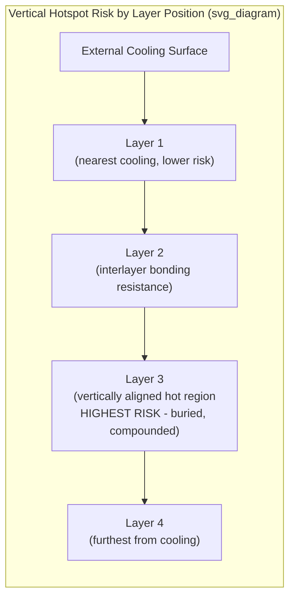

## Vertical Hotspot Management in Stacked-Die Systems

### Overview

Vertical hotspot management addresses the thermal challenge specific to 3D-stacked die architectures: localized regions of intense heat generation that occur not only laterally across a single die's surface (as in conventional single-die hot-spot analysis) but also at specific vertical positions within a multi-layer stack, where the combination of concentrated power density, long conduction paths for interior layers, and thermal coupling between vertically adjacent dies can produce peak temperatures substantially higher than what a simple average-power or single-layer analysis would predict. This topic builds directly on the thermal simulation, embedded microfluidic cooling, and thermal via co-design topics of this curriculum, applying their principles specifically to the vertical dimension unique to 3D integration.

**Key Points**

- A vertical hotspot is defined not merely by its lateral (x-y) location on a given die layer but by its position in the z-axis (which layer, and how far from the nearest effective heat-extraction surface) — a 3D stack can have the same lateral hot-spot location on two different layers behave very differently thermally depending on which layer is closer to the cooling solution.
- Vertical hotspot severity compounds two effects simultaneously: the lateral power-density concentration typical of any modern hot spot, and the added series thermal resistance from vertical conduction through intervening layers and bonding interfaces — meaning 3D stacking does not simply add a new hot-spot type but tends to intensify the consequences of hot spots that would already be a concern in a single-die context.

### Physical Origins of Vertical Hotspots

**Layer-to-Layer Power Density Variation**

In heterogeneous 3D stacks (e.g., logic-on-logic, memory-on-logic, or general chiplet-on-chiplet vertical integration), different layers often have substantially different power densities — a high-performance logic die stacked beneath or above a lower-power memory or I/O die creates an inherently asymmetric vertical power profile, where the thermal design must account for one layer generating the overwhelming majority of the stack's total heat while its neighbors generate comparatively little.

**Vertical Alignment of Hot Regions Across Layers**

Where multiple active layers each have their own internal lateral hot spots (e.g., specific high-activity logic blocks), the vertical alignment (or misalignment) of these hot regions across layers significantly affects peak stack temperature — if hot regions on adjacent layers are vertically stacked directly atop one another, their combined heat must exit through a compounded, spatially concentrated thermal path, producing a more severe peak temperature than if the same total heat were more laterally distributed across the stack's footprint.

**Interlayer Bonding and TSV Thermal Resistance**

Each bonding interface between stacked die layers (whether hybrid bonding, micro-bump, or other 3D integration bonding technology) introduces additional thermal resistance in the vertical conduction path, and through-silicon vias, while providing a locally lower-resistance path than the surrounding bulk silicon or bonding material, are typically sparse relative to the total die area, meaning most of the vertical heat flux must still traverse the higher-resistance bulk interlayer material rather than benefiting from TSV-level conduction everywhere.

### Distance-from-Cooling-Surface Effects

**The "Buried Layer" Problem**

As introduced in the embedded microfluidic cooling topic, any die layer not adjacent to the package's primary external heat-extraction surface (conventional heatsink, cold plate, or lidless direct-die cooling interface) must conduct its heat through the intervening layers to reach that surface. In a tall stack (many layers), the layer(s) furthest from the cooling surface face the greatest combined series thermal resistance, making them structurally the most vulnerable to hot-spot formation even if their own intrinsic power density is not the highest in the stack.

**Asymmetric Cooling Approaches**

Some 3D stack architectures address this by providing cooling access from both the top and bottom of the stack (rather than only one external surface), or by inserting an embedded microfluidic cooling layer at a strategic interior position (as discussed in the embedded microfluidic cooling topic) specifically to shorten the effective conduction path for the layer(s) that would otherwise be most thermally isolated from any single external cooling surface.

**Interaction with Non-Uniform Power Maps**

As emphasized throughout the thermal management topics of this curriculum, treating each layer's power dissipation as spatially uniform substantially understates the risk of vertical hotspot formation; accurate thermal simulation for stacked-die systems requires per-layer, spatially-resolved power maps combined with an accurate representation of interlayer thermal resistance (bonding interface, TSV density and placement) to correctly identify which combination of lateral location and vertical layer position produces the system's true peak temperature.

### Simulation and Modeling Approaches

**Multi-Node Compact Thermal Models for Stacks**

As discussed in the thermal simulation and compact thermal modeling topic, the traditional single-junction-node compact model is inadequate for stacked-die thermal analysis; a stacked-die-appropriate compact model requires multiple thermal nodes — at minimum, one per die layer, connected by resistances representing the interlayer bonding/TSV thermal path, and each with its own connection (direct or indirect, depending on layer position) to the external boundary condition(s).

**Detailed Full-Stack Simulation**

Full-fidelity finite-element or finite-volume simulation of a complete 3D stack, incorporating the actual per-layer power maps, interlayer bonding material properties, TSV density and placement, and external cooling boundary conditions, remains the most accurate (though most computationally expensive) approach to identifying true vertical hotspot locations and magnitudes, particularly important for validating or calibrating the simplified multi-node compact models used for faster, iterative design-stage analysis.

**Co-Simulation with Electrical/Workload Data**

Because power maps in modern die are highly workload-dependent (varying significantly based on which functional blocks are active at a given time), accurate vertical hotspot analysis increasingly requires co-simulation between electrical/architectural power estimation tools (predicting realistic, time-varying, spatially-resolved power maps for representative workloads) and thermal simulation, rather than relying on simplified static or worst-case-average power assumptions that may not capture the specific combination of per-layer activity patterns that produces the actual worst-case vertical hotspot.

**Key Points**

- [Inference] As 3D stacking depth (die count per stack) increases in future advanced packaging generations, the gap between simplified uniform/single-node thermal analysis and the actual worst-case vertical hotspot temperature is likely to widen, making accurate multi-node, non-uniform power map simulation an increasingly necessary (rather than merely more accurate) part of thermal signoff for deeply stacked architectures.

### Mitigation Strategies

**Floorplan-Level Mitigation: Vertical Hot-Region Offsetting**

Where die floorplan flexibility exists across the stacked layers, deliberately offsetting high-activity functional blocks on adjacent layers (rather than allowing their hot regions to vertically align) can reduce peak stack temperature by spreading the combined heat load over a larger effective footprint rather than concentrating it through a single vertical column — a floorplan-level thermal mitigation strategy analogous in spirit to lateral hot-spot mitigation in single-die designs, but applied across the z-axis.

**Thermal Via and TSV Placement Optimization**

As discussed in the thermal via design and thermal-electrical co-design topic, strategically placing thermal vias/TSVs specifically beneath or near known vertical hot-region locations (rather than uniformly distributing them) provides a more effective, spatially-targeted vertical conduction path precisely where the compounded lateral-plus-vertical hot-spot risk is greatest.

**Embedded Cooling Layer Placement**

As discussed in the embedded microfluidic cooling topic, inserting a dedicated cooling layer at the specific interior position within the stack that best intercepts the combined heat flux from the highest-risk vertical hotspot region (rather than at an arbitrarily chosen or purely manufacturing-convenient position) is a direct architectural mitigation for the buried-layer thermal isolation problem.

**Power/Performance Management (Thermal Throttling)**

Beyond physical/architectural mitigation, system-level dynamic power management (reducing clock frequency or voltage, or migrating workload away from specific functional blocks, in response to detected or predicted vertical hotspot conditions) provides a runtime mitigation layer — particularly relevant given that the true worst-case vertical hotspot condition may depend on specific, relatively rare combinations of concurrent activity across multiple stacked layers that are more practically managed via monitoring and throttling than via a physical design margin sized for every theoretically possible combination.

**Key Points**

- Effective vertical hotspot management typically combines architectural mitigation (floorplan offsetting, targeted thermal via/cooling layer placement) applied at design time with runtime thermal management (monitoring and throttling) as a complementary safety margin, rather than relying on either approach exclusively — architectural mitigation reduces the frequency and severity of hotspot conditions, while runtime management provides protection against the residual, harder-to-predict worst cases.

### Measurement and Validation Challenges

**Embedded Temperature Sensing**

Validating vertical hotspot predictions in physical hardware requires temperature sensing at multiple die layers within the stack — typically via on-die temperature sensors integrated into each active layer's design — since external measurement techniques (infrared thermography, thermal test die measurement at the package surface) cannot directly observe interior layer temperatures in an assembled 3D stack, making embedded sensor placement and correlation with simulation-predicted vertical hotspot locations an important verification consideration specific to stacked-die thermal validation.

**Key Points**

- Because interior-layer temperatures in an assembled 3D stack cannot be directly measured externally, confidence in vertical hotspot simulation predictions depends more heavily on model correlation using embedded sensor data (where available) or careful benchmark/test-vehicle validation during technology development, compared to single-die thermal validation where external measurement techniques can more directly observe the relevant surface.

### Illustrative Vertical Hotspot Diagram

### Related Topics

- Thermal simulation and compact thermal modeling
- Embedded microfluidic and microchannel cooling for 3D stacks
- Thermal via design and thermal-electrical co-design in dense stacks
- Lidless package designs for high-TDP AI accelerators
- Backside power delivery network integration with packaging (non-uniform power effects)
- On-die temperature sensor design and embedded thermal monitoring
- Dynamic voltage/frequency scaling and thermal throttling architectures
- Logic-on-logic and memory-on-logic 3D integration floorplanning